# M4 Common Probability Distributions

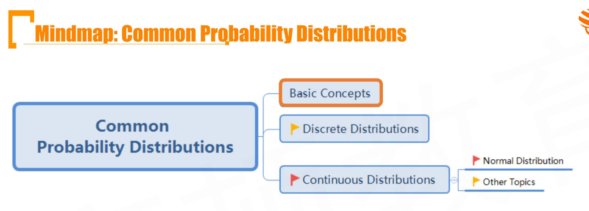

## R4.1 Basic Concepts

#### Random Variable

- A random variable is a variable whose value depends on the outcome of a probabilistic experiment
  - **Discrete random variable:** takes on a countable number of possible values
  - **Continuous random variable:** takes on an uncountable number of possible values

#### Probability Distribution

- Probability distribution specifies the probabilities of all possible outcomes for a random variable
  - **Discrete distribution:** the distribution of the discrete random variable
  - **Continuous distribution:** the distribution of the continuous random variable

#### Probability Function

- **Probability function** specifies the probability that the **discrete random variable** takes on a specific value 穷举法
  - $P(X=x)$ is the probability that a random variable X takes on the value x.

#### Probability Density Function

- **Probability density function**(PDF) specifies the probability that the continuous random variable takes on a value within a range
- When the PDF is graphically portrayed, the area under the curve will indicate the interval in which the variable will fall. The total area in this interval of the graph equals the probability of a continuous random variable occurring.

$$
P(x_1<X<x_2)=\int_{x_1}^{x_2}{f(x)}dx
$$

- The probability of taking on an specific value is always zero

$$
P(X=x_i)=0
$$

#### Cumulative Probability Function, F(x)

- **Cumulative probability function(CDF)** gives the probability that a random variable X is less than or equal to a particular value x, $P(X\le x)$
- For both discrete and continuous random variables:
  - $F(x_i)=P(X\le x_i)$
  - $P(x_1<X\le x_2)=F(x_2)-F(x_1)$

$$
F(x)=P(X\le x)=\int_\infin^x f(t)dt
$$

#### Univariate and multivariate distribution

- **Univariate distribution**
  - Describe a single random variable
- **Multivariate distribution** 多变量
  - Describes the probabilities for a group of related random variables 
  - More variables needed
    - n means in total 平均数
    - n variances in total 方差
    - n(n-1)/2 distinct correlations in total 相关系数
  - **Joint distribution** 联合分布

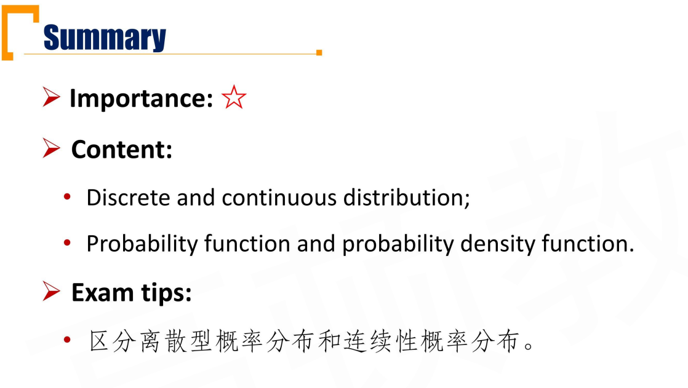

## R4.2 Discrete Distributions

#### Discrete Uniform Distribution

- Has a finite number of possible outcomes, all of which are equally likely.

**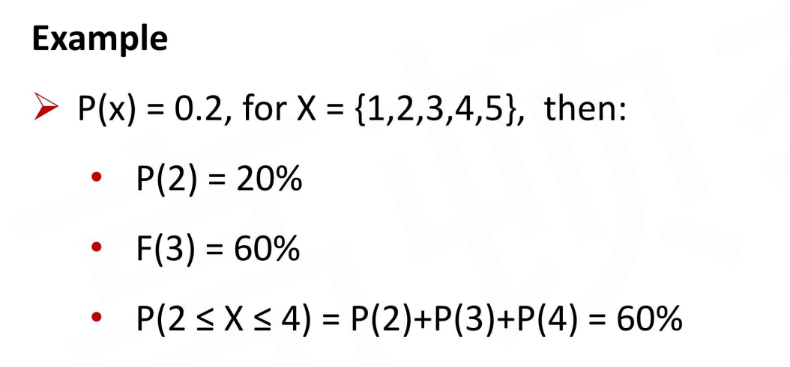**

#### Binomial Distribution

- **Bernoulli trial** 
- **Bernoulli random variable**
  - Random variables with only two outcomes, one represents success(denoted as 1), the other represents failure(denoted as 0)
  - 两种结果，每次实验互相独立

- **Binomial random variable(X)** 
  - 伯努利分布是扔一次，二项分布是n次
  - **The number of successes in n Bernoulli trials, assuming that:**
    - The probability of success(p) is constant for all trials
    - The trails are all independent

$$
X\sim B(n, p)
$$

- if $X\sim B(n,p)$Binomial Distributions:

$$
E(X)=np\\
Var(X)=np(1-p)
$$

- The **probability of binomial random variable**

$$
P(X=k)=C_n^kp^k(1-p)^{n-k}
$$

#### Advance question

- if the probability of success is 0.6. what is the probability that **at least** 3 success in 5 trials?
  - 注意题目求得是“至少”，所以需要把3、4、5次成功求和
- **Binomial Distribution**
  - 做n次实验，每次成功概率p，成功k次的概率

- **Negative Binomial Distribution**
  - 为了成功m次， 每次成功概率为p，至少需要进行r次伯努利实验的概率。
  - 确定好参数：m、p，变量：r
  - 所以负二项分布和二项分布的参数、变量相反
  - 负二项分布的条件等价于：
    - 第r次伯努利实验，恰好是第m次成功的概率。
    - 也就是：前r-1次实验，成功m-1次，并且第r次成功。

$$
P(X=r)=pC_{r-1}^{m-1}p^{m-1}(1-p)^{r-m}
$$

- 负二项分布中，r可以取值为$[m,\infin]$，所以离散型分布的变量取值范围可以是无穷。

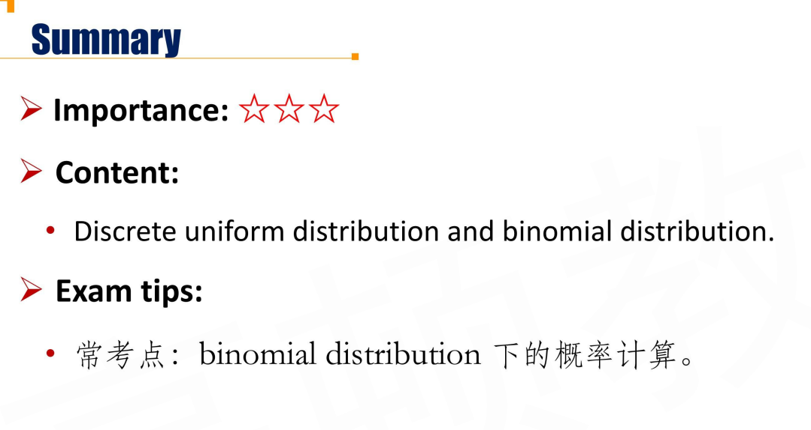

## R4.3 Continuous Distributions

### Normal Distribution \*\*\*

$$
X\sim N(\mu, \sigma^2)\\
f(x)=\frac{1}{\sqrt{2\pi}\sigma}\exp{-\frac{(x-\mu)^2}{2\sigma^2}}
$$

- **Properties**
  - Completely described by **mean** and **variance**
  - Skewness = 0(symmetric about the mean)
  - Kurtosis = 3
  - Linear combination of normally distributed random variables is also normally distributed
    - $X\sim N(\mu_1,\sigma_1^2)$
    - $Y\sim N(\mu_2,\sigma_2^2)$
    - $Z=aX+bY\sim N(\mu_1+\mu_2,\sigma_1^2+\sigma_2^2)$
    - [Linear combination of independent normal random variables | The Book of Statistical Proofs (statproofbook.github.io)](https://statproofbook.github.io/P/norm-lincomb.html)
  - Probabilities decrease further from the mean, but the tails go on forever

- **Confidence interval** 置信区间

| confidence | 区间                                 | 估计                         |
| ---------- | ------------------------------------ | ---------------------------- |
| 50%        | $(\mu-(2/3)\sigma, \mu+(2/3)\sigma]$ |                              |
| 68%        | $(\mu-\sigma, \mu+\sigma]$           |                              |
| 90%        | $(\mu-1.65\sigma, \mu+1.65\sigma]$   |                              |
| 95%        | $(\mu-1.96\sigma, \mu+1.96\sigma]$   | $(\mu-2\sigma, \mu+2\sigma]$ |
| 99%        | $(\mu-2.58\sigma, \mu+2.58\sigma]$   | $(\mu-3\sigma, \mu+3\sigma]$ |

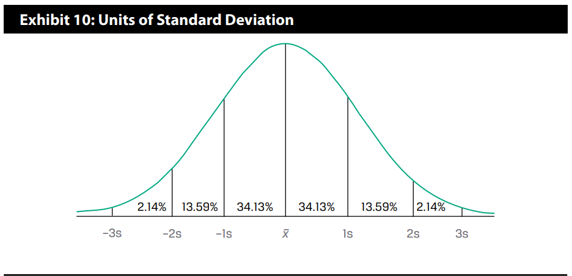

#### Standard Normal Distribution(Z-distribution)

- Normal distribution with mean$\mu=0$, and standard deviation $\sigma=1$

- **standardization**

$$
X\sim N(\mu, \sigma^2)\\
Z=\frac{X-\mu}{\sigma}\\
Z\sim N(0,1)
$$

- The Z value calculated by standardization represents the number of the standard deviations from the mean.

##### Z-table 标准正态分布的累计分布函数

$$
1-\Phi(x)=\Phi(-x)
$$

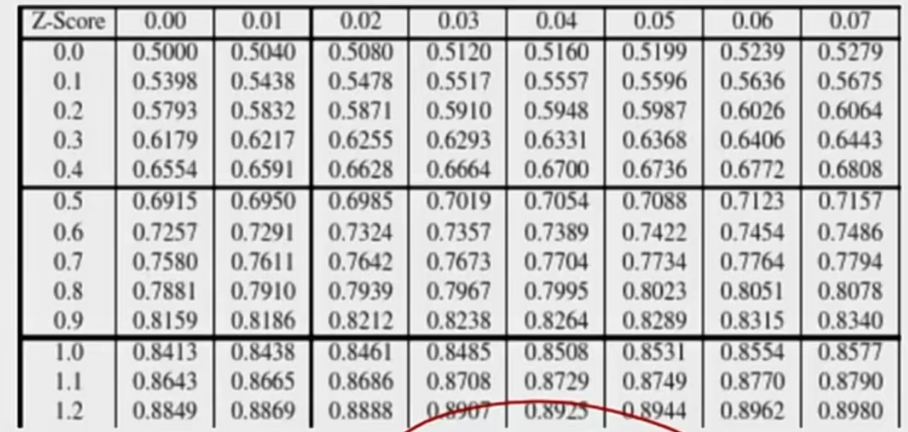

比如x=1.24，则找纵轴1.2，横轴0.04，则查到0.8925

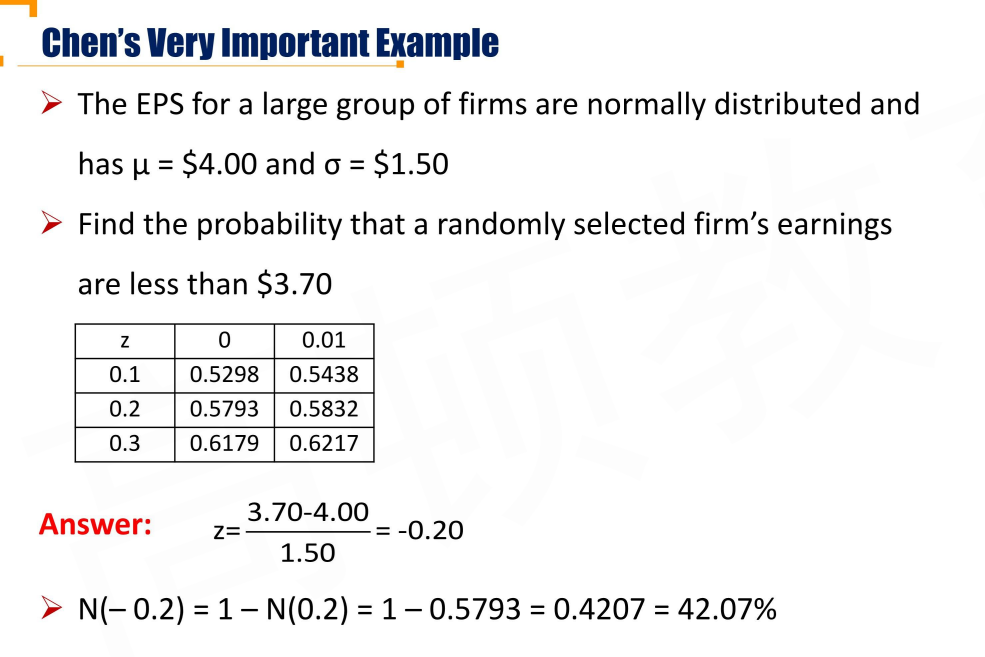

#### Lognormal Distribution 对数正态分布

- If X is normally distributed, then $e^X$ is lognormal distributed
  - $X\sim N\iff e^X\sim lgN$
  - $Y\sim lgN \iff \ln Y\sim N$
- If Y follows a lognormal distribution, then $lnY$ is normally distributed
  - Lognormal random variable is **bounded from below by zero**
  - It is **positively skewed**右偏
- The lognormal distribution is completely described by two parameters:
  - Mean and standard deviation

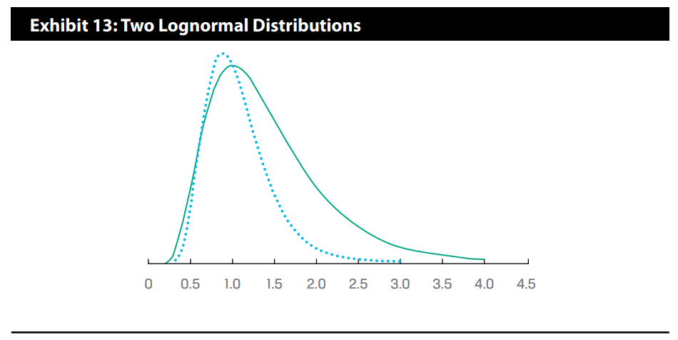

#### Continuously Compounded Return

- The stock price may be well described by the **lognormal distribution**, and a stock's **continuously compounded return** is **normally distributed**
  - 股票价格服从对数正态分布，股票连续复利回报率服从正态分布

假设t时刻股票价格是$S_t$，t时刻到t+1时刻的收益率（rate of return）是$R_{t,t+1}$，连续复利计算得到的回报率是$r_{t,t+1}$.

- $R_{t,t+1}$ is the rate of return from t to t+1
- $r_{t,t+1}$ is the continuously compounded return from t to t+1

$$
S_{t+1}=S_t\times e^{r_{t,t+1}}=S_t\times (1+R_{t,t+1})
$$

两边取对数，得到
$$
r_{t,t+1}=\ln\frac{S_{t+1}}{S_t}=\ln(1+R_{t,t+1})
$$

###### Two important points

持有股票从0到T时刻
$$
\frac{S_T}{S_0}=\prod_{t=1}^{N}\frac{S_{t}}{S_{t-1}}
$$

- Using holding period the multiplication of quantities(1+holding period return)使用$R_{t,t+1}$计算，总体收益率使用乘法，由上面的公式，可以得到

$$
1+R_{0,T}=\prod_{t=1}^{T}(1+R_{t-1,t})
$$

- Using continuously compounded returns involves additions，使用连续复利计算时，总体收益率使用加法叠加

$$
r_{0,T}=\ln\frac{S_T}{S_0}=\ln\prod_{t=1}^{N}\frac{S_{t}}{S_{t-1}}=\sum_{t=1}^{T}\ln\frac{S_t}{S_{t-1}}=\sum_{t=1}^{T}{r_{t-1,t}}
$$

- Assume that the one-period continuously compounded returns (such as $r_{0,1}$) are **independently and identically distributed(i.i.d.)** 独立同分布 random variables with mean $\mu$ and variance $\sigma^2$, then:
  - If the one-period continuously compounded returns are normally distributed, then the T holding period continuously compounded return, $r_{0,T}$, is also **normally distributed** with mean $\mu T$ and variance $\sigma^2T$
    - 这是因为正态分布的线性叠加，也是正态分布。

$$
E(r_{0,T})=\sum_{t=1}^{T}E(r_{t-1,t})=\mu T\\
\sigma^2(r_{0,T})=\sigma^2T
$$

- 这是因为对于正态分布：Z=X+Y, Z~N(mu1+mu2, s1^2+s2^2)
- Volatility measures the standard deviation of the continuously compounded returns on the underlying asset。用每天波动率计算全年波动率

$$
\sigma_{annualy}=\sigma_{daily}\sqrt{250}
$$

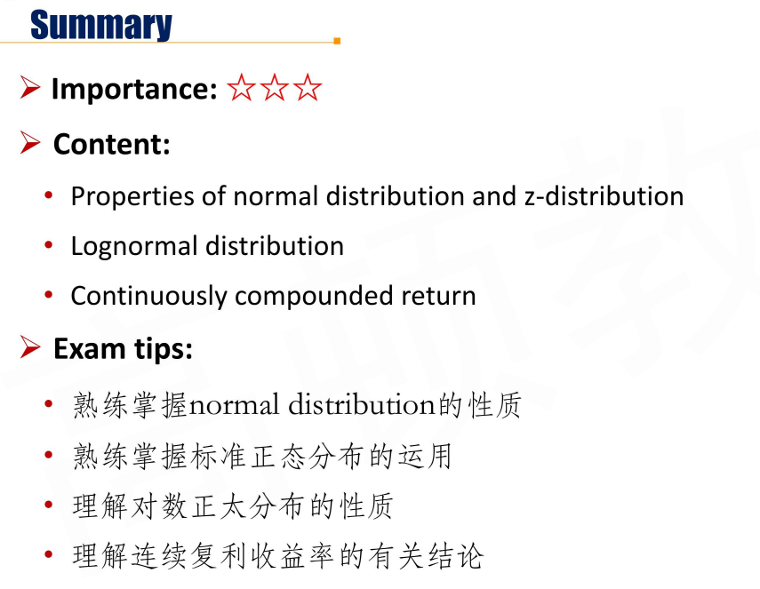

## R4.4 Continuous Distributions - Other Topics

#### Continuous Uniform Distribution

- Probability of continuous uniform random variable which distribute evenly over an interval
- Probability density function:

$$
f(x)= \begin{cases} 
      \frac{1}{b-a} & x\in [a,b] \\
      0 & otherwise
   \end{cases}
$$

- Probability for an interval

$$
P(a\le X \le b)=\int_a^bf(x)dx
$$

- Cumulative probability distribution

$$
F(x)=\begin{cases}
0 & x \lt a\\
\frac{x-a}{b-1} & x \in [a,b)\\
1 & x\ge b
\end{cases}
$$

#### Student's T-Distribution \*\*\*

- Defined by single parameter: **degrees of freedom(df)**
  - df = n-1, where: n is the sample size
  - t分布一般用作抽样，n就是样本量。自由度等于样本量-1
- Symmetrical(bell shaped), skewness = 0
- Fatter tails than a standardized normal distribution (N(0,1))
  - t分布肥尾，一般在投资领域，用来预测小概率事件效果更好
- As df increase, t-distribution is approaching to standard normal distribution
- Given a degree of confidence, t-distribution has a wider confidence interval than z-distribution
  - 同样的置信概率，t分布的置信区间比标准正态分布要**宽**.(因为尾巴比N(0,1)更厚)
  - 比如95%，z-distribution是1.96$\sigma$，那t分布比1.96$\sigma$更宽

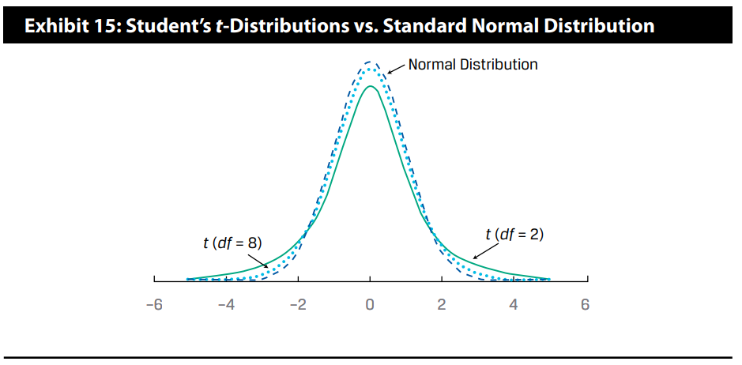

#### Chi-square Distribution 卡方分布

- The **chi-square distribution** is **asymmetrical** distribution with **k degrees of freedom**
  - $X\sim \chi^2$, 以0为下限。自由度为k。
  - It is the distribution of the sum of the squares of k independent standard normally distributed random variables
- A different distribution exists for each possible value of degrees of freedom, **n-1(n is sample size)**
  - As the degrees of freedom of the chi-square distribution increase, the shape of its pdf becomes more similar to a bell curve

#### F-Distribution

- Like the chi-square distribution ,the **F-distribution** is a family of **asymmetrical** distributions bounded from below by 0.
  - 非对称分布，以0为下界
- Each F-distribution is defined by **two values of degrees of freedom**, called the numerator and denominator degrees of freedom
  - 由两个自由度定义，把两个卡方分布用自由度修正。
  - If $\chi_1^2$ is one chi-square random vairable with m degrees of freeom and $\chi_2^2$ is another chi-square random variable with n degrees of freedom, then $F=(\chi_1^2/m)/(\chi_2^2/n)$ follows an F-distribution with m numerator and n denominator degrees of freedom
  - As both the numerator(df1) and the denominator (df2) degrees of freedom increase, the density function will also become more **bell curve-like**.

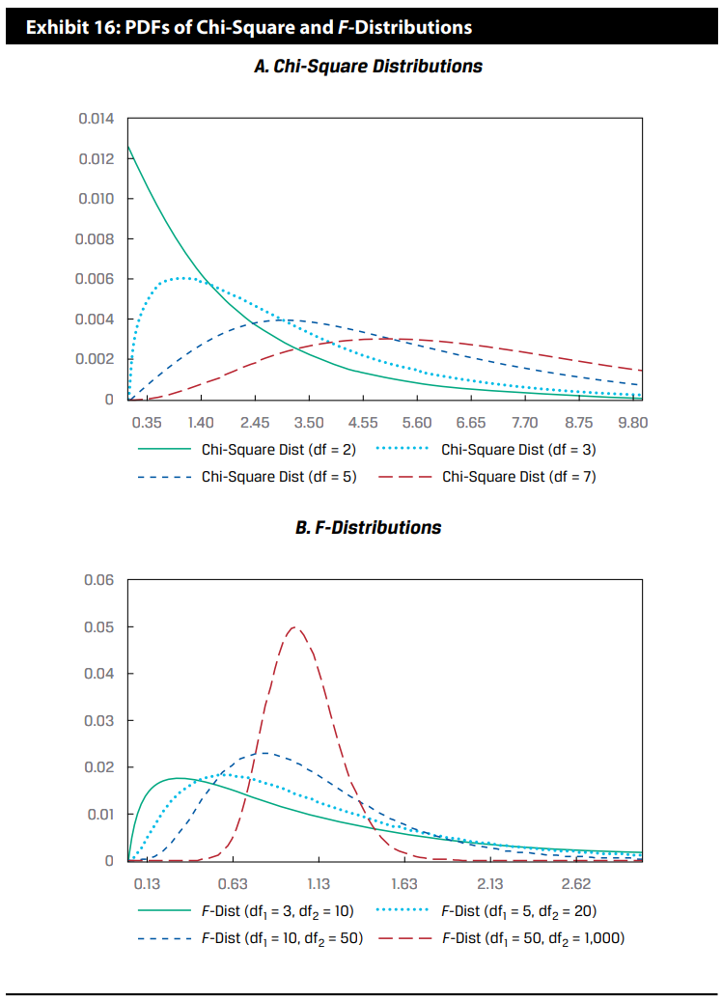

#### Univariate Distribution and Multivariate Distribution

- An **univariate distribution** describes a single random variable 单一分布
- A **multivariate distribution** specifies the probabilities for a group of related random variables 多元分布
  - It has to specify **correlations** is a distinguishing feature of the multivariate distribution, in contrast to the univariate distribution
  - 需要考虑协方差等关联度
- For example, a **multivariate normal distribution** for the returns on n stocks is completely defined by three lists of parameters: 多元正态分布
  - n means in total
  - n variances in total
  - n(n-1)/2 distinct correlations in total 相关系数

#### Application of Distribution- shortfall risk

- Shortfall risk is the risk that portfolio value or return will fall below the **minimum acceptable level**($R_L$, shortfall level, threshold level) over some time horizon
  - 低于最低可接受的亏损的概率(shortfall)
- **The lower, the better**

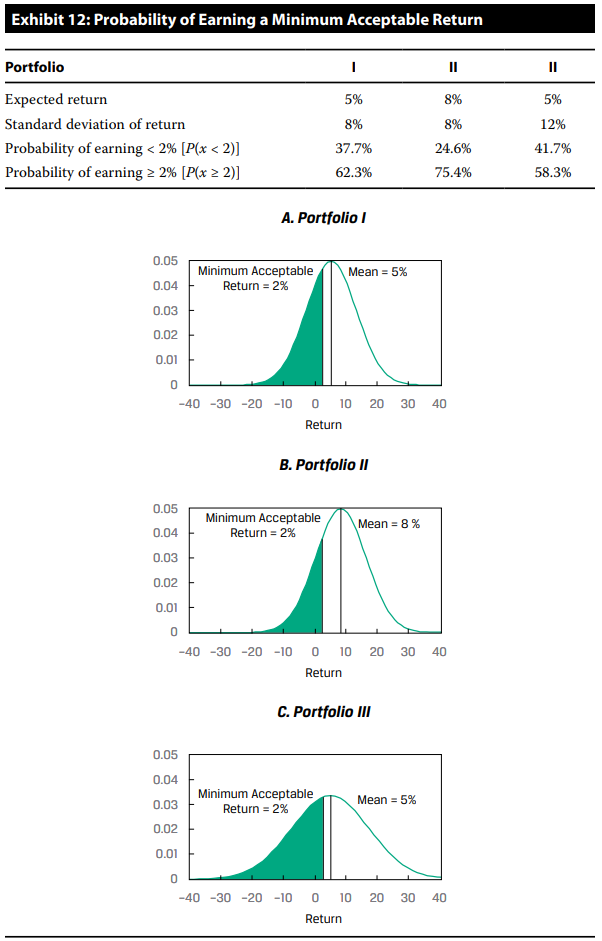

#### Application of Distribution - Safety-First Ratio \*\*\*

- Safety-first ratio is the distance from the mean return to the shortfall level in units of standard deviation
- **The higher, the better** 越大越好
- Minimizing shortfall risk = Maximizing safety-first ratio

$$
SFRatio=\frac{E(R_p)-R_L}{\sigma_p}\\
R_L=shortfall\ level
$$

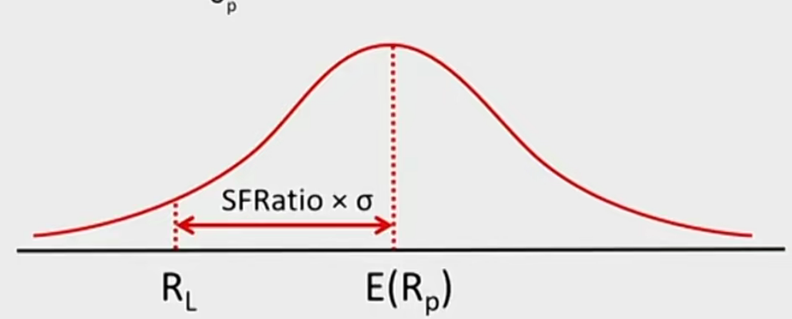

- safety-first ratio的一个特例：夏普比率，相当于把MAR（minimum acceptable rate）设置为无风险利率

#### Monte Carlo Simulation

- Use **randomly generated** values for risk factors, based on their assumed distributions, to produce a distribution of possible outcome
- Limitation
  - Fairly complex 
  - Do not directly provide precise insights
  - Provide answer no better than the assumption used
- Random observations from any distribution can be produced suing the **uniform random variable** with end-points 0 and 1 via the **inverse transformation method**
  - 用均匀分布，inverse transformation method，产生随机数。（用CDF）
  - uniform random variable->产生[0,1]均匀分布随机数t
  - 累计分布函数的逆函数$F^{-1}(t)$，得到对应的随机数。

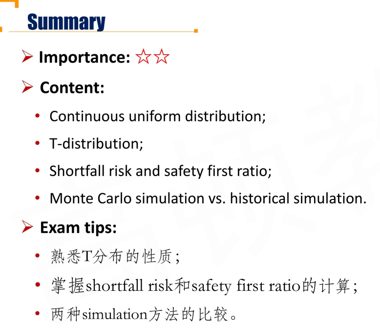

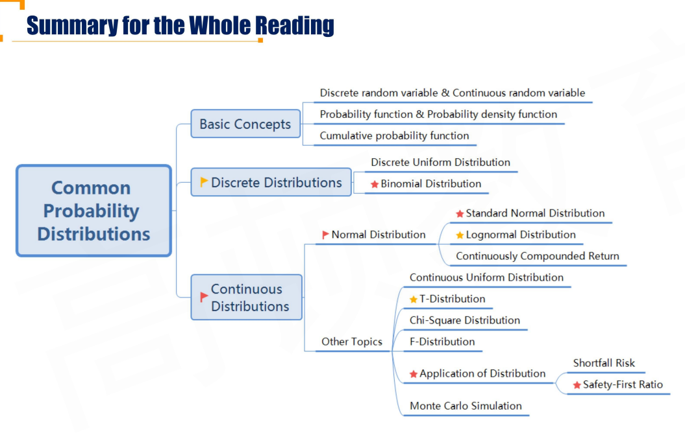

