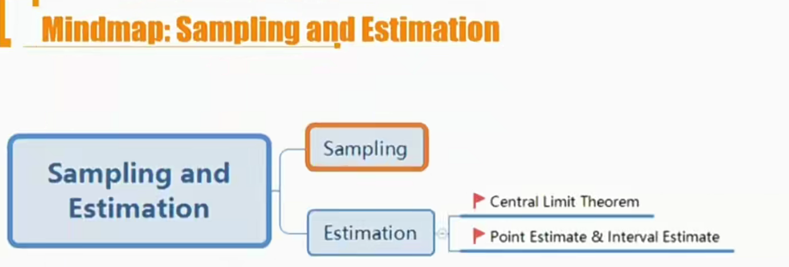
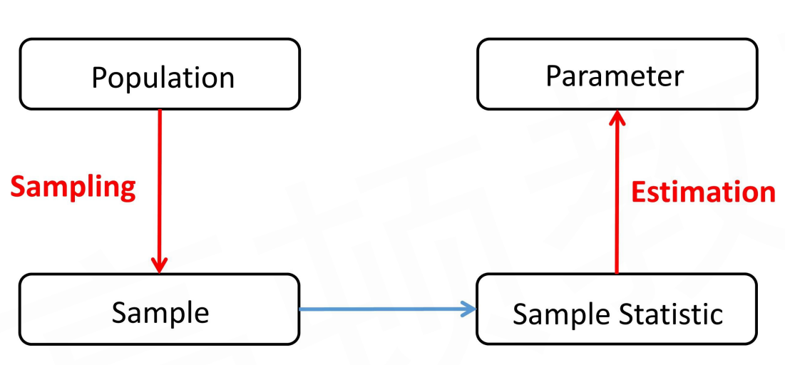
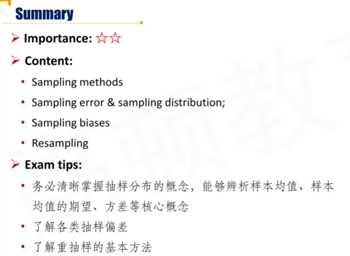
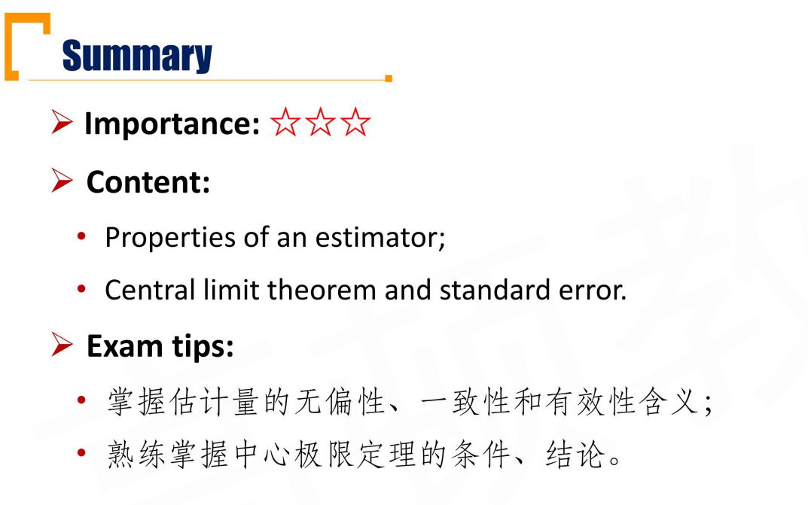
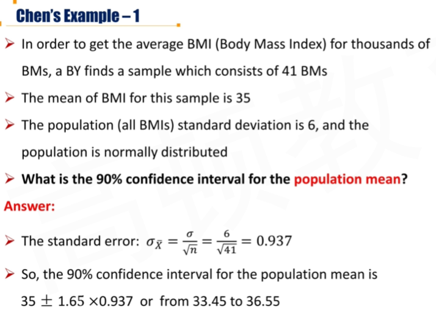
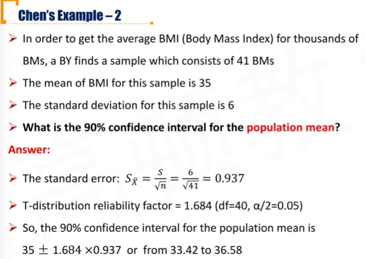
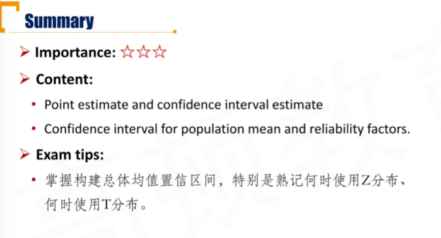
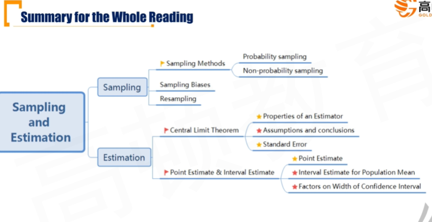

# M5 Sampling and Estimation

## 5.1 Sampling

#### Overview

#### Selection of Sample Size

- **Pros for larger sample size**
  - Larger sample size would produce a better estimate for parameter(better precision)
- **Cons for larger sample size**
  - Larger sample size may involve additional expenses that outweigh the value of additional precision
- Sampling from more than one population would not improve the estimate for the parameter(sampling risk)
  - 抽样风险。抽样需要从一个总体population中进行。

#### Sampling Methods

- There are two types of sampling methods
  - **Probability sampling** gives **every member** of the population an **equal chance** of being selected
  - **Non-probability sampling** depends on factors **other than probability considerations**, such as a sampler's judgment or the convenience to access data
- In general, all else being equal, probability sampling can yield **more accuracy and reliability** compared with non-probability sampling
- Other than selecting appropriate sampling methods, we also need to be careful when sampling from a population that is not under one single distribution

#### Probability Sampling

- A **simple random sample** is a subset of a larger population created in such a way that each element of the population has an equal probability of being selected to the subset
- With **systematic sampling**, we select every $k^{th}$ member until we have a sample of the desired size.
- In **stratified random sampling**, the population is divided into subpopulations(strata) based on one or more classification criteria
  - 分层随机抽样。先根据一定的标准分层，在每个strata进行随机抽样
  - Simple random samples are then drawn from each stratum in sizes proportional to the relative size of each stratum in the population
- For **cluster sampling**, the population is divided into cluster, and then certain clusters are chosen as a whole using simple random sampling. 一抽抽一窝。

#### Non-Probability Sampling

- In **convenience sampling,** an element is selected from the population based on whether or not it is accessible to a researcher or on how easy it is for a researcher to access the element
  - The level of the sampling accuracy could be limited
  - The advantage is that data can be collected quickly at a low cost
- **Judgmental sampling** involves selectively handpicking elements from the population based on a researcher's knowledge and professional judgement
  - Sample selection under judgmental sampling could be affected by the bias of the researcher and might lead to skewed results that do not represent the whole population

#### Important Question

- Who is constant and who is random variable?
  - Population parameter
    - 参数，总体的参数必然存在
  - Sample statistics
    - 变量。样本抽取前不确定，样本本身就是随机变量。

#### Key Concepts \*\*\*

- **Sampling error** is the difference between the **sample statistic** and the **population parameter**
  - 抽样误差一定避免不了，也无法估计（因为population parameter不知道）
- **Sampling distribution**抽样分布 is the distribution of all the distinct possible values that the **statistic** can assume when computed from **samples** of the same size randomly drawn from the same population。 样本统计量的分布
  - **e.g. Sample Mean**
    - **Expectation of sample mean**
    - **Variance of sample mean**

#### Sampling Biases

- **Data-snooping bias:** misuse of data referring to the repeatedly "drilling" in the same data until finding the statistically significant patterns
- **Sample selection bias:** certain databases are excluded from the analysis
- **Survivorship bias:** only sampling from existing database
- **Look-ahead bias:** using information that was not available on the test date
- **Time-period bias:** based on a time period that may make the results time-period specific

#### Resampling

- **Resampling** is the process to repeatedly draw samples from the original observed data sample for the statistical inference of population parameters
  - **Bootstrap自助法**：is one of the most popular resampling methods
    - It is a simple but powerful method for any complicated estimators and particularly useful when no analytical formula is available
    - Bootstrap has potential advantages in accuracy
  - **Jackknife** is another resampling technique
    - Jackknife method is often used to reduce the bias of an estimator **降低估计的bias**
    - Jackknife produces similar results for every run, whereas bootstrap usually gives different results because bootstrap resamples are randomly drawn

## R5.2 Central Limit Theorem \*\*\*

#### Properties of and Estimator

- **Estimator估计量** is a <u>random variable</u> that generates estimates of a parameter of a given distribution
  - 估计量产生估计值

1. **Unbiasedness无偏性**
   - The expected value equals the parameter it is intended to estimate
   - E(估计量) = 总体参数
2. **Consistency** 一致性
   - The probability of estimates close to the value of the population parameter increases as sample size increases
     - 样本数量越多，估计值越接近总体参数
     - 样本数量越多，估计量（random variable）的方差降低（$\sigma^2_{estimator}$）
3. **Efficiency** 有效性
   - The unbiased estimator of the population parameter that has a sampling distribution with smallest variance
   - 所有无偏估计中，方差最小，最有效

#### Central Limit Theorem\*\*\*

- Given a population described by **any** probability distribution having mean $\mu$ and finite variance $\sigma^2$（population）, the **sampling distribution of the sample mean** $\bar X$, computed from simple random samples of **same size n**  from this population, will be **approximately normal** with mean $\mu$ and variance $\sigma^2/n$, **when** the sample size n is large.

- 当n较大的时候

$$
\frac{\bar X - \mu}{\sigma/\sqrt n}\sim N(0,1)
$$

###### 前提

- 简单随机抽样，simple random samples
- 样本量足够大 n>=30

###### 结论

$\mu$和$\sigma^2$是总体的均值和方差。$\bar X$是抽样的均值（estimator）。

- $\bar X\sim N(\mu, \sigma^2/n)$

- $E(\bar X)=\mu$
  - $\bar X$估计$\mu$具有无偏性
- $\sigma^2(\bar X)=\sigma^2/n$
  - 当n越大，方差越小，意思是consistency越强。所以具有efficiency。

####  Standard Error标准误

- **Standard error of sample mean 样本均值的标准差**： the standard deviation of the distribution of sample means
- 这里通过总体方差反过来求样本均值的标准差
  - When the population standard deviation ($\sigma$) is known

$$
\sigma_{\bar X}=\frac{\sigma}{\sqrt n}
$$

- When the population standard deviation ($\sigma$) is unknown

$$
s_{\bar X}=\frac{s}{\sqrt n}
$$

- 不知道总体标准差的时候，用样本标准差$s$代替$\sigma$, 除以$\sqrt n$，估计**样本均值**的标准差。

#### Notices

- When the population standard deviation $\sigma$ is known

$$
\frac{\bar X - \mu}{\sigma/\sqrt n}\sim N(0,1)
$$

- When the population standard deviation ($\sigma$) is unknown
  - 用标准误$s_{\bar X}=s/\sqrt n$代替分母

$$
\frac{\bar X-\mu}{s/\sqrt n}\sim t_{n-1}
$$

用标准误估计时，满足t分布(自由度n-1)。可见，当n越大，s越接近于$sigma$，t分布也越接近于N(0,1)

## R5.3 Point Estimate and Interval Estimate

#### Point Estimate点估计

- **Point Estimate:** the calculated value of the sample statistic in a given sample is used as an estimate of the population parameter 

  - **Estimator估计量:** formulas to compute the sample statistics

    - e.g.

    - $$
      \bar X=\frac{\sum_{i=1}^{n}X_i}{n}
      $$

    - **an estimator has a sampling distribution**样本统计量的分布

  - **Estimate估计值**: particular value calculated from sample observations using an estimator 估计量一次样本估计的值
    - **an estimate is a fixed number**是一个确定的值

- 从估计量只做一次抽样计算到估计值，直接当成总体参数

#### Interval Estimate

- **Confidence interval** for observation: A range for which a given percentage($1-\alpha$, **degree of confidence置信度**) of all observations will lie based on a particular probability distribution
  - **Significance level($\alpha$)显著性水平** : the probability that the observations would not fall in a specific range

- 95%置信区间的意思：
  - 总体参数由95%概率落在该区间里❌
    - 总体参数是确定的数
  - 构造出的置信区间有95%的概率覆盖总体参数✔
    - 置信区间的上限和下限是需要估计的

#### Interval Estimate for Population Mean

- Confidence interval for population mean is a range that contain the population mean with a given confidence level($1-\alpha$)

- **Confidence Interval of population mean = point estimate of population mean $\pm$ Reliability Factor $\times$ Standard Error of sample mean**
  - 总体均值$\mu$的置信区间，由一次点估计，加减 样本均值的标准误得到。

上面这条公式的推导：

由中心极限定理（假设总体方差已知的情况）：
$$
\bar X \sim N(\mu, \sigma^2/n)\\
\frac{\bar X - \mu}{\sigma/\sqrt n}\sim N(0,1)
$$
置信水平为$1-\alpha$, 显著性水平为$\alpha$的情况下，Reliability factor为$Z_{\frac{\alpha}{2}}$,（下标为尾巴的面积）

reliabilit factor的定义，对于任意正态分布，变量落在均值$\pm$ reliability factor倍的标准差的范围内的概率为$1-\alpha$

则，根据定义，对于标准差为1的标准正态分布有
$$
P(-Z_{\frac{\alpha}{2}}\le \frac{\bar X - \mu}{\sigma/ \sqrt n} \lt Z_{\frac{\alpha}{2}}) = 1-\alpha
$$
即
$$
P(\bar X -Z_{\frac{\alpha}{2}}\sigma/ \sqrt n\le \mu \lt \bar X +Z_{\frac{\alpha}{2}}\sigma/ \sqrt n) = 1-\alpha
$$
这个表达式表达的是，在置信水平$1-\alpha$的时候，也就是有$1-\alpha$的概率把握，$\mu \in[\bar X -Z_{\frac{\alpha}{2}}\sigma/ \sqrt n,\bar X +Z_{\frac{\alpha}{2}}\sigma/ \sqrt n)$。

注意，上面区间的上下限都是随机变量，也就是，通过某一次的具体估计值，求出的区间能否覆盖住要求的总体参数$\mu$。上面的公式中，对于reliability factor的定义也没有改变（在样本均值为中心，左右偏移reliability factor倍的样本均值的标准差（标准误））

比如，$\alpha = 5\%$的时候，reliability factor为1.65，即对于某个N(0,1)变量, 90%的概率在[-1.65,1.65)内。

#### Chosing statistic for reliability factor

| When sampling from a | When sampling from a | Reliability factors | Reliability factors  |
| -------------------- | -------------------- | ------------------- | -------------------- |
| Distribution         | Variance             | Small sample(n<30)  | Large Sample(n >=30) |
| Normal               | known                | z                   | z                    |
| Normal               | unknown              | t                   | t\*                  |
| unknown              | known                | not available       | z                    |
| unknown              | unknown              | not available       | t\*                  |

\*: zstatistic is theoretically acceptable here but use of the tstatisic is more conservative（这里意思是同等置信水平下，学生分布的置信区间要比标准正态分布的区间要宽（conservative））

上图中，使用Z意思就是用正态分布的reliability factor, 使用t 意思是用学生分布的reliability factor

- Confidence interval of population mean with **known** population variance

$$
\bar X\pm z_{\frac{\alpha}{2}}\frac{\sigma}{\sqrt n}
$$

- Confidence interval of population mean with **unknown variance**

- 不知道总体方差的时候，用样本方差代替时，变为学生分布

$$
\bar X\pm t_{\frac{\alpha}{2}}\frac{s}{\sqrt n}
$$

- Degrees of freedom(df) = n - 1

#### Factors on Width of Confidence Interval

| Factors                                                     | Width of Confidence interval |
| ----------------------------------------------------------- | ---------------------------- |
| Larger confidence level($1-\alpha$)                         | Larger                       |
| Larger significance level($\alpha$)                         | Smaller                      |
| Larger sample size(n, df)                                   | Smaller(n在分母)             |
| Larger sample standard(s)                                   | Larger(s在分子)              |
| use t-distribution rather than standard normal distribution | Larger（t分布肥尾不尖峰）    |

