# M6 Hypothesis Testing

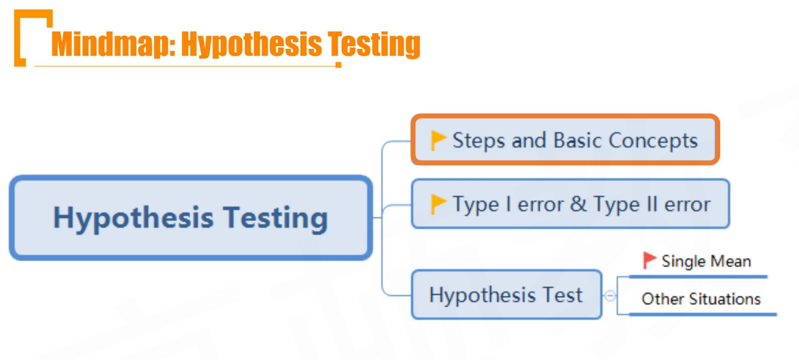

## R6.1 Steps and Basic Concepts

- Hypothesis testing is an act in statistics whereby an analyst tests an assumption regarding a **population parameter** 对于总体参数的假设的检验

  - 基础：认为小概率事件不会发生

- **Interval Estimation** and **Hypothesis testing**

  - Estimation
    - Addresses the questions such as "what is this parameter's value"

  - Hypothesis testing
    - Addresses the questions such as "is the value of the parameter equal to a specific value"
  - **Important question**
    - What's the logic between interval estimation and hypothesis testing?
      - 假设检验包括单边和双边
      - 区间估计就是双边检验
      - 两者逻辑一致，假设检验核心思想是小概率事件需要拒绝；区间估计也是站在某个概率的角度，看区间是否能覆盖总体参数。

#### Steps of Hypothesis Testing

1. Stating the **hypothesis:** relation to be tested. 关于总体参数的假设.
2. Identifying the appropriate **test statistic** and its **probability distribution**
   - 构造检验统计量（test statistic, 一个随机变量）
3. specifying the **significance level**
4. stating the **decision rule**
5. collecting the data and calculating the **value of test statistic**
   - 计算检验统计量的一次计算的具体取值
6. making the **statistical decision**
   - 根据4）的规则，做出判断。（拒绝小概率事件）
7. making the **economic or investment decision**

#### Null hypothesis and Alternative Hypothesis

- **Null hypothesis($H_0$):** Hypothesis to be tested 原假设
- **Alternative Hypothesis($H_a$)备择假设**: The opposite side of null hypothesis（和H0互斥且互补）
- Example1:
  - H0: average BMI for BMs is euqal to 30
  - Ha: average BMI for BMs is not equal to 30
- Example 2:
  - H0: average BMI for BM is less than or equal to 30
  - Ha: average BMI for BMs is more than 30
- **Important Conclusion**
  - The "=" sign will be showed in null hypothesis
    - 等号一定要出现在原假设。要根据原假设构建检验统计量
  - The only decision we can make is whether to reject the original hypothesis or not
    - 针对原假设进行检验（不判断Ha的正确性，只检验是否拒绝H0）
    - 注意，"接受H0"的说法也是错误。这里只检验是否拒绝H0
    - **不要轻易说接受**：
      - 拒绝H0，不等于接受Ha
      - 不拒绝H0，不等于接受H0
      - 这是因为我们站在检验统计的角度看问题。如果发生了小概率事件，我们要拒绝H0。但是如果发生了大概率事件，不能说明H0一定是对的。（谨慎性，证伪只需要举出一个反例（小概率事件），然而证明要严格的逻辑，不能单纯靠检验统计量不断检验。比如：对了一万次，不能说明下一次还会对，但是只要错了一次，就说明下一次肯定还会错。）
  - Null hypothesis is that analyst wants to reject
    - 想要拒绝的假设，一般放在H0
    - 假设检验的目的，就是拒绝掉一个不想要的假设。因为证伪总比证明容易。
      - 如果把一个想要的假设放在了H0，最后的检验统计量出来了不拒绝H0. 并不能说明接受H0.
      - 而把一个不想要的假设放在H0，最后检验统计量计算出拒绝H0，对研究的问题就产生了进展。

#### Two tailed Test 双边检验 vs. One-Tailed Test

- **Two tailed test**
  - Used to test if a population parameter is different from a specified value
  - $H_0: \theta=\theta\ vs.\ H_a:\theta \ne \theta_0$
  - 这种情况，拒绝域（正态分布的两个尾巴）是双边的。
- **One-tailed test**
  - Used to test if a parameter is above or below a specified value
  - $H_0: \theta\le\theta_0\ vs.\ H_a:\theta \gt \theta_0$
    - 拒绝域在右边
  - $H_0: \theta\ge\theta_0\ vs.\ H_a:\theta \lt \theta_0$
    - 拒绝域在左边
  - 拒绝域在原假设的另外一边
- 上面$\theta$是总体参数，$\theta_0$是假设的某个值（常数）。所以假设都是对常数进行假设

#### Critical Concepts

- **Test statistic's value** 检验统计量的value
  - A quantity calculated based on a sample
  - 检验统计量是随机变量，基于抽样计算得到test statistic's value
- **Significance level($\alpha$)** 显著性水平
  - The level of significance reflects how much sample evidence we require to reject the null
  - 小概率事件对应的面积
- **Critical value(rejection point)** 临界值
  - A value with which the computed test statistic is compared to decide whether to reject or not reject the null hypothesis
  - 就是$\alpha$对应的置信区间的边界reliability factor($z_{\alpha/2}$)
  - 临界值和$\alpha$一一对应
  - 拒绝域：拒绝原假设的区域（显著性水平对应的尾巴）
  - 检验统计量value和critical value做比较，超过critical value时（value落在尾巴），认为时小概率事件，拒绝H0。
- **p-value**
  - The smallest level of significance at which the null hypothesis can be rejected
  - p-value就是计算出test statistic value时，积分对应检验统计量分布的右侧得到的值。（test statistic value对应的尾巴的面积），
    - 一般p value和$\alpha$作比较：
      - 当一侧的尾巴面积是$\alpha/2$时，所以算p-value时需要单边尾巴面积乘以2
      - 当一侧尾巴面积就是$\alpha$时，p-value就是单边尾巴的面积（下面的one-tailed test）
  - 判断是否拒绝假设时，看p-value 是否小于某个显著性水平$\alpha$ 
  - p-value和significance level比较；test statistic value和critical value比较

#### Decision rules

- If test statistic is outside the range of critical value(test statistic >= upper critical value, or test static value < = lower critical value), rejuct the null hypothesis
- If the p-value is less or euqal to the level of significant ($\alpha$), reject the null hypothesis

#### Example: Two-tailed test of population mean

- $H_0:\mu = 0\ v.s.\ H_a:\mu\ne 0$

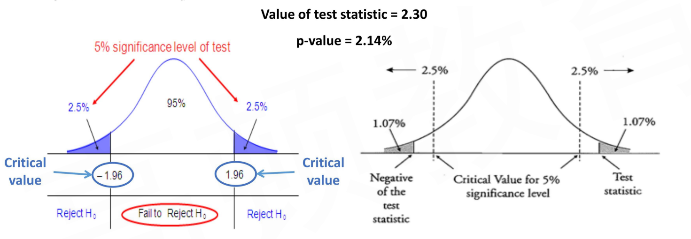

- 上图中，p-value:2.14和5比较；也可以1.07和2.5比较

#### Example: One-tailed test of population mean

- $H_0: \mu \le 0\ v.s.\ H_a:\mu>0$

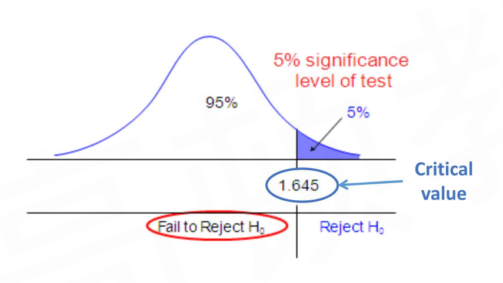

- 注意：上面5%对应的是1.645的critical value。（对应90%置信水平）
- 另外，如果这时候算到的test statistic value对应的右边尾巴面积是3，那3和5对比，p-value就是3，不需要乘以2.

#### Multiple Testing Problem - Example 多次测试

- 需要估计总体参数，从总体中采样sampling，得到一个样本（样本容量n），计算得到检验统计量进行检验；如果要继续resampling，会计算得到多个检验统计量。这里的multiple testing problem考虑的就是resampling下如何进行假设检验。
  - 抽样次数：number of samples
  - 样本容量: sample size

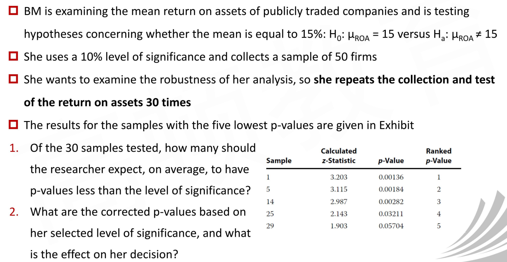

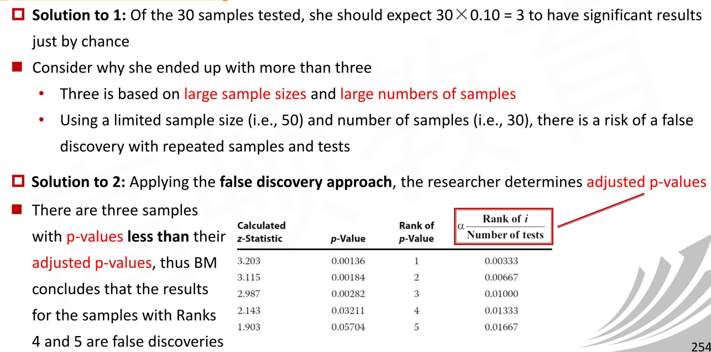

- corrected p-value调整后的p-value
- false discovery approach：原有的p-value拒绝，但是corrected p-value没有拒绝。这是false discovery
  - 原来的假设检验方法:$pvalue < \alpha$
  - corrected方法：$pvalue \lt \alpha\frac{i}{k}$
  - i是p值的排序，k是样本量（抽样次数）
  - 显然corrected后，对pvalue的要求更为严格（要求更小）

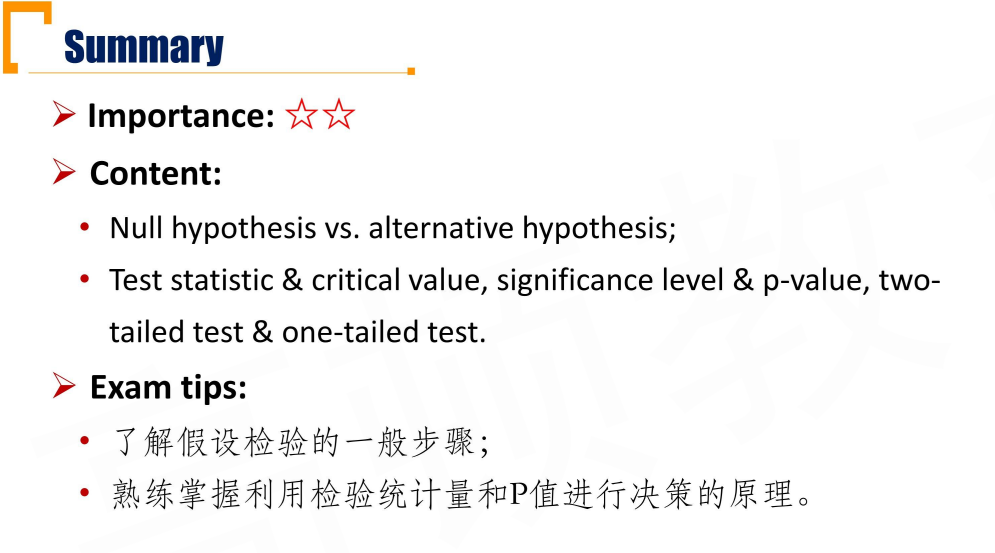

## R6.2 Type I error and Type II error

- **Type I Error**
  - **rejecting null hypothesis when it is true**
    - 原假设正确，却拒绝了原假设（拒真）
  - **P(Type I error) = significance level $\alpha$ **

- **Type II error**
  - **failing the reject the null hypothesis when it is false**
    - 原假设错误，却没有拒绝原假设（纳伪）
  - P(Type II error) = $\beta$
  - **Power of test**: rejecting the null hypothesis when it is false
    - Power of test = 1 - P(type II error) = $1-\beta$
    - power: 势

#### Question

- Since both type I and Type II are errors, can they be avoided at the same time?
  - 不可以同时降低Type I and Type II。降低Type I代表更谨慎，尽可能拒绝，此时提高了Type II；降低Type II代表尽可能接受，避免误判，此时提高了Type I。有点像precision 和 recall的关系
- How should we improve the plan in order to avoid them as much as possible？
  - 提高样本量，并且用随机抽样
- Which error is more fatal and why？
  - Type I error is more fatal。一类错误更重要。
  - 假设检验本身的目的就是证伪，找到一个小概率事件，拒绝掉H0。
- P(type I error) + P(type II error) $=?$ 100%。❌，不等于100%！。
  - P(没有拒绝｜原假设正确) = 1 - alpha
  - P(拒绝｜原假设正确) = alpha = P(type I error)
  - P(没有拒绝｜原假设错误) = beta = P(type II error)
  - P(拒绝｜原假设错误) = 1 - beta = power of test
- H0 True表示原假设是正确的情况下，H0 False表示原假设错误：

| Decision         | H0 True                          | H0 False                                          |
| ---------------- | -------------------------------- | ------------------------------------------------- |
| Do not reject H0 | correct decision(P = $1-\alpha$) | Type II error(P = $\beta$)                        |
| Reject H0        | Type I error(P = $\alpha$)       | Correct decision(P = power of test=(1 - $\beta$)) |

#### Type I Error and False Positive Result

- A **type I Error** is the risk of **rejection of a true null hypothesis**

  - false postive result就是犯了第一类错误

- Another way of phrasing this is that it is a **false positive result**

  - That is, the null is rejected(the positive), yet the null is true(hence, a false positive)

  - 这不就是混淆矩阵(confusion matrix)

  - |                     | actual Positive | actual Negative |
    | ------------------- | --------------- | --------------- |
    | prediction postive  | TP              | FP              |
    | prediction negative | FN              | TN              |

    这里预测positive，就是拒绝null，那么如果原假设正确，意思是actual negative。那就是prediction postive yet actual negative，就是FP, false positive.

#### Make A decision

- Make a **statistical decision**
  - 做完统计决策，需要根据实际情况(税收、交易费用、风险等)考虑经济决策
- Make an **economic decision**
  - The economic or investment decision takes into consideration not only the statistical decision but also all pertinent economic issues
- We frequently find that slight differences between a variable and its hypothesized value are statistically significant but not economically meaningful
  - The standard error decreases as the sample size n increases, so that we can reject the null and find that it provides a statistically significant return
  - The reuslts may not be economically significant when we account for **transaction costs, taxes, and risk**

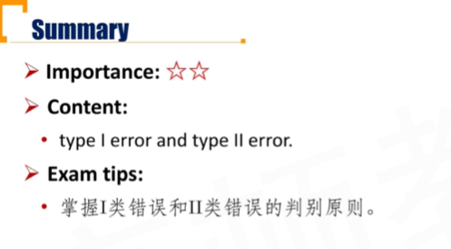

## R6.3 Hypothesis Testing

### 6.3.1 Single Mean

1) 区间估计是未知$\mu$，把区间算出来，然后得出区间覆盖总体参数的概率；假设检验是的假设的$\mu_0$，代入到$\bar X-\mu/\sigma/\sqrt n$中，和分位数做比较。
2) 双边、单边。单边的假设是H0: mu = mu0; 双边的假设H0: mu <= mu0。注意，H0是期望拒绝掉的假设，也就是把最不可能的假设放在H0。比如H0: 平均身高<=160。
3) 未知sigma，使用样本标准差代替，这时候中心极限定理变为t分布。

- Test statistic for hypothesis test of population mean with **known variance**

- $$
  z = \frac{\bar X - \mu_0}{\sigma/\sqrt n}
  $$

  - 🐖 is 🐖-statistic

  - $\bar X$ is sample mean

  - $\mu_0$ is hypothesis value of the population mean

  - $\sigma$ is population standard deviation

- Test statistic for hypothesis tests of population mean with **unknown variance**

- $$
  t_{n-1}=\frac{\bar X-\mu_0}{s/\sqrt n}\\
  z=\frac{\bar X-\mu_0}{s/\sqrt n}\ \ \ when\ sample\ size\ is\ large(\ge30)
  $$

  - $t_{n-1}$ is the t-statistic with n-1 degrees of freedom(n is the sample size)
  - $\bar X$ is the sample mean
  - $\mu_0$ is the hypothesized value of the population mean
  - s is the sample standard deviation

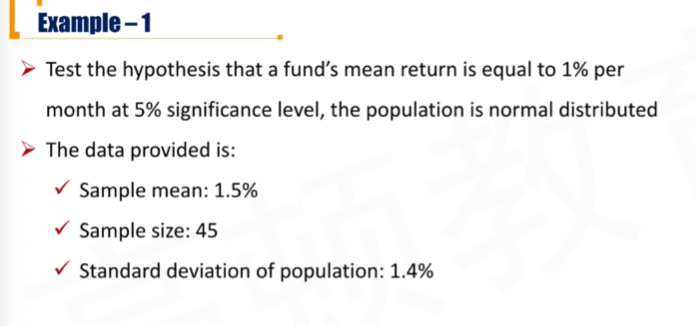

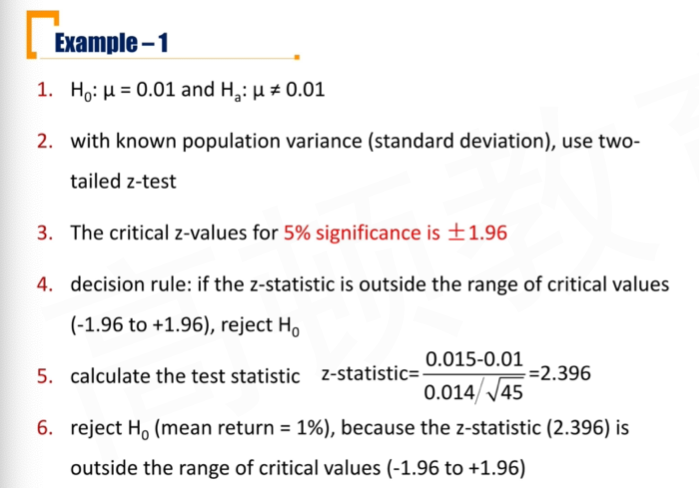

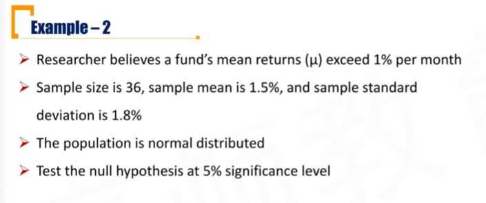

- believe >1%，所以把预期拒绝的<=1%放在H0

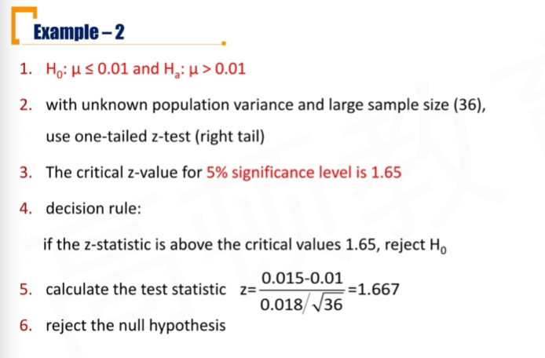

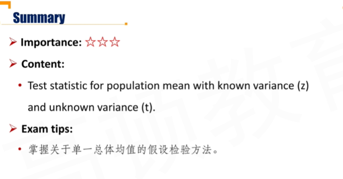

### 6.3.2 Other situations

#### Test Concerning Differences Between means with independent samples

- independent的两个变量，对比均值
- Let $\mu_1$ and $\mu_2$ represent, respectively, the population means of the first and second populations
- Two-sided:
  - $H_0:\mu_1-\mu_2=d$
  - $H_a:\mu_1-\mu_2\ne d$
- One-sided:
  - $H_0:\mu_1-\mu_2\le (\ge)d$
  - $H_a:\mu_1-\mu_2\gt(\lt) d$

- When we can assume that the two populations are **normally distributed** and that the **unknown population variances are equal**, we use a **t-distributed test statistic** based on independent random samples.
  - **三个条件：独立(independent)，(normally distributed)正太分布，总体未知方差相等**

$$
t=\frac{(\bar X_1-\bar X_2)-(\mu_1-\mu_2)}{\sqrt{\frac{s_p^2}{n_1}+\frac{s_p^2}{n_2}}}
$$

where,
$$
s_p^2=\frac{(n_1-1)s_1^2+(n_2-1)s_2^2}{n_1+n_2-2}
$$

- The number of **degrees of freedom** for this t-distribution test statistic is $n_1+n_2-2$

####  Test Concerning Differences between means with dependent samples

- When we want to conduct tests on two means based on samples that we believe are **dependent**, we use the test of **the mean of the differences**(a.k.a. **paired comparisons test**)
  - Suppose we have observations for the random variables $X_A$ and $X_B$, and $d_i=x_{A_i}-x_{B_i}$
- Two-sided:
  - $H_0:\mu_d=\mu_{d_0}$
  - $H_a:\mu_d\ne\mu_{d_0}$
- One-sided:
  - $H_0:\mu_d\ge(\le)\mu_{d_0}$
  - $H_a:\mu_d<(>)\mu_{d_0}$
- When we have data consisting of paired observations from samples generated by **normally distributed** populations with **unknown variances,** the **t-distributed test statistic** is
  - 三个要点：1) dependent, 2) normally distributed; 3) unknown variances

$$
t=\frac{\bar d-\mu_{d_0}}{s_{\bar d}}
$$

where
$$
\bar d=\frac{1}{n}\sum_{i=1}^{n}d_i\\
s_{\bar d}=\frac{s_d}{\sqrt n}
$$

- **The number of degrees of freedom for this t-distributed test statistic is $n-1$**

#### Testing concerning Tests of variances

- Two-sided: 
  - $H_0:\sigma^2=\sigma_0^2$
  - $H_a:\sigma^2\ne\sigma_0^2$

- One-sided:
  - $H_0:\sigma^2\le(\ge)\sigma_0^2$
  - $H_a:\sigma^2>(<)\sigma_0^2$

- In tests concerning the variance of a **single normally distributed population**, we make use of a **chi-square test statistic**

$$
\chi^2=\frac{(n-1)s^2}{\sigma_0^2}
$$

- The number of degrees of freeedom for this t-distributed test statistic is **n-1**

#### Test Concerning the equality of two variances

- Suppose we have a hypothesis about the relative values of the variances of **two normally distribute populations** with variances of $\sigma_1^2$ and $\sigma_2^2$
- Two-sided: 
  - $H_0:\sigma_1^2=\sigma_2^2$
  - $H_a:\sigma_1^2\ne\sigma_2^2$

- One-sided:
  - $H_0:\sigma_1^2\le(\ge)\sigma_2^2$
  - $H_a:\sigma_1^2>(<)\sigma_2^2$

- Suppose we have two samples, the first with $n_1$ observations and a sample variance $s_1$, and the second with $n_2$ observations and a sample variance $s_2$
  - The samples are random, **independent** of each other, and generated by **normally distributed population**

$$
F=\frac{s_1^2}{s_2^2}
$$

- 两个样本方差相除，大的样本方差放上面。
- $df_1=(n_1-1)$ numerator degrees of freedom
- $df_2=(n_2-1)$ denominator degrees of freedom
- 自由度是(n1-1, n2-1)
- When we rely on tables to arrive at critical values, a convention is to use the larger of the two sample variances in the numberator

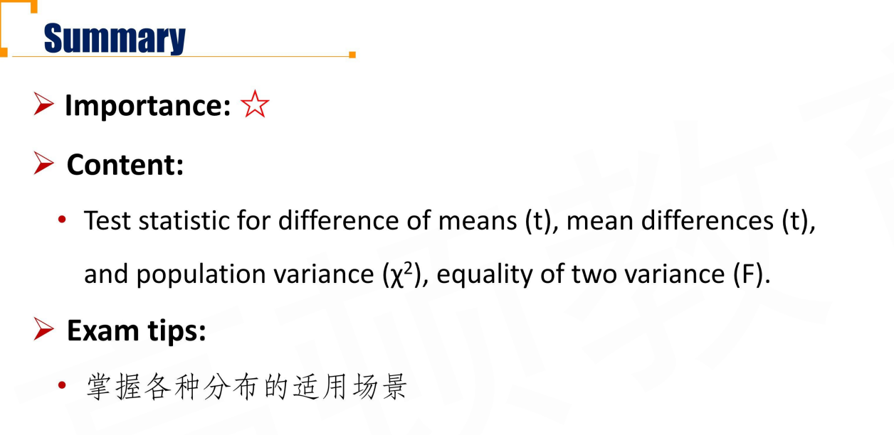

### 6.3.3 Hypothesis Test for Relationship

#### Tests Concerning Correlation \*\*\*

- In many contexts in investments, we want to assess the strength of the linear relationship betwen two variables, thus we want to evaluate the correlation between them
- Two sided:
  - $H_0: \rho=0$
  - $H_a:\rho\ne 0$
- One-sided:
  - $H_0:\rho\le(\ge)0$
  - $H_a:\rho >(<)0$
- If the two variables are **normally distributed**, we can test to determine whether the null hypothesis($H_0:\rho=0$) should be rejected using the sample correlation, r(样本相关系数)
  - The formula for the **t-test** is \*\*\*

$$
t=\frac{r\sqrt{n-2}}{\sqrt{1-r^2}}
$$

**The nubmer of degrees of freedom for this t-distributed test statistic is $n-2$**

最后，关于上面的式子中的样本相关系数r，下面给出了两种计算方法。

##### Pearson Correlation and Spearman Rank Correlation

- The parametric pariwise correlation coefficient is often referred to as the Pearson correlation, the bivariate correlation, or simply the sample correlation r.
- 样本相关系数为：

$$
r=\frac{s_{XY}}{s_Xs_Y}
$$

- 上面的方法是Parametric Tests，下面是Nonparametric Tests

- When we believe that the population under consideration meaningfully **departs from normality**(不符合正态分布时), we can use a test based on the **Spearman rank correlation coefficient** 

$$
r_s=1-\frac{6\sum_{i=1}^{n}d_i^2}{n(n^2-1)}
$$

- d是difference，两个变量的rank difference。
- The test of hypothesis for teh Spearman rank correlation depends on whether the sample is small or large(n>30)
  - For small samples, the researcher requries a specialized table of critical values
  - For large samples, we can conduct a **t-test with n-2 degrees of freedom**

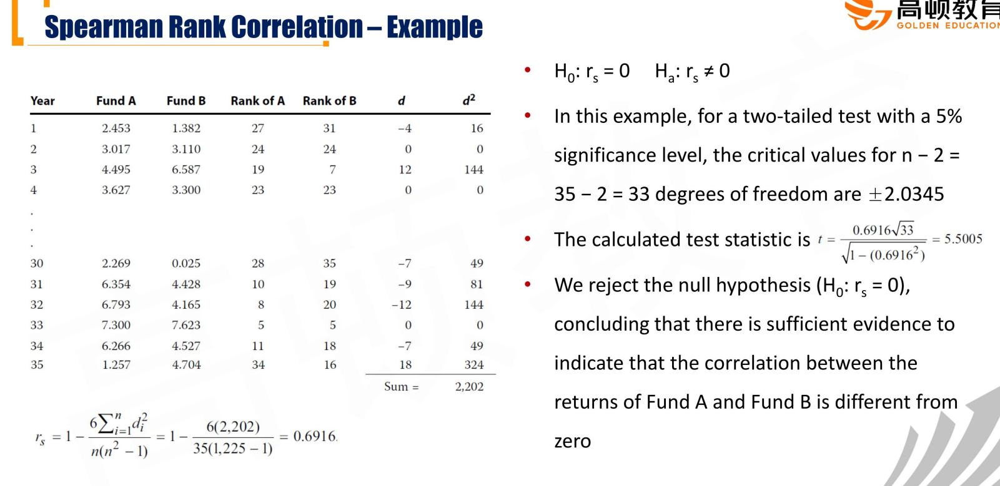

#### Parametric Tests vs. NonParameteric Tests

##### Parametric tests

- Based on assumptions about population distributions and population parameters. 
  - e.g., t-test, z-test, F-test

##### Non-parametric tests

- Test things other than paramter values
- Applied when:
  - **Data do not meet distributional assumptions**
  - **Data are given in ranks**
  - **The hypothesis we are addressing does not concern a parameter**

#### Test of Independence Using Contingency Table Data

- When faced with **categorical or discrete data**, we **cannot** use the methods that we have dicussed up to this point to test whether the classifications of such data are independent. 这里要验证的是列联表的两个维度是不是相关。
- The frequency table is called **contingency table**
- If we want to test wheter there is a **relationship between the row and column**, we can perform a test of independence using a **non-parametric test statistic** that is **chi-square** distributed

$$
\chi^2=\sum_{i=1}^{m}{\frac{(O_{ij}-E_{ij})^2}{E_{ij}}}
$$

- m = the number of cells in the table

- Oij = the number of observations（事实上的列联表的数字） in each cell of row i and column j(i.e. observed frequency)

- Eij = the expected number of observations in each cell, assuming independence(i.e, expected frequency)
  $$
  E_{ij}=\frac{Total\ row\ i \times Total\ column\ j}{Overal\ total}
  $$

- **The number of degrees of freedom is $(r-1)(c-1)$**

  - r和c是横纵坐标的维度

- 下面的案例，上面的表格是observation，下面是expectation

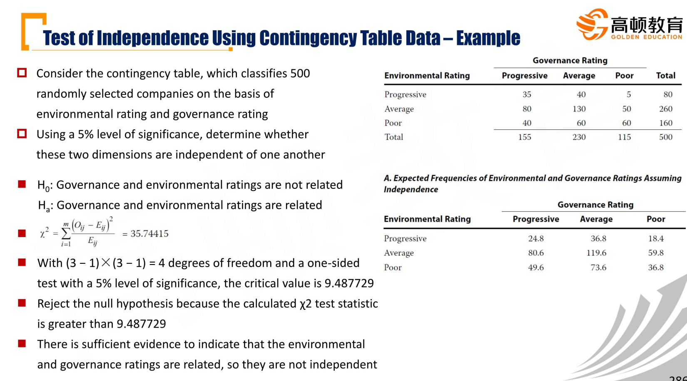

- 注意，上面的例子中chi-square是单边检验。

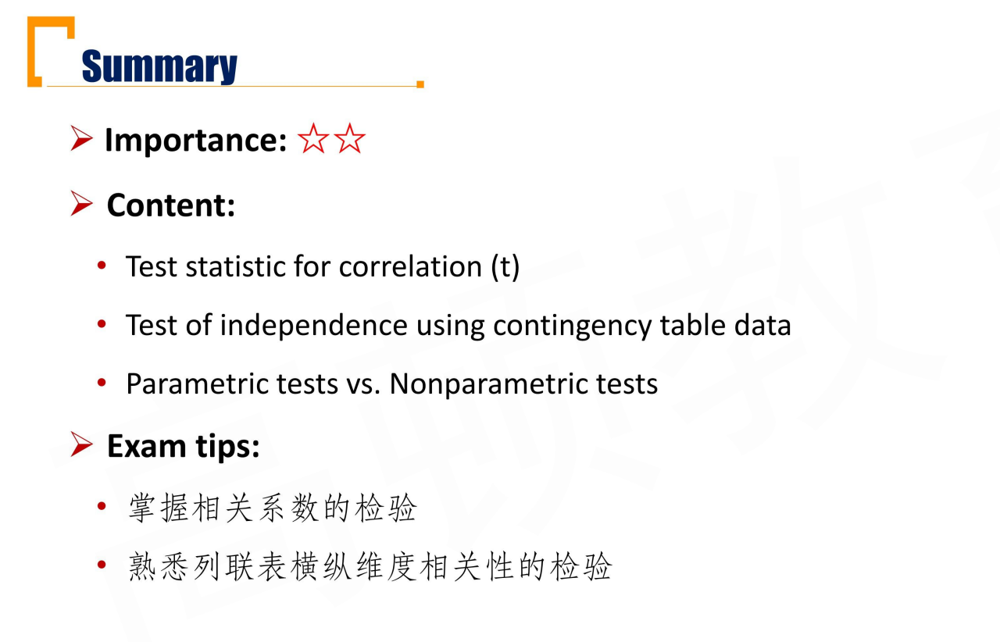

 
