# M7 Introduction to Linear Regression

## R7.1 Basics of Linear Regression Analysis

#### Regression Analysis

- Analysts often need to examine whether a variable X is useful for explaining another variable Y, and **regression analysis** is a tools for examining this type of issue.
  - 注意方向性：X解释Y。方向不能反（Y解释x ❌）
- What explains the variation of variable Y?
  - One way to start is to understand why each outcome of variable Y differs from the its mean $\bar Y$
  - The variation of Y is often referred to as the **sum of squares total (SST)**
  - Sum of squares total = $\sum(Y_i-\bar Y)^2$
    - $Y_i$ is the observation
    - $\bar Y$ is the mean

#### Dependent Variable and Independent Variable

- The variable whose variation is **being explained** as the **dependent variable, or the explained variable**, and it is typically denoted by $Y$
- The variable(s) whose variation is (are) being **used to explain** the variation of the dependent variable as the **independent variable(s)**, or the **explanatory variable(s)**, and it is typically denoted by "X(s)"
  - Y: dependent variable, explained variable
  - X: independent variable, explanatory variable
- A common method for relating the dependent and independent variables is through the **estimation of a linear relationship**
  - If we have **only one** independent variable, we refer to the method as **simple linear regression(SLR)**
  - If we have **more than one** independent variable, we refer to the method as **multiple linear regression**
  - 注意是线性

#### Simple Linear Regression

- **Linear regression** assumes a **linear relationship** between the dependent and the independent variables
- One way that we often describe the simple linear regression relation is that"Y is regressed on X"
- $Y_i=b_0+b_1X_i+\epsilon_i$
  - 下标$i$代表第$i$个observation
  - **Regression coefficients**(系数)
    - **$b_0$ is the intercept**
    - **$b_1$ is the slop coefficient**
  - $\epsilon_i$ is the **error term**
- Regression analysis uses two principal types of data（注意，没有办法解释panel data）
  1. cross secional data
  2. Time series data

#### Population and Sample Regression Function

- **Population regression function**
  - $Y_i=b_0+b_1X_i+\epsilon_i$
    - $b_0$ and $b_1$ are the **values for population parameter**
- **Sample regression function**
  - $Y_i=\hat b_0+\hat b_1 X_i+e_i$
    - $\hat b_0$ and $\hat b_1$ are the **estimates** of the population paramters **based on the sample**. 基于样本的对于总体参数的估计量。
- The **residual** for the i-th observation, $e_i$, is how much the observation value of $Y_i$ differs from the $\hat Y_i$ estimated using the regression line: $e_i=Y_i-\hat Y_i$
  - The **error term** $\epsilon_i$ refers to the **true underlying population relationship** 误差项是总体线性估计表达式的结果和真实值的偏差。
  - The **residual term** $e_i$ refers to the **fitted linear relation based on the sample** 残差项是真实值和每次样本估计值的偏差
  - 两者含义稍有区别。error term只站在总体的方程进行描述；residual term是样本和总体之间的偏差

#### Interpreting the regression coefficients

- The **intercept** is the value of the dependent variable if the value of the independent variable is zero
  - This does not make sense if it is unrelistic that the independent variable would be zero
- The **slope** is the change in the dependent variable for a one-unit change in the independent variable
  - If the slope is positive (negative), then the change in independent variable and the **estimate change** of dependent variable will be in the same(opposite) direction
  - estimate change：意思是存在误差项
- **The expected value of the residual term is zero**
  - $E(\epsilon)=0$
  - What if the expectation of error term is not zero?
    - 可以上下移动图像，把误差项移动到截距项

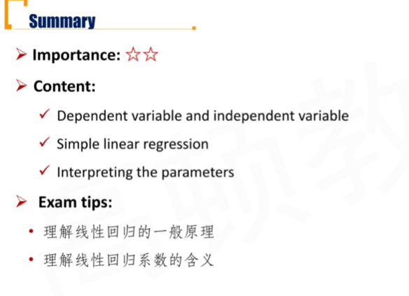

## R7.2 Simple Linear Regression(SLR)

#### Ordinary Least Squares(OLS) Regression

- The goal is to **fit a line** to the observations on Y and X to **minimize the squared deviations** from the line
- In simple linear regression, the estimated intercept $\hat b_0$, and slope $\hat b_1$ are such that **the sum of the squared vertical distances** from the observations to the fitted line is **minimized**
  - Fitting the line requires minimizing the sum of the squared residuals, the **sum of squares error(SSE)**, also known as the **residual sum of squares**

$$
SSE=\sum_{i=1}^{n}(Y_i-\hat Y_i)^2=\sum_{i=1}^{n}[Y_i-(\hat b_0+\hat b_1X_i)^2]=\sum_{i=1}^{n}e_i^2
$$

#### Estimating the Parameters

- The slope $\hat b_1$, is the ratio of the **covariance between Y and X** to the **variance of X**

$$
\hat b_1=\frac{
	\frac{\sum_{i=1}^{n}(Y_i-\bar Y)(X_i-\bar X)}{n-1}}{\frac{\sum_{i=1}^{n}(X_i-\bar X)^2}{n-1}}=
	
	\frac{\sum_{i=1}^{n}(Y_i-\bar Y)(X_i-\bar X)}{\sum_{i=1}^{n}(X_i-\bar X)^2}
$$

- Once estimate the slope$\hat b_1$, we can then estimate the intercept $\hat b_0$ **using the mean of Y and the mean of X**

$$
\hat b_0=\bar Y-\hat b_1 \times \bar X
$$

- Slope of the regression line and correlation
  - 斜率大于零$\iff$ X和Y协方差大于0
- Where is the point $(\bar X, \bar Y)$
  - 一定在$<\hat b_0, \hat b_1>$拟合的直线上

#### Assumptions of the Simple Linear Regression

四个假设都是站在残差的角度

##### 1. Linearity 

- **Assumption**: the relationship between the dependent variable Y and the independent variable X is **linear**
  - 三点：X和Y线性、残差项是随机变量、自变量不是随机变量

- If the relationship between the independent and dependent variables is nonlinear in the parameters, the model will be biased, because it will under- and overestimate the dependent variable at certain points
- When we look at the residuals of a model, what we would like to see is that the **residuals are random**
  - **Independent variable X is not random** 自变量不是随机变量
  - 残差项是白噪声，模型希望残差项是随机变量，没有明显的规律。

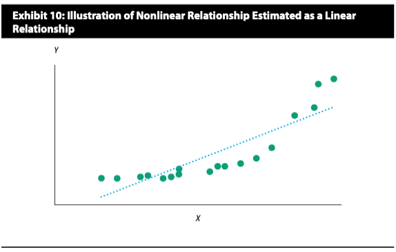

- 上图中，X和Y的关系不是线性，所以导致下图中的残差项不是随机分布

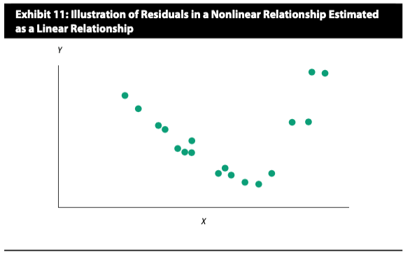

##### 2. Homoskedasticity 同方差

- **Assumption**: the variance of the regression residuals is the same for all observations, which is known as the **homoskedasticity**
  - If variance of residuals differs across observations, then we refer this as heteroskedasticity（异方差）

课本上的一个例子，拟合出的直线如下图：

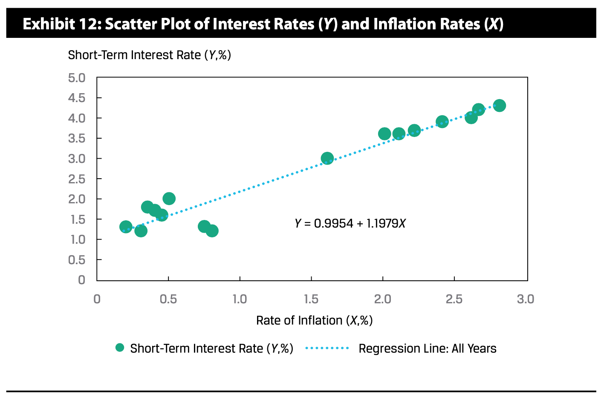

- 进一步画出对应的残差项图：观察得到，不同的区域，残差项的方差不一样。不满足同方差的assumption

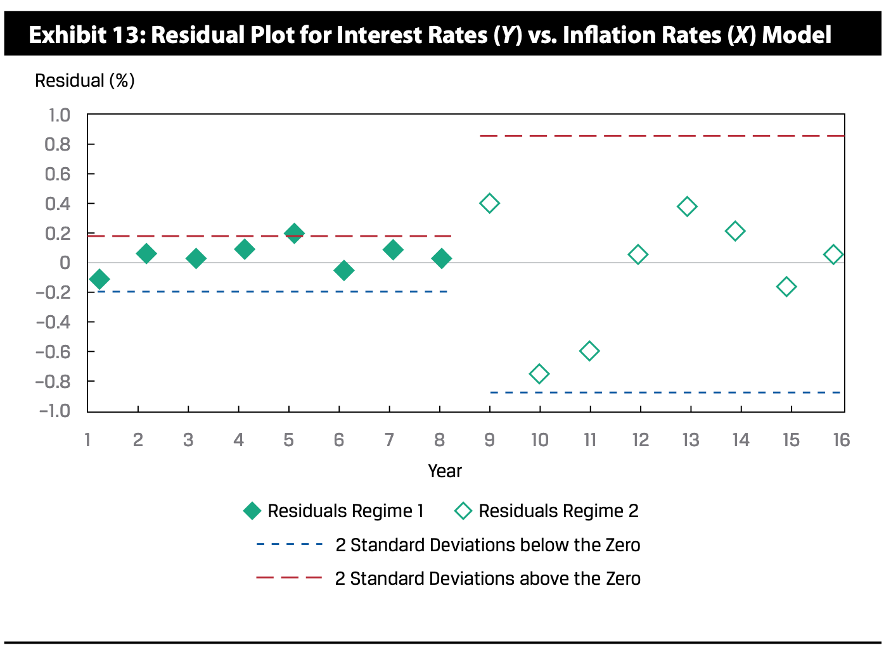

- 解决方法：分段讨论，分段拟合

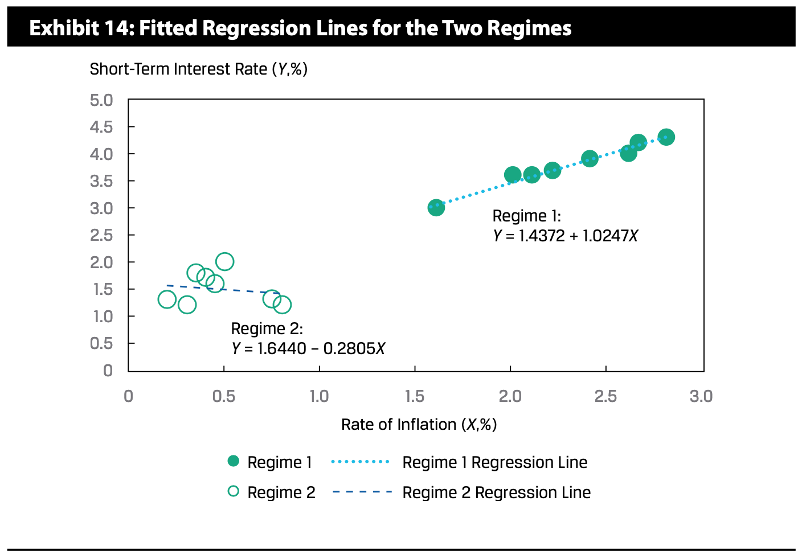

##### 3. Independence

- **Assumption**: the observations, **pairs of $Y_i$ and $X_i$, are independent** of one another, which implies the regression **residuals are uncorrelated** across observations 这里指的是across observation，每次的observation是互相独立的
  - If there is correlation between observations, they are not independent and the residuals will be correlated
- It is important to examine whether the residuals exhibit a pattern, suggesting a violation of this assumption

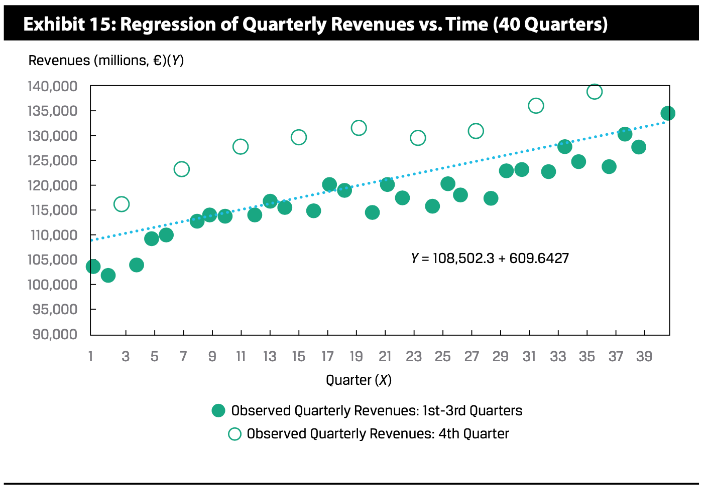

- 公司收入出现季节性，第四季度的收入会明显变大。于是这里出现了自相关性：$\rho_{e_i,e_{i-4}}\ne0$，今年4季度的残值，显然和去年4季度的残值会相关。

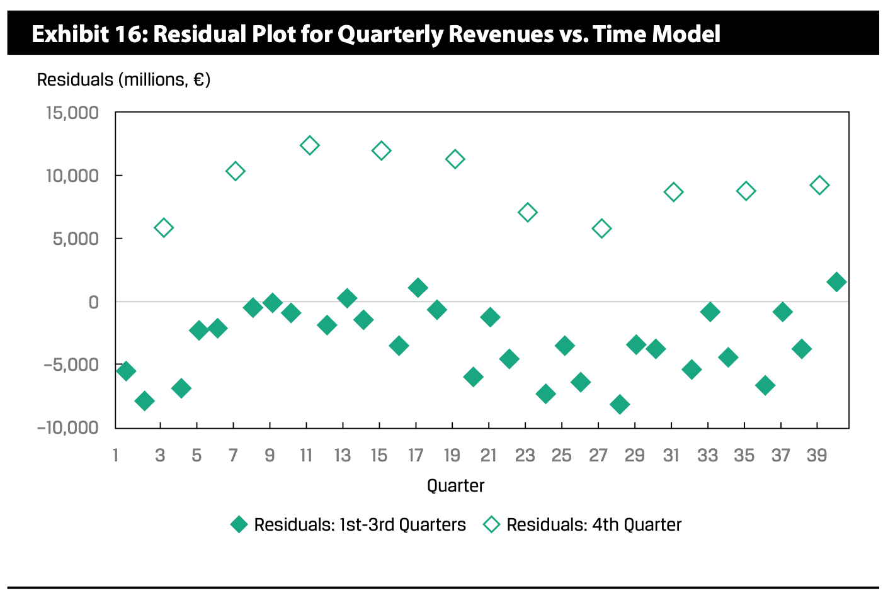

##### 4. Normality

- **Assumption**: the regression residuals are **normally distributed** 残差项服从正态分布
  - The assumption of normality only means that **the residuals** from the model are normally distributed
    - This does not mean that the dependent and independent variables must be normally distributed
  - With normally distributed residuals, we can test a particular hypothesis about a linear regression model
    - **For large sample sizes**, we may be able to drop the assumption of normality by appealing to the central limit theorem
- 上面的四个assumption，基本上都是站在残差项的角度分析
  - 残差项随机变量
  - 残差项有白噪音的特征：均值为0，方差有限且相等，互不相关
  - 最后一点假设服从正态分布

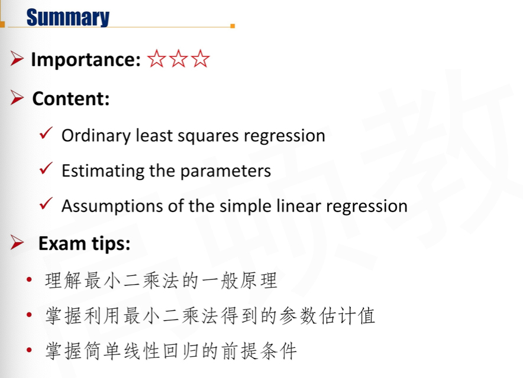

## R7.3 Analysis of Variance \*\*\*

方差分析是重点

#### Sum of Squares

- **Sum of squares total(SST)** can be broke down into two parts:
  1. **Sum of squares error(SSE)**
  2. **Sum of squares regression(SSR)**

- **SST = SSE + SSR**
- **Sum of squares total (SST)** represents the **total variation in Y** 总体变动
  - $SST = \sum (Y_i-\bar Y)^2$
- **Sum of squares error(SSE)** represents the **unexplained variation in Y** 利用线性预测和真实值之间的偏差，不能被线性组合解释的部分
  - $SSE = \sum(Y_i-\hat Y_i)^2$

- **Sum of squares regression(SSR)** represents the **explained variation in Y** 能被线性组合解释的部分
  - $SSR = \sum (\hat Y_i-\bar Y)^2=SST - SSE$

#### Mean Square

- Review Question：
  - What is $SST \div\ degrees\ of\ freedom$?
    - degree of freedom就是n-1，所以上式是Y的方差Var(Y)
- **Mean square regression(MSR, 均方回归) = SSR / degrees of freedom**
  - df = number of independent variables(k) 自变量的个数
  - In the case of a simple linear regression, df = k = 1
    - $MSR=\frac{\sum \hat Y_i-\bar Y}{1}$

- **Mean square error(MSE，均方误差) = SSE / degrees of freedom**
  - df = n - 1 - k
  - In the case of a simple linear regression, df = n - 1 - k = n - 2
    - SST = SSE + SSR, SST求方差有n-1个自由度，MSR有一个自由度，自由度可以相加。所以MSE df = n-2
    - $MSE=\frac{\sum(Y_i-\hat Y_i)}{n-2}$

#### Measures of Goodness of Fit 如何衡量拟合效果

- There are several measures taht we can use to evaluate goodness of fit, that is, how well the regression model fits the data. 三个指标衡量线性回归的拟合效果。
  1. **Coefficient of determination($R^2)$**
  2. **F-statistic for the test of fit**
  3. **Standard error of the regression($s_e$, $\sqrt{MSE}$)** 回归标准差，就是残差的标准差

##### R-squared($R^2$)

- The **coefficient of determination**, also referred to as the **R-squared** or $R^2$, is the **percentage of the variation of the dependent variable** that **is explained by** the independent variable. 总体的变动里，线性组合能够解释的部分。
  - **Coefficient of determination（$R^2$）= SSR / SST = 1 - SSE / SST**

$$
R^2=\frac{\sum (\hat Y_i - \bar Y)^2}{\sum (Y_i-\bar Y)^2}
$$

- Coefficient of determination ranges from 0% to 100%
- In a **simple linear regression,** the square of the pairwise **correlation equal to the coefficient of determination**

$$
R^2=r^2
$$

- 这里的r是样本相关系数。决定系数 = 相关系数平方（在简单线性回归中才成立）

##### F-statistic for the Test of Fit

- $H_0:b_1=0$
- $H_a: b_1\ne 0$
  - 这里b1=0，意思是Y和X不具有线性关系。如果拒绝掉H0，意思是Y和X会有线性关系。
- The **F-distributed test statistic** is constructed by using the sum of squares regression and the sum of squares error, each adjusted for degrees of freedom

$$
F_{(1,n-2)}=\frac{SSR/1}{SSE/(n-2)}=\frac{MSR}{MSE}=\\
\frac{\sum (\hat Y_i-\bar Y)^2}{1}/\frac{\sum (Y_i-\hat Y_i)^2}{n-2}
$$

- It is distributed **with 1 and n-2 degrees of freedom** in simple linear regression
- The F-statistic in regression analysis is one sided, with the rejection region on the right side, because we are interested in whether the variation in Y explained(the numerator) is larger than the variation in Y unexplained(the denominator) 拒绝域在右侧尾巴，表示分子大、分母小。分子是线性回归可以解释的部分，分母是线性回归无法解释的部分。

##### Standard Error of the Estimate ($s_e$)

- Standard error of the estimate($s_e$), 残差的标准差, which is also known as the **standard error of the regression** or **the root mean square error**, is a **measure of the distance** between the observed values of the dependent variable and those predicted from the estimated regression

$$
s_e=\sqrt{MSE}=\sqrt \frac{\sum (Y_i-\hat Y_i)^2}{n-2}
$$

- 注意分母是n-2，残差的标准差
- The smaller the $s_e$, the better the fit of the model
- Unlike the **coefficient of determination** and the F-statistic, which are **relative measures of fit**, the **standard error of the estimate** is an **absolute measure** of the distance of the observed dependent variable from the regression line

#### 	Analysis of Variance (ANOVA) Table

| Source     | Sum of Squares                  | Degrees of freedom | Mean Square   | F-statistic   |
| ---------- | ------------------------------- | ------------------ | ------------- | ------------- |
| Regression | SST = sum($\hat Y_i -\bar Y_i$) | 1                  | MSR = SSR / 1 | F = MSR / MSE |
| Error      | SSE = sum($Y_i-\hat Y_i$)       | n-2                | MSE=SSE / n-2 |               |
| Total      | SSR = sum($Y_i-\bar Y$)         | n-1                |               |               |

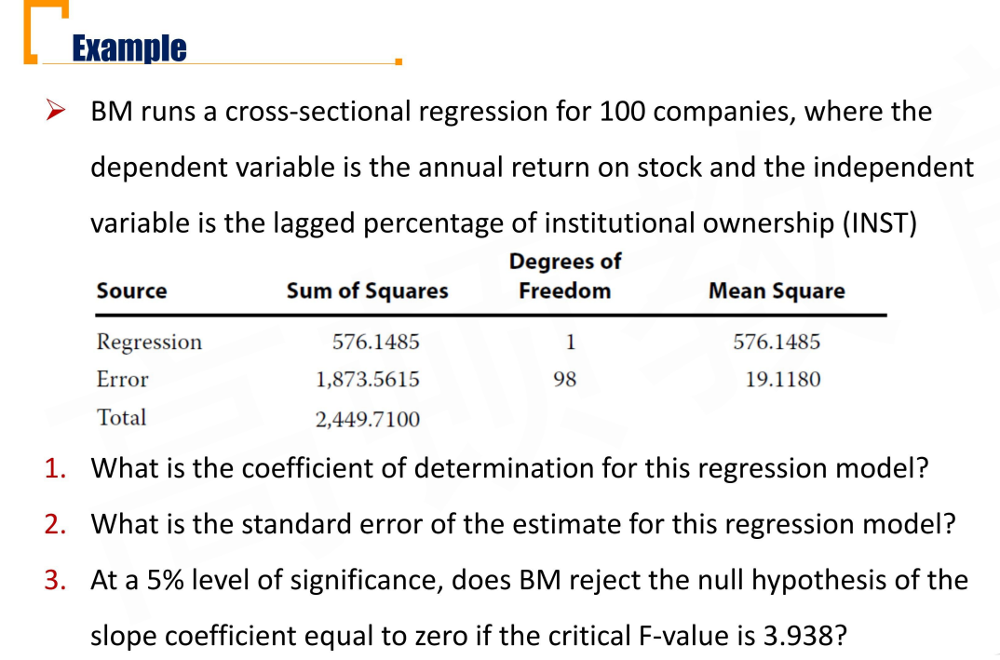

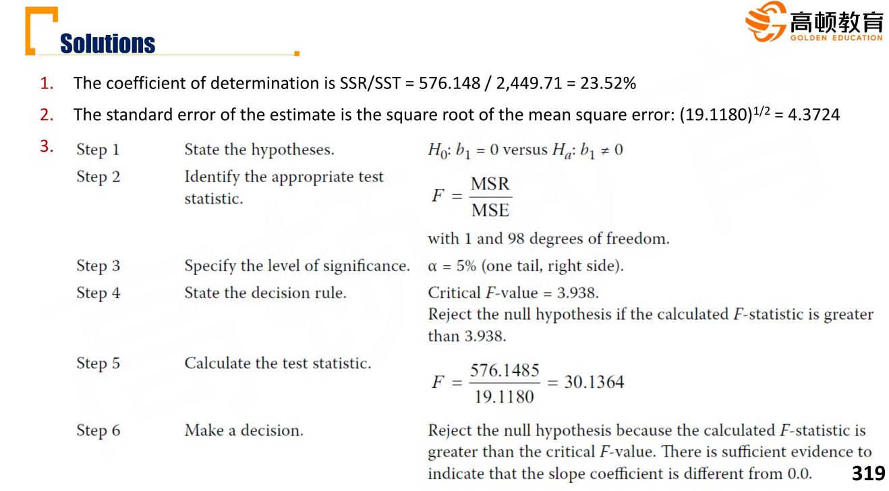

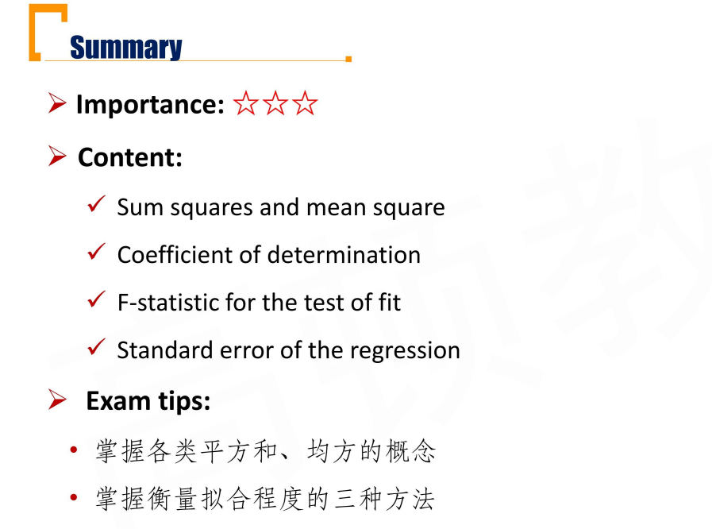

## R7.4  Inference by Simple Linear Regression

#### Hypothesis Test of the Slope Coefficient

- We use a **t-distributed test statistic ** to test whether the **population slope** is different from a specific value or whether the slop is higher(lower) than a specific value(比如，双边检验时，H0: b1 = B1)

$$
t=\frac{\hat b_1-B_1}{s_{\hat b_1}}\sim T_{n-1-k}
$$

- $\hat b_1$ is the **estimated slope coefficient**
- $B_1$ is the **hypothesized population slope**
- $s_{\hat b_1}$ is the **standard error of the slope coefficient**
  - $s_{\hat b_1}=s_e/\sqrt{\sum(X_i-\bar X)^2}$

- The greater the variability of the independent variable, the lower the standard error of the slope and hence the greater the calculated t-statistic
  - If the calculated t-statistic is outside the bounds of the critical t-values, we reject the null hypothesis
  - 自变量X 离散程度越大，$s_{\hat b_1}$越小，t检验统计量绝对值越大，所以越容易拒绝假设（比如，H0: b1 = 0，拒绝表示更有线性关系）
- For simple linear regression, the **t-statistic is with n-2 degrees of freedom** because two parameters(an intercept and a slope) were estimated
- **Question:** can we use the F-statistic to test for the significance of the slope coefficient? 上节课中的F统计量需要和这里的t统计进行区分，对于多元线性回归
  - 对于F检验，是对整体自变量和Y的关系进行检验。
    - H0: b1=b2=b3...=0
  - 对于t检验，是针对某一个斜率slope进行检验
    - H0: bk = 0

#### Hypothesis Tests of the Correlation

X,Y之间的相关系数

- Two-Sided
  - $H_0:\rho=0$
  - $H_a:\rho\ne0$

- One-sided
  - $H_0:\rho\le(\ge)0$
  - $H_a: \rho>(<)0$

$$
t = \frac{r-0}{\sqrt{\frac{1-r^2}{n-2}}}=\frac{r\sqrt{n-2}}{\sqrt{1-r^2}}\sim T_{n-2}
$$

- r is the **sample correlation**
- 关于simple linear regression的两个feature
  1. <u>One feature of simple linear regression</u> is that the **t-statistic** used to test whether the slop coefficient is equal to (larger/smaller) than 0 and the **t-statistic** to test whether the pairwise correlation is equal to (larger/smaller) 0 are the **same value** 上一页的$t=\frac{\hat b_1-B_1}{s_{\hat b_1}}$和这里的t结果数量一致。
  2. <u>Another feature of simple linear regression</u> is that the test-statistic used to test the fit of the model(**F-distributed test statistic**) is **related to **the calculated **t-statistic** used to test whether the slope coefficient is equal to 0
     - $t^2=F=MSR/MSE$

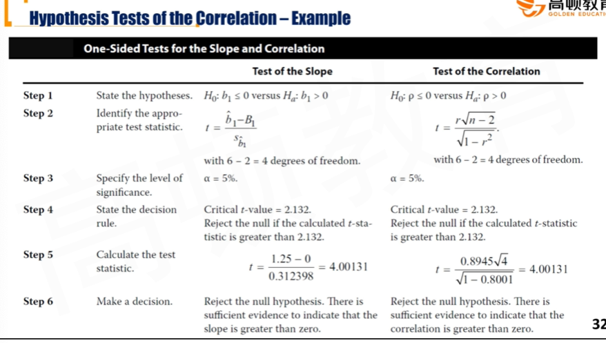

#### Hypothesis Tests of the Intercept

- There are occasions when we want to test whether the **population intercept** is a specific value
- H0: b0=B0

$$
t=\frac{\hat b_0-B_0}{s_{\hat b_0}}\sim T_{n-2}
$$

- $\hat b_0$ is the **estimated intercept**
- $B_0$ is the **hypothesized population intercept**
- $s_{\hat b_0}$ is the **standard error of the intercept**
  - $s_{\hat b_0}=\sqrt{\frac{1}{n}+\frac{\bar X^2}{\sum(X_i-\bar X)^2}}$

#### Indicator Variable 哑变量

- **Indicator variable**, (a.k.a dummy variable), is the **independent variable** who takes on **only the values 0 or 1**
- $Y_i=b_0+b_1X_i+\epsilon_i$
  - if $X_i$ is the indicator variable
    - The interpretation of the intercept is the predicted value of the dependent variable if the indicator variable is zero
      - X=0时，Y=b0
    - The slope, when the indicator variable is 1, is the difference in the means if we grouped the observations by the indicator variable
      - X=1时，Y=b0+b1。$Y(x=1)-Y(x=0)=b1$

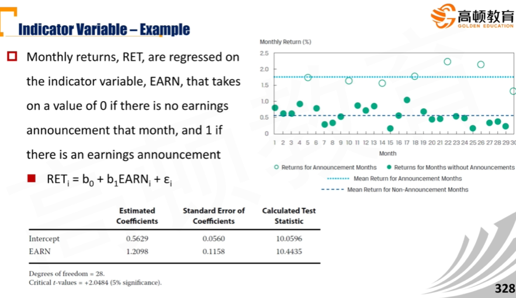

#### Prediction Interval of Dependent Variable

- A **forecasted value of the dependent variable** $\hat Y_f$ is determined using the **estimated intercept and slope**, as well as the **expected or forecasted independent variable, $X_f$** 预测值，自变量和应变量都是预测值
  - $\hat Y_f=\hat b_0+\hat b_1 \times X_f$
- We need to consider that the estimated regression line does not describe the relation between the dependent and independent variables perfectly, because the residuals are not all zero
  - $\hat Y_f$ is an average of the relation between the two variables
- An **interval estimate of the forecast** is needed to reflect this uncertainty
  - The prediction interval is $\hat Y_f \pm t_{critical\ for\ \alpha/2}\times s_f$

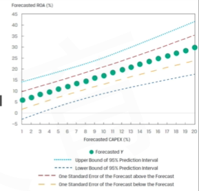

##### Sandard Error of the Forecast 预测标准误

$$
s_f=s_e\times\sqrt{1+\frac{1}{n}+\frac{(X_f-\bar X)^2)}{\sum (X_i-\bar X)^2}}
$$

- $s_e=\sqrt{MSE}$
- The smaller standard error of the forecast($s_f$) will be achieved(这时候置信区间更窄，估计更精确), if:
  1. The better the fit of the regression model, the smaller the standard error of the estimate($s_e$)
  2. The larger the sample size(n) in the regression estimation
  3. The closer the forecasted independent variable($X_f$) is to the mean of the independent variable($\bar X$)used in the regression estimation
  4. The larger the variation of the independent variable($\sum (X_i-\bar X)^2$)

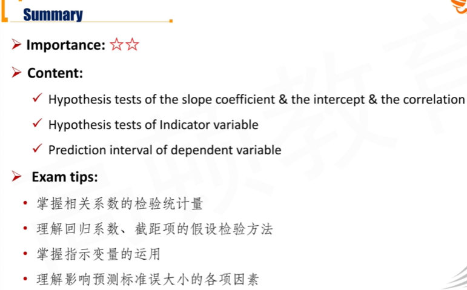

## R7.5 Different Functional Forms of Simple Linear Regression

#### Log-Lin Model

- In the log-lin model, the dependent variable is in  logarithmic form and the independent variable is in linear form
  - $\ln Y_i=b_0+b_1X_i+\epsilon_i$
  - The slope coefficient $b_1$ is the **relative change** in the dependent variable for an absolute change in the independent variable
  - b1表示 变动1个单位，lnY1 变动 b1个单位，注意，这里Y变动relative change，也就是y变动b1%.
    - $d\ln Y_i = b_1dX_i\iff \frac{dy}{dx}=b_1y$

#### The lin-log model

- In the lin-log model, the dependent variable is in linear form and the independent variable is in logarithmic form
  - $Y_i=b_0+b_1\ln X_i+\epsilon_i$
  - The slope coefficient $b_1$ provides the absolute change in the dependent variable for a relative change in the independent variable
    - x 变动1%，Y变动 b1个单位

#### The Log-Log model

- The log-log model, in which both the dependent variable and the independent variable are linear in their logarithmic forms, is also referred to as the double-log model
  - $\ln Y_i=b_0+b_1\ln X_i+\epsilon_i$
  - The slope coefficient $b_1$ is the relative change in the dependent variable for a relative change in the independent variable
    - X变动1%，Y变动b1%(弹性elasticity)

#### Selecting the Correct Functional Form

- The key to fitting the appropriate functional form of a simple linear regression is examining the goodness of fit measures
  1. The coefficient of determination(R^2)
  2. The F-statistic
  3. The standard error of the estimate($s_e$)
     - 注意，$R^2$和F-statistic可用于lin-log, log-lin, log-log，
     - 但是$s_e$只可用于lin-log，因为$s_e$是绝对指标$\sqrt {MSE}$，$R^2$和F都是相对指标，只适用于Y轴不变的情况
  4. We can also examine whether there are **patterns in the residuals** 
     - what we want to see in these plots is random residuals

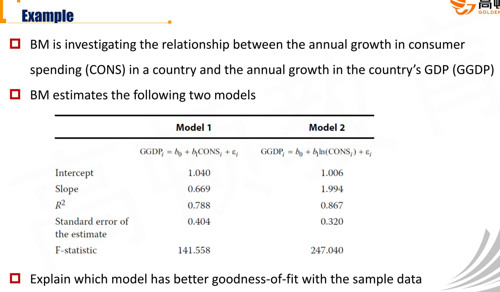

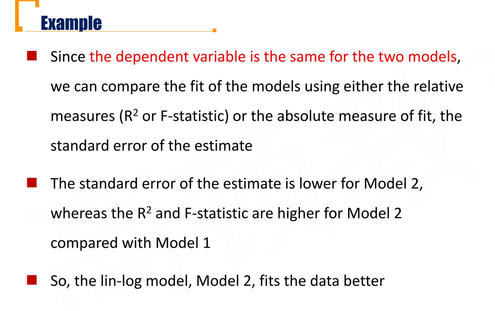

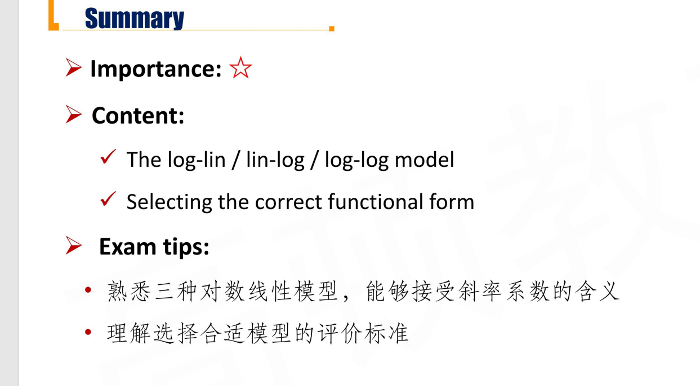

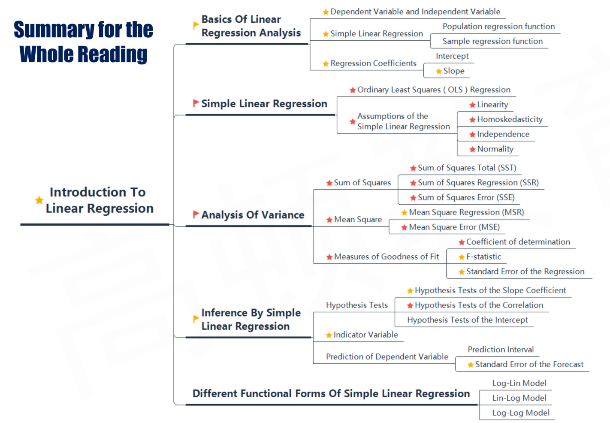

