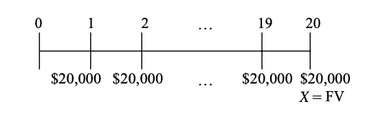
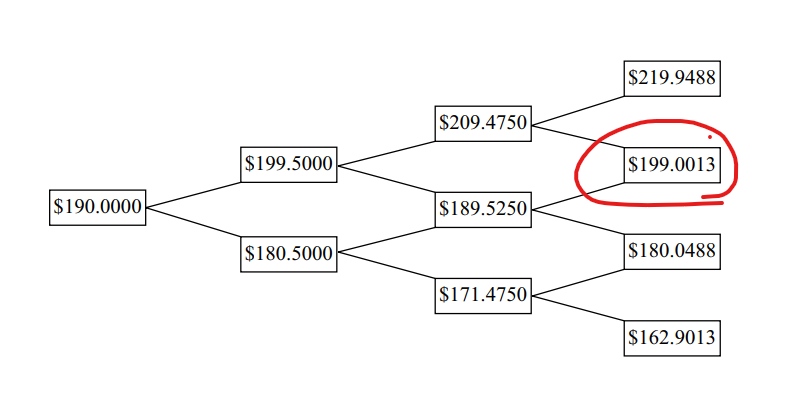
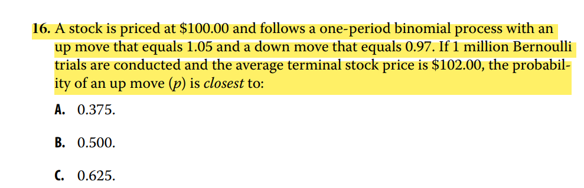

# M1

annuity due和ordinity annuity区别

- There are two types of annuities, the annuity due and the ordinary annuity. The annuity due has a first cash flow that occurs immediately; the ordinary annuity has a first cash flow that occurs one period from the present (indexed at *t* = 1).

错题：22、25、27

关键看支付时间、到期时间点，用课本的这种模式画线

知识点：

- EAR
- FV\PV
- Annuity

# M2

- ordinal 定序数据 nominal 定类数据
  - negative, neutral, positive：三类，都算ordinal, 有序的

- Pareto Chart ：barchart 上有累积分布

- absolute frequency(raw frequency) is the actual number of observation
- cumulative relative frequency看右边区间, 比如bin: a < x <b的cumulative relative frequency，把所有x < b的relative frequency 相加
- 不同线发掘的规律：
  - line chart：changes over time
  - scatter plot: joint variation in two numerical variables
  - heat map: joint frequencies among categorical variables(degree of correlation)
- 注意semi-target deviation，分母是n-1
- 变异系数CV是$S/\bar X$, 分母是标准差。

错题：1、2、5、18、21、29、32、40

不确定的题目：9、10、11、19、26、36、44

# M3

- correlation接近+1，说明两个portfolio线性正相关。
  - **diversification benefits**: This risk reduction is a diversification benefit, meaning a risk-reduction benefit from holding a portfolio of assets. The diversification benefit increases with decreasing covariance. This observation is a key insight of modern portfolio theory. This insight is even more intuitively stated when we can use the concept of correlation.
  - 当correlation（covariance）下降时，diversification benefit上升

- Multinomial formula就是labeling

  - $$
    \frac{n!}{\prod n_i}
    $$

错题：20、21、22、25，31

不确定：7、12

# M4

- 注意二叉树的画法，第三级的下和上连在一起

- 二项分布的两个条件：
  - 每次概率相等
  - 独立同分布
- Monte-Carlo 不能提供因果分析（cause-and-effect）
- 错题：12、17、19

- 这题的意思就是期望是102
- E(X)=P(up)Xup+P(down)Xdown=105*p+97(1-p)=102
- 1million是干扰项

# M5

- If an estimator is consistent, an increase in sample size will increase the accuracy of estimates. an more concentrated on the parameter(方差更小)
- jackknife和bootstrap:(21题)
  - jackknife：
    - 适用于总体地样本量相对较小
    - 每次without replacement从original sample中抽出一个。
    - 对于sample size n, 需要repetition n times.
    - 可以更好地减低bias
    - 每次结果都similar
  - bootstrap
    - 适用于总体样本量很大。
    - 每次replacement地从总体中重新抽样。
    - repeat times 需要自己定。
    - 每次结果都不同（random）
- 24题关于data mining biases，可以这样应对：
  - test on out-of-sample data
  - make economic sense，尝试从逻辑上解释
- A out-of-sample test is used to investigate the presence of Data-mining bias.
- biases:
  - look-ahead: information not available on test date
  - time-period bias: 比如study on short time series不能应用在long-time period
- 错题：1、21、26、27
- 关注：2、11、24

# M6 

- 错题：4、10、19、21、24、25、29、30、31、33、37、39、41
- 关注：2、11、15
- zstatistic检验没有自由度
- 10、增加significance level$\alpha$，Type I error概率下降、Type II Error概率上升。
- 11、The power of test is the probability of rejecting the null hypothesis when it is false
  - P(not regject | false ) = beta
  - P(reject | false) = 1-beta = power of test
- 15、When a statistically significant result is also economically meaningful, One should futher explore the logic of why the result might work in the future.
  - presume:推定、认定

- 19、The p-value is the smallest level of significanct($\alpha$) at which the null hypothesis can be rejected. 能使H0拒绝的置信度alpha的最小值。

- 21、

  - C）🐖-statistic 没有df
  - $\chi^2$检验，自由度是n-1，只有协方差的t-检验的情况才是n-2!

- 24、比较两个均值，注意：假设前提：总体都是均值、互相独立、总体方差未知且相等

  - 注意单边检验时候：原假设的形式H0: $\mu_1\le \mu_2$
  - 单边检验的时候，rejection point需要注意是直接取significance 查表
  - $s_p$ 是 pooled estimate of variance

- 29、注意pool estimator 是$s_p$ 定义。

- 30、检验均值mean differences 如果是dependent variable，使用pair comparison test:

  - $t=\frac{\bar d-d_0}{s_{\bar d}}$
  - 注意分母是 标准误，$s_{\bar d}=s_d / \sqrt{n}$

- 31、mean difference between dependent RV: pair comparison test

- 33、注意chi-square自由度n-1

- 37、样本量小、总体分布也不满足正态分布，无法使用参数估计，转而使用non-parameter test. 

- 39、和37一样，样本量小、alpha有下界（不能小于-1），expense ratios不能为负数。所以不满足parameter test 的前提条件。使用spearman 估计。

  - spearman估计的细节：

    - 排序方式，最大为1，从大到小排序！！

    - 相同数字排序：排两遍

    - 注意公式，1不在分子上

    - $$
      r_s=1-\frac{6\sum_i d_i^2}{n(n^2-1)}
      $$

- 41、注意列联表求和，右下角的总和定义，**不能横和竖向加两遍！！！**

# M7

错题：2、8（C）、10、14、19、27、32

关注：2（D）、7、23

- 2、一些Sum of squares 的名词：
  - total variation in Y: SST
  - unexplained variation in Y: SSE
  - explained variation in Y: SSR
  - 注意这里的variance不能翻译为方差，所以分母**不用**再除以n-1
  - SST / n-1就是 sample variance（样本方差）
- 8（C）F-statistic test for linear regression的假设是(所有)斜率为0，如果是SLR，就是b1=0.
- 10、注意 coefficient of determination在SLR中，有$R^2=r^2$，pairwise correlation是平方。
- 14、注意题目：decrease，所以CPIENG 变动是-0.01
- 19、样本协方差，分母需要除以n-1
- 23、SLR里对参数的检验(slope, intercept, correlation)，都是df = n-2
- 27、Linear regressin model 4 assumption:
  - 1) the relationship between the dependent variable and the independent variable is linear 
    2) The residuals are independent of one another
    3) the variance of the error term is the same for all observations
    4) the error term is normall distributed
  - 所以，题目中dependent variable不是normal
- 32、对slope和intercept，要看清假设的目标值B。有时候需要重新计算。