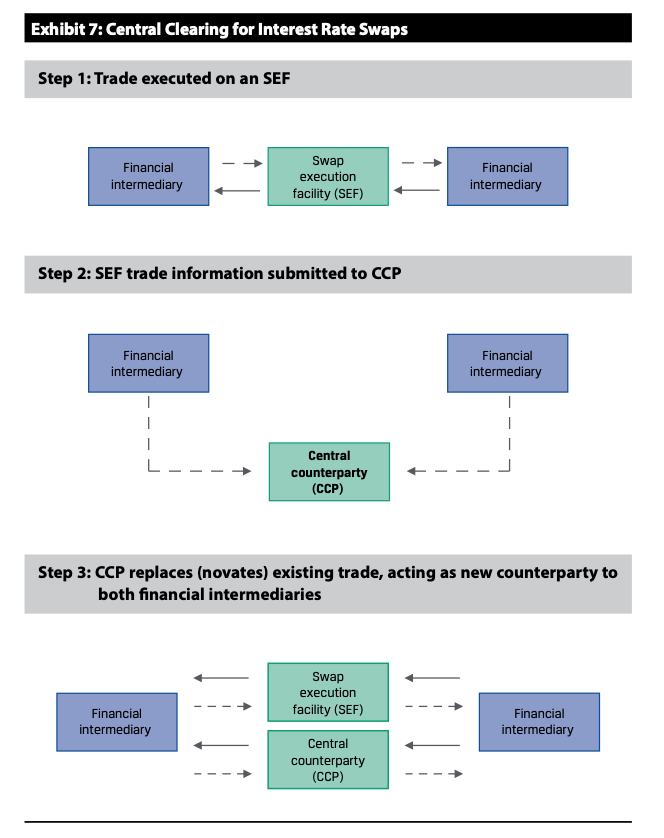
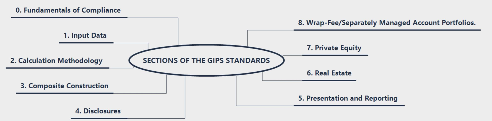
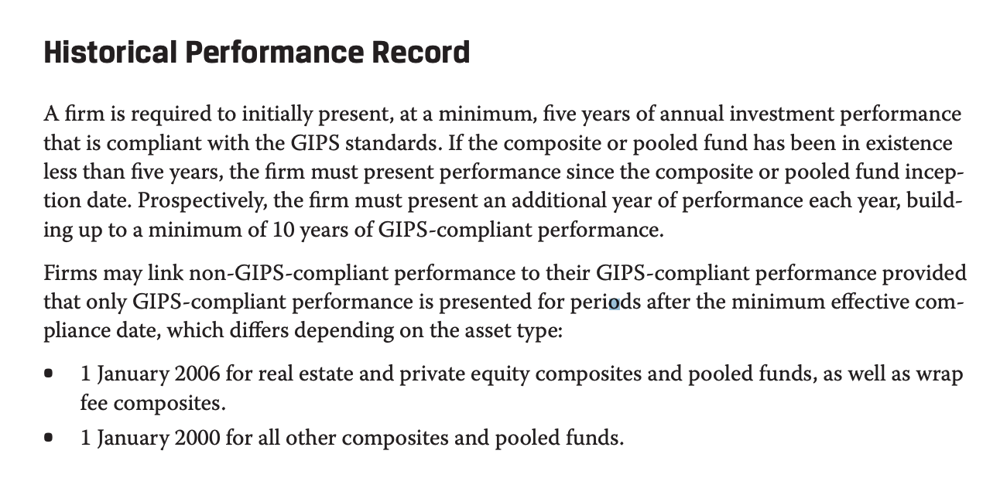
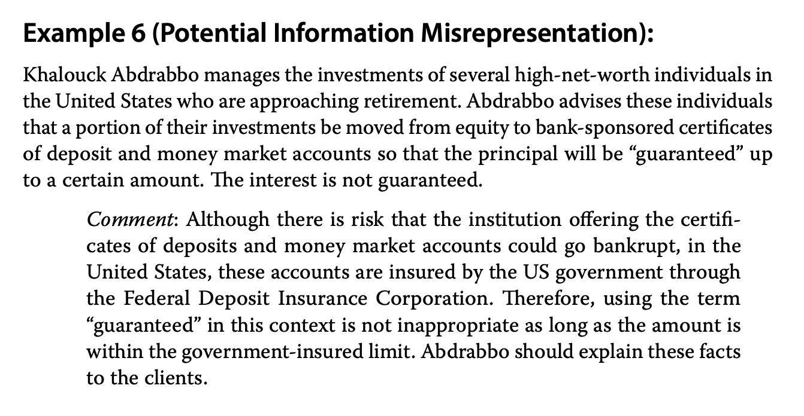
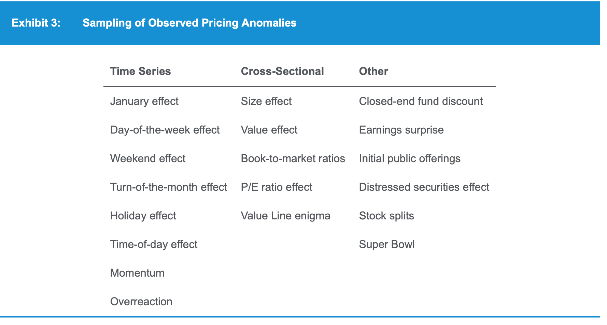
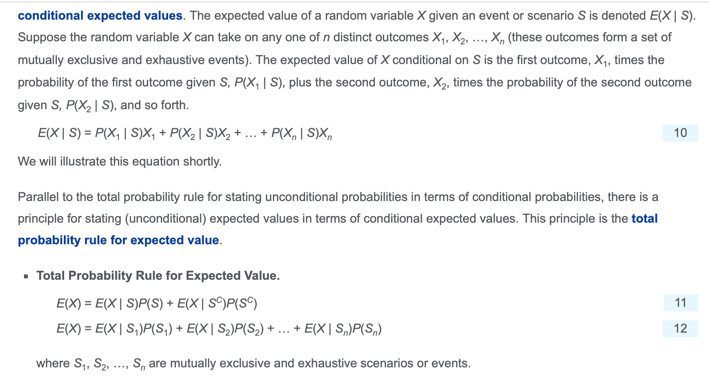
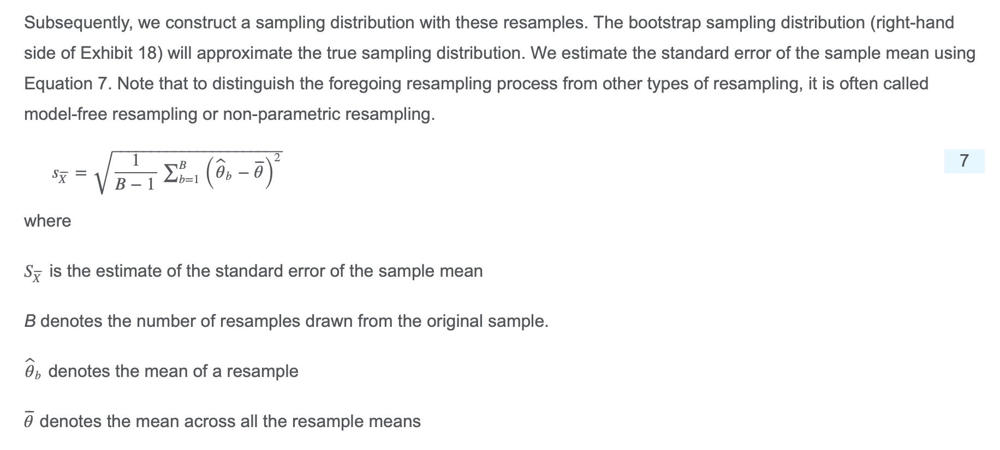
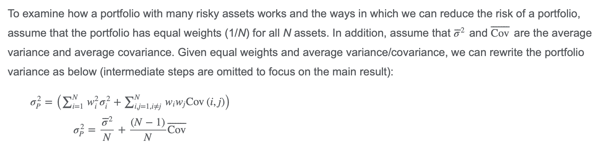
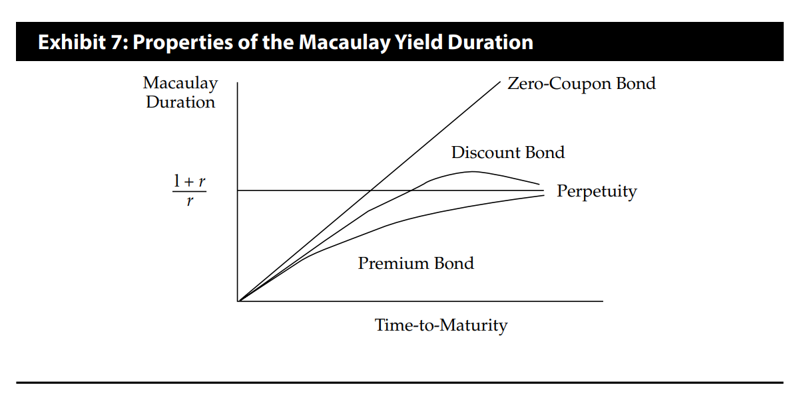
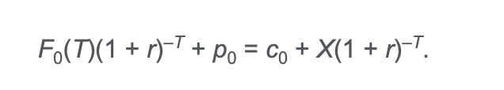

# Mock3 B

4、factoring referes to the sale of recevables without recourse.

- **factor** is the one who purchases the receivables.

7、flotation cost要include在initial cash outflow of the project中。（equity）

8、CAPM和SML线联系在一起，在线上方是undervalue，在线下方是overvalue。在线上是equal the market's performance.

14、pitfall陷阱、隐患。only incremental overhead costs related to a project should be included in the analysis.

- overhead cost经常性开支

16、如果interest coverage ratio <2，认为是warning sign.

23、

- sells primarilly on credit
- Enbird is a regional airline that leases its aircraft and service facilities. 资产都是租的
- advance payments for subscriptions.
- sell on credit和另外两个asset-light, pay-in-advance模式比起来，需要更多的 capital

26、estimated return < CAPM计算的required return.证明是高估overvalue，在SML线下方。

29、cyclical firms tend to have high systematic risk, which means high beta.

- utility stock指的是公共事业股票，水电气，non-cyclical
- homebuilder stock和周期有关，是cyclical

31、matrix pricing

- 直接用平均值算某年的yield
- 然后根据T插值

32、novate: replace a new contract. novation: a central clearing house taking the opposite positions to both counterparties.

- 

- 46、"top-heavy" refers to a capital structure that includes a high percentage of **secured bank debt**. 这种情况，很难再从银行借钱，increases the likelihood of default if the firm encounters financial distress.
- 49、注意，exercise value = intrinsic value = (e.g. call)max(S-X/(1+r_f)^t,0)
  - 但是，exercise price = X
  - option premium = exercise value + time value
  - time value = speculative value
- 50、interpolated spread = I-Spread
- 51、total return 包括dividend
- 54、duration-based estimates of bond value changes assume the yield curve shifts in a parallel manner. If instead short-term interest rates are more volatile than long-term interest rates, it is possible for a bond with lower duration to have more price volatility than a bond with higher duration.
- 关于yield curve、平行移动。
  - yield curve就是收益率-时间曲线，横坐标是时间，纵坐标是收益率。一般呈现的是向上的曲线，也就是short-term yield is lower than long-term yield. 
    - 
  - 另外，由于central bank controls short-term interest rate to influence AD. 所以短期收益率一般波动率大，long-term yield 波动率较小。则称为term structure of yield volatility.
  - yield curve的平行移动，一般做不到，因为短期利率移动的幅度会更大。
- yield curve的移动，直接导致某个债券的price-yield曲线的横坐标发生变化，会导致price volatility.
  - 债券price volatility和两个因素有关：1）price-yield曲线的形态，也就是duration and convexity; 2）横坐标yield的变动幅度，也就是yield volatility
  - 所以，a greater duration and covexity don't guarantee a greater price volatility. 因为有可能duration大，但是是long-term bond，所以yield volatility 小。也就是yield curve non-parallel shift.
  - 从$p/\Delta p$的近似式子就可以看出，price volatility 由上面说的两部分组成

$$
\%\Delta P^{Full}=-ModDur\Delta r+\frac{1}{2}Convexity(\Delta r^2)
$$

59、Valuations based on appraisals tend to smooth returns compared to using market-based valuations. As a result, returns based on an appraisal index are likely to have a lower standard deviation than returns based on a repeat sales index or a REIT index.

- 主观appraisals index波动最小。

69、**Structural subordination** Arises in a holding company structure when the debt of operating subsidiaries is serviced by the cash flow and assets of the subsidiaries before funds can be passed to the holding company to service debt at the parent level.

- Restricted subsidiaries are those whose cash flows and assets are designated to service the debt of their holding company. Classifying a subsidiary as restricted alleviates structural subordination by making holding company debt rank pari passu with the subsidiary's debt.
- 把子公司列为restricted. 子公司赚了钱，先上交还母公司的债。

81、growth cycle的时候，竞争还不激烈。

85、accretive: characterized by gradually growth.

- 如果发生兼并收购，改变了公司的盈利模式的话。采用forward P/E ratio，用未来的现金流估计比较合适。

88、计算具体的bond return yield的时候。coupon按照reinvestment rate计算收益，然后

- PV=FV/(1+r)^N
- 注意r最后要年化。如果periodicity=2，yield=r*2.

# Mock3 A

2、For a gift from a client in appreciation of past service or performance, informing his supervisor verbally is sufficient. I(B) requires disclosure prior to accepting the gift when possible, but in cases such as this when there is short notice, notification afterward is permitted.

3、不涉及"professional relationship"的部分泄漏了，不违反III(E)???

4、酗酒如果不影响工作，不算违反I(D) Misconduct.

7、TODO，再看一遍ethics和conduct的区别

11、conference call for analysts不算public information

18、超额认购的IPO，从业人员不能参与。如果不是超额认购，可以参与，没有要求"pre-clearence"

19、兼职，其他报酬补偿。IV(B) Additional compensation arragements要求，比如有written consent from employer.

20、a list of recommendations may be sent without regard to suitability, including both safe income stocks and aggressive growth stocks.

26、eight major sections of GIPS standards, 包括input data and calculation methodology.

29、VI(C) Referral Fees, 推荐费，要disclose to employers and to affected prospects and clients.

32、Real business cycle theory, which derives from applying utility theory and budget constraints to macroeconomic models, is associated with the New Classical school.

35、管理层的guidance 过高，也是low quality financial report的一个motivation。管理层太笨，是low quality financial report的opportunity.

40、financial services firm会有比较高的dividend payouts

- growth firm有high expected earnings growth，导致有high P/E.

46、 central bank的exchange rate targeting会受到available resources limitation, 也就是foreign reserves的限制。

- 另外两个目标inflation and interest rate targeting 不是收到resources 限制。

50、from a point of view of financial analyst，是分析师的角度，分析师想要最准确，比如存货反应最新价值，COGS反应最新的价值。这点和公司管理层角度不一样，管理层如果希望盈利高，资产多，那么会希望存货价值越高越好，COGS越低越好。whose point of view are we looking from需要特别注意。

56、the presentation format of balance shee t data that standardizes the first-year values to 1.0 and presents subsequent years' amounts relative to 1.0 is a horizontal common-size balance sheet. 时间对比，horizontal.

vertical common-size是和Total asset做出发。

57、如果增加asset estimated useful life，会导致carrying value上升，所以DTL增加。

- 如果DTA DTL同时上升，有可能是tax rate变动
- 未来预期profitability 下降，会增加DTA allowance.

59、From an initial equilibrium, an increase in real money balances will leave households and businesses with more money than they wish to hold, so they will purchase interest-bearing securities, driving their prices up and yields down until a new equilibrium short-term rate is established. 发钱，有钱了，买interest-bearing securities，然后这些securities价格上升，导致interest 下降达到新的equilibrium.

70、列联表检验，是test of **independence**.

- independent variables are uncorrelated, but uncorrelated(no linear relationship) variables are not necessarily independent.

79、premium payments on life insurance of key employees is an expense on the financial statments, but is not deducted on tax returns. 人寿保险费用，永久性差异。

80、IFRS，资产如果revalue upward, 需要披露revalue日期，fair value确定的方式，historical cost model的carrying value, 如果是intangible asset，还是要披露是finite or indefinte useful life.

86、

- credit cycle and economic cycle **not** coincide。
- credit cycles is **longer** than economic cycles。
- credit cycles may **amplify** economic cycles.

90、expansionary effects from fiscal policy being felt when an economic expansion is already underway.这句话意思是，本来已经处在经济扩张阶段，政府出台的政策开始生效。

- recognition lag, action lag, impact lag
- 由于lag的存在，使得fiscal policy changes may result in pro-cyclical同周期 rather than countercyclical反周期 effect.

# Mock1 A

- 1、A member is not responsible for guaranteeing or ensuring the competence of other investment professionals, nor all employees in their firm. 不用管别人的专业性，和supervisor区分

- 3、manipulation includes, but is not limited to, the following: ... securing a controlling, dominant position in a financial instrument **to exploit and manipulate the price** of a related derivative and/or the underlying asset. 操纵市场的目的是操纵股价。
- 5、可以提供差异化服务，但不能选择性地提供。❌Selectively offering different service levels to prospective clients. 只把VIP服务卖给一部分人。
- 6、根据III(D) Performance Presentation，模拟的业绩需要披露，另外不一定要把投资背后的逻辑写在宣传材料，但要表明可以获取。
- 7、IV(B) Additional Compensation Arrangement. 要获得所有利益相关方的书面同意，才能收礼物。Members and Candidates **must not** accept gifts, benefits, compensation, or consideration that competes with or might reasonably be expected to create a **conflict** of interest with their employer’s interest unless they obtain written consent from **all parties involved**.

- 9、可以用业余时间准备与雇主有竞争的业务。IV(A) Loyalty, A departing employee is generally free to make arrangements or preparations to go into a **competitive** business before terminating the relationship with his or her employer as long as such preparations **do not breach the employee's duty of loyalty**

- 10、IV(C) Responsibilities of Supervisor, **Supervisors and firms** must look closely at their incentive structure to determine whether the structure encourages profits and returns at the expense of ethically appropriate conduct. 公司和雇主都要关注激励结构是否符合道德。
- 11、意见不一样，可以署名也可以不署名。
- 18、两个观点是正确的
  - Firms can also help prevent misrepresentation by specifically designating which employees are authorized to speak on behalf of the firm. 委派公司发言人，可以减少misrepresentation
  - Firms can assist member and candidate compliance by periodically reviewing employee correspondence and documents that contain representations of individual or firm qualifications. 可以检查公司和个人的信件和文件，确保合规。
- 19、selective disclosure.选择性披露。指的是公司只把重大非公开信息披露给一部分人。不能放置内部信息交易。另外personal trading limitations是一个可选的限制内幕交易的方法。
- 20、可以看到，只要操纵了市场，就违反了Misconduct。
- 21、I(D)Misconduct，Check references of potential employees to ensure that they are of good character. 潜在员工，员工入职前检查清楚是否人品端正。
- 22、VII(B)–Reference to CFA Institute, the CFA Designation, and the CFA Program，不能说completed the CFA course，意思是已经获得charter!

- 24、25、
  - initially最初，披露之前的五年（或者存续期小于5年的，只披露存续时间），然后再未来坚持additionally5年，一共build up to minimum 10年；如果一只基金只存续了3年，那么，就要披露历史的3年GIPS业绩，然后再坚持7年，一共minumum 10年

- 27、按照课本，accounts are insured by the US government through the Federal Deposit Insurance Corporation，就可以using the term “guaranteed” in this context is not inappropriate as long as **the amount is within the government-insured limit**
  - 

- 34、注意应用这个公式*P*(*W*1 or *W*2) = *P*(*W*1) + *P*(*W*2) – *P*(*W*1*W*2)

- 37、P(2<=X<=4) = P(X=2,3,4)=P(X<=4)-P(X<=1)，注意数字，注意素质
- 40、**Probability sampling** gives **every member** of the population an **equal chance** of being selected
- 41、注意，degree of confidence置信度是$1-\alpha$，和置信区间对应。
- 44、we primarily use nonparametric procedures in four situations: (1) when the data we use do not meet distributional assumptions, (2) when there are outliers, (3) when the data are given in ranks or use an ordinal scale, or (4) when the hypotheses we are addressing do not concern a parameter. non-parametric 检验四种情况：没有分布，outliers, ranked data, 不考虑参数
- 45、the slope coefficient of the simple linear regression of *Y* to *X*

$$
b_0=\frac{COV_{XY}}{\sigma^2_X}
$$

- - Which of the following factors is *most likely* to lead to economies of scale?

  1. Supply constraints
  2. Duplication of product lines
  3. **Specialization by workers**
     - Specialization by workers can increase their proficiency, leading to lower average costs when the firm is large enough to allow specialization.

As the firm grows in size, economies of scale and a lower ATC can result from the following factors: 规模经济的原因

- Increasing **returns to scale**（<u>When a production process leads to increases in output that are proportionately smaller than the increase in inputs.</u>）, which is when a production process allows for increases in output that are proportionately larger than the increase in inputs.
- Having a division of labor and management in a large firm with numerous workers, which allows each worker to **specialize** in one task rather than perform many duties, as in the case of a small business (as such, workers in a large firm become more proficient at their jobs).专人专用
- Being able to afford more expensive, yet more efficient equipment and to adapt the latest in technology that increases productivity.用高科技
- Effectively reducing waste and lowering costs through marketable byproducts, less energy consumption, and enhanced quality control. 废物利用
- Making better use of market information and knowledge for more effective managerial（管理的） decision making. 管理层决策
- Obtaining discounted prices on resources when buying in larger quantities. 供应商买一送一

The factors that can lead to **diseconomies of scale**, inefficiencies, and rising costs when a firm increases in size include the following:

- Decreasing **returns to scale**, which is when a production process leads to increases in output that are proportionately smaller than the increase in inputs.
- Being so large that it cannot be properly managed.太大了
- **Overlapping** and **duplication** of business functions and product lines. 大妈分工不明确
- Higher resource prices because of **supply constraint**s when buying inputs in large quantities.供应商抬价，限制进货。

- 50、The relationship between domestic savings, private investment, the fiscal balance, and the trade balance is given by *S* = *I* + (*G* – *T*) + (*X* – *M*), where

  *S* = Domestic savings

  *I* = Private investment(gross private domestic investment, which includes **business investment in capital goods** (e.g., fixed capital such as plant and equipment) and **changes in inventory** (inventory investment))

  *G* = Government spending(government spending on final goods and services for both **current consumption** and **investment in capital goods** = $G_C + G_I$)

  *T* = Total government tax revenues

  *X* = Exports

  *M* = Imports

  *G* – *T* = The government deficit

  *X* – *M* = The trade deficit

  The trade deficit will be (*X* – *M*) = (*S* – *I*) – (*G* – *T*).

  For the hypothetical economy, the following is true:

  - Domestic savings (*S*) is given as 638.
  - Total private investment (*I*) = Business gross fixed investment + Change in inventories = 538 + (–16) = 522.
  - Total government spending (*G*) = Government spending + Government fixed investment = 666 + 118 = 784.
  - Tax on households = Personal income – Personal disposable income.
  - Net tax paid by households = Tax on households – Transfer payments to consumers.
  - Total government revenues (*T*) = Net tax paid by households + Other tax revenues = (2,456 – 1,930) – 348 + 440 = 618. 
    - 可见，government revenue分 net tax + other tax. net tax是 tax 减去转移支付。tax是personal income - personal disposable income/
  - Net government spending (*G* – *T*) = Total government spending – Total government revenues = 784 – 618 = –166.
  - Trade deficit = (*X* – *M*) = (*S* – *I*) – (*G* – *T*) = (Total domestic saving – Total private investment) – Net government spending = (638 – 522) – 166 **= –**50.

- 54、In general, the inflation rate is pro-cyclical (that is, it goes up and down with the cycle), but with a lag of a year or more. CPI是滞后指标

- 58、as an economy slows and unemployment rises, **government spending [expenditure] on social insurance and unemployment benefits** will also rise and add to aggregate demand. This is known as an automatic stabilizer." 自动稳定器，主要看的是自动，不需要政府主动决策。比如失业救助，医疗救助金，自动增加的税收等。
  - 注意，税率改变不是自动稳定器，因为需要政府主动干预。a decrease in corporate tax rates is a discretionary fiscal policies.建造新医院也不是，需要干预。

- 61、Heckscher–Ohlin model才允许income distribution. 对于劳动密集型，资源稀缺型的一方，income is redistributed from capital to labor.
  - Recardian 模型只有labor, Heckscher-Ohlin有labor+capital

- 66、Under US GAAP, which of the following should be reported **separately** from continuing operations on the income statement?
  1. Restructuring charges
  2. Gain or loss from sale of an asset
  3. **Results of discontinued operations**

- 67、Under US GAAP, restructuring charges are operating items.美国会计准则把重组费用作为operating items
- 73、for a mature company, because net income includes **non-cash expenses (depreciation and amortization),** operating cash flow typically exceeds net income. 成熟企业折旧比较多

- 76、2/10 net 30 is **a trade credit often offered by suppliers to buyers**. It represents an agreement that the buyer will receive a 2% discount on the net invoice amount if they pay within 10 days. Otherwise, the full invoice amount is due within 30 days.

- 77、FFO = funds from operations, defined as EBITDA minus net interest expense minus current tax expense (plus or minus all applicable adjustments).
  - If interest income and expense are combined, the line item can be called “Interest Income – net” or “Interest Expense – net.”
  - FFO = EBITDA - net interest expense - current tax expense +/- ...

- 78、在存货确认cost中：Abnormal waste, storage of finished goods, and administrative overhead are expensed.
  - Transportation-in, Tax-related duties关税, Trade discounts计入cost
- 81、不考虑税收的话，capitalized或者expensed interest不会影响实际的cash flow。
- 85、pledged，是担保的意思

# Mock 1 B

- 2、关于shareholder and manager/director relationship
  - entrenchment: 当任期很长的时候，管理层躺平, avoiding risk motivated by a vested interest（既得利益） in keeping one's position. 
    - entrenchment单词本身的意思：the process by which ideas become fixed and cannot be changed
  - empire building: 当管理层的报酬和公司规模绑定的时候，为了增长而增长，导致公司过大。
  - excessive risk taking: 当管理层被奖励太多期权或者股份，管理层太多激进。
    - at odds with 不一致in disagreement
- 4、
  - value chain：the systems and processes within a firm that create value for its customers.
  - supply chain: The sequence of processes involved in the creation and delivery of a physical product to the end customer, both within and external to a firm, regardless of whether those steps are performed by a single firm.
  - https://study.cfainstitute.org/app/cfa-program-level-i-for-november-2023#read/section/what-is-a-business-model-2
- 5、Post-auditing事后审计 capital projects are important for several reasons. First, these steps help **review assumptions** that underlie the capital allocation process. Systematic errors, such as overly optimistic forecasts, become apparent." 
  - https://study.cfainstitute.org/app/cfa-program-level-i-for-november-2023#read/section/the-capital-allocation-process
- 8、To finance working capital, which of the following sources provides the *most* financial flexibility to companies?
  1. **Long-term debt**
  2. Commercial paper
  3. Uncommitted lines of credit

- 因为，long term debt 最贵，但是可以提供给公司financial flexibility
- commericial paper 只有大公司才能用，是短期的外部融资渠道，需要back-up line of credit and constantly reissue.
- 什么是negotiable CD. CD是一种short-term融资渠道
  - A **certificate of deposit** (CD) is an instrument that represents a specified amount of funds on deposit for a specified maturity and interest rate. CDs are an important source of funds for financial institutions. 
  - A CD may take one of two forms: non-negotiable or negotiable. 
    - If the CD is non-negotiable, the deposit plus the interest are paid to the initial depositor **at maturity**. A withdrawal penalty is imposed if the depositor withdraws funds prior to the maturity date.
    - a negotiable CD allows any depositor (initial or subsequent) to sell the CD **in the open market** prior to the maturity date. 
- 15、a company's management has the greatest flexibility in managing the financial risk than sales or operating risk.
  - what is operating risk?
    - **Operating risk** is the risk attributed to the operating cost structure, in particular the use of fixed costs in operations. The greater the fixed operating costs relative to variable operating costs, the greater the operating risk.
    - Business risk由operating risk和sales risk组成
- 19、**Smart beta**, 
  - involves the use of simple, transparent, rules-based strategies as a basis for investment. 
  - Typically, smart beta strategies feature somewhat higher management fees and higher portfolio turnover relative to passive market-cap weighted strategies. 
  - smart beta strategies seek abnormal return from factors other than the market beta, which measures the market-cap-weighted exposures.
  - Smart beta用简单透明，基于规则的策略进行投资。通常费用较高，portfolio turnover 比被动管理高。利用市场因子赚取回报。
- 25、cognitive error可以被纠正。emotional biases stem from impluses and intuition，所以比较难纠正。
  - coginitive errors分为
    - belief perserverance biases: RICCH，基于errors of memory or assigning and updating probablities
    - processing errors: FAMA，基于信息如何被处理

- 28、
  - MA线可以用来估计support and resistance level，可以用来看趋势（黄金交叉）
  - RSI(Relative Strength Index) momentum oscillator，用来观看股票是否overbuy or oversell，观察股票的momentum
  - ROC（Rate of Change oscillator）也是momentum oscillator，观察是否超卖超买。

- 29、几个大数据概念。data curation保证质量，data capture收集，data storage存储。
  - **Data curation** refers to the process of ensuring data quality and accuracy through a data **cleaning exercise**. This process consists of reviewing all data to **detect and uncover data errors**—bad or inaccurate data—and making adjustments for missing data when appropriate."
  - **Data capture** refers to how the data are collected and **transformed** into a format that can be used by the analytical process. 这里有transform
  - **Data storage** refers to how the data will be recorded, archived, and accessed and the underlying database design
  - **Data Search**—Search refers to how to query data. Big Data has created the need for advanced applications capable of examining and reviewing large quantities of data to locate requested data content.
  - **Data Transfer**—Transfer refers to how the data will move from the underlying data source or storage location to the underlying analytical tool. This could be through a direct data feed, such as a stock exchange’s price feed.

- 30、Financial instruments trade for delivery in both spot and forward market.
  - practitioner 从业人员
  - practitioners classify markets by whether the markets trade instruments for immediate delivery or for future delivery.
- 35、构建指数第一步，选择market，然后确定investmetn universe，然后determining the constituent securities.
- 36、**Investment-grade bond indexes** are typically further subdivided by **maturity** (i.e., short, intermediate, or long) and by **credit rating** (e.g., AAA, BBB, etc.)."
  - 债券指数，细分为maturity 以及 credit rating.
- 37、an inefficient market reflects new information slowly，可以用主动投资，主动投资需要花费更多cost（相比于passive investment）
- 39、the value stock anomaly contradicts semi-strong market efficiency because all the information used to categorize stocks in this manner is publicly available.
- 

40、**Non-cumulative preference shares** Preference shares for which dividends that are not paid in the current or subsequent periods are forfeited permanently (instead of being accrued and paid at a later date).

**Cumulative preference shares** Preference shares for which any dividends that are not paid accrue and must be paid in full before dividends on common shares can be paid.

- Similar to the interest payments on debt securities, the dividends on preference shares are fixed and are generally higher than the dividends on common shares. 
- Preference shares (or preferred stock) **rank above common shares** with respect to the payment of dividends and the distribution of the company’s net assets upon liquidation. 清算时排在普通股前面

- 41、stock compensation plan，一般要buyback stock而不是发股。
- 44、limited capacity and long lead times, provide industry participants pricing power. Tight, or limited, capacity gives participants more pricing power as demand for the product or service exceeds supply. Generally, if new capacity is physical it will take longer for new capacity to come on line to meet an increase in demand, resulting in a longer period of tight conditions. Long lead times justifies the case for tight supply conditions with resulting pricing power.
  - 产能有限，扩张的准备时间长，定价能力就高。

- 47、注意优先股也有可能被赎回。The shares are **retractable** (at par) with the retraction date set for three years from today.

- 49、**Equipment trust certificates** are bonds secured by specific types of equipment or physical assets, such as shipping containers. 实体抵押
  - **mortgage-backed securities** are debt obligations that represent claims to the cash flows from pools of mortgage loans. MBS是住房抵押贷款抵押。
  - **collateral trust bonds** are secured by securities such as common shares, other bonds, or other financial assets.

- 51、coupon payment structures

  - **FRN, floating-rate notes**
    - coupon和reference rate 挂钩
    - national government一般不发行，因为国债一般要求固定票息
    - 一般是**quarterly coupon**
    - little interest rate risk. 
    - floored FRN, coupon 有兜底；capped FRN，coupon有上限
    - inverse/reverse FRN，coupon rate和reference rate方向变动。
      - 预期利率跌的投资者，喜欢inverse FRN
      - 预期利率涨的投资者，喜欢FRN
  - **Step-up coupon bond**
    - coupon is fixed or floating, increases by specified margins at specified dates.

  - **Credit-Linked Coupon Bonds**
    - coupon changes when credit rating changes. 信用评价下降，coupon rate 上升。
    - provide protection against poor economy
  - **Payment-in-Kind Coupon Bonds**
    - 发芝麻糊
    - allows the issuer to pay interest in the form of additional amounts of the bond issue rather than as a cash payment
  - **Deferred coupon bonds***(**split coupon bond**)
    - 前几年不给coupon，之后给coupon.
    - 一般discount发行
    - helpful in managing tax, 可以减少tax
    - zero coupon bond是极限情况下的deferred coupon bond
  - **Index-Linked Bonds**
    - coupon和specified index挂钩
    - 比如，**inflation-linked bonds**和CPI, RPI等挂钩
      - 政府发行inflation-linked bonds，一般叫做**linkers**
        - 比如英国gilts linked to UK RPI, US Treasury发行的TIPS（变本金）
      - 减少inflation risk
      - 有以下几种形式
        - zero-coupon-indexed bond,
          - 没有coupon, inflation调节只调节最后的本金（Sweden）
        - interest-indexed bond
          - 本金固定，调节 coupon。相当于FRN, reference是inflation rate
        - capital-indexed bonds
          - coupon固定，调节本金。(Australia, Canada, New Zealand, UK, US)
        - indexed-annuity bonds
          - fully amortized bonds. 上面的interest-index/capital-index没有amortizing.
          - annuity payment根据inflation rate 调节，这其中包括利息和本金。

- 52、对于FRN来说，Different reference rates are used depending on where the bonds are issued and their currency denomination. 取决于发行地以及发现的币种，货币面额。一般参考的是short-term rate，比如LIBOR

- 55、accrued interest is calculated using Equation AI =t/T ×PMT.

  - 30/360，指的是，前面的月份都是30天，当月按照实际天数。

- 56、matrix pricing 

  - 估计yield spread的时候 benchmark是
    - **government** bond having the same or close to the **same time-to-maturity.**

  - 估计price或者market discount rate的时候，使用
    - similar time-to-maturity, coupon rates, and credit quality
    - 一般inactively-traded or not yet issued会使用

- 57、For a coupon bond with a positive yield, compounding more frequently within the year results in a yield-to-maturity that is less positive.

  - For a **given** pair of cash flows, the stated annual rate and the periodicity are inversely related. Increasing the frequency of compounding lowers the annual rate. 

  - 这句话，意思是原来的ytm是确定的, periodicity和对应的ytm(r)的关系

  - $$
    1+YTM = (1+\frac{r}{n})^n\\
    r=n(y^{1/n}-1)
    $$

    假设y=0.3，得到的图像是递减的。也就是n越大，compound的r 越小。

    

- 58、CMBS 没有amortizing principals, RMBS有amortizing principals

  - CMBS有ballon payments, 提供call protection

- 66、credit risk由default probablity和loss severity组成

  - expected loss = default probability * loss severity = default probability * (1 - recovery rate)
  - 对于信用好的issuer，更关心 default probability
  - Credit risk is the **risk of loss** resulting from the borrower (issuer of debt) failing to make full and timely payments of interest and/or principal. 

- 68、waiver弃权
  - Covenant violations are a breach of contract and can be considered default events unless they are cured in a short time or a waiver is granted.
    - 除非短时间内纠正或者豁免，违反covenant视为违约。

- 72、derivatives have lower transaction costs than the underlying. The transaction costs of derivatives can be high relative to the value of the derivatives, but these costs are typically low relative to the value of the underlying. 衍生品交易费用比标的资产更低
- 74、convenience yield "represents a nonmonetary advantage of holding the asset.” 有🐷在手

- 75、If a forward contract requires no cash outlay at initiation, it is *most likely* true that at initiation price exceeds value.

  - 在0时刻no cash outlay，value = 0，Price is a positive number that states the amount that must be paid when the purchase takes place.
    - 所以，price指的是远期价格>0=value

- 76、A swap is *most likely* similar to a series of forward contracts when all forward contracts are created with the combined value equal to zero. swap在初始时刻，认为是很多和forward汇总起来V = 0的合约。

- 79、In a binomial option pricing model, the expected payoff is based on risk-neutral probabilities discounted at the risk-free rate.

  - 根据$r_f$计算risk-neutral probability

  - $$
    \frac{\pi c_u+(1-\pi)c_d}{(1+r_f)^t}=c_0
    $$

- 83、Two types of waterfalls: 

  - deal-by-deal (or American) waterfalls
  - whole-of-fund (or European) waterfalls

- 86、tenant租户

# Mock 2 A

- 1、situational influence，外部影响，比个人internal 更能导致unethical 行为，包括bystandar effect, loyalty to coworkers.
  - bystander effect，有其他人在场时，出手帮助的机会降低。

- 4、V(C) Record Retention：离职的时候不能带走雇主资料，不能带走纸质记录，如果要用到之前的材料，需要re-create之前的supporting records

- 6、CFA允许在论坛分享学习资料。

- 7、credential资格
  - I enrolled in the CFA Program to obtain **the highest set of credentials** in the global investment management industry. 这句话没有违反VII(B)

- 9、I(B)Independence and Objectivity的建议：
  - restrict list
  - restrict special cost arrangment规范差旅费等
  - limit gift
  - restrict investment. 比如private placement和IPO的限制

- 11、II(A) material nonpublic information.
  - 拿到内幕消息，先make reasonable efforts to achieve public dissemination of the information努力促使公开。如果无法公开，通知上级以及合规部门。supervisor and complicance personnel. If public dissemination is not possible, the member or candidate must communicate the information only to the designated supervisory and compliance personnel within the member’s or candidate’s firm and must not take investment action on the basis of the information.

- 16、对于IV(B) Additional Compensation arrangment, 合规和上级都要通知。
  - Members and candidates should make an immediate written report to their **supervisor** and **compliance officer** specifying any compensation they propose to receive for services in addition to the compensation or benefits received from their employer.

- 17、Employers should have investment professionals provide to the clients notification of approved referral fee programs and provide the employer regular (at least **quarterly**) updates on the amount and nature of compensation received. 对于VI(C) Referal Fee, 员工至少一个季度向雇主披露一次

- 18、客户优先，交易顺序优先。

- 19、V(A) Diligence and Resonable Basis:
  - An individual employee (a supervisory analyst) or a group of employees (a review committee) should be appointed to review and approve such items prior to external circulation to determine whether the criteria established in the policy have been met. 指派专人审核研究报告
  - Develop detailed, written guidance that establishes **minimum** levels of scenario testing of all computer-based models used in developing, rating, and evaluating financial instruments. 最小范围的测试场景。

- 20、according to Standard V(B)–Communication with Clients and Prospective Clients, the member or candidate must keep clients and other interested parties informed on **an ongoing basis** about changes to the investment process。
  - 另外，展示投资建议的时候，结合基本的推理步骤，然后说明详细的步骤可获取即可。

- 21、只有VI(C) Referal Fee提到了事前披露。VI(A) Disclosure of Conclicts 没有提到**事前**。
  - 没有返回收益给客户这一说法。

- 22、VI(B) Priority of Transactions: 公司需要给客户披露他们公司的personal trading的policy.

- 24、The GIPS standards were created to help **prevent misleading practices**, such as representative accounts, whereby firms select top-performing portfolios to represent the firm’s overall investment results for a specific mandate.

- 25、according to the GIPS standards, “A claim of compliance requires that **all fee-paying discretionary accounts managed by the firm** be included in at least one composite.”

- 26、**不可以声称一个客户符合GIPS，但可以声称一个客户持有的一个账户符合GIPS**

  - Firms that claim compliance with the GIPS standards must not make statements referring to the performance of a current client or pooled fund investor as being “calculated in accordance with the GIPS standards,” except when reporting the performance of a segregated account to a current client or a pooled fund to a current investor.

- 36、条件期望 

  

- 39、注意看清楚给的是什么rate. continuously compounded returns直接相加得到所有period的continuously compounded returns. 注意区分holding period return和continuously compounded return
- 41、efficiency: 方差最小；consistency：the probability of estimates close to the value of the population parameter increases as sample size increases，靠近总体参数的概率变大。

- 42、bootstrap and jackknife
  - bootstrap: 用来估计标准误，有放回，不需要参数，轮次可选
  - jackknife：有放回，减少bias，轮次必须为n
  - 下面是bootstrap估计standard error of sample mean
- 

- 43、P(type I) = $\alpha$ =  false positive(FP)
  - **false discovery rate(FDR)**: The rate of Type I errors in testing a null hypothesis multiple times for a given level of significance.
  - The **false discovery approach** to testing requires adjusting the *p*-value when you have a series of tests. 
    - 根据p值排序，$p < \alpha \frac{rank i}{number of test}$则拒绝。
    - 一共有n个samples，那么预期应该有$n\alpha$个被拒绝。
  - increasing the number of tests will increase the number of false positives.
- 45、线性检验中三个相等的值：
  - $t_r^2=F$，correlation的t检验值等于F
  - $t_r = t_{slope}$，correlation的检验值等于斜率=0时候的t-statistic
  - $R^2=r^2$, coefficient of determination等于协方差

- 52、the neoclassical growth model "assumes that the production function exhibits **diminishing marginal productivity** with respect to any individual input." 不管input在什么水平，边际产出都是递减的。
  - The neoclassical model makes three assumptions 
    - 1)the production function has constant returns to scale.(MES, alpha+ beta = 1)
    - 2)production function exhibits diminishing marginal productivity with respect to any individual input.
    - 3)no positive or negative externalities are associated with the use of the inputs. 

- 53、对于inventory-sales ratio来说，抓住sales变得比inventory 快

|                   | recovery       | expansion | slowdown | contraction         |
| ----------------- | -------------- | --------- | -------- | ------------------- |
| inventory / sales | begins to fall | stable    | rise     | fall back to normal |

- 54、 average duration of unemployment是滞后指标。businesses wait until a downturn looks genuine before laying off employees and until recoveries look secure before rehiring. 等到真正down turn才裁员。
- 55、两种通胀
  - expected inflation 引起：
    - shoe and lether cost; 
    - menu cost
  - unanticipated inflation: 
    - a boom and bust cycle繁荣和萧条周期；
    - lead to inequitable transfers of wealth between borrowers and lenders (including losses to savings);
    - give rise to risk premia（risk premium） in borrowing rates and the prices of other assets; and
    - reduce the information content of market prices.

- 58、the **structural (or cyclically adjusted) budget deficit** as an indicator of the fiscal stance. This is defined as the deficit that would exist if the economy was **at full employment (or full potential output).**"

- 60、各种合作组织：
  - free trade area: 商品流动
  - custom union: 海关一致对外
  - common market: 生产要素流动，工签
  - economic union: 相同的economic 政策
  - monetary union: 相同货币

- 85、Under US GAAP, deferred tax assets are reduced by creating a valuation allowance. Establishing a valuation allowance reduces the deferred tax asset and income in the period in which the allowance is established. 只有us gaap才有dta allowance
- 87、DC Plan只要往账户里充钱就好，operating cash flow.
  - DB Plan需要base on assumptions, 比如员工预期工资，预期寿命等等。

# Mock 2 B

- 1、public 公司一般Their shares are typically liquid with minor ownership overlap between management and shareholders
  - 对于private 公司，with often smaller numbers of shareholders in private companies, investors have **greater control** over management and there may be greater chance of ownership overlaps between management and shareholders"
  - subject to sth, 取决于，视什么而定；有，承受，遭受
- 4、各种risk
  - industrial risk
  - company-specific risk
    - competitive risk丢掉市场份额
    - product market risk 东西卖不出去
    - execution risk管理层搞不定
    - capital investment risk投资失败
    - ESG risk 不环保
    - 
- 5、Financing costs are reflected in the required rate of return
- 7、实物期权
  - timing option延期投资
  - sizing option
    - abondonment option 跑路
    - growth option/expansion option 加投
  - Flexibility option
    - price-setting option 改变价格
    - production-flexibility option 改变产量
  - fundamental option: **treat an entire investment as an option**, 油价低，躺平不采油了。
- 10、WACC计算里，就算interest expense is tax deductible，也要用after-tax cost of debt
- 11、Using financial leverage generally increases the variability of return on equity (net income divided by shareholders’ equity). In addition, its use by a profitable company may increase the level of return on equity
- 19、**Endowments** are funds of **non-profit institutions** that help the institutions provide designated services.  In contrast, **foundations** are **grant-making entities**. 
  - endowment捐赠基金
  - foundation类似慈善基金
- 21、

- 26、**momentum** can be partly explained by availability, hindsight, and loss aversion biases.
- 30、**DLT** has the potential to accommodate '**smart contracts**,' which are computer programs that self-execute on the basis of pre-specified terms and conditions agreed to by the parties to a contract. Examples of smart contract use are the automatic execution of contingent claims for derivatives and the instantaneous transfer of collateral in the event of default."

- 33、book building累计投标方式，属于primary market
  - lead underwriter主承销商
- 34、act to level the playing field
  - level, vt, 使平坦
- 35、什么时候用price 什么时候用total return
  - 按照题目意思是，默认price return。说明了才用total return.

- 40、information cascades是rational行为，提升市场有效性。
- 41、DR, 价格会受到exchange rate 影响
  - A **sponsored** DR is when the foreign company whose shares are held by the depository has **a direct involvement** in the issuance of the receipts. 公司直接参与发行DR.
    - Investors in sponsored DRs have the same rights as the direct owners of the common shares. 分红、投票。
  - with an **unsponsored** DR, the underlying foreign company **has no involvement** with the issuance of the receipts.
    - the **depository** purchases the foreign company’s shares in its domestic market and then issues the receipts through brokerage firms in the depository’s local market. depository bank把取票买过来，然后发行DR.
    - depository bank保留投票权。
  - Sponsored DRs are generally subject to greater reporting requirements than unsponsored DRs. Sponsored DR注册的要求更高。
  - 另外，DR分为GDR和ADR
    - GDR不能在美国交易所上市
    - ADR对应ADS, ADS是在发行公司本国交易的股票。
      - ADR有4种，Level I, Level II, Level III, Rule 144A
      - Level I是OTC，Level II和III在交易所上市,发行费用高，盈利要求高
      - 发行新股是Level III.
      - Rule 144A时private placement, unlisted
  - GRS，Global Rigistered share, 以不同货币计价。在不同国家不同交易所发行
  - Basket of Listed Depository Receipts(BLDR), 一种ETF.

44、

- 45、关于external influences on industry

- |                                   | Branded Pharmaceutical | Oil Services                                         | Confections/Candy                  |
  | --------------------------------- | ---------------------- | ---------------------------------------------------- | ---------------------------------- |
  | Barriers to Entry                 | Very high              | Medium                                               | Very high. 不知名品牌消费者不买    |
  | level of concentration            | concentrated           | **fragmented**                                       | very concentrated 集中在几个名牌上 |
  | Impact of Industry capacity       | not applicable         | medium/high                                          | not applicable                     |
  | industry stability                | stable                 | unstable 因为技术和市场需求，market share 会不断变化 | very stable                        |
  | life cycle                        | mature                 | mature                                               | mature                             |
  | price competition                 | low/medium             | high                                                 | low                                |
  | demographic influences            | positive               | not applicable                                       | not applicable                     |
  | gov regulation influences         | very high              | medium                                               | low                                |
  | technological influences          | medium/high            | medium/high                                          | very low                           |
  | growth vs. defensive vs. cyclical | defensive              | cyclical                                             | defensive 糖果需求很稳定           |

- 48、A two-stage dividend discount model would be appropriate for a company that is experiencing a higher than the **sustainable growth rate**.

- 50、Valuation obtained by using FCFE involves discounting expected future FCFE by the required rate of return on equity; the expression parallels Equation 1
  $$
  V_0=\frac{FCFE_t}{(1+r)^t}
  $$

  - FCFE也是乘数模型multiple，需要require rate of return

- 51、**In the past**, Eurobonds typically were bearer bonds, meaning that the trustee did not keep records of who owned the bonds; only the clearing system knew who the bond owners were. Eurobonds, domestic, and foreign bonds are **now** registered bonds for which ownership is recorded by either name or serial number.
  - Eurobond一般是unsecured
- 53、T-Bill小于1年，一般是pure discount bond.
- 55、
  - 在discount并且long-term的时候，dur可能睡着Time-to-maturity变大而变小。

- 57、Sometimes the **simple** yield on a bond is quoted. It is the sum of the coupon payments plus the straight-line amortized share of the gain or loss, divided by the flat price.

- 59、The yield spread in basis points over an actual or interpolated government bond is known as the G- spread. 计算和coupon无关，和期限有关。
- 60、A **key rate duration** (or partial duration) is a measure of a bond’s sensitivity to a change in the benchmark yield **at a specific maturity**.
  - Effective duration is a *curve duration* statistic in that it measures interest rate risk in terms of a parallel shift in the benchmark yield curve (ΔCurve).
  - Effective duration 考虑的curve的变动是government par curve.
    - **Par curve** A sequence of yields-to-maturity such that each bond is priced at par value. The bonds are assumed to have the same currency, credit risk, liquidity, tax status, and annual yields stated for the same periodicity.
  - effective duration适合含权债券，mortgage-back bond, 因为现金流不确定。
  - 也就是，这里的curve移动，是yield-T曲线。如果平行移动，key rate和effective一样。如果不平行移动，也就是at a specific maturity变化了，用key rate.
- 61、moddur用市值加权
- 66、The CDO manager seeks to earn a rate of return higher than the aggregate cost of the bond classes. **The return in excess of what is paid out to the bond classes** accrues to the **holders of the equity tranche** and to the **CDO manager**.”
- 67、Credit ratings 会考虑ESG因素。
  - Credit ratings tend to **lag** the market’s pricing of credit risk.
- 69、Companies are *more* susceptible to default when their capital structure includes a lot of secured debt. 
  - default可能性主要看还款能力。
  - In a holding company structure, the parent owns stock in its subsidiaries. Typically, the parent doesn’t generate much of its own earnings or cash flow but instead receives dividends from its subsidiaries. The subsidiaries’ dividends are generally paid out of earnings after they satisfy all their other obligations, such as debt payments. … The parent’s reliance on cash flow from its subsidiaries means the parent’s debt is structurally subordinated to the subsidiaries’ debt and thus will usually have a lower recovery rating in default. 母公司依赖于子公司的股利。子公司支付股利前，已经还了债，所以，母公司的债比子公司的债等级低，parent一般更低的rating.
- 72、问option的value，一律不减去option fee.
- 75、FRAs are forward contracts that allow participants to make a known interest payment at a later date and receive in return an unknown interest payment.

- 79、put call parity: fudiciary call 和 protective put
  - put-call **forward** parity: fudiciary call 和 synthetic protective put
    - 

- 80、 the value of a call option is independent of the probability of a downward movement in an underlying.

- 83、The partnership between the [general partner] and [limited partners] is governed by a **limited partnership agreement (LPA)**, a legal document that outlines the rules of the partnership and establishes the framework that ultimately guides the fund’s operations throughout its life."

  - "**Side letters are** side agreements created between the [general partner] and a certain number of [limited partners] that exist *outside* the [limited partnership agreement]. 比如side letter包括
    - **Potential additional reporting** due to [a limited partner]’s unique circumstances, such as regulatory or tax requirements".

- 86、**Early-stage** financing is capital provided for companies **moving toward** operation but **before** commercial manufacturing and sales have occurred.

  -  **Later-stage** financing is provided after commercial manufacturing and sales have begun but before any initial public offering.
  - **Seed-stage** financing is capital provided for a business idea.
