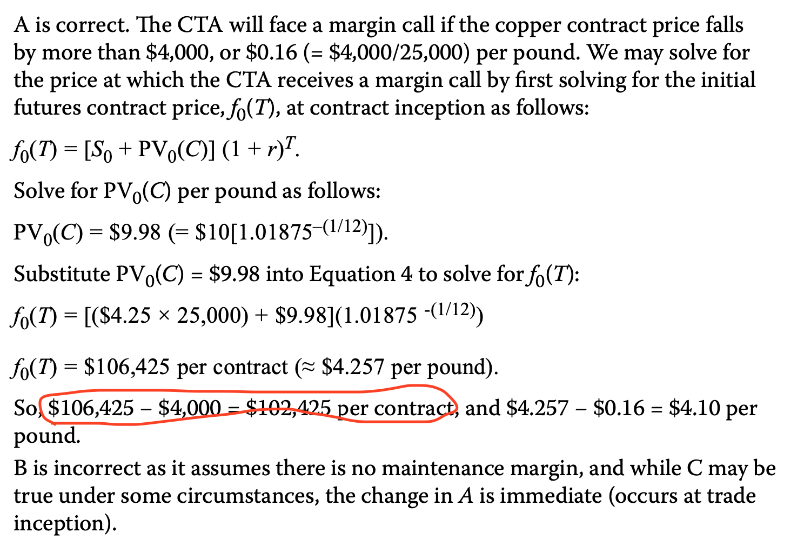
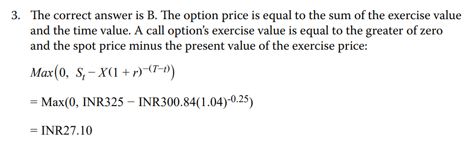

# M1 Introduction

- 错题：1、4
- 1、抓住对冲的根本原因，在于风险头寸，在于未来的不确定性
- 4、OTCmarket定制化衍生品，ETD场内交易的是标准化合约，很难找到对应期限、价格的产品。

# M2 

- nope

# M3 

- 错题：2
- 关注：3
- 2、如果是在ETD市场（exchange）那么主要credit risk就是交易所跑路，exchange and its clearing house.
- 3、在交易所的产品更liquid，market more transparent
  - The Structured Note is likely to be far less liquid than the stand-alone SIXV call option, which is traded on a derivatives exchange. Recall from an earlier lesson that **exchange-traded contracts are more formal and standardized, which facilitates a more liquid and transparent market.** Note also that the Baywhite Financial LLC Structured Note is issued at 102% of face value, suggesting that an investor will likely forgo this premium if selling the note prior to maturity.

# M4 Replication

long underlying + short risk-free = long derivative

long forward = long underlying + short bond

# M6 Valuation of Futures

- 错题：1
- 关注： all
- 1、maintain margin的计算，是计算相对值。比如期货原来价格f，initial margin是m0，maitainance margin是mm，(mm < m0)，那么只要f下跌到f - (m0 - mm)，就有margin call.
  - 另外，注意，期货这里不是债券，用的是compound rate。（不是BEY）

- 4、MTM gains on the forward contracts are not realized until maturity.

# M7 Swap Valuation

- 错题：3、5
- 关注：4
- 3、Swap估值V在一开始是0。
  - 后面的MRR会变化，所以会导致MTM value变动（也就是对应的forward interest rate变动）
- 5、outstanding fixed-rate debt: 意思是未偿还的债务。（注意区分issued debt已发行债务）
  - 所以题目意思是，要付fixed-rate的coupon，变成MRR related.
  - 所以，利率上升时，fixed-receiver的MTM loss.

- 4、求t=0的swap rate的方法，把所有的implied forward rate按照spot rate折现，求得swap rate.
  - $\sum\frac{IFR}{(1+Z_i)^i}=\sum\frac{S_i}{(1+Z_i)^i}$

# M8 

- 关注：4
- volatility越高，期权价值越高
- 另外注意CFA中，价值需要折现。

# M10

- 错题：1、2、4
- 1、50-50 chance不是指的risk-neutral probability...还是要根据$\pi$的公式进行计算
- 2、如果算到option hedge ratio是负数，那就是long underlying to hedge.
- 4、这几道题都是递进关系。
- 步骤：
  - 先算$\pi$
  - 再算p的二叉树
  - 再算p价格

