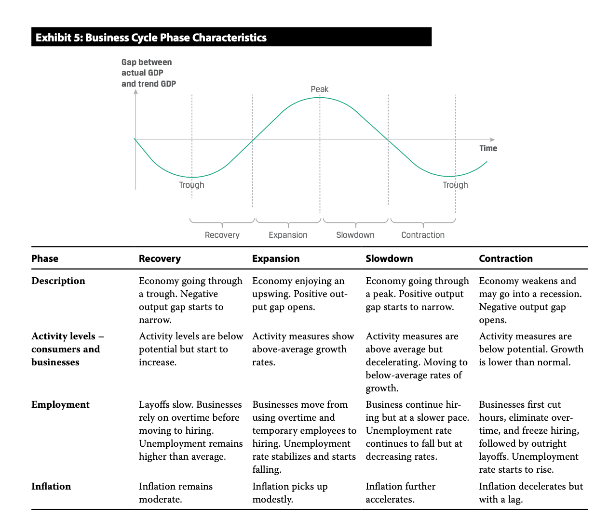

# M1 Demand and Supply

错题：14、15

关注：6、7、11

- The law of diminishing returns occurs in the short run when addi- tional output falls as more and more labor is added to a fixed amount of capital. **When a factory is operating at full capacity**, adding additional employees will not increase production because the physical plant is already 100% employed. More labor hours will add to costs without adding to output, thus resulting in dimin- ishing marginal returns. 当工厂的capacity产能已经100%，再增加worker会引起diminishing returns.
- complements互补品，认为是同一种商品，价格涨，需求量跌，所以cross price elasticity < 0
  - substitute替代品，互相竞争，A价格涨，B需求涨cross price elasticity > 0
- discretionary自由决定的。discretionary goods的elasticity比较大。

# M2 Market Monopoly

错题：3、7、8、11、15

关注：1、9、10

- 注意，求出来的Q，还是P。以及题目要求的是P还是Q

- When companies have **similar** market shares, competitive forces  tend to outweigh the benefits of collusion

- 对于perfect competition market, The credible threat of entry holds down prices and multiple incumbents are offering undifferentiated products. 

- perfect competition的supply curve是MC，是well-defined

- Oligopoly的dominant company最终的市场份额会下降，因为吸引了其他商家进入。

- $$
  MR = P(1-\frac{1}{\epsilon_P})
  $$

可以通过这个公式，求MR = MC

# M3 Aggregate Output

错题：12、13、17

关注：1、2、8、11、15、16、18、20、21、22、23、**25**、27、28、29

- 12、13、注意这几个概念的符号，字母顺序：
  - **government fiscal deficit = G - T**
  - **net export**，trade balance = X - M = net capital outflow
  - private sector saving/investment balance = S - I

- 17、At the full employment, or natural, level of output, the economy is operating at an efficient and unconstrained level of production. Companies **have enough spare capacity** to avoid bottlenecks, and there is a modest, stable pool of unemployed workers (job seekers equal job vacancies) looking for and transition- ing into new jobs.

  - natural rate of unemployment/ full employment
    - GDP是potential GDP
    - 存在一定的失业
    - 处于最efficient配置，没有完全利用资源，有足够的spare capacity应对瓶颈。

- GDP两种定义：

  - 支出法：the market value of all final goods and services produced within the econ-

    omy during a given period

  - 收入法：the aggregate income earned by all households, all companies, and the gov- ernment within the economy during a given period

- 2、Byproducts（附带产品） of production processes that have no explicit market value are not included in GDP. 没有明显的市场价值不计入

- 8、deflator可以用来直接估计价格变动：假设有第n年和第1年的deflator

  - (Dn / D1) ^ (1/(n-1)) - 1表示这n-1年的价格变动了多少百分比

- 11、 Unincorporated（未具备法人资格的） business net income, also known as proprietor’s income, is included in personal income.GDP核算中，个体户proprietor，属于个人收入。

- 15、Assuming a **fixed** supply of money, a higher price level will lead to a **higher price of money**. Because the **price of money is the interest rate**, as the price level increases, the interest rate increases. Higher interest rates will lead to lower consumption and investment. 

  - 在考虑价格对利率的影响时，考虑固定的货币供应。价格上升使得货币变贵，所以interest rate上升，从而抑制消费。美国：物价上升，加息，抑制通胀。

- 16、A lower price level results in a weaker real exchange rate, making domestic goods cheaper to people in other countries and imports less competitive, resulting in a higher level of net exports.

  - price level和**real** exchange rate成**正比**。

- 18、对于aggregate supply curve，超短期VSRAS，指几个月；short run SRAS指的几年（成本发生变动）

  - aggregate supple曲线的斜率关键在于成本变动。
    - 在超短期，工厂可以自由决定产量
    - 在短期，物价变动，但是某些成本没变(how wages and other input prices repond to changes in final output prices)，物价上涨让margin profit变高，所以物价越高，output越大
    - 在长期，output稳定在potential GDP，此刻是full employment

- 20、影响AD变动的几个因素

  - **Household wealth**
    - Stock prices
    - Housing prices
    - 居民财富增多，AD shift right
  - Consumer and business expectations
  - Capactity utilization(产能利用率)
    - 当产能利用率接近full capacity，公司会遇到production blockages，所以会增加investment spending，从而shift AD to the right
  - **Fiscal policy**
    - Government spending
    - Taxes
    - 扩张财政政策使得AD shift right
  - **Monetary policy**
    - 扩张货币政策使得AD shift right
  - Exchange rate
    - 影响 X - M
    - 本币贬值，有利于出口，AD向右移动
    - 本币升值，有利于进口，AD向左移动
  - Growth in the global economy

- 21、对于影响AS曲线，注意分开short-run（生产意愿）和long-run（生产禀赋）

  - short-run左移$\iff$: nominal wages提高，input prices 提高，expectations 下降，business tax提高，exchange rate（贬值，导致进口原材料成本增加，SRAS左移）
  - long-run右移$\iff$, supply of labor, supply of natural resources, supply of phyiscal capital, productivitiy and technology升高。

- 22、wealth effect，越有钱，存钱越少，花钱越多。

- 23、AS和AD曲线，横坐标是real GDP。提高real GDP时，unemployment下降

- **25**、当能源价格上升，导致了AS左移，政府不干预，货币供给不变的时候，supply curve会自己调节移动回去。所以long-run来说，价格不会变化。

- 27、Labor productivity can be directly measured as output/hour.

- 28、

  - output growth = labor forces growth + labor productivity growth
    - Unlike total factor productivity, output per worker is **observable**, so this measure is the most **practical** way to approach estimation of sustainable growth.

- 29、neoclassical or Solow 模型，就是Y = Af(K, L)， A是全要素生产率, total factor productivity

  - TFP is a scale factor that captures the exogenous effect of technological change and other factors that raise output beyond the measured contribution of the capital and labor inputs.
  - TFP is not directly observed.

# M4 Business Cycle

- 错题：3、4、5、6、9、10、19、26、35、41、42、44
- 关注：2、12、14、16、17、18、20、22、23、24、31、37、38、39
- 有个窍门（待进一步验证），看每个周期的特征，关注周期的初始阶段。比如contraction初期，是在下降阶段，对于contraction的描述都和下降有关：
  - weakens, go in to a recession, unemployment start to rise, infaltion decreases but at a lag.
- 

- 3、**在peak的时候，通胀inflation is rising at peaks**。（不是在最高点稳定）
- 4、At the end of a recession, firms will run “lean production” to generate maximum output with the fewest number of workers.有点违反直觉，通常productivity最高，是在recession最底部。
- 5、在经济不断膨胀(expansion周期）的时候，labor cost和capital investment不断增加。
  - 这时候，市场上更难找到qualified workers. When an economy’s expansion is well established, businesses often have difficulty finding qualified workers.
- 6、Accelerating inflation and rapidly expanding capital expenditures typically characterize the peak of the business cycle. During such times, many businesses finance their capital expenditures with debt to expand their production capacity.
  - 注意看上面的图，在**slowdown**, inflation further accelerates。在peak的时候，inflation增长最快最高。
- 9、not maintain equipment是不保养设备的意思。In recession, Physical capital adjustments to downturns come through aging of equipment plus lack of maintenance.
- 10、unfold展开，开始。inventory/sales上升，意思是sales开始下降。在near the top of economic cycle的时候，销量开始下降，产量还没有来得及调整缩减，所以inventory/sales开始上升。
- 19、
  - (leading)**Rising building permits**—a leading indicator—indicate that an upturn is expected to occur or continue. 
  - Increasing average duration of unemployment—a lagging indicator—indicates that a downturn has occurred
  - The lack of any change in services inflation—also a lagging indicator—is neither negative nor positive for the direction of the economy. 
  - Taken together, these statistics indicate that a cyclical upturn may be expected to occur.
- 26、适龄人口 = labor force + discouraged worker + voluntarily unemployment
  - 如果discouraged worker上升，会导致labor force下降，所以labor participation rate下降
  - dicouraged worker上升，导致原来labor force 中的unemployment下降，根据糖水不等式，unemployment rate 也下降。
- 35、high inflation, slow economic growth, and high unemployment. This scenario is often referred to as stagflation. Here, the economy is likely to be left to self-correct because no short-term economic policy is thought to be effective. stagflation政府躺平。
- 41、44、在cost-push inflation中，分析师关注以下几点：
  - commodities price
  - wage price
    - unemplyment rate
    - participation rate
    - **natural unemployment rate** determines when an economy will experience bottlenecks in the labor market and wage-push inflationary pressures.
  - The labor market is “tight” **when job openings are plentiful and available workers are scarce**.
  - The greater each worker’s output per hour, the lower the price businesses need to charge for each unit of output to cover hourly labor costs. 
  - 这道题意思是，在成本推动的inflation中，工人工资涨得慢，但是生产效率productivity却提高了，公司白嫖了工人的生产效率，所以价格就不会涨得快。另一方面，如果工人工资wages cost提高，而生产效率又跟不上，就会提升产品价格，发生cost push inflation. Whatever causes the productivity growth, if it fails to keep up with worker compensation, unit costs to a business rise, and as a business tries to protect its profit margins, prices generally come under increasing upward pressure.
- 42、理解三个bias
  - quallity bias: 价格上涨，包括了其中的价值上涨，这部分不是通胀。
  - substitution bias:
  - new product bias

- 关注：2、12、14、16、17、18、20、22、23、24、31、37、38、39

2、所谓的周期，就是真实的aggregate output和potential output之间的波动。在contraction 阶段，真实GDP小于potential GDP，并且差距增加。

12、Monetarist认为政府的角色有限，因为政策产生效应需要很长时间。

14、Real Business Cycle(RBC, neoclassical)认为经济波动原因：changes in technology，external shocks, such as supply shocks, energy prices. 改变AS引起经济波动。政府不应过度干预。 

15、16、Austrian认为政府过度干预，引起经济波动。government intervention. 所以，Austrian 认为，government should allow the market to adjust naturally.

17、对于经济的indicator，a combination of them can offer effective forecast，合并起来看更有效。没有完美的economic indicator，通常需要periodic revision。

18、Loan Prime rate贷款市场报价利率（LPR）.Prime Rate: the interest rate that commercial banks charge their most credit-worthy customers.

- 十年期Treasury yield和federal funds rate利差缩小，意思是短期经济下降
- prime rate 是lagging indicator，通常move after the economy turns.

20、inventory-sales ratio、unit labor cost是lagging indicator；而real personal income是coincident indicator同步指标

22、real personal income是同步指标。the ratio of consumer installment debt to income is a lagging  indicator.

23、预测需要leading indicator，average weekly hours, manufacturing是leading indicator. Industrial Production Index is a coincident economic indicator.

24、因为招聘成本存在，所以unemployment rate is lagging indicator.

25、经济恢复的时候，大量新的求职者涌入，但是没那么快找到工作，所以恢复的时候，unemployment rate 会上升。

37、央行一般用CPI监测通胀，来制定评估monetary policy

38、PPI一般用作business contract，员工合同一般用CPI调整。

- PPI category weights can vary more widely than analogous CPI terms

39、Fisher Index就是考虑Q动态变化。reflecting substitutions made by consumers over time.

# M5 Monetary Policy

- 错题：5、7、10、26、27、28
- 关注：2、4、6、9、12、13、15、16、17、18、21、24、31
- 5、货币中性：money supply 不影响长期的real GDP
  - 所以，货币政策的基本前提是，短期内，货币不中性。
- 7、Fisher Effect is based on the idea that the real interest rate is relatively stable.
  - Changes in the nominal interest rate result from changes in expected inflation.
- 10、anticipated inflation比unanticipated inflation 带来的economic cost更少；low level inflation的economic cost比moderate 的economic cost更高。
  - anticipated inflation cost: menu cost, leather show cost
  - unanticipated inflation cost: 债权人财富流失、资产估值溢价、市场信息减少
- 26、entitlement spending福利支出
  - 看是否contractionary还是expansionary，关键看有没有产生budget deficit/surplus, 体中支出相互抵消，所以是neutral fiscal policy
- 27、against high national debt 的观点之一：disincentives for economic activity
- 28、government borrowing and spending may lead to **higher interest rates** and lower private sector investing.(crowding out effect)

- 2、货币的三个需求：
  - transaction: GDP越高，transaction需求越高
  - precautionary: 大公司、GDP越高，precautionary需求越高
  - speculative：市场return越高，speculative需求越低，把钱投出去；市场投资风险相对越高，speculative需求越高，拿着钱不投资。（**inversely** related to returns available in the market, **positively** related to perceived risk in other financial instruments）
- 4、According to the theory of money neutrality, an increase in the  money supply ultimately leads to an increase in the price level and leaves real  variables unaffected in the long run.货币中心，不影响长期real GDP output.
- 6、monetarists believe prices may be controlled by manipulating the money supply. 货币主义者，认为货币控制物价水平。
- 9、central bank 的职责：
  - sole supplier of currency
  - banker to the government and other banks
  - regulator and supervisor of payment system（不是唯一监管方）
  - lender of last resort
  - holder of gold and foreign exchange reserves
  - conductor of monetary policy
- 12、央行的最主要职责：control inflation, promote price stability
  - 对于monetary policy rate increase的4个传导路径，不是互相独立：
    - bank short-term rate increase
    - asset price decrease(折现模型)
    - expectation decrease
    - currency appreciate
- 13、official policy rate提高，investment 下降。
- 16、central bank有三个qualities:
  - independence
    - operational independence: determine the policy rate
    - target independence: defines how inflation computed, sets the target inflation level, determines the horizon over which the target is to be achieved. 如何计算通胀，通胀目标，通胀期限。
  - credibility
  - transparency
- 17、提高利率，可以提高exchange rate，货币升值。
- 18、neutral interest rate = real trend rate of economic growth + inflation target
  - 如果policy rate = neutral interest rate，那就是stable inflation, neutral policy.
- 21、一个monetary policy limitation: 在deflation刺激经济的时候，利率不能无限下降。
- 24、ensure the stability of the purchasing power of its currency ：是monetary policy的目标。
  - 对于fiscal policy的目标：影响经济aggregate demand，财富再分配，分配资源.
    - 注意都是影响demand。
- 31、Fiscal policy有recognition, action, impact lags.不能做到及时。

# M6 Geopolitics

- 错题：3、16
- 关注：2、7、8、9、11、14、15
- 英文单词：
  - conduit 导管，管道
  - reciprocate 回报，报答，报酬
    - reciprocal 互惠的，报答的；倒数
  - archetype 原型，典型
  - vulnerable 易受伤的
  - cabotage： 国内运输权  the right to the transport of goods or people within a county's borders. by a foreign firm.

- 3、The strength of a country’s institutions can make cooperative relationships more durable. 国家的机构可以使得国际合作更持久 A is incorrect because modeling geopolitical risk is not  easily standardized. B is incorrect because a cooperative country is one that is  both engaged and reciprocates.

- 16、event risk、exogenous risk、thematic risk中，event risk的uncertainty最小。
- 7、pay differences 薪酬差异
- 9、reshore: to move a business or part of a business that was based in a different country back to its original country
  - reshore essentials 回流关键
- 11、cabotage 国内运输权
- 14、Highly collaborative, interconnected countries are vulnerable to geopolitical risk高度协作、相互关联的国家容易受到地缘政治风险的影响
- 15、the threat of an event was shown to have a larger impact over time than that of the actual events themselves 事件的威胁比事件本身有更大影响。
  - The GPR index creators found that high levels of geopolitical risk  reduce US investment, employment, and price level of the stock market.

# M7 International Trade

- 错题：5、7、8、9、13、17、19
- 关注：10、12、14、20、21、22、23
- 7、a country  captures more of the gains from trade the more the final terms of trade differ  from its autarkic prices. 注意 Terms of Trade，就是TOT。
- 8、资本密集型生产capital intensive goods, labor abundant produce labor intensive goods. 并且没有绝对，不会全部生产一种商品。
- 9、According to the Heckscher–Ohlin model, when trade opens the abundant factor gains relative to the scarce factor in each country. 丰富生产要素获得收益更大。
- 13、free trade + restriction to non-member  = customs union
- 17、dividend 算在current account
- 19、A current account deficit tends to result from low private saving,  high private investment, low government savings, or a combination of the three.  Of these choices, only high investments can increase productive resources and  improve future ability to repay creditors
- 12、By definition, a large country is big enough to affect the world price  of its imports and exports. A large country can benefit by imposing a tariff if its  terms of trade improve by enough to outweigh the welfare loss arising from inefficient allocation of resources. 对于大国，impose tariff有可能增加national welfare
- 14、Regional trading agreements are politically less contentious and  quicker to establish than multilateral trade negotiations (for example, under the  World Trade Organization). Policy coordination and harmonization is easier  among a smaller group of countries.
- 20、21、22、23、
  - IMF、WorldBank、WTO

# M8 Exchange Rate

- 错题：1、5、16、17、19
- 关注：2、3、4、9、13、15、18、21
- 1、

$$
real\ exchange\ rate_{X/Y} = nominal\ exchange\ rate_{X/Y} \frac{P_Y}{P_X}
$$

- 5、indirect: foregin country as price currency. 一单位的domestic换多少单位的foreign currency
- 16、An ideal currency regime would have credibly fixed exchange rates among all currencies. This would eliminate currency-related uncertainty with respect to the prices of goods and services as well as real and financial assets.
  - The ideal currency regime 
    - credibly fixed exchange rate
    - fully convertible (i.e., currencies could be freely exchanged for any purpose and in any amount)
    - fully independent monetary policy
- 17、exchange rate regime中, band 越大，monetary policy的自由度越大（discretion）.因为band越窄，就需要更多地在市场中调控，买卖货币达到rigid parity.
- 19、**A trade deficit must be exactly matched by an offsetting capital account surplus to fund the deficit.** A capital account surplus reflects borrowing from foreigners (an increase in domestic liabilities) and/or selling assets to foreigners (a decrease in domestic assets). A capital account surplus is often referred to as a “capital inflow” because the net effect is foreign investment in the domestic economy.
  - trade defict会被capital account surplus抵消

- 3、The sell side generally consists of **large banks** that sell foreign exchange and related instruments to buy-side clients. These banks act as market makers, quoting exchange rates at which they will buy (the bid price) or sell (the offer price) the base currency.

  - sell-side：大型银行卖货币
  - buy-side: 其他购买方，比如Corporate, retail accounts, governments, central banks, pension plans, sovereign wealth funds

- 9、套利低买高卖

- 13、
  $$
  \frac{F_{X/Y}}{S_{X/Y}}=\frac{1+r_X}{1+r_Y}
  $$

- 15、这个说法是❌的：~~exchange rate quote in real term~~

- 18、With a **currency board**, the monetary authority is legally required to exchange domestic currency for a specified foreign currency at a fixed exchange rate. It cannot issue domestic currency without receiving foreign currency in exchange, and it must hold that foreign currency as a 100% reserve against the domestic currency issued. Thus, the country’s monetary base (bank reserves plus notes and coins in circulation) is fully backed by foreign exchange reserves. 货币局制度，要求100%外币作为reserves保证金。

- 21、The trade surplus cannot decline unless the capital account deficit also declines. Regardless of the mix of assets bought and sold, foreigners must buy more assets from (or sell fewer assets to) domestic issuers/investors.

  - trade surplus和capital account联系在一起
  - A trade **surplus (deficit)** must be matched by a corresponding **deficit (surplus)** in the capital account. Any factor that affects the trade balance must have an equal and opposite impact on the capital account, and vice versa.
  - 这里的capital account和上一章的BOP里的capital account 不一样，课本做了简化。
    - In official balance of payments accounts, investment/financing flows are separated into two categories: the capital account and the financial account. Because the technical distinction is immaterial for present purposes, we will simply refer to the balance of investment/financing flows as the capital account. Similarly, we ignore the technical distinction between the trade balance and the *current account* balance. The details of balance of payments accounting are presented in the Level I curriculum reading on International Trade and Capital Flows. 都当作capital account，并且忽略current account 变化。
    - 自己的外贸出现逆差（deficit），说明花的钱比赚的钱多，所以补贴这部分差距，要么是从外国人手里借钱，要么是卖东西从外国人手里赚钱。
    - *impact of exchange rates and other factors on the trade balance must be mirrored by their impact on capital flows*.

