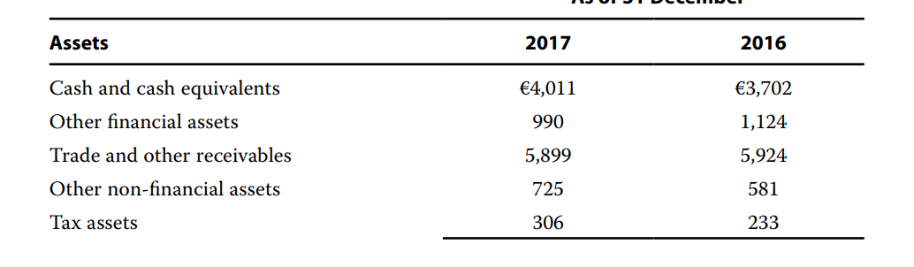

# R1

错题：2、3、14、18

关注：16

- 注意区分，providing information, 是financial report
- financial report是公司自己准备的
- 审计意见中qualified ：有一部分exception
- 注意区分process data, 和analyze/interpret the processed data
- Interim reports: semiannually, quarterly.

# R2

- IOSOC: core objective: ensure market fair, efficient, and transparent
-  **Realizable (settlement) value**: 
  - In reference to assets, realizable value is  the amount of cash or cash equivalents that could currently be obtained  by selling the asset in an orderly disposal. 
  - For liabilities, the equivalent to  realizable value is called “settlement value”—that is, settlement value is the  undiscounted amount of cash or cash equivalents expected to be paid to  satisfy the liabilities in the normal course of business.

- 错题：4、11、14
- 关注：6、10

# R3 Income Statement

错题：4、7

关注：15、24

- Begin equity + CI - Dividend = End equity
  - CI = NI + OCI
  - 注意哪些进入OCI
    - **unrealized**: available for sales, derivatives for hedge
    - foreign currency gain
- Commonsize analysis, represent as **a percentage of sales**
- Income is increases in economic benefits during the accounting period in the form of inflows or **enhancements of assets** or **decreases of liabilities** that result in increases in equity, other than those relating to contributions from equity participants.
  - enhancement of asset 
  - decreases of liabilities
    - 导致了increase in equity
    - 除了equity participant参与的以外
- 7、incremental costs of obtaining a contract must be capitalized
- 15、如果改会计准则，需要把prior periods shown in a report一并修改
# R4 BS

错题：13

关注：3、24、29

- Financial Leverage Ratio = A / E
- PPE和inventory都涉及delivery cost
- 29、注意BS中，一般列示的顺序，有从liquid到iliquild。这里，如果cash and cash equivalents，和trade and other receivables都算作quick ratio分子，那么中间的other financial assets流动性处于中间，肯定也算入quick ratio.

# R5 CF/S

错题：22、23、26、30

关注：4、5、8、21

- 4/5、non-cash transactions, if significant, are reported as **supplementary information**

- 8、Taxes on income are required to be separately disclosed under IFRS and USGAAP. The disclosure may be in the cash flow statement or elsewhere.

- 21、CFI的计算，抓住：selling price(cash inflow) - NBV = Gain/loss on sale

  - **Begin. Accu. Depre + dep. Exp. - ending accu depre = depreciation on the equiment sold**

  - **Begin Balance of equiment + Purchased Equipment - Ending Equipment = historical sold of Equipment sold**

  - 上面两式子相减，就得到笔记中的

    - NBV total beg. + Purchase - (NBV disposal + depreciation expense + impairment) 

      = NBV total end.

  - 计算得到NBV(sold) = historical of equiment sold - depreciation on the equiment sold之后

  - 得到Gain/Loss on sale + NBVsold = selling price(cash flow in)

- 22、company issued stock = equity中，common stock和additional paid-in capital的变动。
- 23、**计算CFO indirect method，需要对non-operating ：减去gain, 加上loss**
  - 另外，对于DTL和DTA，是NCC项目，需要+ $\Delta$DTL - $\Delta$DTA

- 26、an overall assessment of the major sources and uses of cash should be the first step in evaluating a cash flow statement
- 30、interest coverage ratio: measures the Ability to meet interest obligations

$$
\frac{CFO+Interest+Taxs}{Interest}
$$

# R6 Ratios

错题：8、14、20

关注：13、21、22

- P/E ratio = price of one share / EPS
- 注意：
  - Begin equity + new shares issuance - shares repurchased + comprehensive income - dividends = ending equity
  - 公司的equity的book value不受到market value的影响。

# R7 Inventory

错题：2、14、17、27、28、29、31、35、38、40、54

关注：1、4、11、13、46、50

1、存货运到客户手中，算expense; 存货运送到business点（达到可销售状态），可以capitalize

2、Inventory expense includes costs of purchase, costs of conversion, and other costs incurred in bringing the inventories to their present location and condition. 不包括**生产不要求**的存储费用。

- 购买存货，会有费用。这些费用有两种会计处理方式：
  - 1）算入inventory，然后在存货卖出，确认revenue的时候，作为cogs流出(product cost)
  - 2）直接算作当期的expense。（period cost）

4、FIFO 在IFRS下时可接受acceptable，并不是推荐preferred

13、14、注意题目是、compared to the cost of replacing the inventory。replacing the inventory，意思就是当前的inventory的市场价格。显然14题中，LIFO的存货价格更低。所以Nutmeg's inventory balance is lower than the cost of replacing the inventory.

17、write-down 存货，使得inventory value下降，COGS上升

- 注意：write-down在会计处理中：write downB/S中的inventory，同时把write-down确认在**COGS或者Loss中！！**(Notes 162页)

28、题目中要求excluding charges for increases in valuation allowances. 所以COGS要减去allowances(COGS中的written-down部分)

29、注意after=tax.

- 其实28、29的关键，在于理解为什么要减去COGS的written-down的部分。因为17题中的write-down确认在COGS中，排除掉有利于分析问题。

31、使用LIFO更能反映当下的gross profit margin，因为COGS更能代表**replacement cost**

- 另外：！！！当LIFO reserve一直在下降的时候，说明在发生LIFO liquidation，一部分的LIFOReserve会跑到利润表，影响gross profit margin。所以LIFO liquidation不发生，gross profit margin 更准确。

38、存货减少，原材料减少，厂家则预期销量下降。**Finished goods and raw materials** inventories are lower in 2018  when compared to 2017. **Reduced levels of inventory** typically indicate an anticipated business **contraction**.

40、这题有点奇怪。但有几个点：

- 如果价格下降，发生write-down，FIFO受到影响最小，因为存货本身已经按照最新价格计量
- LIFO更不可能发生write-down，因为存货计量的值本来就很低了。如果发生了减值，减少的幅度较小。

46、RE(FIFO) = RE(LIFO) + LIFO Reserve (1-t)

- 这是因为COGS(FIFO) = COGS(LIFO) - $\Delta$ LIFO Reserve
- NI = Revenue - COGS - ....
- **RE是时间点数**，COGS是时间段数
- 所以计算上税收，FIFO比LIFO多期末的LIFOReserve(1-t)

50、农林矿，可以以NRV计量，即使比historical cost高

54、IFRS和USGAAP都需要披露expense存货的金额。

# R8 Long-lived Asset

- 注意，DDB折旧，没有考虑残值，每一步需要验证是否小于了residual value

错题：8、14、16、33、39、40、41、42、46

关注：3、4、5、10、13、17、18、26、29、30、36

8、在US GAAP，assets arising from contractual or legal rights and assets that can be separated from the acquired acompany are recognized separately from goodwill.

- 对于IFRS和US GAAP，不能认为是tangible或者intangible的部分，认为是goodwill

14、预期使用寿命 = Net PPE / annual depreciation

- 注意：Net PPE = PPE - accumulated depreciation

16、对于capitalized interest 对interest coverage ratio的影响，一般考虑站在cfa角度，也就是把interest payment纳入计算，而不是interest expense。所以interest采用capitalize还是expense对EBIT/I没有影响。

33、注意revaluation是reporting model，不是impariment，可以增值。

另外，对于revaluation model的增值部分，先冲销原来的Loss，然后剩余的进入OCI，直接进入到Equity中的AOCI，也就是不会经过Income Statement.

39、对于cost model and revaluation model, 处置长期资产，gain/loss直接等于sales proceed减去 carrying value

关于披露：IFRS不用披露PPE的acquisition dates, intangible asset的fair value

US GAAP要求披露接下来5年的long-lived asset的预计摊销

##### 其他关注的知识点

3、constructing an asset 中产生的interest expense

- for own use: capitalize interest as PPE, 然后摊销
- for sale: capitalize interest as COGS, 卖出时作为COGS的一部分

4、借来的钱，中途投资产生收益，可以在interest expense中扣减。

**5、IFRS下，good will 不是intangible** 

13、注意这种说法：如果发生了减值（impariment loss），说明在过去（prior year)，折旧不够。An impariment loss suggests that insufficient depreciation expense was recognized in prior years. 所以如果发生减值，可以说明在过去的年份，net income被高估。

18、estimated useful life = estimates of average remaining life + estimate ages.

- estimate of average remaining life = **Net PPE**  / annual depreciation
- estimate of ages = Accumulated depreciation  / depreciation expense.

30、units-of-production折旧法用的是actual production，不是expected production

36、impairment 影响原来的asset，并且进入I/S

# R9 Tax

错题：7、8、10、12、13、16、19、20

关注：17

8、Net DT A = DTA - Allowance

Net DTL = DTL - Net DTA

这题通过DTL- DTA，表明企业有递延所得税负债。所以降低税率，递延的税会降低，所以对balance sheet来说是好事

10、provision，准备。

原文：companies create a provision on the balance sheet called deferred tax assets or deferred tax liabilities.

也就是这里针对税的provision，指的就是DTL DTA

12、tax credit，税务豁免

13、对DTA的allowance降低，说明以后会多交税进行抵扣，说明对未来预期好。

The valuation allowance is taken against deferred tax assets to represent uncertainty that future taxable income will be sufficient to fully utilize the assets.

16、what？The timing和amount of tax payments are uncertainty时，DTL应该从Debt和equity中移除。？？？

17、理解provision的含义。deferred就是延迟，今后少交税DTA，今后多交税DTL. provision就是BS里的DTL DTA科目。

**20?** 说的啥。

- 法定税率，taxable income \* t = tax payable
- 实际税率 EBT * t = tax expense

# R10 non-current liabilities

错题：12、13、14、19

关注：7、20

- amortization = interest expense - coupon payment

13、债券的摊销，实际上是BV比面值多出来的，进行摊销：

每期的摊销，意味着从BV向par value靠近。靠近的方法有effective rate amortization，按照实际利率进行摊销。或者直线摊销法。

直线摊销的时候，和之前的depreciation一样（Book value - residual value）/ N。这里residual value相当于就是par value.

14、zero-coupon bond相当于coupon rate = 0，也是需要摊销。相当于discount bond. 注意，债券存续期间会产生Interest Expense，所以会影响Return Earning, 进而影响equity.

20、current liabilities部分披露12个月内到期，non-current liabilites部分12个月后到期的债务。 在Notes中披露effective interest rate, maturity dates for a company's debt obligation.

养老金轧差。

# R11 Quality and Application

错题：8、23、25

关注：6、12、21、26、27

词汇：

litigation cost 诉讼费用

pro forma形式上的

prominence 突出、杰出、声望

reconcilation 一致，和好

barter 以物易物

prematurely 过早地、不成熟地

restructuring charge

extrapolate 推断，推知

6、最优状况，high financial quality, high earnings quality

8、manage earnings:

- real action: defere R&D
- accounting choices: estimated product returns, bad debt expense, impairment.

12、conservative，减少诉讼费用支出（litigation）

21、If a company uses a non-GAAP financial measure in an SEC filing, it  is required to provide the most directly comparable GAAP measure with equivalent prominence in the filing. In addition, the company is required to provide a  reconciliation between the non-GAAP measure and the equivalent GAAP measure. Similarly, IFRS require that any non-IFRS measures included in financial  reports must be defined and their potential relevance explained. The non-IFRS  measures must be reconciled with IFRS measures.

- 在SEC 文件使用非美国标准：
  - 显著位置提供comparable GAAP measure
  - 提供reconciliation
- IFRS要求非IFRS标准
  - potential relevance explained
  - reconciled with IFRS

23、interest paid是operation outflow，使得cash flow下降

stretching AP, 使得付钱更晚，所以cash flow上升

25、假设普通正常水平是receivable turnover是R/A

- 那么，如果一个公司提前确认了收入（prematurely，或者甚至fiticious），AR和Revenue同时增加相同数量，那么receivable turnover减小，DSO上升。

26、把一些支出延后，使得NI变高

27、restructuring charge and impairment charge 需要进行pro forma earning 调整
