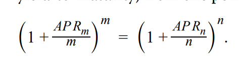

# M1

错题：1、6、11、18、20、24、28

关注：2、4、13、14、19、21

1、

tenor是剩余的maturity date

债券的nominal rate就是coupon rate(年化)

redemption value是issuer赎回债券的价格。不是bond's price

2、

stipulate规定

最大可变卖资产是negative convenants

11、

- affirmative and negative covenants are all legally enforceable.
- affirmative一般不会带来额外成本，但是negative 带来成本costly.

18、

注意，inverse floater bond和FRN影响的是coupon rate.在利率上升的环境，coupon rate也调高对投资者有利。

20、在隐含基础上赚钱。

A zero-coupon, or pure discount, bond pays no interest; instead, it is issued at a discount to par value and redeemed at par. As a result, the interest earned is **implied** and equal to the difference between the par value and the purchase price.

24、

putable 对bondholder有利

28、注意概念

conversion ratio = 1单位bond = 多少单位股

conversion price = bond par value / conversion ratio

conversion value = market value of stock \* conversion ratio

conversion premium = bond price \- conversion value

2、

capital market security >1年

4、

legal contract 是indenture，具体条款是covenant，debenture是一种债券

13、bearer bond不记名（欧洲债券）

registered bond记名

14、

- prorated 按比例的
- orginal issue discount(OID)，区分：
  - OID把折扣当成每一年的利息，征收利息税
  - 零息债券征收资本利得税（capital gain）

19、

- capital-indexed bond，本金和通胀挂钩
- interest-indexed bond，coupon和通胀挂钩

21、

- payment-in-kind(PIK) 实物支付债券
- deferred coupon bond，递延债券，初期不付coupon
- credit-linked coupon bond，bond的credit rating变化，那么coupon 也变化
- equity-linked notes(ELN)股权挂钩债券，没有期间利息，最后的本金取决于股票指数
  - 相当于zero-coupon bond + call option on equity index
  - 通常principal protected

# M2 

错题：2、6、13、14、15、16、22、23、25

关注：3、5、7、10、12、17、21、24、26、27、29

2、A bond issued internationally, outside the jurisdiction of the country in whose  currency the bond is denominated is best described as an Eurobond.

注意欧洲债券的表述

6、reference rate change可以表述为reset

13、注意区分bond的OTC和exchange market

- In over-the-counter (OTC) markets, buy and sell orders are initiated  from various locations and then matched through **a communications network**.  Most bonds are traded in OTC markets. 意思是OTC打电话交。
- on organized exchanges, buy and sell orders may come from anywhere, but the transactions must  take place at the exchange according to the rules imposed by the exchange

14、**Liquidity** in secondary bond markets refers to the ability to buy or  sell bonds quickly at prices close to their **fair market value**. 流动性，意思是可以以市场公允价值交易

15、 Settlement of trades in the OTC markets occurs by means of  a simultaneous exchange of bonds for cash on the books of the clearing system  “on a paperless, computerized book-entry basis.”

**OTC用book-entry basis（簿记基础）**

另外，corporate bond的settlement是**T+3**

16、注意，sovereign bonds没有抵押，unsecured obligation。backed by tax authority by national government.

22、商业票据可以作为：interim financing for long-term projects长期项目的临时融资

- commercial paper 谁都可以发，（issued by companies across the risk spectrum）

23、Commercial Paper is negotiable，意思是可以在二级市场买卖商业票据。

- Euro commercial paper can be denominated in **any currency**
- Eurocommercial paper may be issued on an interst-bearing(or yield) basis or a discount basis. 可以利息基础放发行，也可以贴现基础上发行。

25、sinking fund arrangement **reduce credit risk**

偿债基金条款，the issuer is required to set aside funds over time to retire the bond issue. 意思是要求发行人，在某个时间后，赎回部分本金。

5、Floating-rate bonds影响coupon rate

- interest-indexed 影响coupon
- capital-indexed 影响本金
  - TIPs，本金和通胀挂钩

**7、** interbank offered rate银行同业拆息

- 用作reference rate, for floating-rate bonds, and for other debt instruments(mortgates, derivatives such as interest rate and currency swaps)
- interbank offered rate是a set of reference rate, for borrowing periods up to 1 year.

10、privately placed bonds私募债券

12、在二级债券市场，主要参与者是大型机构（银行），不是retail investor散户韭菜。

17、国债高信用等级的两个因素

- issued in local currency
- strong domestic savings base强大国内储蓄基础

24、sinking fund arrangement和serial maturity structure都是按照提前约定的计划，需要提前偿还本金一部分。

- 对比，term maturity structure，到期期限结构，到期偿还本金。

26、银行short-term funding，资金来源两个：

- wholesale funds批发：CD，央行借钱、银行间市场（interbank funds）

- Retail deposits: 散户存钱，demand deposits/checking account活期、saving account定期、money market account余额宝

27、CD都是大单，large denomination大面额；可以在到期前卖出

- 对于non-negotiable CD: a penalty is imposed if the depositor withdraws funds prior to maturity

29、回购的repo margin是双方协商确定的。

# M3

错题：22、23、26、31

关注：25、28、32、33、37、40、coupon effect和maturity effect

22、不活跃的、还没有发行的bond，适用于matrix pricing

23、matrix pricing用于估计yield spread over the benchmark rate.

25、stated for a periodicity of 12，意思是1年计息12次。

26、The formula to **convert an annual percentage rate (annual  yield-to-maturity) from one periodicity to another** is as follows

28、注意，计算yield to call的时候，call price是FV

31、quote margin加在coupon rate，discount/required margin加在market rate

A two-year floating-rate note pays six-month Libor plus 80 bps. 意思是半年付息一次。

32、quote margin > require margin，那就是priced at premium

33、注意AOR定义

37、掌握英语表达：

- The forward rate can be interpreted to be the **incremental** or marginal return for **extending** the time-to-maturity of an investment for an additional  time period. 

- The add-on rate (bond equivalent yield) is a rate quoted for **money  market instruments**, such as bank certificates of deposit, and indexes, such as  MRR, Libor and Euribor. 
- Yield-to-maturity is the internal rate of return on the  bond’s cash flows—the uniform interest rate such that when the bond’s future  cash flows are discounted at that rate, the sum of the present values equals the  price of the bond. It is the implied market discount rate

40、inflation已经包含在benchmark中，所以通胀对spread影响最小。

注意。

coupon rate越小，同一单位的market rate变动，percentage of price变动越大

maturity 越长，同一单位的market rate 变动，percentage of price变动越大（例外是coupon 较小，discount发行的时候）

# M4 ABS

错题：9、24、25、39、41、42、43

关注：2、5、6、8、10、16、27、31、32、34、35、37、38、40

9、The creation of bond classes with a waterfall structure for sharing losses is referred to as credit tranching. 

- time tranching: 对prepayment risk重新分配
- credit tranching: 对credit risk 重新分配

另外：内部信用增强方式有下面几种：如果发生违约，首先消耗reserve fund，然后overcollateralization，最后通过subordination化解

- subordination：指的上面的time tranching和credit tranching
- overcollateralization：
- reserve funds: spread account

24、两组概念：conforming loan标准住房贷款，non-conforming loan非标准

- agency RMBS采用confoming
- non-agency RMBS，采用non-conforming，所以需要信用增强（internal or external）

25、注意CMO（collateralized mortgage obligation）不是created directly from mortgage loans，而是在MPS基础上，通过分层分散prepayment risk 的产品。CMO可以满足instituitional investors的asset/liability needs

39、In credit card receivable ABS, the only way the **principal cash flows** can be **altered** is by triggering the **early amortization provision**.

41、CDO三个层级被保护的优先级排序：senior > mezzanine > subordinated(equity)

- 所以，subordinated tranche的风险最大，收益最大。

42、当CDO没有通过pre-specified risk test时，会触发对senior层的本金支付，直到满足risk test。这个过程，使得senior的本金被消耗，从而使得CDO的cheapest funding source is reduced，所以得以deleveraged.

43、注意题目是least accurate！！！

- covered bond的底层资产可以动态调整。
- covered bond提供lower credit risk, lower yield
- covered bond 提供dual recourse，双重保证。

2、证券化是消除了orignating borrower和ultimate investor之前的壁垒。使得investor可以更好地调整interest rate and credit risk。

5、delinquent 违法的

- SPE负责issuance
- servicer，负责collection payment以及违约时收回标的资产。

6、depositor，指最初开始的银行（originator）

- underwritter 承销商

8、time tranche：prepayment risk

16、**bullet mortgage**: interest-only mortgage，在存续期间只支付利息，最后一笔支付本金。

27、support tranche给PAC tranche提供limited保护(PSA collar)。

- 注意，**sequential-pay tranche**只能提供要么extension，要么contraction，只能单方面保护。
- Sequential-pay tranche和PAC同属于CMO

31、RMBS有点像callable bond，所以CMBS的call protection，使得这个提前赎回权消失，更像普通的corporate bond

- Debt-service coverage ratio，a measurement of a firm's available cash flow to pay current debt obligations。保持良好的DSC Ratio可以消除部分credit risk。

32、Internal credit enhancement: subordination、overcollateralization、reserve fund

34、注意题目（least subject to）CMBS有call protection，最少prepayment risk

35、spread account是内部信用增强，减少credit risk

37、除了CMBS，credit card receivable ABS are backed by non-amortizing loans that do not involve schedulted principal repayments, 不受到prepayment risk影响

38、credit risk的第一道防线：excess spread account

- repossession and resale of autos are reqpayment cash flows rather tahn a form of credit enhancement for loss protection?
-  For securities backed by auto loans, prepayments result from sales and trade-ins requiring full payoff of the loan, repossession and subsequent resale of autos, insurance proceeds received upon loss or destruction of autos, and early payoffs of the loans.

40、CDO的层：senior > mezzanine > subordinate(equity)

# M5 Duration

错题：13、17、18、21、25、26

关注：4、5、6、11、15、19、23、27、28

13、三个对久期的影响因素：Time-to-maturity，coupon rate，yield-to-maturity

- **Longer** time-to-maturity usually leads to **higher** duration
  - 考虑MacDur，结论很显然
- **Higher** coupon rate leads to **lower** duration
  - 考虑MacDur，coupon越多，平均回流时间越靠前。所以久期越小
- **Higher** yield-to-maturity leads to **lower** duration
  - 考虑曲线上，yield越大，斜率（美元久期）越小，也就是MacDur、ModDur越小

17、注意计算仔细

18、注意，PVBP = $(P_{-} - P_{+})/2$，注意最后要除以2！

21、注意公示中，$\Delta r$带符号
$$
\%Price=-ModDur \Delta r+\frac{1}{2}Convexity (\Delta r)^2
$$
25、sale point在MacDur之前，市场价格风险主导。

26、Duration Gap = 🍔 - investment horizon

关于4、5、6，处置债券的计算

处置债券时，注意vanilla债券的carry value还是par value，因为不是摊销型债券。carrying value没有变化。

11、shaping risk，使用Key rate duration/ paritial duration

15、Portfolio的ModDur根据market-value加权平均

Portfolio的**Dollar** Duration**不用加权平均**，直接相加

19、second-order，意思就是二阶导数

23、

- yield 波动率 - Time-To-maturity是向下曲线
- yield 波动率大，不一定价格波动大，因为还受到ModDur和Convexity的影响

27、降低债券评级，影响的是credit spread

28、在经济条件恶化时，empirical duration适用于porfolio consisting of a variety of differenct bonds from different issuers. 这种时候，高收益债券的credit spread changes 会有时候抵消掉(offset) 低风险的国债或者AAA公司债券的yield change。一般用empirical duration能更好地预测到这种offset.

# M6 Credit

错题：2、7、9、16、18、22、28、29、30、34、37、40、41、47

关注：1、3、6、35、46

2、market liquidity risk的原因

- less debt outstanding
- a lower issue credit rating

7、credit risk has two components: default risk and loss severity

9、first mortgage debt属于senior secured debt，对specific property追偿，最高等级。

16、analysts and rating agencies 都不能foreseeing future debt-financed acquisitions.

18、有子公司和母公司的债券时，需要考虑**strucutural subordination**

- Debt at the operating subsidiaries is serviced by the cash  flow and assets of the subsidiaries before funds are passed to the parent holding  company
- 意思是：子公司的债，先自己还，然后再把资金转移给母公司。

22、the higher the senior unsecured rating, the smaller the notching adjustment.

要高评级，越不需要notching

28、EBIT是operating profit，EBITDA = EBIT + Depreciation and amortization

29、Total capital = Total debt +  Shareholders’ equity

30、issue more common share=> debt/capital improved

34、分析师分析公司信用，需要从industry structure 开始。

37、分析中，character的评判，包括use of aggressive accounting policies。recognizing revenue prematurely 属于aggressive accounting.

40、注意，debt/capital中的debt不是liability. 这里的**debt  = short term debt + long term debt.**

- 复习：FCFF = CFO - FC Inv + Interest (1 - t)
- 所以FCF after dividend = CFO - NetCapital expenditure - Dividends
- operating profit margin = EBIT / Revenue

41、在credit analysis中

- leverage 用 debt / capital和FCF after dividend / debt.

47、对于投资级别债券，更关注spread risk，对于垃圾债（高收益）债券，更关注default risk.

1、a bond's crediworthiness declines: credit migration risk.

3、credit risk: **risk of loss** resulting from the borrower failing to make **full and timely** payments of interest and/or principal.

6、credit risk包括default probability和loss severity

35、分析师需要关注公司的character，包括use of aggressive accounting policies。题目中的use a significant amount of off-balbance-sheet financing就属于aggresive accounting.

46、Non-sovereign governments typically must balance their operating  budgets and lack the discretion to use monetary policy as many sovereigns can. 地方政府债需要关注其预算。