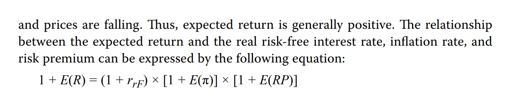

# M1 Introduction

错题：2、13、15

关注：9

- 2、portfolio主要关注降低risk, risk reduction
- 13、ETF没有capital gain distribution（因为是股票实物赎回）
  - ETF
    - 有tax 优势
    - trading price close to NAV
    - 没有capital gain
    - 比mutual fund更低transaction costs 
  - 封闭式基金
    - premium or discount to NAV
  - 开放式
    - at NAV
    - cash drag（保留一部分现金以免赎回）
- 15、Buyout Fund收购基金，或者private equity firm会投资几家private company然后3到5年卖掉；Venture capital投**很多**小公司，大部分会失败，只有少数获得巨额回报。
- 9、Most foundations and **endowments** are established with the intent of having perpetual lives. Although defined benefit plans and life insurance companies have portfolios with a long time horizon, they are not perpetual. 投资期限最长的是endowment.

# M2 Effective Frontier

错题：2、4、11、12、17、19、20、21、26、35

关注：5、6、7、9、14、16、32、34、39、41、42

2、return over 3 year，直接算3年整体的回报率，不用变为EAR

4、The arithmetic mean return assumes that the amount invested at the beginning of each period is the same. 当涉及到每期期初金额变化的时候，可以用geometric return 来计算compound return.

11、12、equity risk premium的计算方法 (1+re)/(1+rf) - 1

17、A=-4也可以算作低的risk aversion.但实际是risk seeker

19、20、21、注意U = E(R) - 0.5 A $\sigma^2$中，注意百分号的转换小数。

26、注意，cov(R1, R2) = $\rho \sigma_{R_1}\sigma_{R_2}$，计算时要区分cov还是rho

35、Given equal weights and average variance/covariance, we can rewrite the portfolio variance as below
$$
\sigma_P=\frac{\bar{\sigma}^2}{N}+\frac{N-1}{N}\bar{cov}
$$

- 所以，等权重的投资组合中，随着投资数量增多，单个的asset波动率影响逐渐变小，而资产之间的关联度（covariance）影响逐渐变大。

5、money-weighted return就是IRR

6、TWR就是geometric mean return

7、对于MWR和TWR。在熊市之前投资，MWR<TWR

9、(1+r)=(1+real rate)(1+ inflation premium)(1+...other premium)

14、风险和收益成正比

16、risk aversion程度越高，A越大，slope越大

34、和35题原理一样。

39、The markowitz efficient frontier has **higer rates of return ** for a given level of risk. With respect to the minumum-variance portfolio, the Markowiz efficient frontier is the set of portfolios above the global minimum-variance portfolio that **dominates** the portfolios below the global minimum-variance portfolio.

- Markowiz有效前沿，**dominates** minumum-variance portfolio.

41、在CAL上，在risk asset和无风险点之间的，是把资金以rf出借（lend）;在风险比risk asset更高的，borrow money with rf

42、mean-variance graph就是E(R)-$\sigma$图。根据每个投资者的indifference curve和有效前沿相切，得到最优点。

# M3 CAPM

- 错题：3、11、14、31
- 关注：2、4、6、7、12、13、15、17、**18、19、20、21**、22、24、25、32、35、36、40

- 3、Investors will have different optimal portfolios depending on their indifference curves. The **optimal portfolio** for each investor is the one with high- est utility; that is, where the CAL is tangent to the individual investor’s highest possible indifference curve.
  - **optimal portfolio**，就是indifference curve和CAL相切。最高的utility.
- Investors are capable of **avoiding nonsystematic risk** by forming a portfolio of assets that are not highly correlated with one another, thereby reducing total risk and being exposed only to systematic risk. 非系统性风险可以消除。
- Only systematic risk is priced. Investors do not receive any return for accepting nonsystematic risk or diversifiable risk
- 14、The sum of systematic variance and nonsystematic variance equals the total variance of the asset. References to total risk as the sum of systematic risk and nonsystematic risk refer to variance, not to risk.
  - 系统性风险+非系统性风险 = total **variance** of the asset.
  - As we have shown, beta captures an asset’s systematic risk, or the portion of an asset’s risk that cannot be eliminated by diversification
  - beta就代表系统性风险。

- 31、如果investors have **homogeneous** expectations or beliefs
  - Because their valuations of all assets are identical, they will generate the same optimal risky portfolio, which we call the **market portfolio**.
  - **homogeneous expectation $\implies$ same optimal risky portfolio, which is market portfolio**
  - The homogeneity assumption refers to all investors having the same economic expectation of future cash flows. If all investors have the same expectations, then all investors should invest in the same optimal risky portfolio, therefore implying the existence of only one optimal portfolio (i.e., the market portfolio).

2、correlation between the risk-free asset and the risky asset is equal to 0zero.

4、highly riks-averse investors will most likely invest the majority of their wealth in the risk-free asset.

6、CML中的portfolio包括了所有市场上的所有risky asset.

7、注意概念，CML和市场有效前沿相切的点，等于market portfolio等于optimal risky portfolio

12、非系统性风险是个体、公司的风险。nonsystematic risk is specific to a firm, whereas systematic risk affects the entire economy.

13、only systematic risk is priced. 只有系统性风险才被定价。接受非系统性风险和可分散风险（nonsystematic risk or diversifiable risk），不会带来任何回报。

15、个股的total risk直接看个股的standard deviation

17、个股的market risk，就是beta值。beta = $\rho_{i,m}\frac{\sigma_i}{\sigma_m}$

**18、19、20**、return generating model

- Expected Return can be calculated by **Return Generating model**
- 包括：
  - multi-factor
    - $E(R_i)-R_f=\sum_j \beta_j E(Factor_j)$
  - single-index
    - only one factor is considered, market risk premium
    - $E(R_i)-R_f=\beta_i[E(R_m)-R_f]$
    - **consistent with CML线**
    - $\sigma_i=\sqrt{\beta_i^2\sigma_m^2+\sigma_e^2}$
  - market Model
    - $R_i=\alpha_i+\beta_iR_m+e_i$

**21、With respect to capital market theory, average beta of all assets in the market is equal the 1.0.**

22、CAPM模型中，$\beta$ is the primary determinant主要决定因素。

24、CAPM：market risk premium = E(Rm) - Rf = return in excess of the market return.

25、CAPM的图像表述就是SML线，security market line

32、CML，capital market theory中，market portfolio存在，因为大家的预期同质，所有有同样的有效前沿。所有，homogeneous expectation导致market portfolio存在。

35、Jensor's alpha直接就表明超额收益（alpha > 0 indicates that the portfolio has outperformed the market），其他的treynor ratio, sharp ratio, M-square，都需要基金之间进行对比。

36、M-square adjusts for risk using standard deviation. 所以适用与not fully diversified investor.

40、jensor's alpha越大越好，因为是risk-adjusted return。

# M4 Portfolio Planning

- 错题：5、16、18
- 关注：2、6、8、11、13、19
- 5、SAA、rebalancing policy实际操作，反而在IPS放在附录appendices
- **16、**returns on **asset classes** primarily reflect the systematic risks of the classes.
- 18、注意，correlation越大，表示相关性越高。显然，within class的asset相关性比among classes 更高。
- 2、A written IPS is best seen as a communication instrument allowing clients and portfolio managers to mutually establish investment objectives and constraints. IPS是clients and manager构建共同目标工具。
- 6、According to the reading, “The sections of an IPS that are most closely linked to the client’s **distinctive need**s are those dealing with investment **objectives** and **constraints**.” 
  - *Investment Guidelines* “[provide] information about how policy may be executed, including investment **constraints**.
  - ” *Procedures* “[detail] the **steps** to be taken to keep the IPS current and the **procedures** to follow to respond to various contingencies.
  - ” *Statement of Duties and Responsibilities* “detail[s] the **duties and responsibilities** of the client, the custodian of the client’s assets, the investment managers, and so forth.”
- 8、risk assessment questionaires用来调查willingness to take risk
- 11、10年是long-term
  - 投资考虑因素RRTTLLU
  - Risk Return Tax Time Liquidity Legal Unique
- 13、refrain from doing sth忍住，节制做某事。投资者的一些投资限制，需要记录在IPS，
  - When a client has a restriction in trading, such as this obligation to refrain from trading, the IPS “should note this constraint so that the portfolio manager does not inadvertently不经意地 trade the stock on the client’s behalf.”
- 19、Tactical asset allocation（TAA，就是临时改变打法，战术性偏离SAA） allows actual asset allocation to **deviate** from that of the strategic asset allocation (policy portfolio) of the IPS.
  - Tactical asset allocation attempts to **take advantage of temporary dislocations** from the market conditions and assumptions that drove the policy portfolio decision.

# M5 Behavior

- 错题：2、3、12-15
- 关注all
- Under-diversified portfolios are a consequence of these following four biases
  - illusion of control
  - confirmation biases.
  - over-confidence
  - availibility
- Both endowment bias and regret-aversion bias often result in indecision or inertia—a typical outcome of status quo bias, in which people prefer to not make changes even when changes are warranted.
  - endowment bias
  - regret-aversion
  - status quo
  - 这三个都会带来惰性
- The overconfidence and excessive trading that contribute to a bubble are linked to self-attribution bias, a form of overconfidence.
- 8、The most common consequence of mental accounting is **neglecting opportunities to reduce risk by combining assets with low correlations**, because each account’s asset allocation is examined **discretely**. Offsetting positions across accounts, or an overall inefficient allocation with respect to risk, can lead to sub- optimal aggregate performance.
- 与有效市场假说偏离，不一定是anomoly(anomalous). 有可能是：选错了模型choice of asset model, temporary暂时的，statistical inadequate样本不够
- **Home bias** refers to FMPs preferentially investing in **domestic securities**, likely reflecting perceived relative informational advantages, a greater feeling of comfort with the access to company executives that proximity brings (either personal or through a local brokerage), or a psychological desire to invest in a local community. 
- Momentum, on the other hand, has been documented in a range of markets around the world, in a time-dependent manner, and reflects some FMPs’ availability bias, manifested as a belief that stocks will continue to rise because recently they have only risen, as well as regret aversion by those who invest in past winners because they regret not investing in them in the past.
- Companies with strong historical growth rates are viewed as good invest- ments, with higher expected returns than risk characteristics merit.
  - This choice describes the halo effect, which does offer a behavior- al explanation for the poor performance of growth stocks versus value stocks. Growth stocks are mispriced relative to their risk characteristics, because FMPs focusing on just a few properties, such as a high historical revenue growth rate, while neglecting other characteristics.

# M6 Risk Management

- 错题：2、7、8、12
- 关注：all
- 2、投资者可以控制的是risk。control the risk, and the return will take care of itself.
- 7、risk governance 是站在高层角度，站在整个企业的角度考虑问题。
- 8、The risk management committee is a part of the risk governance  structure at the operational level—as such, it does not approve the governing  body’s policies.
  - risk management committee是属于risk governance的范畴。
- 12、risk budgeting：分配具体风险
- 1、For individuals, risk management concerns **maximizing utility** while  taking risk consistent with individual’s **level of risk tolerance**.
- 3、The process of risk management includes defining and measuring risks being taken.
- 5、The risk management infrastructure  **identifies**, **measures**, and **monitors** risks (among other things)

- 6、risk governance 是top-down process that **defines risk tolerance,  provides risk oversight and guidance to align risk with enterprise goals**
- 9、当risk tolerance(risk appetite)被决定了，下一步就是align risk exposures. 
  - When risk tolerance has been determined, the risk framework  should be geared toward 
    - **measuring, managing, and complying with the risk tolerance**
    - **aligning risk exposure with risk tolerance**. 
  - The risk tolerance decision  begins by looking at what shortfalls within an organization would cause it to fail  to achieve some critical goals and what are the organization’s risk drivers.
- 11、risk governance 和management 顺序：
  - tolerance->budgeting->exposures
- 17、The **VaR** measure indicates the probability of a loss of **at least** a certain level in a time period. 至少的损失。
- 18、如果企业选择接受风险头寸，那么企业会构建reserve fund to cover losses
- 19、风险修正modification of risk：One must weigh  benefits and costs in light of the firm’s risk tolerance when choosing the method  to use

# M7 Technical Analysis

- 错题：2、4、15、18、26、29、31、32、37、39
- 关注：8、9、22、24、38
- 2、技术分析有用，意思就是market inefficient. 特别的，weak inefficient.
- 4、commodities和currencies没有fundamental 分析，所以特别适用于technical analysis
- 15、downtread line is construted by drawing a line connecting the highs of the price chart
- 18、resistance，阻力线，是向上的阻力。对比support line，是防止股价进一步向下的支撑。
- 26、An inverse head and shoulders is a reversal pattern for a downtrend that preceded the formation of the pattern. An inverse head and shoulders is also referred to as a head and shoulders bottom and signals a potential reversal from the preceding downtrend to an uptrend. An inverse head and shoulders is the opposite of a head and shoulders pattern that signals a reversal from a preceding uptrend to a downtrend.
  - 反向头肩顶，从下降趋势逆转到向上趋势
  - 头肩顶，从向上趋势逆转到向下趋势
- 29、healthy correction：With a “healthy correction,” a type of continuation pattern, the long-term price trend does not change as supply and demand remains in balance while ownership transitions from one investor group to another. 长期价格不会改变，供需平衡，一部分人buy，另一部分马上sell，属于continuation pattern，包括triangle, rectangle, flags等。
- 31、pattern有continuation pattern和reversal pattern反转趋势
  - continuation pattern: triangle, rectangle, flag, pennant
  - reversal pattern: head and shoulder, double tops/bottom, triple tops/bottom
- 32、对于head and shoulders pattern，volume is necessary to confirm the market rallies。
  - head and shoudler一共三个要素：neckline, volulme, price target
  - price target = neckline - (head - neckline)
- 37、oscillator振荡器
  - Bollinger Bands are price-based indicator
- 39、Securities that break out from low-volatility conditions are likely to experience high volatility, and high volatility in the direction of an existing trend will usually help the trend pick up momentum. **Breakouts from consolidation periods in an uptrend or entering an uptrend are usually followed by a continuation of the existing trend.**
  - 低波动率，变高波动率时，有向上的趋势的话，存在向上的momentum.
- 8、9、candlestick，light（空心）代表收盘高于开盘。dark实体代表开盘高于收盘
- 24、price target = neckline - (head - neckline)
- 38、Intermarket analysis commonly used **relative strength analysis**, which charts the ratio of the price of two assets.

# M8 Fintech

- 错题：4、7、9
- 2、学习英语表达：real-time communication of it is uncommon due to vast content.
  - due to 因为
  - vast content大量内容
- 4、NLP分析社交媒体，用于分析市场情绪，to identify trends and short-term indicators about a company, a stock, or an economic event that might have a bearing on future performance. 可以用来分析economic trend
- 5、Research suggests that robo-advisers tend to offer fairly conservative advice, providing a cost-effective and easily accessible form of financial guidance to underserved populations, such as the mass affluent and mass market segments
  - mass affluent表示upper-end of the mass market，属于high-income segment
  - mass market represent lower- and middle-income segment
  - 另外，robo-adviser通常提供的是passive strategies被动管理
- 6、Interest is increasing in monitoring risk in real time. To do so, relevant data must be taken by a firm, mapped to known risks, and identified while moving within the firm. Data could be aggregated for reporting purposes or used as inputs to risk models.
  - segregate分开

7、量化投资，和trading destination增加有关。这里指的是交易所，投资渠道，比如electronic exchanges, alternative trading systems, dark pools。

9、DLT用于phyisical asset是Tokenization上链, the process of representing ownership rights to physical assets on a blockchain or distributed ledger.
