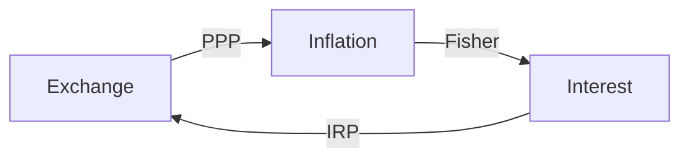
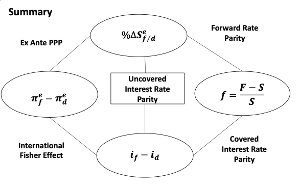
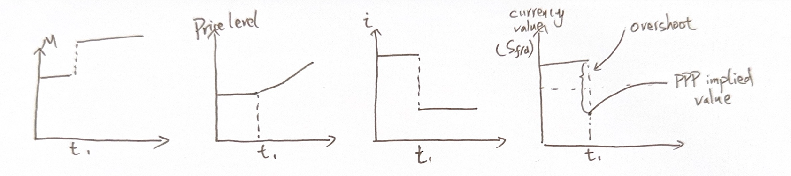
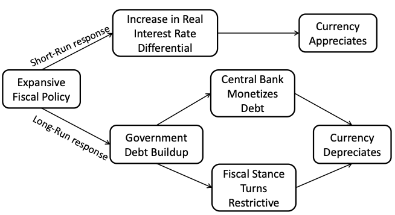
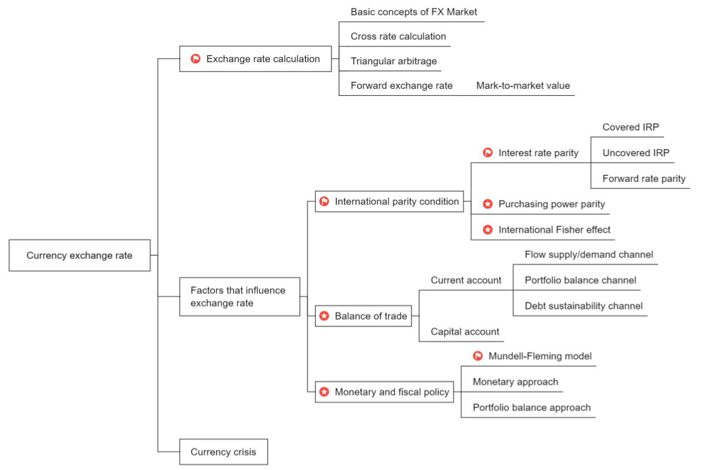

# Currency Exchange Rate

## I. Exchange Rate Calculation

### 1. Basics

> The bid price is the price, defined in terms of the price currency, at which the counterparty is willing to buy one unit of the base currency. Similarly, the offer price is the price, in terms of the price currency, at which that counterparty is willing to sell one unit of the base currency. 

- for P/B quoting, for the perspective of bank
  - bid price: Base currency in, Price currency out
  - ask price: Base currency out, Price currency in

- **hit the bid**, sell the base currency. 
- **paid the offer**, buy the base currency. 比如留学生买港币

##### Bid-offer spread

- Spreads are often stated as **pips**(万分之一)
  - except yen: 1/100
- The bid-offer spread a dealer provides to its clients is typically **wider than** the bid-offer spread in the interbank market.
  - 零售市场的价差，比银行间外汇市场更大。
    - retail market spread > interbank spread
    - 因为interbank market更活跃，交易量更大，流动性更好。
- 影响spread的具体因素
  - spread quoted by a dealer to its clients depends on : 零售retail market的价差取决于
    - bid-ask spread quoted in the interbank market. 银行需要在interbank market 处理外汇持仓。
    - size of the transaction. 交易量越大，spread 越大。交易量大，在interbank market的平盘难度大。
    - relationship between the dealer and client.
  - Interbank spreads depends on 
    - currency pair involved
      - 货币对。主要货币之间的兑换，流动性好，价差更窄。
    - time of day
      - 全球的不同市场在不同时间段开盘，比如NY time 8-11点，交易量大，spread 小
    - market volatility

### 2. Cross Rate Calculation

- 相对一级，考虑bid/ask价格

#### Cross rate

- 中间货币

  - $(\frac{A}{B})_{bid}=(\frac{A}{C})_{bid}(\frac{C}{B})_{bid}$

  - $(\frac{A}{B})_{ask}=(\frac{A}{C})_{ask}(\frac{C}{B})_{ask}$

- 买卖方向
  - $(\frac{A}{B})_{bid}=1/(\frac{B}{A})_{ask}$
  - $(\frac{A}{B})_{ask}=1/(\frac{B}{A})_{bid}$

##### Example

- A dealer is quoting the AUD/GBP spot rate as 1.5060-1.5067. Compute proceeds of converting 1 million GBP and proceeds of converting 1 million AUD.
  - converting GBP, sell GBP, buy AUD. 1 million GBP converts to 1m \* 1.5060 = 1.506 million AUD
  - converting AUD, sell AUD, buy GBP. use ask price.
    - 1 million AUD converts to 1 / 1.5067 million GBP.

- 记忆
  - A/B, converts B, 乘法+bid price. 手里有B，换A，所以是$B \times (A/B) = A$
  - A/B, converts A, 除法+ask price. 手里有A，换B，所以是$A/(A/B) = B$

### 3. Triangular Arbitrage 三角套汇

#### Arbitrage constraints on FX quotes

- 外汇市场：interbank, retail

- **Triangular arbitrage**: if identical financial products(currency) are priced differently, then market participants will buy the cheaper one and sell the more expensive one until the price differentce is eliminated. 买低卖高。
- The bid quoted by a dealer in the interbank market **cannot be higher than** the current interbank offer. The offer quoted by a dealer in the interbank market **cannot be lower than** the current interbank bid.
  - 如果dealer bid > interbank ask，可以低买高卖，存在套利机会
  - 如果dealer ask < interbank bid，可以低买高卖，存在套利机会
  - **总之，只要市场上存在ask比bid低，都会有套利机会。**
- The cross-rate bids(offers) posted by a dealer must be lower (higher) than the implied cross-rate offers(bids) available in the interbank market.
  - 银行的交叉汇率，要满足deal bid < interbank ask

##### Example

- Spot rate quotes in the interbank market

| JPY/USD | 105.39/105.42 |
| ------- | ------------- |
| CAD/USD | 1.3199/1.3200 |

- If a dealer quoted a bid-offer rate of 79.81/79.83 in JPY/CAD, whether a triangular arbitrage exists or not?
  - interbank: JPY/CAD = 105.39 * (1/1.32) / 105.42 * (1/1.3199)=79.84/79.87
  - dealer ask < interbank bid, there is a arbitrage opportunity.
  - buy CAD from dealer, and sell CAD to interbank, gain a profit of JPY 0.01 per CAD.
  - 记住，A/B，就是买卖B。利润是A per B.

### 4. Forward Exchange Rate

mark-to-market value

#### Forward Premium and Discount

- If the forward quote is **higher** than spot price
  - Base currency is trading at a forward premium. 预期升值
  - Price currency is trading at a forward discount. 预期贬值
  - 比如CNY/USD = 7, forward CNY/USE = 7.5 人民币贬值
- If the forward quote is **less** than spot price
  - Base currency is trading at a forward discount
  - Price currency is trading at a forward premium
  - 比如CNY/USD = 7, forward CNY/USE = 6.5
- **Forward exchange rates are typically quoted in terms of points**
  - 1point = 1/10000

#### The mark-to-market value of a forward contract

- **Mark-to-market value**: the profit(or loss) that would be realized from closing out the position at current market prices.
- To close out a forward position, we must offset it with an equal and opposite forward postion using the spot exchange rate and forward points available in the market when the offsetting position is created.
  - 反向平仓，带来的盈亏
- The process for marking to market a forward position
  - **Step1**: Create an offsetting forward position that is equal to the original forward position
  - **Step2**: Determine the appropriate all-in forward rate for this new, offsetting forward position. 确定反向合约的远期汇率：买/卖？具体days？
  - **Step3**: Calculate the cash flow at the settlement day
    - 比如A/B forward，在settlement day.计算A流入流出，B流入流出
  - **Step4**: Calculate the present value of this cash flow at the future settlement date. **The currency of the cash flow and the discount rate must match.**
    - 按照货币国家的利率，折线到今天。

## II. Factors that influence exchange rate

### II.1 International parity condition

$Fx, i, \pi$，研究汇率、利率、通胀率之间的关系

#### Overview of key international parity conditions

| Interest rate parity | Purchasing power | International Fisher effect |
| -------------------- | ---------------- | --------------------------- |
| Covered IRP          | Absolute PPP     | Fisher effect               |
| Uncovered IRP        | Relative PPP     | Real interest rate parity   |
| Forward rate parity  | Ex-ante PPP      |                             |
| Fx vs. $i$           | Fx vs $\pi$      | $i$ vs $\pi$                |

#### 1. Interest rate parity（FX vs. i）

##### Interest rate paritey - Covered IRP 抛补利率平价

- **Covered Interest rate parity(CIRP)**: an investment in a foreign money market instrument that is completely hedged against exchange rate risk should yield exactly the same return as an otherwise identical domestic money market investment.
  - 通过远期合约锁定未来汇率forward contract
  - 两个前提：1）国外国内投资same return；2）通过hedge对冲风险

$$
1+i_d=\frac{S_{f/d}(1+i_f)}{F_{f/d}}
$$

- The domestic currency will trade at a **forward premium**($F_{f/d}>S_{f/d}$)if the foreign risk-free interest rate **exceeds** the domestic risk-free interest rate($i_f>i_d$). 无套利机会利率

$$
F_{f/d}=S_{f/d}\frac{1+i_f\frac{days}{360}}{1+i_d\frac{days}{360}}\\
\implies \frac{F_{f/d}-S_{f/d}}{S_{f/d}}=\frac{\frac{days}{360}}{1+i_d\frac{days}{360}}(i_f-i_d)
$$

- 上面公式表明远期与即期差的$\%$，约等于利率差$i_f-i_d$
  - $i_f>i_d \iff F_{f/d}>S_{f/d}$, 远期升水，forward premium

##### Interest Rate Parity - Uncovered IRP 无抛补

没有Forward contract，用预期的即期汇率$S_{f/d}^e$, expected spot rate替代$F_{f/d}$

- **Uncovered interest rate parity(UIRP)**: the **change in spot rate** over the investment horizon should, on average, equal the differential in interest rates between the two countries.

$$
S_{f/d}^e=S_{f/d}\frac{1+i_f\frac{days}{360}}{1+i_d\frac{days}{360}}\\
\implies \frac{S_{f/d}^e-S_{f/d}}{S_{f/d}}=\frac{\frac{days}{360}}{1+i_d\frac{days}{360}}(i_f-i_d)\\
\implies \% \Delta S_{f/d}^e\approx \frac{days}{360}{i_f-i_d}
$$

- 重要：预计即期汇率变化百分比，约等于利率差
  - 也就是，本国利率高，本国货币相对贬值
  - 这里和直觉相违背，一般利率高，资金进入这个国家，短期会使得货币升值。但是我们这里讨论的是长期均衡状态。

- The investor is assumed to be **risk-neutral**. （前提条件，重要）
  - 回报相同，国内国外投资都可以。
- The expected appreciation/depreciation of the exchange rate just offsets the yield differential(利率差)
  - 汇率差抵消利率差。
- In domestic currency terms, the investment return on an uncovered foreign-currency-denominated investment is equal to: 外国投资回报计算
  - 持有1单位外币，利率收益$1+i_f$，汇率抵消$1-\%\Delta S_{f/d}^e$，最后这个投资回报，应该要等于$i_d$

$$
(1+i_f)(1-\% \Delta S_{f/d}^e)-1\\
\approx i_f-\% \Delta S_{f/d}^e
$$

##### FX carry trade (\*\*\*) 套利机会

- When UIRP does not hold, in a FX carry trade, an investor invests in a higher yielding currency using funds borrowed in a lower yielding currency(**funding currency, d**).
  - 利率低的国家借钱，投到利率高的国家
- During periods of low volatility, carry trades tend to generate positive returns, but they are prone to significant crash risk in turbulent times.
  - 利率波动大的时候，风险较大

###### Example

- Exchange rate for USD/GBP is 1.5 today and 1.49 one year later. Interst rate is 3% for UK and 1% for US Calculation the profit to borrowing in the US and investing in the UK. (TODO???? 这个 $\%\Delta S_{f/d}^e$ 究竟是什么？存在疑问)
  - 方法1:公式（这个公式有待验证）
    - gross return = $(1+i_{UK})(1-\% \Delta S_{GBP/USD}^e)-1$
      - $=1.03\times (1-\frac{\frac{1}{1.49}-\frac{1}{1.5}}{\frac{1}{1.5}})=1.03 \times (1-0.67\%)=2.31\%$
    - Net return = gross return  - borrowing cost = $2.31\%-1\%=1.31\%$
  - 方法2:按照套利流程推导
    - 1.借入1USD，换成 $1/1.5=0.6667$ GBP
    - 2.GBP投资1年，得到 $0.6667 \times 1.03=0.6867$ GBP
    - 3. 换回USD，得到$0.6867 \times 1.49 = 1.0231$ USD
      4. 还1 USD，扣费前利润为$2.31\%$
      5. 扣除借钱的利息，net return = $2.31\%-1\%=1.31\%$

##### Interest Rate Parity - Forward rate parity

- **Forward rate parity(FRP)**: the forward exchange rate will be an **unbiased predictor** of the future spot exchange rate **if both covered and uncovered interest rate parity hold**. 无偏估计量

$$
F_{f/d}=S_{f/d}^e
$$

- CIRP must hold because it is enforced by arbitrage. The question of whether FRP holds is thus dependent upon whether UIRP holds.
  - FRP取决于UIRP是否成立

##### Summary

- CIRP
- UIRP
- FRP

#### 2. Purchasing Power parity  (FX vs $\pi$)

##### Purchasing Power parity(PPP) 购买力平价

- **Absolute PPP**: the equilibrium exchange rate between two countries is determined entirely by the ratio of their national price levels. 绝对购买力平价

$$
S_{f/d}=P_f/P_d
$$

- 
  - 记忆，巨无霸指数，比如$S_{CNY/USE}=P_{CN}/P_{US}$

- In practice, absolute PPP might not hold because the weights of the various goods in the two economies may not be the same (e.g., people eat more potatoes in Russia and more rice in Japan.)
  - 消费结构不一样，PPP不一定成立。
- **Relative PPP**: the percentage change in the spot exchange rate will be completely determined by the difference between the foreign and domestic inflation rate. 相对购买力平价，即期汇率变化和两个国家的通胀率有关

$$
\%\Delta S_{f/d}=\pi_f-\pi_d
$$

- 推导过程：上标为时间点

  - $$
    \pi=P^{(1)}/P^{(0)}-1 \\
    S_{f/d}=P_f/P_d\\
    \%\Delta S_{f/d}=S^{(1)}_{f/d}/S^{(0)}_{f/d}-1\\
    =\frac{P^{(1)}_f/P^{(1)}_d}{P^{(0)}_f/P^{(0)}_d}-1\\
    =\frac{P^{(1)}_f/P^{(0)}_f}{P^{(1)}_d/P^{(0)}_d}-1\\
    =\frac{\pi_f+1}{\pi_d+1}-1\\
    =\frac{\pi_f-\pi_d}{\pi_d+1}\approx\pi_f-\pi_d
    $$

- **Ex-ante version of PPP**: 预期购买力平价（\*\*\*）， asserts that the expected changes in the spot exchange rate are entirely driven by expected differences in national inflation rates. 注意这里是预期通胀。

- Countries that are **expected** to run persistently high inflation rates should expect to see their currencies depreciate over time. 国家预期通胀高，预计这个国家货币会贬值。

$$
\%\Delta S_{f/d}^e=\pi_f^e-\pi_d^e
$$

##### Summary

- absolute PPP: Price
- relative PPP: inflation
- ex-ante PPP: expected inflation (\*\*\*)

#### 3.International Fisher effect (i vs. $\pi$)

利率和通胀的关系

##### International Fisher effect and real interest rate parity

- **FIsher effect**

$$
i=r+\pi^e
$$

nominal interest rate = real interest rate + expected inflation
$$
i_f-i_d=(r_f-r_d)+(\pi_f^e-\pi_d^e)
$$

- If **UIRP** and **ex-ante PPP** both hold, $\%\Delta S_{f/d}^e\approx i_f-i_d\approx \pi_f^e-\pi_d^e$, then $r_f=r_d$, real interests rates will converge to the same level across different markets, which is called **real interest rate parity(RIRP)** 实际利率平价。
  - UIRP和ex-ante PPP成立时，RIRP成立

$$
r_f=r_d
$$

- **International Fisher effect**: if RIRP holds， 利率差约等于预期通胀差

$$
i_f-i_d\approx\pi_f^e-\pi_d^e
$$

#### Summary

- According to CIRP(covered interest rate parity), arbitrage ensures that nominal interest rate spreads equal the percentage forward premium(or discount).
- According to UIRP(uncovered interest rate parity), the expected percentage change of the spot exchagne rate should, on average, be reflected in the nominal interest rate spread.
- If both CIRP and UIRP hold, then the forward exchange rate will be an unbiased predictor无偏估计量 of the future spot exchange rate.
- According to the ex-ante PPP, the expected change in the spot exchange rate should equal the expected difference between domestic and foreign inflation rates
- Assuming the Fisher effect and RIRP hold in all markets, then the international Fisher effect holds
- If ex-ante PPP and the international Fisher effect hold, then UIRP holds.

- 注意每个定理的前提假设、结论、计算

### II.2 FX and Balance of payment

current account经常账户对汇率的影响\* 

- flow supply/demand; portoflio balance; debt sustainable

capital account

商品/服务计入currenct account, 投资计入capital account

#### Overview of BOP flows

- Over the **long term**, countries that run persistent current account deficits(net borrowers，这里指的是贸易逆差) often see their currencies depreciate because they finance their acquisition of imports through the continued use of debt.
  - current account长期。
  - 出口>进口，贸易顺差，surplus
    - 抛售外币，买入本币，导致本币升值
  - 出口<进口，贸易逆差，货币贬值
- However, investment/financing decisions are usually the dominant factor in determining exchange rate movements, at least in the **short to intermediate** term.
  - capital account短期/中期，资金流入流出，对货币需求影响较大。

#### Influence of currenct account on exchange rates

- Current account influences the path of exchange rates through the following mechanisms:

  - The flow supply /demand channel

  - the portfolio balance channel
  - The debt sustainability channel

##### 1) Flow supply/demand channel

- country with persistent current account **surpluses(deficits)** would see their currencies **appreciate(depreciate)** overtime.
  - current account surplus=>出口>进口=>顺差=>本币需求上升=>本币升值
  - restor（修复）：**本币升值，出口吸引力下降，又导致surplus下降**
    - 复习CFA level 1：汇率变动，影响CA，和商品的elasticity有关系

- The amount by which exchange rates must be adjust to **restore** current accounts to balanced positions depends on：
  - The initial gap between imports and exports. 原来进口出口差异大，修复速度更慢。
  - The response of import and export prices to changes in the exchange rate
  - The response of import and export demand to the change in import and export prices.
    - 汇率-->价格-->需求

##### 2) Portfolio balance channel

- 国际财富，从逆差国家转移到顺差国家。

- Current account imbalances shift financial wealth from deficit nations to surplus nations
  - 比如，如果A国对B国处于顺差，那A国会持有大量的B国的货币的资产（比如B国国债）。出于组合管理，会减持部分资产，导致B国货币贬值，A国货币升值。
- Nations running large current account surpluses versus the United States might find that their holdings of US dollar-denominated assets exceed the amount they desire to hold in a portfolio context. Actions they might take to reduce their dollar holdings to desired levels could then have a profound, negative impact on the dollar's value.

##### 3) Debt sustainability channel

- If a country runs a large and persistent current account deficit over time, eventually it will experience an untenable（站不住脚的） rise in debt owed to foreign investors. 举债维持deficit。
- If such investors believe that the deficit country's external debt is rising to unsustainable levels, they are likely to reason that a major depreciation of the deficit country's currency will be required at some point.
  - 当deficit国信用降低，投资者抛售资产，导致货币贬值。
  - 或者deficit国印钱，也会导致货币贬值。

#### Influence of capital account on exchange rates 资本账户（短期/中期）

- As capital flows **into(out)** a country, demand for that country's currency increases(decreases), resulting in **appreciation(depreciation)**.
  - 资金流入=>货币升值
- Global capital flows have helped fuel boom-like conditions in emerging market economies for a while before, suddenly and often without adequate warning, those flows reversed.
  - 回顾：热钱。
- Excessive emerging market capital inflows often plant the seeds of a crisis by contributing to :
  - An unwarranted appreciation of the currency
  - A huge buildup in external indebtedness 债务过多
  - An asset bubble
  - A consumption binge（消费狂热）that contributes to explosive growth in domestic credit and/or the current account deficit
  - An overinvestment in risky projects and questionable activities
  - e.g. 泰国泰铢经济危机

#### Equity market trends and exchange rates

股票市场和汇率

- Increasing equity prices can also attract foreign capital
- Instability in the correlation between exchange rates and equity markets makes it difficult to form judgements on possible future currency moves based solely on expected equity market performance.
  - 股票和回报之间其实并没有找到稳定的关系

#### Summary

- current account 长期 (\*)
  - flow suply/demand
  - porfolio balance
  - debt sustainablity
  - 总体的规律就是：
    - surplus导致升值
    - deficit 导致贬值
- capital account 中短期
  - 资本流入，导致货币升值
  - 资本流出，导致货币贬值

### II.3 FX and monetary/fiscal policy

#### 1. Mundell-Fleming model \*\*

- It describes how changes in monetary and fiscal policy within a country affect <u>interest rates</u> and <u>economic activity</u>, which in turn leads to changes in <u>capital flows</u> and <u>trade</u> and ultimately to changes in the exchange rate
  - 资金可自由流通的国家（G10）
  - 资金不自由流通的国家
- **Assume inflation plays no role** 不考虑通胀

- Mundell-Fleming approach focuses on the **short-term** implications of monetary and fiscal policy短期影响

##### Monetary-fiscal policy mix with <u>**high** capital mobility</u> （货币完全自由流通）

- 货币/财政政策，影响利率，进而影响capital account，影响货币价值
- Expansionary **monetary** policy 
  - -> **interest rate decrease**
  - -> investments and spending increase
  - -> capital flows to high-yielding countries
  - -> **depreciation** pressure
- Expansionary **fiscal** policy
  - -> spending increase or tax decrease（导致发债，债务变高）
  - -> **interest rate increase** （挤出效应crowd-out effect，政府把钱借走，钱变少）
  - -> capital flows being attracted from low-yielding countries
  - -> **appreciation** pressure

| 货币自由流通国家               | Expansionary monetary policy         | Restrictive monetary poicy           |
| ------------------------------ | ------------------------------------ | ------------------------------------ |
| **Expansionary fiscal policy** | Indeterminate                        | Domestic currency <u>appreciates</u> |
| **Restrictive fiscal policy**  | Domestic currency <u>depreciates</u> | Indeterminate                        |

##### Monetary-fiscal policy mix with <u>**low** capital mobility</u> 不自由资金流通

通过trade影响<u>current accout</u>，trade/export，进而影响货币价值。

- Expansionary monetary policy
  - -> boost spending and import （Aggregate Demand上升）
  - -> worsen trade balance （进口 > 出口，需要把本币换外币，买国外商品）
  - -> **depreciation** pressure
- Expansionary fiscal policy
  - -> increase import
  - -> create trade deficit（AD 上升）
  - -> **depreciation** pressure

| 货币非自由流通                 | Expansionary monetary policy     | Restrictive monetary poicy       |
| ------------------------------ | -------------------------------- | -------------------------------- |
| **Expansionary fiscal policy** | Domestic currecy **depreciates** | indeterminate                    |
| **Restrictive fiscal policy**  | indeterminate                    | domestic currecy **appreciates** |

#### 2. Monetary approach 

关注短期/长期的货币政策对汇率的影响

- Assume that output is fixed（GDP达到potential GDP）, so that monetary policy primarily through the price level and the rate of inflation.
  - 复习：货币数量 MV = PY, money supply $\times$ velocity = price level $\times$ real GDP
    - M / P = Y / V.  Y and V are relatively constant. 所以
      - $M\propto P$ 
      - 如果宽松货币政策，M上升，则物价P上升，根据[PPP](#Purchasing Power parity(PPP) 购买力平价)，货币贬值。

- **Pure monetary model(long-term)**: assuming that purchasing power parity（PPP） holds, a <u>money supply</u>-induced **increase(decrease)** in domestic prices relative to foreign prices should lead to a proportional **decrease(increase)** in the <u>domestic currency's value</u>.
  - M上升，currency贬值
  - M下降，currency升值
  - 注意，这里的pure monetary model是长期long-term的结论. (复习，货币数量理论MV=PY在长期成立)

- **Dornbusch overshooting model(short-term)**
  - Dornbusch 超调模型
  - Assumes prices have limited flexibility in the short run but are fully flexible in the long run.
    - 物价粘性。短期增加货币供给，物价不会变化很大，但是利率的变动非常显著。
  - Under an expansionary monetary policy, in the short term, exchange rates overshoot the long-run PPP implied values. The depreciation of currency is greater that the depreciation implied by PPP. In the long term, exchange rates gradually increase toward their PPP implied values.
    - 解释：短期内，P变化不大，但是利率变化相当大。如果货币宽松，利率下降，导致资金出逃，货币急剧贬值（overshoot），然后长期慢慢恢复到PPP  implied values（购买力平价定理所推导的货币价值）
    - 

#### 3. Portfolio balance approach（long-term）

长期财政政策

- Portfolio balance model focuses on the long-term implications of **fiscal policy** on currency values
  - Continued increases in fiscal deficits are unsustainable and investors may refuse to fund the deficits. The government will have to **monetize its debt(i.e. print money)** - leading to currency deprecition.
  - In the long term, the government has to reverse course (tighter budgetary policy) leading to depreciation of the domestic currency.
  - 长期的扩张fiscal policy，借钱借得太多，不可持续，导致：
    - 印钱还债，导致贬值
    - 减少budget，调整为tight fiscal policy，导致贬值

#### Summary

| Model                      | Assumption                                                 | Conclustion                                                  |
| -------------------------- | ---------------------------------------------------------- | ------------------------------------------------------------ |
| Mundell-Fleming model      | 1. Monetary and fiscal; 2. short term; 3. Ignore inflation | 1. High capital mobility: 政策相同时不确定(capital account)；2. low capital mobility： 政策相反时不确定(current account) |
| Monetary approach          | 1. monetary oplicy; 2. short-term and long-term            | 1. long-term：宽松货币政策，导致贬值；2. short-term：宽松货币政策，overshoot，先超额贬值，再回升到PPP implied value。 |
| Portfolio balance approach | 1. fiscal policy; 2. short-term and long-term              | 1.short-term：扩张财政政策，导致升值（high capital mobility）；2.long-term：扩张财政政策，贬值（印钱）。 |

## III. FX Management and Currency Crisis（了解即可）

#### Government intervention and capital controls

- Capital flows can be both a blessing and a curse. Governments resist excessive inflows and currency bubbles by using capital controls and direct intervention(selling their currency) in the foreign exchange market.
- Key issue for policymakers:
  - preventing currencies from appreciating too strongly 防止货币过度升值
  - reducing the aggregate volume of capital inflows 减少过度资本流入
  - enabling monetary authorities to pursue independent monetary policies 央行独立性
- Effectiveness of direct government intervention
  - The effect of intervention in developed market economies is limited.
    - 发达国家的政府干预效果较低
  - Emerging market central banks appear to be in a stronger position than their developed market counterparts to influence the level and path of their exchange rates.
    - 发展中国家汇率更容易受到政府影响

#### Warning signs of a currency crisis

Waring signs 不是必然发生，只是一个提示。

参考：EUR/CHF，2015/1/16，瑞士法郎急剧升值

- 货币危机：
  - 狭义：固定汇率变为浮动（泰铢）
  - 广义：汇率波动超过正常幅度

- Prior to a currency crisis, the capital markets have been **liberalized** to allow the free flow of capital. 市场自由度提高
- There are **large inflows** of foreign capital (relative to GDP) in the period leading up to a crisis, with short-term funding denominated in a foreign currency being particularly problematic.
- Currency crises are often preceded by(and often coincide with) **banking crises**.
- Countries with **fixed or paritally fixed exchange rates** are more susceptible to currency crises than countries with floaing exchange rates. 固定汇率更容易遭受货币危机。
- The ratio of exports to imports(known as "the terms of trade"，一级：TOT) often **deteriorates** before a crisis. 危机前，TOT下降
- In the period leading up to a crisis, the currency has **risen substantially** relative to its historical mean.
- **Inflation** tends to be significantly higher in pre-crisis periods compared with tranquil periods.
- **Foreign exchange reserves** tend to decline precipitously（陡峭地） as a crisis approaches. 外汇储备大幅下降。
- **Broad money growth** and the ratio of M2(a mreasure of money supply) to bank reserves tend to rise prior to a crisis. 广义货币供给增加。

## Summary

- 4个计算：cross rate, triangular, mark-to-market, carry trade
- 几个定理
  - CIRP
  - UIRP
  - FRP
  - PPP
  - International Fisher effect
- FX vs. BOP
  - current account
    - 三个channel，顺差->升值
  - capital account
    - 资金流入->升值
- FX vs. monetary/fiscal policy
  - 三个model/approach