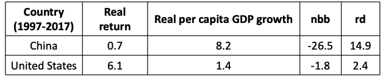
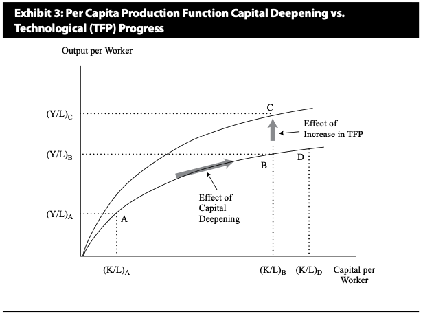
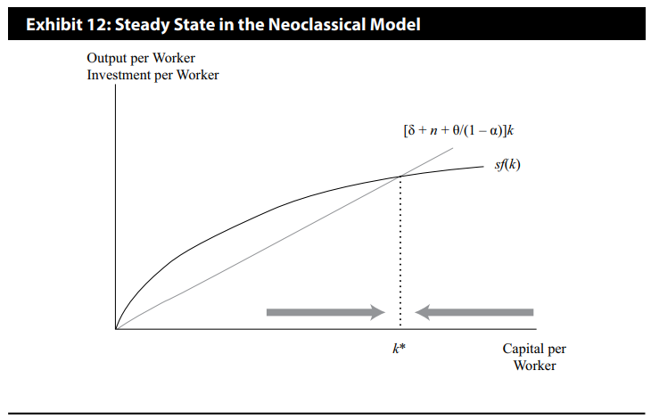
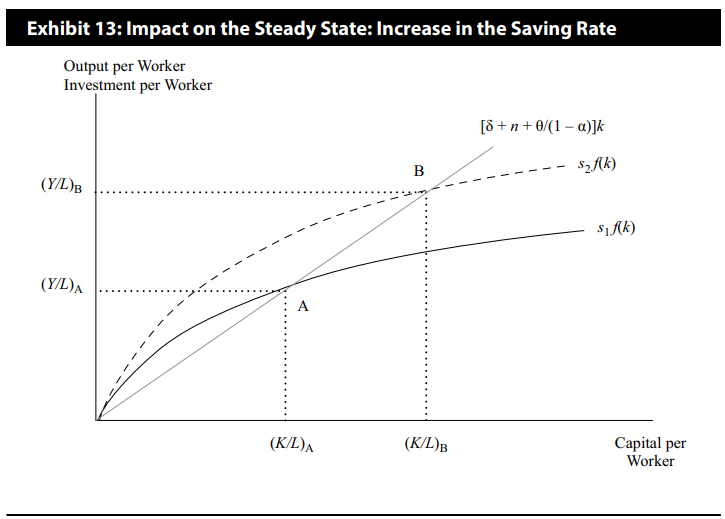
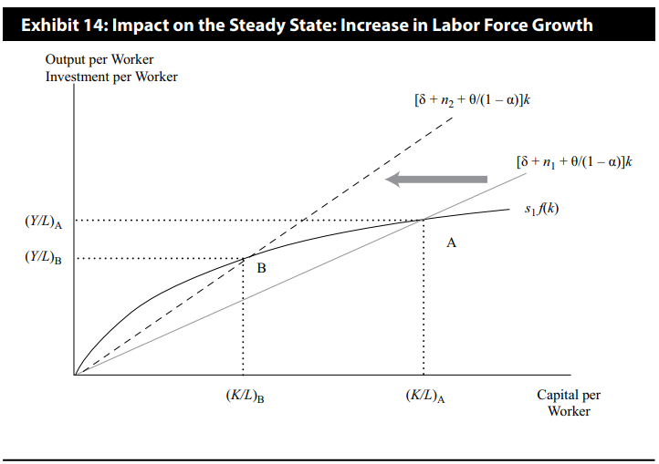
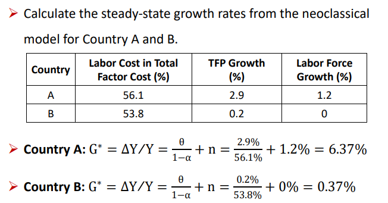
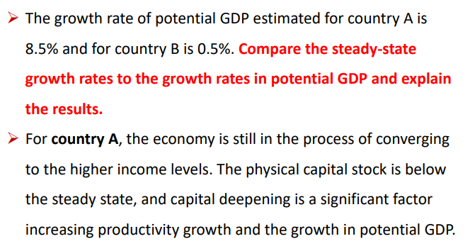
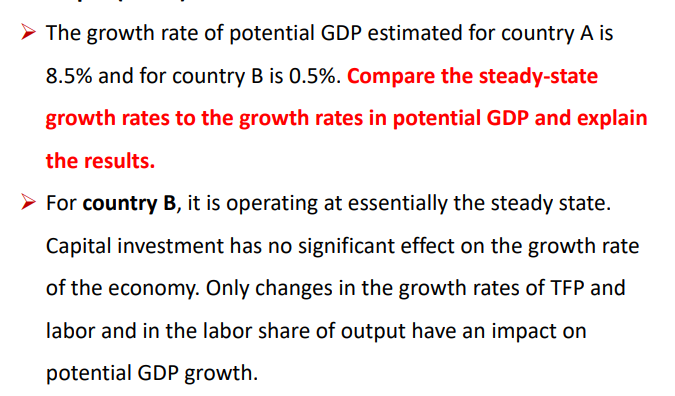
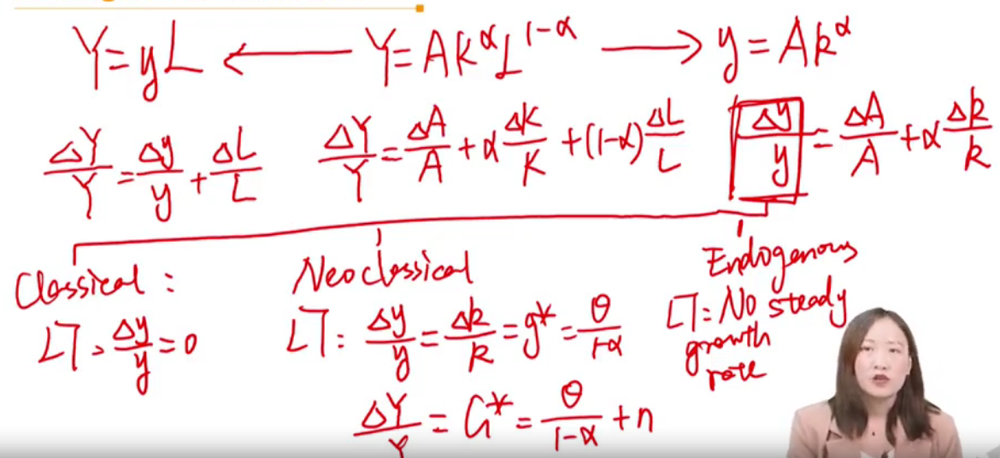
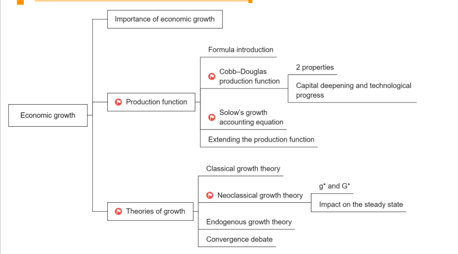

# Economic Growth

three parts:

- importance of economic growth
- production function (\*)
- theories of growth (\*)

## I. The Importance of Economic Growth to Investors

#### Developed vs. developing

- Some of the key institutions and requirements for growth:
  - Savings and investment
  - Financial markets and intermediaries
  - Political stability, rule of law and property rights
  - Education and health care systems
  - Tax and regulatory systems
  - Free trade and unrestricted capital flows

#### Why potential growth matters to equity investors

- Relationship between economic growth and equity return
  - Grinold-Kroner(2002)
- E(Re)
  - = dividend yield + expected capital gain（股价波动百分比$\%\Delta P=\% \Delta EPS+\%\Delta PE$）
  - = dividend yield + expected reprcing + earnings growth per share.   （因为 P = EPS * P/E），expected repricing 是$\%\Delta P/E$
  - = dividend yield + expected repricing + inflation rate + real economic growth + change in shares outstanding
  - = $dy+\Delta(P/E)+i+g+\Delta S$
  - 这里EPS，受到real GDP growth影响，通胀，股数变化（摊薄或者增加单个股东盈利）
  
- $E(R_e)=dy+\Delta (P/E) + i+g+\Delta S$, overtime:
  - $dy$: the dividend yield, **fairly stable** 分红稳定。
  - $\Delta(P/E)$: the expected reprecing term, volatility in the market's P/E ratio over market cycles.
    - 市盈率变化，受到经济周期影响。GDP扩张阶段，企业赚钱，估值高。
  - $i+g+\Delta S$: Earnings growth per share（EPS） can be expressed as a function of inflation, **real economic growth**（real GDP growth rate）, and change in the number of shares traded in the market.
    - 书本上，$\Delta S$  前面是减号，表示的是一种负向关系。比如增发越多，中小非上市公司越多，越抵消掉GDP增速g对Re的正向促进
    - $\Delta S$ = Net buybacks(nbb)+ relative dynamism(rd)
      - net buyback = 回购 - 增发
        - 增发股票导致dilution effect，
          - 增发带来CFF。但投资者期望公司以CFO为主
          - 股数变多，利润被稀释
          - 所以导致$R_e$下降
        - 回购股票
          - 股价低估时，上市公司才回购股票
          - 股数减少，每股盈利增加
          - 回购股票时回馈股东方式
          - 所以$R_e$上升
      - relative dynamism中小非上市公司数量
        - 国家GDP的增量由上市公司+非上市公司构成
        - 如果非上市公司占数量多：
          - GDP和非上市公司相关性大。投资上市公司的Re，与实际GDP增速g，相关性弱，偏离大。
        - 如果非上市公司数量少：
          - GDP主要由上市公司带来，所以投资上市公司的$R_e$，与实际GDP增速g，偏离小，相关性强。
        - The second effect is due to some part of economic growth coming from small- and medium-sized entrepreneurial firms that are not traded publicly on the stock market. The greater this effect, termed the relative dynamism of the economy, *rd*, the greater the divergence between economic growth in the economy as a whole and the earnings growth of companies listed on the stock market.
  - 注意，上面的公式，并不是可以直接相加，而是代表一种Re和其他因素之间的关系。
    - ****
      - China虽然real GDP growth高，但real return 低。
    - Economic growth <u>does not guarantee</u> that existing equity investors capture the new wealth created.
  

#### Why potential growth matters to fixed income investors固收投资者

- Higher rates of potential GDP growth translate into higher real interest rates and higher expected real asset returns in general
- Potential GDP and its growth rate also affect
  - general credit quality of fixed income securities
  - the likelihood of a change in central bank policy
  - credit risk of sovereign debt or government-issued debt
  - the budgetary balance that would exist. 政府财政赤字得到缓解

## II. Production Function

formula introduction

cobb-douglas production function

Solow's growth accounting equation

Extending the production function

### 1. Formula Introduction

$$
Y=AK^{\alpha}L^{1-\alpha}
$$

- A:  total factor productivity(TFP)
- K: capitalestimate of the capital services provided by the stock of equipment and structures used to produce goods and services
- L: labor. quantity of labor or number of workers or hours worked in the economy

$$
y = \frac{Y}{L}=A(\frac{K}{L})^\alpha=Ak^\alpha
$$

- 人均GDP和人均资本投入(k)有关

$$
Y=y\times L
$$

进一步，求GDP增长率，可以使用$\ln$函数（$\ln Y_{n}-\ln {Y_{n-1}}=\ln {(1+(Y_n-Y_{n-1})/Y_{n-1})}\approx 1+ \Delta Y/Y$）
$$
\ln Y=\ln {AK^\alpha L^{1-\alpha}} \\
\frac{\Delta Y}{Y} = \frac{\Delta A}{A} + \alpha \frac{\Delta K}{K} + (1-\alpha) \frac{\Delta L}{L}
$$
similarly, 对于人均GDP的增长率，又有
$$
\frac{\Delta y}{y}=\frac{\Delta A}{A}+\alpha \frac{\Delta k}{k}
$$
另外，对公式（3）也有 
$$
\frac{\Delta Y}{Y} = \frac{\Delta y}{y} + \frac{\Delta L}{L}
$$

### 2. Cobb-Douglas production function \*\*\*

#### Production Function

- Two-factor production function 

$$
Y = AF(K,L)
$$

- **Cobb-Douglas production function**

$$
Y=AK^{\alpha}L^{1-\alpha}
$$

- where A is TFP, $\alpha$ is the share of GDP paid out to the suppliers of *<u>capital</u>*.
  - $\alpha$ 是资本对GDP的贡献 

- How to compute $\alpha$?

  - To maximize profits(Product总产出)， marginal product of capital (MPK) equals to rental price of capital, $r$

    - 这里的思路是marginal revenue = marginal cost(MR = MC)

  - $$
    MPK = \frac{\Delta Y}{\Delta K}=\frac{{\rm d}[AK^{\alpha}K^{1-\alpha}]}{{\rm d}K}=\alpha \frac{Y}{K}=r\\
    \alpha = \frac{rK}{Y}
    $$

  - 上面MPK公式表示投入1单位的K，带来多少Y的增长

- Two important properties:
  - **Constant returns to scale**: increasing all inputs by a fixed percentage leads to the same percentage increase in output. 
    - 规模报酬不变。所有自变量变化相同幅度，和Y变动幅度相同。（复习一级：MES）
  - **Diminishing marginal productivity**: at some point the extra output obtained from each additional unit of the input will decline, keeping the other inputs unchanged.
    - 边际报酬递减。其他自变量不变时，提升一个input，带来的Y的增加会减少（二阶导<0）

- Output per worker or labor productivity

$$
Y/L=(AK^\alpha L^{1-\alpha})/L=A(K/L)^\alpha\\
y = Ak^\alpha
$$

Where y is labor productivity and k is capital-labor ratio.

- A value of $\alpha$ **close to zero** means diminishing marginal returns to capital are very **significant** and the extra output made possible by additional capital declines quickly as capital increases.
  - $\alpha$越小，边际报酬递减的效用就会越明显。（幂函数的性质）

#### Capital deepening vs. technological progress \*\*\*

- 从图中看到提升Y的办法，提高capital per worker, 或者提高A.
  - 提高k，capital deepening，资本深化。不可持续，一阶导数越来越 小。
  - 提高A，科技水平提高。
- 下面内容重要！！考定性题目\*\*\*
- **capital deepening**, an increase in the capital-to-labor ratio, is reflected in the exhibit by a move along(点移) the production function from point A to B.
  - capital-to-labor 就是 $K / L = k$
- From B to D, further addtions to capital have relatively little impact on per capita output. 增加人均资本以提升Y，不可持续
- Economy reaches steady state, where the marginal product of capital equals its marginal cost, capital deepening is useless.
- From B to C, an **improvement in TFP** causes a proportional upward shift in the entire production function.
- 对于发展中国家，提升k，效果明显。发达国家，提升A，发展科技，成为技术密集型。

### 3. Solow's growth accounting equation

- **Solow's growth accounting equation**

$$
\frac{\Delta Y}{Y} = \frac{\Delta A}{A} + \alpha \frac{\Delta K}{K} + (1-\alpha) \frac{\Delta L}{L}
$$

- 
    - growth rate in potential GDP = 
      - long-term growth rate of technology + 
      - $\alpha \times$  long-term growth rate of capital + 
      - $(1-\alpha) \times$ long-term growth rate of labor
    - $\alpha$ is the **elasticity of output with respect to capital**
    
      - alpha的：
    
        - 第一层含义：capital对Y的贡献
        - 第二层含义，Y对capital 的弹性
    - Rate of technological change is not directly measured and must therefore be estimated.
    
      - A无法被直接估计，可以考虑用下面的人均GDP进行计算增速。
- **Labor productivity growth accounting equation**

$$
Y = yL\\
\frac{\Delta Y}{Y} = \frac{\Delta y}{y} + \frac{\Delta L}{L}
$$

- 
  - Growth rate in potential GDP = 
    - long-term growth rate in labor productivity + 
    - long-term growth rate of labor force
  - It avoids the need to estimate the capital input and the difficulty associated with computing total factor productivity.
  
    - 通过这种方法计算GDP增速，避免了计算全要素生产率。

### Summary

- 总产出 $Y$

  - Cobb-Douglas: $Y = AK^\alpha L ^{1-\alpha}$
    - 规模报酬不变，边际效益递减
  - $Y = yL$

- 人均产出 $y$

  - $y=Y / L=Ak^\alpha$
    - 增加y有两个方式：
      - capital deepening （早期有效，不可持续）
      - improvement of TFP，发展科技

- GDP总量增速 $\Delta Y$

  - Solow's growth model
    - $\frac{\Delta Y}{Y} = \frac{\Delta A}{A} + \alpha \frac{\Delta K}{K} + (1-\alpha) \frac{\Delta L}{L}$
      - 一个问题是$\Delta A/A$难以估计，所以也可以用：

  - **$\frac{\Delta Y}{Y} = \frac{\Delta y}{y} + \frac{\Delta L}{L}$**

### 4. Extending the production function

#### Extending the production function

- A more complete specification of the production function expands the list of inputs to include the following:

$$
Y=AF(N, L, H, K_{IT}, K_{NT},K_P)
$$

- $N$: raw materials
- $K_{IT}$: ICT capital
- $L$: Quantity of labor
- $H$: Human capital
- $A$: Technological knowledge
- $K_{NT}$: Non-ICT capital
- $K_P$: Public capital

#### Extensions - natural resources

- Natural resources includes renewable resources and non-renewable resources.
- Ownership and production of natural resources is not necessary for a country to achieve a high level of income.
  - 比如中东很多国家有石油，但还是发展中国家；非洲有矿产等。
- **Dutch disease**: where currency appreciation driven by strong export demand for resources makes other segments of the economy, in particular manufacturing, globally uncompetitive. 荷兰病。
  - e.g., 壳牌。荷兰天然气产业发展，把其他产业挤出国家。荷兰盾升值，导致其他货品价格变贵，抑制了其他产业的出口。

#### Extensions - Labor Supply

- 劳动力**数量**
- Growth in the labor input depends on :
  - Population growth(fertility and mortality rates, the age mix of the population) 出生率，死亡率，年龄结构
  - Labor force participation 
    - 劳动参与率：labor force / working age population
  - Net immigration 移民
  - Average hours worked 工作时常

#### Extensions - Human capital

- 劳动率**质量**

- Human capital is the accumulated knowledge and skills that workers acquire from education, training, or life experience.
- Education may have a spillover or externalities impact.
  - 溢出效应。教育对其他变量产生影响，比如科技。
- Education encourages growth through innovation

#### Extensions - ICT and non-ICT capital

- Although diminishing marginal productivity will eventually limit the impact of capital deepening, investment-driven growth may last for a considerable period of time. 发展早期，资本投入是有用的capital deepening
- Impact of investment spending on available capital depends on the existing physical capital stock. 发展国家阶段，资本深入效果不明显。
- The composition of investment spending and the stock of physical capital matters for growth and productivity. 

- Capital spending can be separated as :
  - **ICT investment**: spending on information, computers, and telecommunications equipment. 半导体，芯片等
    - Network externalities: the more people in the network, the greater the potential productivity gains. （spillover效应）
  - **Non-ICT investment**: includes non-residential construction（非住宅建设，比如酒店，汽车旅馆等）, transport equipment, and machinery.

#### Extensions - Technology

- Technology allows an economy to overcome limits imposed by diminishing marginal returns and results in an upward shift in the production function.
- Technological change can be embodied in human capital and ICT and non-ICT capital, hence investments are important.

#### Extensions - Public infrastructure 

- 政府基建

- Roads, bridges, municipal water, dams, and, in some countries, electric grids are all examples of public capital.
- As with R&D spending, the full impact of government infrastructure investment may extend well beyond the direct benefits of the projects because improvements in the economy's infrastructure generally boost the productivity of private investments.
  - 比如高铁本身可能不赚钱，但是可以给其他行业等带来促进作用。

## III. Theories of growth

3个增长理论，研究人均gdp增速是多少$\Delta y/y$

### 1. Classical growth theory

#### Classical Growth theory (by Thomas Malthus) 马尔萨斯人口论

- The key assumption underlying the classical model is that population growth accelerates when the level of per capita income rises above the subsistence income, which is the minimum income needed to maintain life.
- Technological advances -> labor productivity up -> higher population growth -> diminishing marginal returns of labor -> per capita income down
  - Y收入增加，出生率上升，L增加，边际效应递减，Y增长变缓，导致人均收入下降
- 结论：
- The classical model predicts that in the long run, the adoption of new technology results in a larger but not richer population. 技术增长使得人更多，并不是使得人更富有
- Thus, the standard of living is constant over time even with technological progress, and there is **no growth in per capita output**.
  - $\Delta y/y \approx 0$

### 2. Neoclassical growth theory \*\*\* 🚩

- 新古典增长理论，重要

#### Neoclassical growth theory (by Robert Solow)

- The objective of the neoclassical growth model is to determine **the long-run growth rate of output per capita**($\Delta y/ y$) and relate it to 人均GDP增速和下面三个变量的关系
  - savings/investment rate $s$
  - rate of technological change $\theta$
  - population growth $n$
- Attempt to find the <u>equilibrium position</u>（长期稳态） toward which the economy will move.
  - 人均GDP增速$g^*$ and GDP总量增速 $G^*$
- This equilibrium is the balanced or **steady-state rate of growth** that occurs when the output-to-capital ratio($Y/K$) is constant. Growth is balanced in the sense that capital per worker and output per worker grow at the same rate($g^*$). Assuming that $\theta$ is the growth rate of TFP:
- $Y/K$是常数，所以$\frac{Y/L}{K/L}=y/k$ 是常数，所以y和k变化百分比一样，所以$\Delta y/y=\Delta k / k$

$$
y=Ak^\alpha\implies \Delta y/y=\Delta A/A+\alpha \Delta k/k\\
\Delta y/y=\Delta k/k \implies \Delta k/k = \Delta A / A + \alpha \Delta k/k\\
g^*=\Delta y/y=\Delta k/k=\frac{\Delta A/A}{1-\alpha}=\frac{\theta}{1-\alpha}
$$

- 上面$1-\alpha$是劳动力对GDP贡献的比例。
- Sustainable growth rate of output($G^*$) is equal to the sustainable growth rate of output per capita, plus the growth of labor.
- Assuming $n$ is the growth rate of labor:

$$
Y=yL\implies \Delta Y/Y=\Delta y/y+\Delta L/L\\
G^*=\Delta Y/Y=\frac{\theta}{1-\alpha}+\Delta L/L=\frac{\theta}{1-\alpha}+n
$$

- In closed economy, investment must be funded by domestic saving: $I=sY$,
  - $s$ is the fraction of income $Y$ that is saved. 储蓄比例
  - Physical capital stock depreciates at a constant rate $\delta$ 折旧
    - 新投资的$\Delta K=sY-\delta K$

$$
k= K / L\\
\frac{\Delta k}{k}=\frac{\Delta K}{K}-\frac{\Delta L}{L}\\
\frac{\Delta k}{k}=\frac{sY - sK}{K}-\frac{\Delta L}{L}\\
\frac{\Delta k}{k}=s\frac{Y}{K}-\delta - n = \frac{\theta}{1-\alpha}
$$

- In the steady state, the output-to-capital ratio is constant$\Psi$.

$$
Y/K=\frac{1}{s}[\frac{\theta}{1-\alpha}+\delta+n]\equiv\Psi
$$

- 回忆：
  - marginal product of capital
  - $MPK = r$
  - $MPK = \alpha Y / K$, 所以MPK也是常数. 注意，**是长期稳态下**。
- Reform，左边上下除以$L$，得到, $sy=[\frac{\theta}{1-\alpha}+\delta+n]k$
  - 人均储蓄率$s$, $y$ 人均收入，所以$sy$是人均投资的钱
- Steady state equilibrium occurs at the point where savings and actual gross investment per worker ($sy$) are sufficient to 
  - Provide capital for new workers entering the workforce at rate $n$
    - 新增劳动力匹配的固定资产
  - Replace plant and equipment wearing out at rate $\delta$
    - 折旧
  - Deepen the physical capital stock at the rate $\theta/(1-\alpha)$​
    - 新的资本投入
- 上面的讨论，主要围绕的是在哪一个$k$, $y$，可以达到长期稳态的均衡点$g^*$, $G^*$，下面探讨$k$和$y$的关系，找到稳态点

- **Steady state in the Neoclassical model**

- Impact on the steady state: **Increase in the saving rate**
  - 直线不动，$sf(k)$​上移，新稳态点在B
  - 注意，$0\le s \le 1$, 稳态点不能无限上升
  - 储蓄率$s$增加
    - 均衡状态下，人均资本投入$k$增加，导致高投资，导致高人均产出$y$
    - 均衡状态下，$\Delta k/k$和$\Delta y/y$，增速不变，因为$\theta / (1-\alpha)$与$s$无关

- Impact on the steady state: **Increase in labor force growth**

- **Implications of the model** \*\*\*重要

  - Capital accumulation 资本深化

    - <u>**Capital accumulation affects the level of output but not the growth rate in the long run**.</u>

      - 只可以影响GDP，但是长期的GDP增速和资本投入没有关系。

    - Regardless of its initial capital-to-labor ratio($k$) or initial level of productivity($y$), a growing economy will move to a point of steady-state growth.

    - In a steady state, the growth rate of output equals

      - $$
        n+\theta/(1-\alpha)
        $$

  - Capital deepening vs. technology

    - Rapid growth that is above the steady-state rate occurs when countries first begin to accumulate capital; but growth will slow as the process of accumulation continues. 一开始的资本深化，会带来更高的GDP短期增速。
    - Because of diminishing marginal returns to capital, **<u>the only way to sustain growth in potential GDP per capita is through technological change or growth in total factor productivity.</u>**
      - 因为边际效应递减，持续的增速，只能通过科技，或者TFP改善。

  - Effect of savings on growth $s$

    - The initial impact of a higher saving rate($s$增加) is to <u>**temporarily**</u> （短期）raise the rate of growth in the economy. The economy moves to a higher level of per capita output. （short-term可以增加growth rate）
    - Once an economy achieves steady-state growth, the growth rate does not depend on the percentage of income saved or invested. **<u>Higher savings cannot permanently raise the growth rate of input.</u>**， （long-term时候，达到稳态，增速和$s$没有关系）

- Examples, refer to textnotes

- 预测值和稳态值的对比

### 3. Endogenous growth theory

#### Endogenous growth theory 内生增长理论

- Unlike the neoclassical model, there are no diminishing marginal returns to capital for the economy as a whole in the endogenous growth models.
  - 结论1：资本投入，没有边际递减效应。
- Capital accumulation is the main factor accounting for long-run growth.
  - 结论2：资本深化效果明显，对长期增长有用。
- R&D expenditures have potentially large positive externalities or spillover effects.
  - 结论3：研发投入可以提高科技水平。
- **In the endogenous growth model, the economy does not reach a steady growth rate.**
  - 结论4：经济体不会达到稳定增长率。
- Instead, saving and investment decisions can generate self-sustaining growth at a permanently higher rate.
  - 结论5：储蓄对GDP越多，投资越多，capital deepening 越多，使得GDP增速提高。
- **A higher saving rate($s$) implies a permanently higher growth rate.**
  - $s$ 提高GDP增速。和古典增长理论不一样。

### 4. Convergence debate 趋同

#### Convergence debate

- **Absolute convergence（绝对趋同）**: developing countries, regardless of their particular characteristic, will eventually catch up with the developed countries and match them in per capita output. 人均GDP，发展和发展中国家的$y$趋同
  - The neoclassical model assumes that all countries have access to the same technology, this implies **<u>convergence of per capita growth rates</u>** among all countries.
    - 新古典理论里，增速趋同($\Delta y/y$)
  - The neoclassical model does not imply absolute convergence
- **Conditional convergence**: convergence is conditional on the countries having the same saving rate($s$), population growth rate($n$), and production function$f(K,L)$.
  - If these conditions hold, the neoclassical model implies convergence to the same level of per capita output($y$) and the same steady state growth rate($\Delta y/y=g^*$).
- **Club convergence（俱乐部趋同）**: only rich and middle-income countries that are members of the club are converging to the income level of the richest countries in the world. 
  - Club里面可以趋同，但是跨越Club比较难。
- Poor countries can join the club if they make appropriate **institutional changes**.
  - 制度/组织改革
- Countries may fall into a **non-convergence trap** if they do not implement necessary institutional reforms.
  - 如果不改革，陷入non-convergence trap陷阱。
- If convergence, and especially club convergence, does occur, investing in countries with lower per capita incomes that are members of the club should, over long periods, provide a higher rate of return than investing in higher-income countries.
  - 如果趋同真实存在并且发生，投资人均GDP低的国家有高回报（$y$）.
- Convergence between developed and developing countries can occur in two ways:
  - Convergence through capital accumulation and capital deepening. 资本积累和资本深化
  - Convergence through imitating or adopting technology from developed countries. 
- In contrast to the neoclassical model, the endogenous growth model makes **no prediction** that convergence should occur.
  - 内生增长认为趋同不会发生。
- The endogenous growth model allows for countries that start with high per capita income and more capital to grow faster and stay ahead of the developing countries.

### Growth in an Open Economy

- 前面的理论，经济体都假设是closed economy

#### Overview

- **Opening up the economy can affect growth rate** becasue:
  - A country can borrow or lend funds in global markets.
  - Countries can shift resources into industries in which they have a comparative advantage.
  - Companies have access to a larger, global market for their products.
  - Countries can import technology.
  - Global trade increases competition in the domestic market.

#### Extension of the Neoclassical model

- According to the neoclassical model, convergence should occur more quickly if economies are open and there is free trade and international borrowing and lending.
  - 新古典模型下，open economy下，趋同更快实现。

#### Extension of the endogenous model

- In contrast to the neoclassical model, endogenous growth models predict that a more open trade policy will permanently raise the rate of economic growth.
  - 内生模型下，open economy下，GDP增速更快

### Summary of Economic Growth

$$
Y=AK^\alpha L^{1-\alpha}
$$

