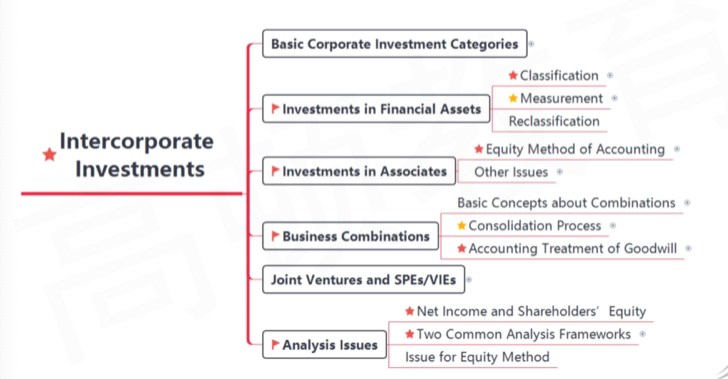

# Intercorporate Investment \*\*\*

most important

- Basic Corporate investment categories
  - A 投资 B
- **Investments in Financial Assets 金融资产**
- **Investments in Associates 长期股权， 联营**
- **Business Combinations  合并**
- Joint Ventures And SPES/ VIES
- Analysis Issues

