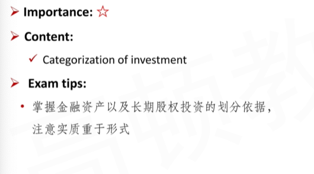

# Basic Corporate Investment Categories

- Classification, investment in :
  - financial assets
  - associates
  - joint ventures
  - combination
  - special purpose and vairable interest entities

#### Categorization of Investment

- **投资分类**：
  - 债权
    - 金融资产
      - “交易性金融资产”（FVPL）
      - ”债权投资“(AMC)
      - “其他债权投资”（FVOCI）
  - 股权
    - 金融资产（小打小闹）
      - ”交易性金融资产“(FVPL)
      - “其他权益工具投资”，（一般是OCI，影响利润表的是dividend）(designated FVOCI)
    - "长期股权投资"
      - 对联营企业投资，比如控制30%股票，可以施加重大影响
      - 对合营企业投资，共同控制（50%）
      - 对子公司投资

- 上面的FVPL, FVOCI是分类，双引号里的是会计科目(报表项目)

- Investments in marketable debt and equity securities can be categorized as
  - 1. **Investments in financial assets**, in which the investor has **<u>no significant influence and control</u>** over the operations of the investee
    2. **Investments in associates**（联营企业投资）, in which the investor can **<u>exert significant influence(but not control)</u>** over the investee. 
    3. **Joint ventures**（合营企业投资）, where <u>**control is shared**</u> by two or more entities.
    4. **Business combinations**, including **investments in subsidiaries**, in which the investor <u>**obtains a controlling interest**</u> over the investee. 企业合并，子公司投资。

- 具体如何判断：
- **Percentage of ownership** is typically used to determine the appropriate category
  - **Lack of influence** is generally presumed when the investor holds **less than a 20%** equity interest
  - **Significant influence** is generally presumed **between 20% and 50%**.
  - **Control** is presumed when the percentage of ownership **exceeds 50%**
- The distinction between investments in financial assets, investments in associates, and business combinations is based on **the degree of influence or control**, **rather than** purely on the percent holding
  - The ownership percentage is only a guideline. 实质重于形式
    - 比如investor持有19%股权（小于20），但是其他股东都是小股东，也可以施加重大影响，甚至控制公司。
    - 比如investor持有了40%股份（大于20），但是其他股东是同一阵营，导致investor不能施加影响

|                            | Financial Assets         | Associates            | Joint Ventures | Business Combination |
| -------------------------- | ------------------------ | --------------------- | -------------- | -------------------- |
| **Degree of Influence**    | no significant influence | significant influence | shared control | control              |
| **Percentage of Interest** | $<20\%$                  | $20\%-50\%$           | varies         | $>50\%$              |
| **Term of Investee**       |                          | associate             |                | subsidiary           |
| **Accounting Treatment**   | AMC/FVOCI/FVPL           | Equity Method         | Equity  Method | Acquisition Method   |

- 也就是，股权占比，影响程度不同，会计处理方法不一样
- joint ventures 的varies，指的是根据实质判断，股权比例仅供参考。
- 拓展：对于企业收购，还有一个分类是是否处于同一控制
  - 比如A购买70%B股权
    - 如果A和B同属C控制，则称A合并方，B被合并方
    - 如果非同一控制，A受到C控制，B受到D控制，则A为收购方，B为被收购方

#### Summary

