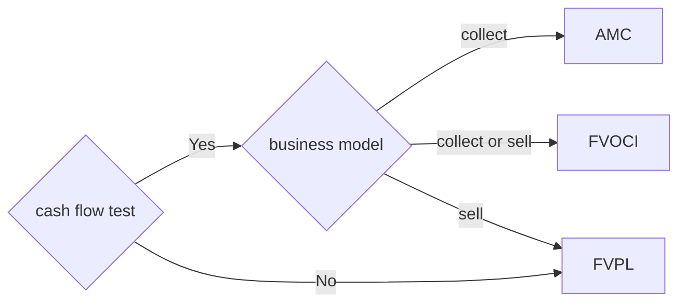
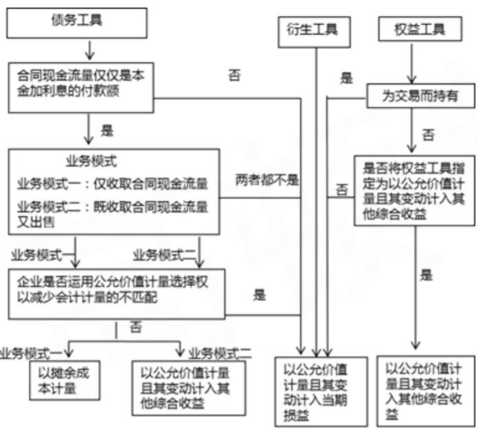
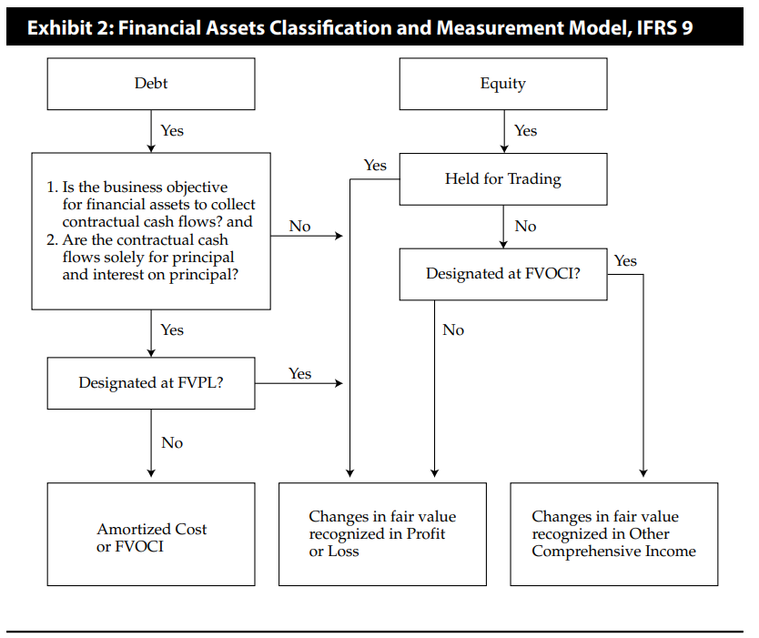
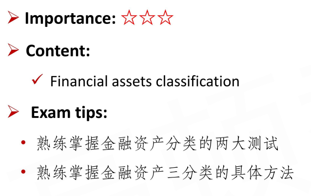
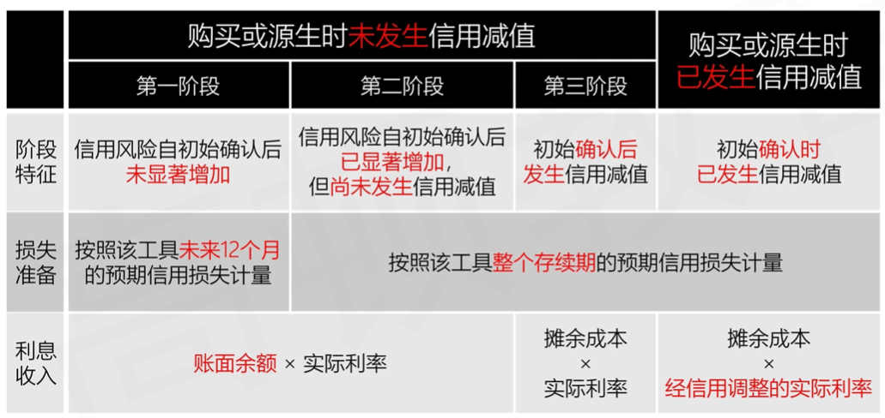
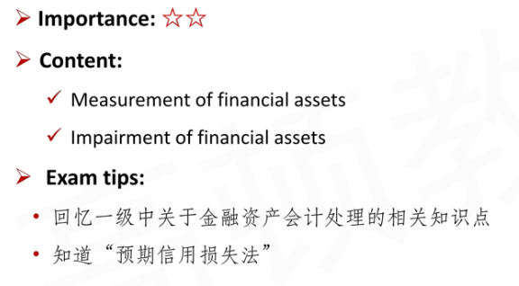
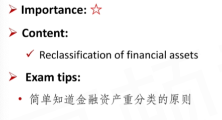

# Investments in Financial Assets

Classification\* 金融资产三分类

Measurement

Reclassification

### 1. Classification of Financial Assets

#### Background Information

- Both IASB and FASB developed **revised standards** for financial investments

1. The portfolio approach of the previous standard(i.e., designation of held for trading, available-for-sale, and held-to-maturity) is **no longer appropriate**, and the terms "available-for-sale" and "held-to-maturity" **no longer appear** in IFRS 9.(国际第九号准则)
2. Another key change relates to the approach to **loan impairment**

- **Important Tips**
  - Classification is required under current CFA LOS
  - You may find the measurement of financial instruments is "just the same" as what we have learnt the level 1 (which is introduced in outdated criteria), but the truth is more cruel
    - 计量方法是差不多的， 只是分类上有修改
    - This is not bad news for the CFA exam

#### Two Criteria for financial assets classification

1. **Cash flow characteristic test**现金流量特征测试 （客观）
   - Whether the contractual cash flows are solely payments of principal and interest on principal
   - 通过了现金流量测试：
     - 合同现金流量：本金支付，未偿还本金产生的利息的支付
2. **Business model test**业务模式测试 （主观）
   - A business model refers to how an entity manages its financial assets in order to generate cash flows - by <u>collecting contractual cash flows</u>, <u>selling financial assets</u>, or <u>both</u>.
   - 三个业务模式：
     - 收取合同现金流
     - 出售金融资产
     - 两者都有

#### Financial Asset Classification : Basic Principles

1. Financial assets that **<u>meet the following two criteria</u>** are generally measured at **amortized cost(AMC，以摊余成本计量)**
   1. The contractual cash flows are solely payments of principal and interest on principal（通过cash flow characteristic test）
   2. The financial assets are being held to collect contractual cash flows. (model test is collecting contractual cash flows)
2. If the financial asset **<u>meets the first criteria above</u>**(cash flow characteristic test), but may be sold, a "hold-to-collect and sell" business model, it may be measured at **fair value through comprehensive income(FVOCI)**

3. **<u>All other remaining financial assets</u>** are classified into **fair value through profit or loss(FVPL)**

- 这里要注意，这里只是分类，并不是会计科目。比如
  - AMC的会计科目有“应收账款”，“贷款”
  - FVOCI: 其他债权投资、应收款项融资（应收账款可以出售）
  - FVPL: 交易性金融资产，其他非流动性金融资产

#### Financial Asset Classification: Supplement

- **Designed as fair value through profit or loss(designated as FVPL)** （designated: 指定为，意思是下面的情况强行指定FVPL）
  - 结论1：债权投资时，才有可能归类为 designated FVPL
  - Management may chosse "**<u>FVPL option</u>**" to **<u>avoid an accounting mismatch</u>**（避免会计错配）, which refers to an inconsistency resulting from different measurement bases for assets and liabilities.
    - 延申：金融负债也有分类。为了使得金融资产和金融负债匹配，强行指定为FVPL
- **Designated as fair value through other comprehensive income(desingnated as FVOCI)**
  - Management may designate **<u>non-tradable equity investment</u>** as measured at FVOCI
    - 买了股票，但是non-tradable
  - 对于会计处理
    - **Only** the **<u>dividend income</u>** is recognized in profit or loss（I/S）
    - 其他影响OCI，最后直接转入AOCI
- 注意，上面两个designated不可撤销，一但指定不可改变。
- Notice:
  - **<u>Derivatives</u>** are measured at **FVPL**(except for hedging instruments)
  - <u>Embedded derivatives</u> are not separated from the hybrid contract if the asset falls within the scope of this standard, and the **<u>asset as a whole</u>** is measured at **FVPL**.
    - 比如可转债，内嵌option

#### Financial Assets Classification

- **Debt instruments** are measured at amortized cost, FVOCI, or FVPL **<u>depending upon the business model</u>**
- **Equity instruments** are measured at FVPL, or FVOCI.
  - Equity investments held-for-trading must be measured  at FVPL. Other equity investments can be measured at FVPL or FVOCI;

- flowchart from textbook

#### Summary

### 2. Measurement of Financial Assets

- **Mr. Chen's very important tips**
  - Recall what we have learnt in CFA Level 1
  - There are **no new requirements** for CFA Level 2
  - But, you must realize that the practical accounting process will be more complex.
- **All financial assets** are measured at **<u>fair value</u>** when initially acquired(which will generally be equal to the cost basis on the date of acquisition)
  - AMC, FVPL, FVOCI在期初的时候，都以Fair value计量。
- Subsequently, financial assets are measured at **<u>either fair value or amortized cost</u>**

复习：

- Realized G/L:
  - dividend
  - interest revenue = amt \* interest rate
    -  (notice: coupon is not realized G/L but real cash flow)
  - capital gain，买卖股票的盈亏
- unrealized G/L
  - 未买卖时的浮盈浮亏

#### Equity Investment measurement

- equity: FVPL, designated FVOCI
- suppose:
  - t=0, buy 10 shares @ \$10
  - t=1, receive \$1 per share dividend
  - t=2, sell 4 shares @ \$12
- notice: 
  - In practical, when equity is designated FVOCI, the equity itself is "non-tradable". In this example, the selling procedure is for practice and a showcase for measurement of FVOCI.
  - FVPL/FVOCI is a category of accounting, not an account in real balance sheet. In the following example, the item "FVPL" or "FVOCI" should be specific accounting account more specifically, like "trading securities".
  - In FVOCI, when shares are sell, the change of AOCI is directly transfered to RE, and leave the I/S sheet unaffected.

##### FVPL

|        | t=0  | t=1  | t=2     |      | t=0  | t=1  | t=2  |
| ------ | ---- | ---- | ------- | ---- | ---- | ---- | ---- |
| cash   | -100 | +10  | ;+48    |      |      |      |      |
| "FVPL" | +100 |      | +20;-48 | RE   |      | +10  | +20  |

- In t=2, two procedures are processed. First, suppose no share is sold, and the price change bring about profit and loss. Second, sell the share and match the asset account cash and FVPL.

##### FVOCI

|       | t=0  | t=1  | t=2     |      | t=0  | t=1  | t=2    |
| ----- | ---- | ---- | ------- | ---- | ---- | ---- | ------ |
| cash  | -100 | +10  | +48     |      |      |      |        |
| FVOCI | +100 |      | +20;-48 |      |      |      |        |
|       |      |      |         | RE   |      | +10  | ;+8    |
|       |      |      |         | AOCI |      |      | +20;-8 |

- In equity designated FVOCI, only received dividend affects I/S.
- In t=2, when stocks are sold, the corresponding AOCI(8 here, $4 / 10 \times 20$) are directly transfered to RE in B/S, and I/S is **not affected.**

#### Bond Investment measurement

TODO

- Suppose:
  - t=0, buy a bond @\$951.96, 3y, 10% coupon rate, par value = \$1000.
  - the fair value of the bond:
    - t=0, FV=951.96
    - t=1, 980
    - t=2, 999
    - t=3, 1000

- **AMC**

- **FVOCI**

- amortized cost is not fair value. when calculating interest revenue, always use amortized cost but not fair value!

- **FVPL**

#### Impairment of Financial Assets

对于金融工具，分为金融资产和金融负债。金融资产分为AMC, FVOCI, FVPL。FVPL不涉及减值。股权投资和债权投资都可以分类为AMC/FVOCI，但是股权投资不涉及减值（designated FVOCI不需要减值），只有债权投资（AMC/FVOCI）需要减值。

- According to IFRS 9, there is a redesign of the provisioning models for financial assets, contract assets（合同资产）, lease receivables（应收租赁）, financial guarantees and loan commitments.
  - 适合减值的四个：金融资产、合同资产、应收租赁、部分金融负债（贷款承诺）

- The new standard moves the recognition criteria from an "incurred loss" model to an "**expected loss**" **model** 预期信用损失模型（这里体现了谨慎性原则）
  - Under the new criteria, there is an earlier recognition of impairment: **<u>12-month expected losses</u>** for **<u>performing</u>** assets and **<u>life-time expected losses</u>** for **<u>non-performing</u>** assets, to be captured upfront.
    - 提前确认损失：
      - performing asset: 12个月内的预期损失
      - non-performing asset: 整个存续期内的预期损失
        - Performing Asset means an asset for which all due payments are made on time and the cash flow is sufficient or benefits from reserve funds.

##### Supplement

- AMC impairment，Book Value is N, 计提减值准备 X
  - AMC ，计提备抵账户减少X 
  - 在I/S中，信用损失expected loss X
  - RE: -X
- FVOCI: the fair value drop K, 计提减值准备X
  - 第一步：RE -X, AOIC +X，I/S中exptected loss X。注意AOCI的处理
  - 第二步：FVOCI -K, AOIC -K
  - 所以对于FVOCI的减值，可以认为减值拆成了两部分，一部分是市场价格变动带来的(X-K)，另一部分是信用损失减值 -X

- 最后一行，实际利率。账面余额大于摊余成本，实际利率大于调整的实际利率
  - 摊余成本=账面余额减去减值的备抵账户

#### Summary

### 3. Reclassification of Financial Assets

- Describe，重新对金融资产进行分类
  - 一经designated(FVPL/FVOCI)，不能撤销。

- Under IFRS 9, the **<u>reclassification of equity</u>** instruments is **<u>not permitted</u>**. 股权投资，不允许重分类
  - An entity's equity intitial classification of FVPL and FVOCI is **<u>irrevocable</u>**
- **Reclassification of debt instruments** is only permitted if the **<u>business model</u>** for the financial assets(objective for holding the financial assets) has changed in a way that significantly affects operations. 只考虑债权的业务模式重大改变带来的重分类。（因为现金流量测试是客观测试）
  - Changes to the business model will require judgment and are expected to be very **<u>infrequent</u>**
- When reclassifcation is deemed appropriate, there is **<u>no restatement</u>** of prior periods at the **<u>reclassification date</u>**.
  - reclassifcation date:重分类日，业务模式变更的下一个会计周期的起始日。
  - 以从重分类日为界限，**不追溯调整。**

##### Extension 拓展，参考课件

- AMC->FVPL
  - 重分类日计量
  - Book value和Fair value之间的差额，计入Profit and loss
  - 结转已有的损失准备（备抵账户）。这里意思是备抵账户清零，比如原来备抵账户-50，结转：备抵账户-50+50，RE: +50
  - 注意，不追溯调整，之前的利润不能动
- AMC->FVOCI
  - 在重分类日计量
  - BV和FV差额，计入AOCI
  - 原来的备抵账户结转到AOCI
  - 不影响实际利率以及exptected loss
- FVOCI->AMC
  - AOCI 转出
  - 调整FV
- FVOCI->FVPL
  - 继续FV计量
  - AOCI转出到RE，经过利润表

- FVPL->AMC
  - 按照重分类日FV作为新BV，有变动的计入RE
  - 重分类日确定实际利率
  - 补提减值准备

- FVPL->FVOCI
  - 继续FV计量，公允价值变动计入RE
  - 重分类日确定实际利率
  - 补提减值准备

#### Summary

