# Investment in Associates \*\*\*

联营企业

## I. Equity Method of Accouting \*\*\*

### **1. Basic Principles of Equity Method \*\*\***

#### Investment in Associates

- Under ==both IFRS and US GAAP==, when a company(**investor**) holds 20% to 50% of the voting rights of an **associate(investee)**, **<u>either directly or indirectly</u>**(i.e., through subsidiaries，通过子公司间接持有), it is presumed that the company has (or can exercise) **<u>significant influence</u>**, but **<u>not control</u>**, over the investee's business activities. （回顾：实质重于形式）
  - The determination of significant influence ***==under IFRS==*** also **<u>includes</u>** <u>currently</u> exercisable or convertible warrants, call options, or convertible securities that the investor owns. 
    - 判断重大影响，需要考虑currently(一年内)的其他含股的权证，如可转债等。注意，这里只是determination of significant influence，实际计量的时候，持股比例按照真实比例，不把含权证券的“假设”的持股比例考虑在内。
  - ***==Under US GAAP==***, the determination of an investor's voting stock interest is based **<u>only</u>** on the voting shares outstanding at the time of the purchase.

#### Evidences of Significant Influence

- The ability to exert significant influence means that the financial and operating performance of the investee is <u>**partly influenced by**</u> management decisions and operational skills of the investor.
  - 这里的partly，是相对于fully influenced而言。和公司合并报表相对应。
- The accounting standards note that significant influence may be evidenced by:
  - Representation on the board of directors
  - Participation in the policy-making process
  - Material transactions between the investor and the investee
  - Interchange of managerial personnel 管理人员交流
  - Technological dependency

#### Equity Method: One-line consolidation

单项合并。一般的企业报表合并，是line-by-line形式，逐项合并。这里并没有达到完全控制，只是significant influence，所以只需要浓缩合并一个项目。

- The **equity method** is often refereed to as "**<u>one-line consolidation</u>**" 
  - The ==**investor's proportionate ownership interest in the net assets of the investee**== is disclosed as a single line item(**equity investment in associate**) on its balance sheet. BS：长期股权投资
    - 注意，这里指的是proportionate，占的份额。具体后面阐述，需要BV变FV，去除不可辨认资产。
    - "Equity investments" are classified as **<u>non-current assets</u>** on the balance sheet(B/S).
  - The investor's share of the revenues and expenses of the investee is disclosed as **<u>a single line item</u>**(**equity income in associate**) on its income statement(I/S). I/S：投资收益，放在operating income之后。
    - "Equity income" is usually **<u>separated from operating income</u>**.

#### Basic principles of Equity Method Accouting

- Under the equity method of accounting, the equity investment is initially recorded on the investor's balance sheet **at cost**. 期初，按成本计量入账。
- In subsequent periods, the carrying amount of the investment is adjusted to recognize the investor's **proportionate share of the investee's earnings or losses**, and these earnings or losses are **<u>reported in income</u>**.
  - 按比例确认损益。BS，长期股权投资+X，IS，投资收益+X.
  - **<u>Dividends</u>** or other distributions received from the investee are treated as a return of capital and **<u>reduce the carrying amount of the investment</u>** and are **<u>not reported in the investor's profit or loss</u>**. 
    - 被投资企业分红，投资者利润表没有变动，RE不动，长期股权投资减少。
  
  - A占股$\alpha \%$ B，B盈利X，现金分红Y，则：
    - A的BS：cash $+\alpha Y$, equity investment $+(X-Y)\alpha$，RE $+X\alpha$
    - A的IS：investment income $+X\alpha$
  
  - Why:
    - equity method权益法，指的是报表反应所有者权益。分红导致所有者权益变少，相当于退款。对比控制企业的成本法：dividend计入RE，相当于投资收益；对于investee的net income，investor不做处理
    - 所以，分析报表的时候，要注意报表里是否存在equity investment，会导致盈利偏高。因为investee赚了钱，只在investor报表里体现，并不一定会分红。
  

#### Example

- BY purchases a 30% interest in SY for \$100 on 1 Jan Year 1.

- SY reports income and divideds as follows:

  - Y1: NI:30, Dividend: 10

- BY Balance sheet:

  - |                   | t=0  | t=1  |      | t=0  | t=1  |
    | ----------------- | ---- | ---- | ---- | ---- | ---- |
    | cash              | -100 | +3   |      |      |      |
    | equity investment | +100 | +9-3 |      |      |      |
    |                   |      |      | RE   |      | +9   |

#### Losses from Associates 亏钱情况

- The recorded investment value can **decline** as a result of investee losses.
- If the investment value is reduced to zero, the investor usually **<u>discontinues</u>** the equity method and **<u>does not</u>** record further losses.
  - 长期股权投资，不能小于0. 注意，这时候，RE也确认和长投相同的变动金额，剩余的放在备查簿。
  - If the investee subsequently reports profits, the equity method is resumed after the investor's share of the profits equals the share of losses not recognized during the suspension of the equity method.
  - 把超额的损失，记在**备查簿**，下次盈利的时候，先抵扣备查簿。

#### Supplement

- 亏损确认顺序。后面investee盈利后，再逆向确认。
  - 长投BV
  - 对investee的权益项目（应收账款等）
  - 承担额外损失义务（在liability确认）
  - 账外备查（备查簿）
- 对于投资成本的确认
  - 初始投资成本：真金白银投了多少钱X
  - 被投资单位可辨认净资产的公允价值份额：投资的investee的可辨认资产（不包括商誉）的FV的对应份额（投资比例）K
    - 如果X >K，买贵了，按照X确认长投BV
    - 如果X<K，买便宜了，按照K确认长投，并且确认一笔Revenue，计入RE: + (K-X)
- 权益法下，investee的AOCI也变动的情况
  - investee的AOCI发生变动，也会影响investor的长投和AOCI也发生变动相应的份额。
- 除了RE、AOCI、Dividend导致的Equity变动
  - 调整investor的长投BV，并调整资本公积。比如investee接受捐赠，导致investee增加equity，导致investor资本公积增加。

#### Summary

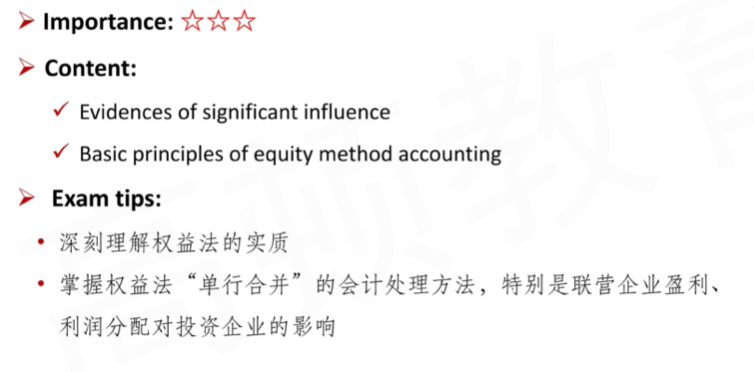

### 2. Excess Purchase Price \*\*\*

注意，purchase price 收购价格，有两种形式，现金，增发股票。

- Excess Purchase Price = Purchase Price - BV%
- Goodwill = Purchase Price - FV%

- The **acquisition cost(purchase price)** of the investment is often **greater than** the investor's **proportionate share of the book value** of the investee's(associate's) **net identifable assets**.

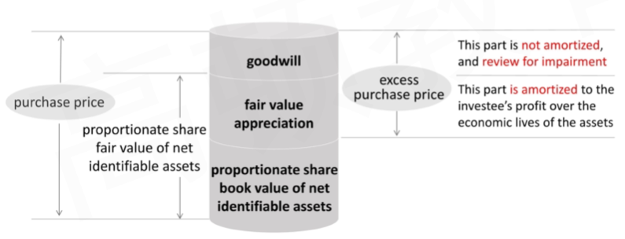

#### Goodwill

max(PP - FV %, 0)

- The difference between the **cost of acquisition** and **investor's share of the fair value of the net idenetifiable assets** is treated as **goodwill**. 
  - 投资成本减去被投资企业可辨认净资产的份额，只有正数才是商誉。
  - Goodwill **is not amortized** because it is considered to have an indefinite life, and it is **reviewed for impairment** on a regular basis, and written down for any identified impairment.
  - Goodwill is **included in the carrying amount of the investment**(instead of being separately recognized), because investment is reported as a single line item on the investor's balance sheet.
    - 注意，商誉Goodwill包含在了长投科目里，并不单独列示。（one-line consolidation）
    - 所以，goodwil减值，其实对长投的减值测试

#### Amortization of fair value appriciation

公允价值增值部分的摊销

- The excess purchase price allocated to the assets and liabilities that are **expensed**(such as inventory) or **peirodically depreciated or amortized** (such as PPE) is accounted for in a manner that is consistent with the accoutning treatment for the specific asset or liability to which it is assigned 增值部分和底层资产处理一样。
  - 这里除了固定资产折旧，无形资产摊销。还有一项：存货卖出的销货成本COGS. 如果investor认为inventory的FV比BV高，那么存货卖出的时候，investor所认为的COGS就higher than invesee's COGS，所以要在investor的I/S做相应调整，同时也要对B/S做出调整。
  - 另外，注意asset以及liability，都有可能产生调整。
  - Investor must directly record these adjustment effects by **reducing the carrying amount of the investment on its balance sheet** and by **reducing the investee's profit recognized on its income statement.**
  - Why？
    - 比如，当fair value增值部分对应的资产发生折旧，会对应影响investor的B/S以及I/S。
    - A投资B，1000元30%股权，按照定义，达到权益法条件。B的资产负债表中，假设其中有一个PPE的BV不等于FV，Book Value是110，Fair value是120. 假设折旧10年，直线法。对于B（investee）来说，每年折旧11元。
    - 但是对于A（investor）来说，只认可Fair Value部分的折旧，也就是每年折旧12元。
    - 如果B一年赚了Net Income=1000元，不考虑稅的情况下。
    - A投资的部分，对应的是 (1000 + 11 - 12) * 0.3元，而不是1000 * 0.3.
- Over time, as the differences are amortized, the balance in the ==investment account== will come closer to represeneting the ==ownership percentage of the book value of the net assets of the associate==.
  - 最终可折旧的资产折旧完了之后，investor和investee的上面说提到的FV和BV的差别就消失。
  - 但某些情况也例外，比如一些无形资产，不摊销，使用寿命无限的情况。

#### Example

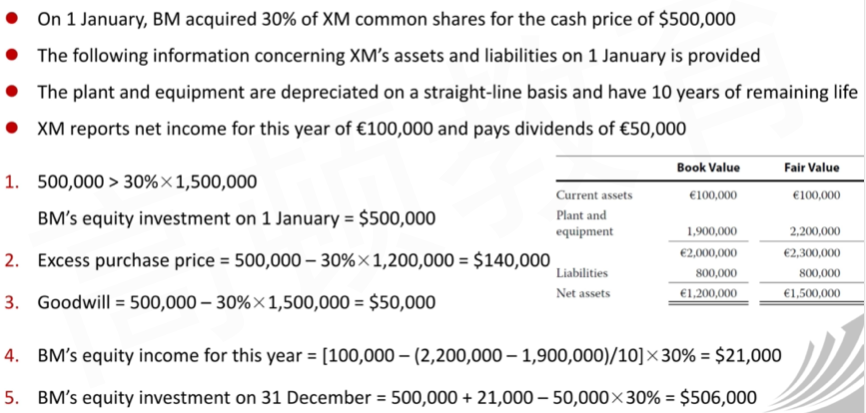

#### Summary

- 课件上有一个更为复杂的例子，比较经典。
- 所以，对于investor当年的I/S的NI，需要针对fair value增值部分的固定资产折旧、无形资产摊销、存货销货成本进行调整。调整的原理，比如对于NI，investee记账时，认为depreciation从BV计算得来，investor认为计算从FV得来。关键看两边的BV和FV之间的差别。

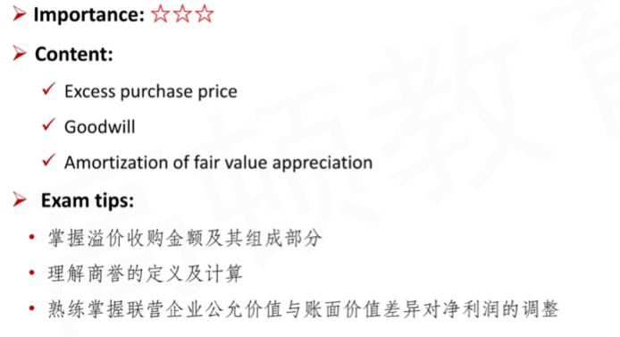

### 3. Transactions with Association \*\*\*

#### General principles for Tansactions with Associates

- Because an investor company **<u>can influence</u>** the terms and timing of transactions with its associates, profits from such transactions **<u>cannot</u>** be realized <u>**until confirmed through sale to third parties** or **use**</u>.
  - 注：这里的use，表示investee买来investor的inventory，作为固定资产使用，计提折旧。

- Accordingly, the **investor company's share of any unrealized profit** must be <u>deferred</u> by **<u>reducing</u>** the amount recorded under the equity method
  - 和上节课的净利润调整相似，unrealized profit需要调整investee的净利润，再记到对应share到investor账上。（NI - unrealized Profit）%
  - 注意，loss 基本上都是realized，所以不调整。
  - In the subsequent period(s) when this deferred profit is considered **confirmed**, it is **added to** the equity income
    - **注意：**defered**关键词**，等investee 把从investor买来的inventory卖出，变为realized profit，要从NI调整加回。但是不回溯调整。具体看下面的Example.

- Transactions between the two affiliates may be upstream (associate to investor) or **downstream**(investor to associate).
  - downstream transaction: 顺流交易，交易方向和投资方向一致。A控股30%B，A卖了货品给B。
  - upstream transaction: 逆流交易，交易方向和投资方向相反。A控股30%B，B卖了货品给A。

#### Upstream Transaction 逆流交易

BY->SY，SY把inventory卖给BY.

- In an upstream sale, the profit on the intercompany transaction is recorded on the associate's income(profit or loss) statement
  - The **<u>investor's share of the unrealized profit</u>** is thus included in equity income on the investor's income statement
- Both IFRS and US GAAP require that the unearned profites **be eliminated** to the extent of the investor's interest in the associate.

- 对于联营企业或者合营企业相投资企业出售资产的逆流交易，在该交易存在未实现内部交易损益的情况下（即有关资产未对外部独立第三方出售或未被消耗），投资企业在采用权益法计算确认应享有联营企业或合营企业的投资损益时，应**<u>抵消</u>该未实现内部交易损益的影响**，同时调整为对联营企业或者合营企业长期股权投资的账面价值。 

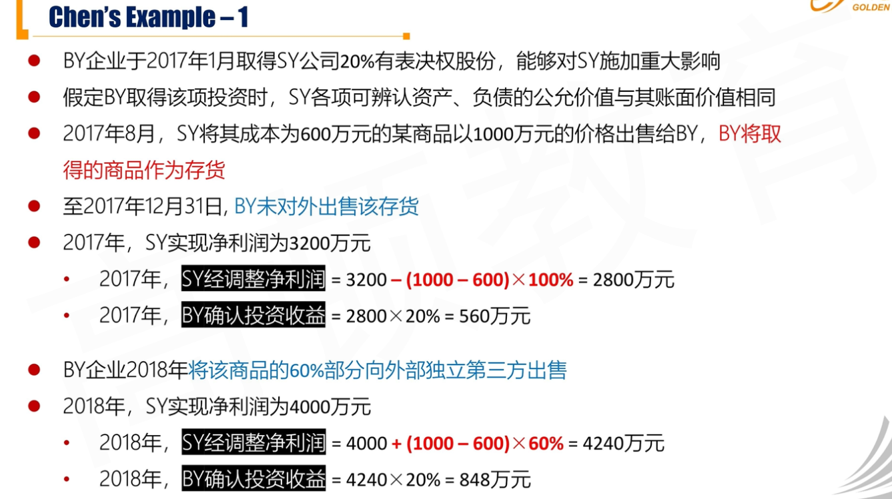

- 上面这题：
  - Net Income - (加价部分) * 未出售比例
  - 2018年的时候，把realized profit加回，体现deferred

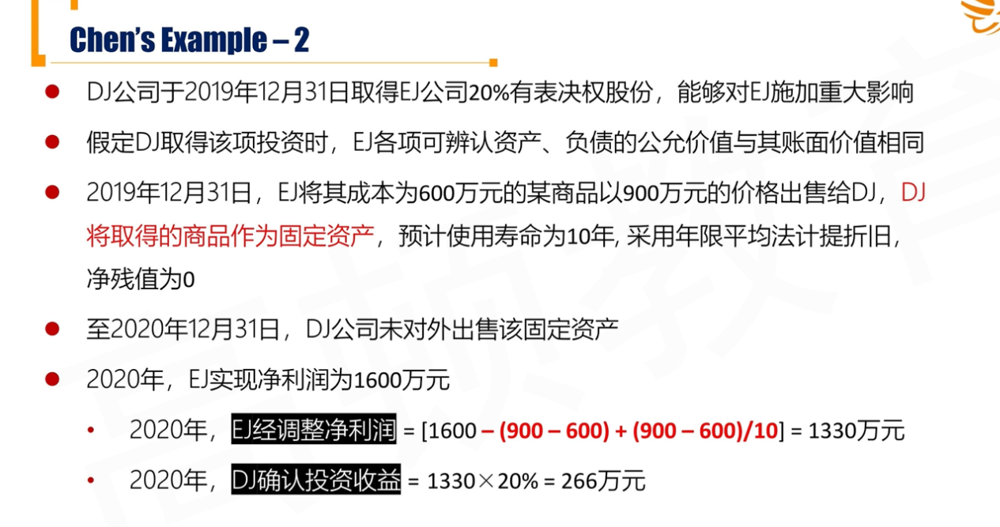

- 固定资产的情况：
  - NI - (加价) + 当年已经**use**的折旧部分

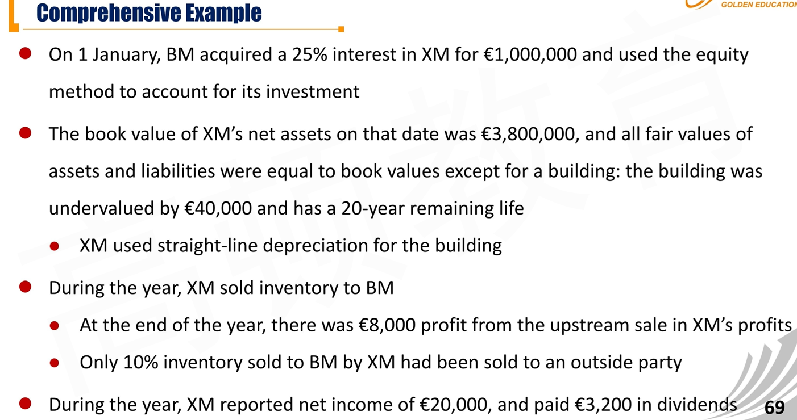

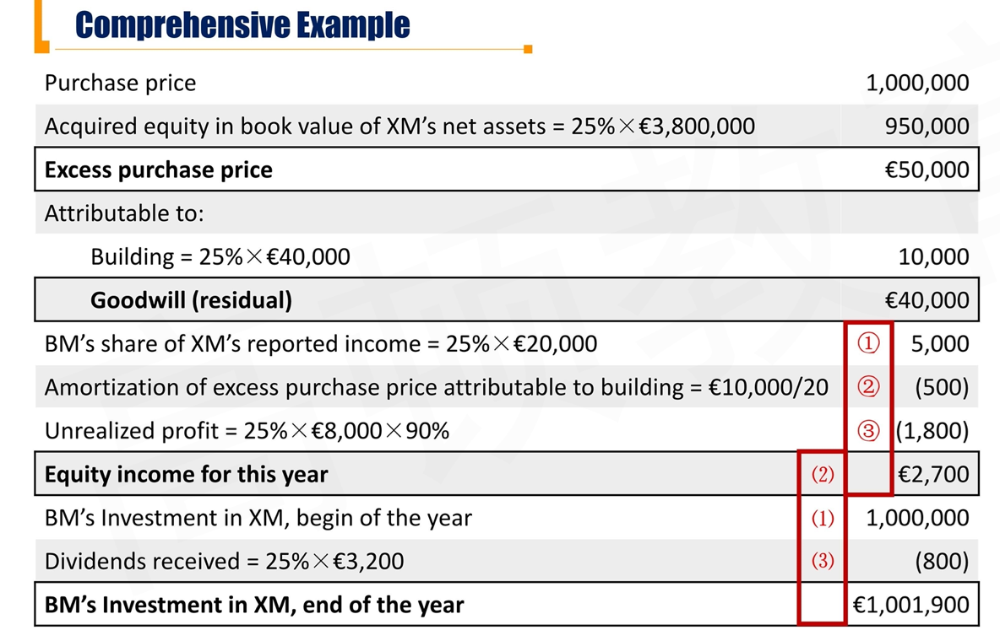

- 涉及两项NI调整
  - amortization of excess PP attribute to building: $40000 \times 25\% / 20$
  - unrealized profit
- 对于equity investment
  - 分红导致减少equity investment
  - 加上调整的对应share的equity income

#### Downstream Transaction 顺流交易

顺流交易处理方法和逆流交易一致。

- In a downstream sale, the profit is recorded on the investor's income statement
- Both IFRS and US GAAP require that the unearned profits **<u>be eliminated</u>** to the extent of the investor's interest in the associate.
- 对于投资方向联营企业或合营企业投出或出售资产的顺流交易，在该交易存在**未实现内部交易损益**的情况下（即有关资产未对外不独立第三方出售或未被消耗），投资方在采用**权益法**计算确认应享有联营企业或合营企业的投资损益时，应**抵消该未实现内部交易损益的影响**，同时调整对联营企业或合营企业长期股权投资的**账面价值**。
- 注意，比如BY控制30%SY，BY向SY出售价值100的存货，价格300。假如今年SY净利润1000w，那么BY的投资收益增加 (1000w - (300-100)) * 30%. 
  - 这里有一个问题，1000w是SY的净利润。300- 100 = 200是BY出售存货产生的净利润。两个数字从不同的主体的角度计算得到，直接相减看似没有逻辑依据，但可以从下面几个角度解释：
    - 1）在BY的投资收益里，因为要调整净利润避免高估，所以要从投资收益中扣减未实现的损益。
    - 2）在SY的净利润中，因为买来的存货比NRV要高，所以要调整SY的净利润。
    - 3）SY买贵了，可以视作SY给BY分红，扣减equity investment。

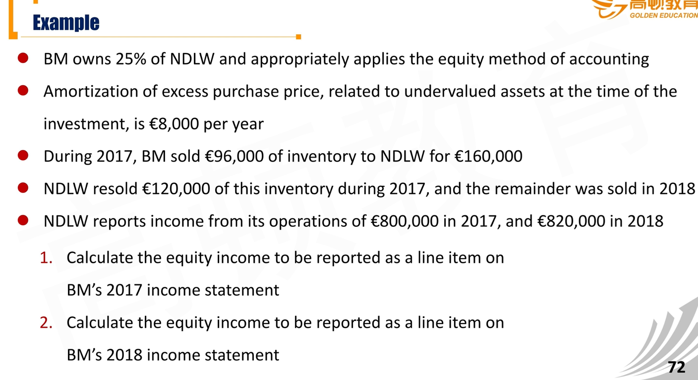

- 2017年，卖掉了75%=（12/16）

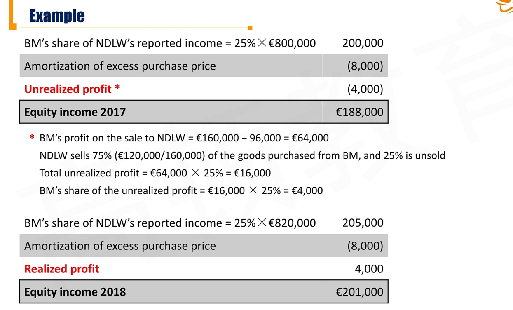

#### Summary

- one-line consolidation, 商誉在equity investment中
  - 初始确认：购买价格X，可辨认净资产公允价值K。X > K, X; X < K, K.
- 调整investorNI
  - 资产FV/BV不一致，amortization. - (FV - BV) / N %
  - upstream, downstream. unrealized profit %
- 调整investor资产负债表
  - dividend分红
  - 来自NI的调整，NI - FV/BV amortization - unrealized profit - div

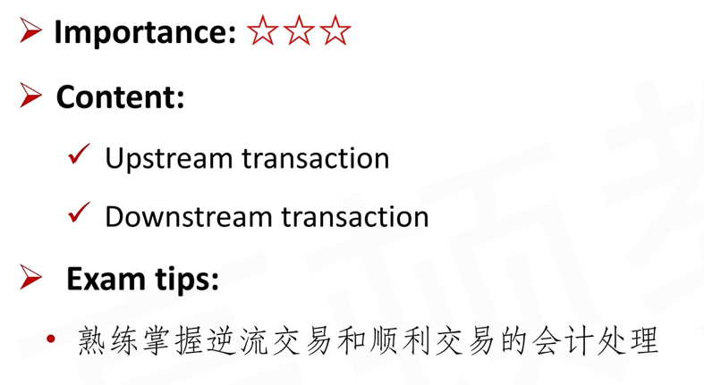

## II. Other Issues

会计的谨慎性原则，不能高估资产

复习CFA level 1:

- Investory: BV vs. NRV
- Long Lived asset: BV vs. recoverable amount = max(NRV, value in use)

#### Impairment for Equity Investment

- Both IFRS and US GAAP require **<u>periodic reviews</u>** of equity method investments for **impairment**
  - If the fair value of the investment is below its carrying value and this decline is deemed to be **<u>other than temporary</u>**, an impairment loss must be recognized 需要判断fair value是暂时性还是永久性低于账面价值。
- The **<u>impairment loss</u>** is recongnized on the income statement, and the carrying amount of the investment on the balance sheet is either **<u>reduced directly</u>**(IFRS, GAAP) or through the use of an **<u>allowance account</u>**(IFRS)
  - 减值首先体现在I/S
  - 然后减少对应的Asset，或者IFRS使用备抵账户
- Both IFRS and US GAAP **<u>prohibit the reversal of impairment losses</u>** even if the fair value later increases. 
  - 长投不能转回！

##### Impairment for Equity Investment - IFRS

- Under **IFRS**, there must be objective evidence of impairment as a result of **<u>events</u>** that occurred after the initial recognition of the investment, and that loss event has an impact on the investment's **<u>future cash flows</u>**, which can be **<u>reliably estimated</u>**.
  - 什么是not temporary: 影响未来现金流
- The entire carrying amount of the investment is tested for impairement by compairing its **recoverable amount** with its **carrying amount**
  - Becasue goodwill is included in the carrying amount of the investment and is not separately recognized, it is **<u>not separately</u>** tested for impairment.
    - 企业合并，goodwill单独减值测试
    - 长期股权投资，goodwill不单独测试
  - Recoverable amount of an asset is the **<u>higher</u>** of its **<u>value less cost to sell</u>** and its **<u>value in use</u>**.
    - max(NRV, value in use)

##### Impairment for Equity Investment - US GAAP

- If the **<u>fair value</u>** of the investment declines below its carrying value and the decline is determined to be **<u>permanent</u>**, **US GAAP** requires an impairement loss to be recognized on the income statment and the carrying value of the investment on the balance sheet is reduced to its fair value.
  - US GAAP直接和FV比较，BV vs. FV

#### Fair value option

一种选择用公允价值计量长投的option。（不是权益法）

- Both IFRS and US GAAP require that the election to use the **fair value option** occur **<u>at the time of initial recognition</u>** and is **<u>irrevocable</u>**

  - 如果要动用fair value option，则必须在初始时刻选择用fair value计量。并且不可逆转。

  - Subsequent to initial recognition, the investment is **<u>reported at fair value</u>** with **<u>unrealized gains and losses</u>** arising from changes in fair value, as well as any **<u>interest and dividends</u>** received included in the investor's profit or loss.

  - |                         | investor采用权益法            | investor动用Fair value option                     |
    | ----------------------- | ----------------------------- | ------------------------------------------------- |
    | investee 实现Net Income | 计入I/S，长投增加，RE增加     | 不做处理（除非Fair value变动）                    |
    | investee分红            | I/S不处理，增加cash，减少长投 | I/S确认投资收益，cash增加，RE增加，长投不受影响。 |
    | fair value发生变动      | 不做处理                      | 影响长投、I/S、RE                                 |

- Under the fair value method, the investment account on the investor's balance sheet **<u>does not</u>** reflect the investor's proportionate share of the investee's profit or loss, dividends, or other distributions. (有点类似FVPL)

  - In addition, the excess of cost over the fair value of the investee's identifiable net assets is **<u>not amortized, nor</u>** is goodwill created
  - fair value option下：不考虑摊销，不考虑商誉

- Both IFRS and US GAAP give the investor the **<u>option</u>** to account for their equity method investment at fair value （fair value option使用范围）
  - Under **US GAAP**, this option is avialable to **<u>all entities</u>**
  - Under **IFRS**, its use is **<u>restricted to</u>** venture capital organizations, mutual funds, unit trusts, and similar entities, including investment-linked insurance funds.

#### Summary

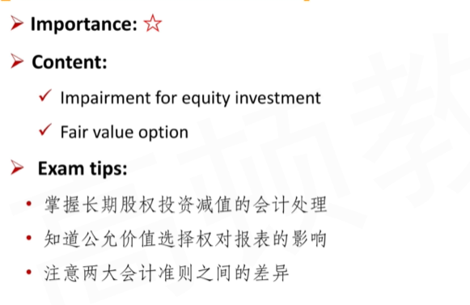