# Business Combinations

Basic Concepts about combinations

Consolidation Process 💛

Accounting Treatment of Goodwill 🚩

## I. Basic Concepts about Combinations

#### Concepts of "Control"

A控制B：A获得可变回报、A拥有控制B的权力

注意区分债权人和股权的区别。（是否回报可变？投票权？）

- Under IFRS, the **control** is present when:
  1. The investor has the ability to **<u>exert influence</u>** on the financial and operating policy of the entity
  2. The investor is exposed, or has rights, to **<u>variable returns</u>** from its involvement with the investee
- US GAAP uses a two-component consolidation model that includes both a **<u>variable interest</u>** component and a **<u>voting interest(control)</u>** component.

#### Business Combinations

- **Business combinations(controlling interest investments)** involve the combination of two or more entities into **<u>a larger economic entity</u>**
  - Under ==US GAAP==, the business combinations are **<u>categorized as</u>** merger, acquisition, or consolidation based on the legal structure after the combination 控股、吸收、合并
    1. **Acquisition**: Company A + Company B = (Company A + Company B)
    2. **Merger**: Company A + Company B = Company A
    3. **Consolidation**: Company A + Company B = Company C
  - **Question**
    - Who prepares **individual/consolidated** financial statements?
      - acquisition：A编制个表+合并报表；B编制个别报表
      - merger和consolidation后，都只有个别财务报表。

#### Acquitisition Method

- Under both IFRS and US GAAP, business combinations are accounted for using the **acquisition method**. 购买法
  - ==In the past==, business combinations could be accounted for either as a <u>purchase transaction</u> or as <u>an uniting(or pooling) of interest</u>
    - However, the use of the pooling accounting method for acquisitions is **<u>no longer permitted</u>**(for business combination not involving enterprises under common control)非同一控制下企业合并，不允许使用pooling accounting method(权益结合法)
    - IFRS and US GAAP now require that all business combinations be accounted for in a similar manner: the **acquisition method** **<u>replaces</u>** the purchase method

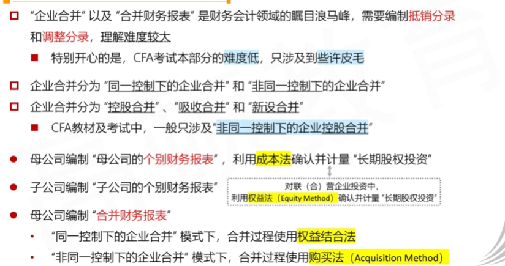

- 合并过程，根据是否同一控制采用不同方法。
  - 权益结合法关注子公司BV，购买法更关注FV

#### Summary

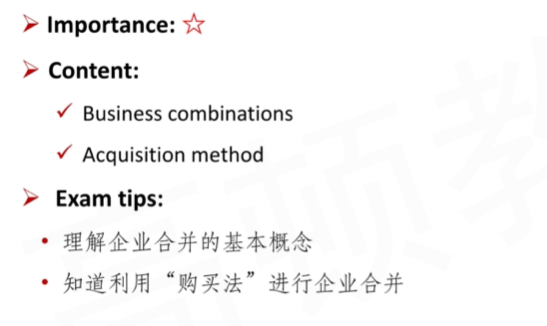

## II. Consolidation Process

重点是B/S和I/S合并

### 1. Instructon of B/S

- 非同一控制下的企业控股合并，合并资产负债表编制的基本流程和思路：
  1. 基于**公允价值**调整**子公司**个别资产负债表
  2. **母公司的账面价值**与**子公司==全部的==公允价值**逐项相加（line-by-line），合并报表层面确认**“少数股东权益”**（若有）
     - 注意，这里是全部公允价值（不考虑份额，就算持有70%，也合并全部FV，最后确认少数股东权益）
  3. 将**母公司长期股权投资的账面价值**与**子公司所有者权益的公允价值**抵消，合并报表层面确认“商誉”（若有）

#### Consolidation Process - 支付现金购买100%股权

- 购买前个别资产负债表

  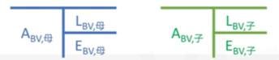

- 购买后个别资产负债表

  - 复习：20%以下为金融资产，大于20%都确认为长投。
    - 对于长投：20%～50%使用权益法；大于50%使用成本法

  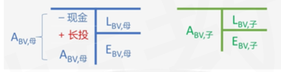

  - 利用**购买法**进行合并

    - 子公司调整为Fair value
    - 逐项相加
    - 长投和$E_{FV,子}$抵消

    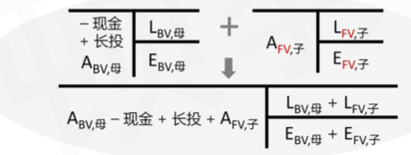

- 购买后合并资产负债表

  - 注意，A收购B，现金支付到B原来的股东S手上，S把对应的股权交到A手上，完成交易。
  - goodwill 分为partial and full

  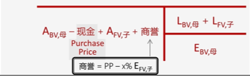

#### Consolidation Process - 发型股份购买100%股权

- 购买前个别资产负债表

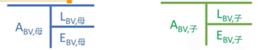

- 购买后个别资产负债表

  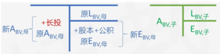

  - 利用购买法进行合并

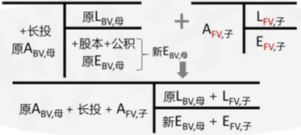

- 购买后资产负债表

  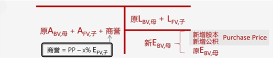

#### Consolidation Process - 现金购买x%(<100%)股权

- 购买前个别资产负债表

  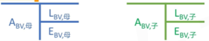

- 购买后个别资产负债表

  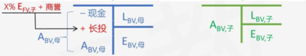

  - 利用购买法进行合并

    

- 购买后合并资产负债表

  - 资产端体现商誉，权益端体现少数股东权益

  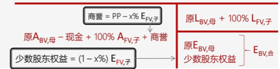

#### Important Summary

- Asset, Liability:  parent's BV + 100% subsidiary FV 
- Equity: based on parent's BV
- Purchase Price = x% FV subsidiary's equity
  - 此时没有goodwill
- Purchase Price > x% FV subsidiary equity
  - 产生goodwill
- x%=100
  - 没有minority interest
- x%<100%
  - 产生minority interest

#### Non-controling [Minority] Interests: Balance sheet

- **Non-controlling interests** are created when the parent acquires **<u>less than a 100%</u>** controlling interest in a subsidiary
  - A non-controlling(minority) interest is the portion of the subsidiary's equity (residual interest) that is held by third parties(i.e., not owned by the parent)
- IFRS and US GAAP have similar treatment for how non-controlling interests are classified
  - Non-controlling interests are presented on the consolidated balance sheet as a separate component of **<u>stockholders' equity</u>**

### 2. Instruction of I/S

- “非同一控制下的企业控股合并”中，**合并利润表**编制的基本流程和思路
  1. 自购买日起，**将子公司全部的**收入利得，成本费用逐项与母公司相加
     - 回忆，权益法中one-line consolidation只确认投资损益。
     - 注意是全部收入、成本都合并
     - 自购买日起：比如财报体现1.1～12.31的数据，在4.1收购。所以前三个月不并入。
  2. 对于**母公司与子公司、子公司互相之间**发生的经济业务，视同同一会计主体内部业务处理，**全额抵消**；调整子公司公允价值与账面价值的差额的摊销额
  3. ==在企业合并净利润==中，==扣除少数股东损益==，==计算得出归属母公司所有者净利润==

#### Consolidation Process - 合并非全资子公司利润表（持股x%）

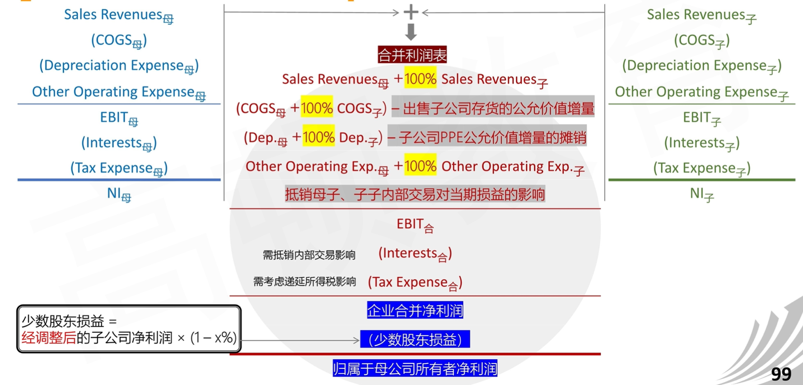

- 出售子公司存货的公允价值增量：母公司认为inventory公允价值比子公司的BV高。母公司认为120，子公司认为100
- PPE公允价值增量摊销。回忆权益法（FV-BV）/N折旧
- Interest\Tax Interest，对于Interst比如母公司借钱给子公司；对于Tax Interest：税务机关只认Book value，调整为FV，会产生递延所得税。
- **归母净利润**会等于权益法中计算得到的母公司净利润！

#### Non-controlling (Minority) Interests: Income Statement

- Each line item includes 100% of the parent and the subsidiary transactions after eliminating any **<u>upstream</u>**(subsidiary sells to parent) or **<u>downsteam</u>**(parent sells to subsidiary) intercompany transactions.
  - Intercompany transactions, if any, **are eliminated in full**
  - I/S of the subsidiary is included in consolidated I/S **from the date of acquisition**
  - 全额抵消，自购买日合并
- The **portion of income accruing to non-controlling shareholders** is presented as a separate line item(**minority interests**) on the consolidated income statement.

#### Example

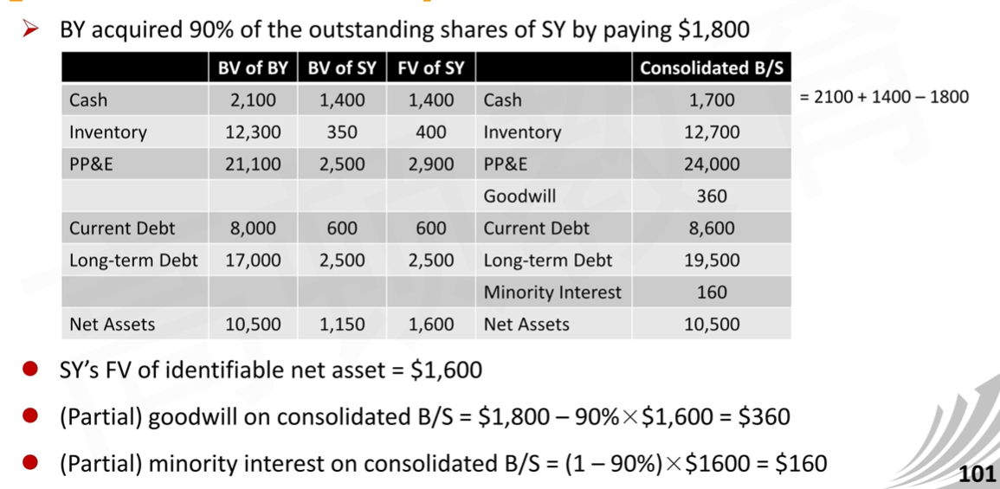

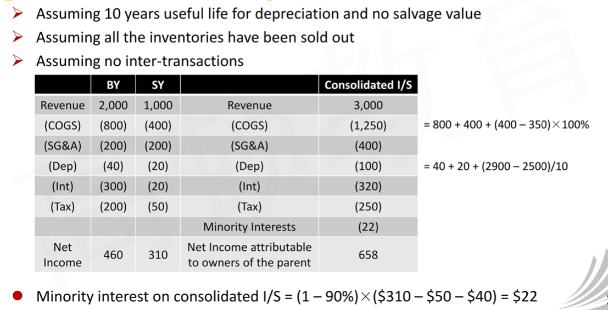

- 注意，少数股东损益，需要加上调整后的项目，比如折旧和COGS.（50，40）

#### Addtional Issues in Business Combinations(not important)

- Under acquisition method, the **fair value of the consideration** given by the acquiring company is the appropriate measurement for acquisitions and **<u>also includes</u>** the acquisition-date fair value of any contingent consideration
  - **<u>Direct costs</u>** of the business combination, such as professional and legal fees, valuation experts, and consultants, **are expensed as incurred**.
  - 核心：PP是什么，要把将来要花的钱考虑进去。（考虑或有对象contingent在购买日的fair value）
  - 直接成本，比如法律等，进入当期费用。

1. Recognition and measurement of **identifiable assets and liabilities**
   - The acquirer measure the identifiable tangible and intangible assets and liabilities of the acquiree **<u>at fair value</u>** as of the date of the acquisition
   - The acquirer **<u>may also recognize</u>** any assets and liabilities that the acquiree had **<u>not previously recognized</u>** as assets and liabilities in its financial statements
     - 比如研发费用。子公司不认为是资产，但是母公司把它资本化。
2. **Contingent assets and contingent liabilities**
   - 或有资产和或有负债。不在子公司B/S，在notes.
   - Under IFRS
     - **Contigent liabilities** are recorded separately as part of the cost allocation process, provided that their fair values can be measured reliably
       - Subsequentily, = max(initially recognized, best estimate of amount required to settle)
         - 尽可能确认大的
     - Contingent assets **<u>are not</u>** recognized
   - Under US GAAP
     - **Contractual contigent asset and liability** are recognized and recorded at their fair values, **non-contractual contigent asset and liability** also be recognized and recorded only if it is "more likely than not" they meet the definition of an asset or a liability
     - Contingent liability = max(initially recognized, best estimate of amount of the loss)
     - Contingent asset = min(initial fair value, best estimate of future settlement amount)
     - 不得高估资产，不得低估负债，也体现谨慎性
3. **Contingent consideration**
   - 或有对价
   - Contingent consideration may be negotiated as part of the acquisition price
   - Contingent consideration is initially measured at **fair value**
   - In subsequent periods, **changes in the fair value** are recognized in the consolidated income statement
     - Both IFRS and US GAAP **<u>do not</u>** remeasure "equity classified contingent consideration"
4. **In-process R&D**
   - We should recognize in-process research and development acquired in a business combination as **<u>a separate intangible asset</u>** and measure it **<u>at fair value</u>**. 把子公司的R&D确认为单独的无形资产（单独列示）
   - In subsequent periods, this research and development is subject to **<u>amortization</u>** if successfully completed, or to **<u>impairment</u>** if failed.
5. **Restructuring costs**
   - 重组成本。（类似direct cost，费用化）
   - IFRS and US GAAP **<u>do not recognized</u>** restructuring costs that are associated with the business combination <u>**as part of the cost of the acquisition**</u>.
   - The are recognized as <u>**an expense**</u> in the periods the restructuring costs are incurred.

#### Summary

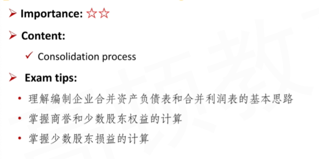

## III. Accounting Treatment of Goodwill \*\*\*

- BY spend 100\$(PP purchase price) by 80% share of SY, the Fair value of net identifiable asset of SY is 80\$.
  - Good will = PP - FV% = 100 - 64 = 36\$
  - 这里是partial goodwill

#### Partial Goodwill and Full Goodwill

- **Partial Goodwill** is measured as the **<u>fair value of the acquisition</u>** **less** the **<u>acquirer's share</u>** of the fair value of all identifiable tangible and intangible assets, liabilities, and contingent liabilities acquired
  - 部分商誉，等于PP减去FV NIA%。
    - 注意fair value of the acquisition，公允合并成本，就是Purchase price.
    - NIA不包括acquiree的商誉。包括或有负债（谨慎性原则，尽可能低估资产）
- **Full goodwill** is measured as the **<u>fair value of the entity as a whole</u>** less the fair value of <u>**all**</u> identifiable tangible and intangible assets, liabilities, and contingent liabilities.
  - Full goodwill不考虑“份额”。在上面的例子，就是125 - 80 = 45\$
  - 一般goodwill默认是partial goodwill. 但是美国会计准则下，必须是Full goodwill.
- 记忆两个会计准则的处理：
  - US GAAP views the entity as a whole and <u>requires full goodwill method</u>.
  - IFRS <u>allows two options</u> for recognizing goodwill at the transaction date.
    - The goodwill option is on a transaction-by-transaction basis.
- **Question**: What is the logic here?
  - partial and full goodwill可以理解为。full goodwill是整体商誉，partial goodwill是归属于母公司部分的商誉。full - partial是归属于少数股东的商誉。（对比归母净利润）
  - 拓展：企业合并时有两种理论，实体理论，母公司理论。
    - 实体理论，把合并报表站在总的公司的角度，所有股东的角度。所以minority interest放在equity部分
    - 母公司理论，把合并报表站在母公司的角度。所以minority interest 放在liability部分
    - partial goodwill and full goodwill represent the thoughts of 实体理论和母公司理论。partial goodwill只考虑母公司部分，是母公司理论。

#### Goodwill and Minority Interest

- **Question**

  - If the goodwill in the consolidated B/S is changed from "partial" to "full", how can the statement be balanced? 如何配平？
    - partial goodwill变为full goodwill，goodwill变大，所以要在equity找一个项目变大，就是minority interest. 达到配平。

- **Partial Goodwill**
  $$
  =Purchase\ Price - X\% \times FV\ of\ Susidiary's\ NIA
  $$

- 

- **Full Goodwill**
  $$
  =(Purchase\ Price / X\%) - FV\ of\ subsidiary's\ NIA\\
  =(Partial) Goodwill/X\%
  $$

- **Partial minority interest**
  $$
  =(1-X\%)\times FV\  of\ subisdiary's\ NIA
  $$

- **Full minority interest**
  $$
  =(1-X\%)\times Assumed\ 100\%\ Purchase\ Price\\
  =(1-X\%)\times(Purchase\ Price/X\%)
  $$

- full minority interest，其实是推导出来的，只能记住

$$
PG=PP-\alpha NIA\\
FG=PP/\alpha-NIA\\
PM=(1-\alpha)NIA\\
FG-PG=FM-PM \implies FM=FG-PG+PM
$$

- 根据上面的式子，可以推出

$$
FM=PP(\frac{1}{\alpha}-1)
$$

所以，上面的full minority interest公式是这么来的。

#### Example

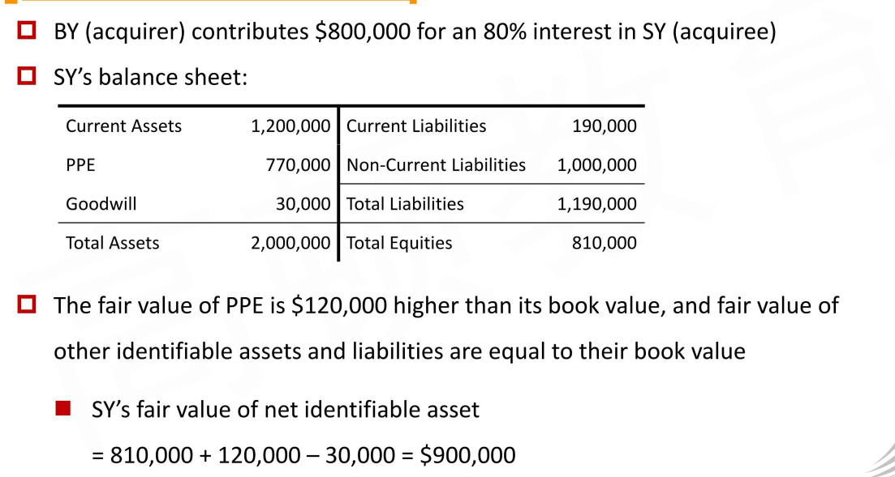

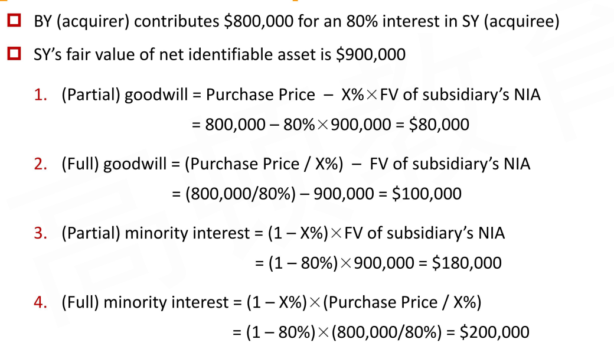

- 上面例子中，SY的个别财务报表也可能出现goodwill。和前面提到的只有acquisition的合并报表做出对比。比如SY之前溢价吸收合并了其他公司，在自己的个别报表中，也有可能出现goodwill.

#### Bargain Purchase

这时候，$PP < FV_{NIA}\%$，买便宜

- **Bargain purchase acquisition** is an acquisition where the purchase price is **<u>less than</u>** the acquirer's share of fair value of the acquiree's net identifiable asset
  - IFRS and US GAAP require the difference between the fair value of the acquired net assets and the purchase price to be **<u>recognized immediately as a gain</u>**.
  - 比如母公司出钱60块购买80%的FV NIA100的子公司，在个别财务报表中，现金减60，长投增加80，立即确认gain + 20. 

#### Goodwill impairment 减值

- Although **goodwill** is **<u>not amortized</u>**, it must **<u>be tested for impairment</u>** at least annually or more frequently if events or changes in circumstances indicate that it might be impaired.
- Under both IFRS and US GAAP, once written down, goodwill **<u>cannot be</u>** later restored.
- IFRS and US GAAP differ on the definition of the levels at which goodwill is assigned and how goodwill is tested for impairment.
- 每年一次，不可转回

#### Goodwill Impairment: IFRS(One-step Approach)

- **Under IFRS**, at the time of acquisition, the total amount of goodwill recognized is allocated to each of the acquirer's **<u>cash-generating units</u>**(资产组，最小能产生现金流的单位).
  - A cash-generating unit represents the lowest level within the combined entity at which goodwill is monitored for impairment purposes.
  - Goodwill是分割成几个资产组进行减值测试的。
- An **impairment loss** is recognized if the **<u>recoverable amount</u>** of the cash-generating unit is less than its **<u>carrying value</u>**.
  - 资产组的可收回金额和BV对比。
- The impairment loss (the difference between these two amounts) is **<u>first applied to the goodwill</u>** that has been allocated to the cash generating unit.
  - Once this has been reduced to zero, the remaining amount of the loss is then allocated to all of the other **non-cash assets** in the unit on a pro rata basis
- 例子：比如一个母公司goodwill，分为A1, A2, A3个资产组（cash-generating unit）。针对每一个资产组进行分配goodwill，并进行减值测试。比如A1 + A1部分的goodwill 的Book value= 70 + 30。测试可回收金额只有60(recoverable amount)，那么，首先减值商誉到0，剩下还有10，A1资产部分按比例分配（pro data basis）

#### Supplement 中国企业会计准则第8号-资产减值

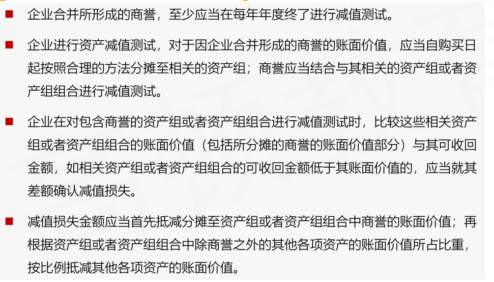

#### Goodwill Impairment: US GAAP Two-step approach

- **Under US GAAP**, at the time of acquisition, the total amount of goodwill recognized is allocated to **<u>each of the acquirer's reporting units</u>**(报告分部).
- Goodwill impairment testing is conducted under **a two-step approach**:
  1. First, the **<u>carrying amount of the reporting unit</u>**(including goodwill) is compared to its **<u>fair value</u>**: if the carrying value of the reporting unit exceeds its fair value, potential impairment has been identified
     - 报告分布的BV和FV对比
  2. The second step is to measure the impairment loss, which is the difference between the **<u>implied fair value of the reporting unit's goodwill</u>** and **<u>goodwill's carrying amount</u>**.
     - BV - 假如今天收购产生的goodwill
     - 这里课本原文implied fair value of the reporting unit's goodwill:
       - The implied fair value of goodwill is determined in the same manner as in a business combination(it is the difference between the fair value of the reporting unit and the fair value of the reporting unit's assets and liabilities)
       - 有点不理解，商誉按照定义=Purchase price - FV %of NIA. 那这里意思就是使用fair value当作purchase price, 指的是现在的市场价值减去FV% of NIA
- After the goodwill of the reporting unit has been eliminated, **<u>no other adjustments</u>** are made to the carrying values of any of the reporting unit's other assets or liabilities.
  - 和IFRS不一样，减值剩下的不会影响剩余的资产。（注意，由于第二步中，Goodwill的BV和implied goodwill FV对比，产生的数字有可能是负数）

#### Example

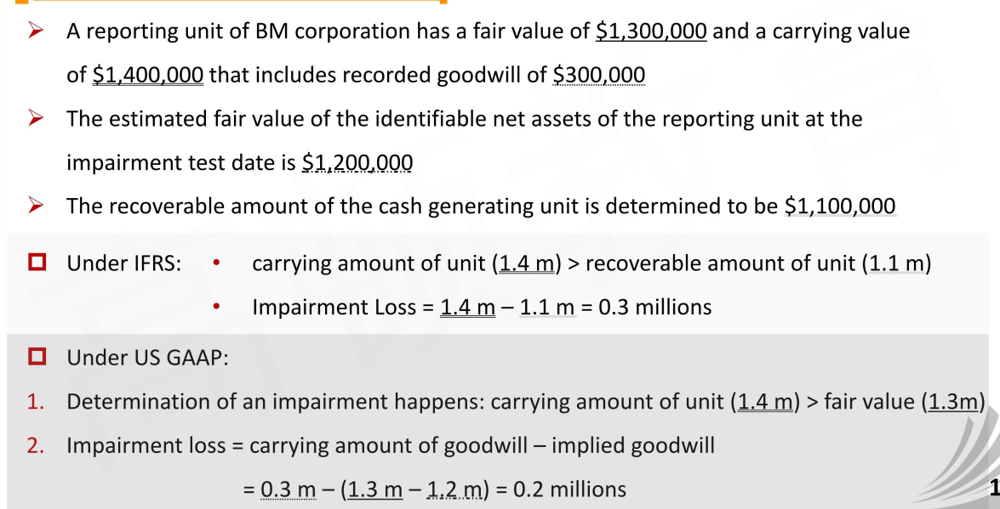

- 拓展：如果涉及partial goodwill（持股比例小于100%）的情况。需要先将goodwill计算到整体模式的goodwill，再和recoverable amount对比。然后得到的loss，再乘以持股比例x%，减值到goodwill中。

#### Summary

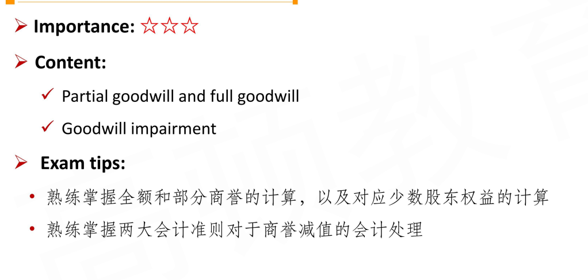