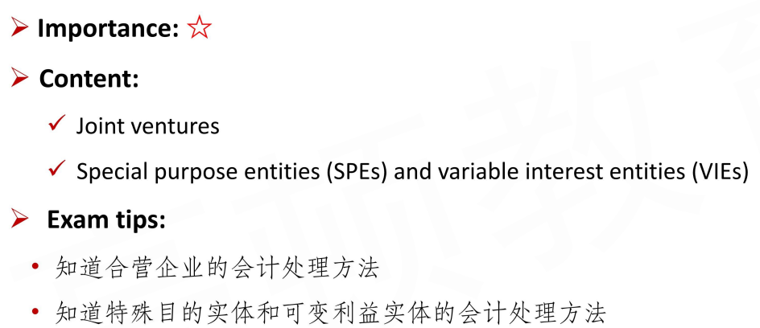

# Joint Ventures and SPEs/VIEs

Special Purpose Entity

Variable interest entities

#### Joint Ventures

- **Joint ventures** are undertaken and controlled by two or more parties
  - 合营企业。使用权益法. 回顾，不能施加重大影响时候，用权益法，是Associates. 当A->50%C, B->50%C的时候，C是合营企业，大家都不能完全控制，控制权被大家共享(shared control)。

- Both IFRS and US GAAP require the **<u>equity method</u>** of accounting for joint ventures
  - The equity method results in **<u>a single line item</u>**(equity in income of the joint venture) on the income statement and a single line item(investment in joint venture) on the balance sheet
  - 合营企业，使用权益法，one-line consolidation:
    - I/S：equity in income of the joint venture
    - B/S: investment in joint venture
- **==Only under rare circumstances==** will joint ventures be allowed to use **proportionate consolidation method**（按比例合并法，极少数情况使用这种方法）
  - On the venturer's financial statements, proportionate consolidation requires the **<u>venturer's share</u>** of the assets, liabilities, income, and expenses of the joint venture to be combined or shown on **a line-by-line basis**.
    - 和前面的100%合并不一样，按持有比例进行合并，不管B/S还是I/S都不考虑minority interest.

#### Special Purpose Entities 特殊目的实体

- **Special purpose entities(SPEs)** are enterprises that are created to accommodate specific needs of the **sponsoring entity**
  - sponsor entity设立SPE。分清主次关系。
- In most cases, the creator/sponsor of the entity retains a significant beneficial interest in the SPE, even though it may own little or none of the SPE's voting equity
  - 通常，sponsor/creator享有SPE的收益，尽管持股比例很低，最后编制报表的时候，需要纳入sponsor的合并报表（consolidated）
- Special purpose entities **<u>are required to be consolidated</u>** by the sponsoring entity
  - ***In the past**, sponsors were able to avoid consolidating SPEs on their financial statements because they did not have "control", but IFRS revised the definition of control to encompass many special purpose entities*. 以前的会计准则漏洞，导致sponsor不披露SPE.

#### Variable Interest Entities 可变利益实体

- The FASB used the more general term **variable interest entity(VIE)** to more broadly define an entity that is financially controlled by one or more parties that do not hold a majority voting interest
  - Therefore, under US GAAP, a VIE includes other entities besides SPEs. (VIE包含了SPE)
- US GAAP **<u>requires</u>** the primary beneficiary of a variable interest entity(VIE) **to consolidate** the VIE regardless of its voting interests(if any) in the VIE or its decision-making authority
  - 这里的primary beneficiary和刚刚的sponsor一样
  - The **<u>primary beneficiary</u>**(which is often the **<u>sponsor</u>**) is the entity that is expected to absorb the majority of the VIE's expected losses, receive the majority of the VIE's residual returns, or both.

#### Summary

