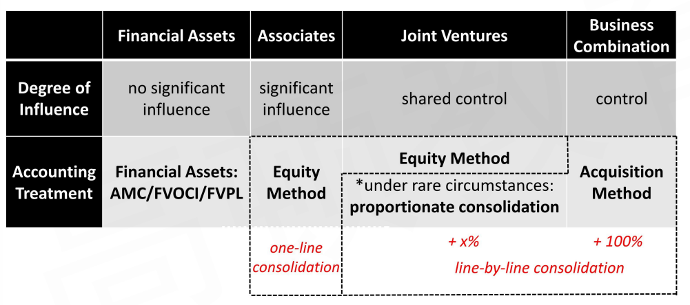
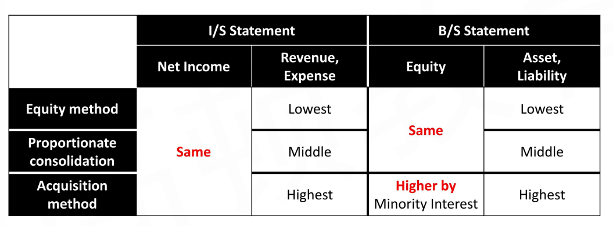
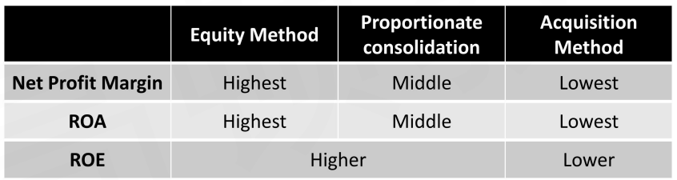
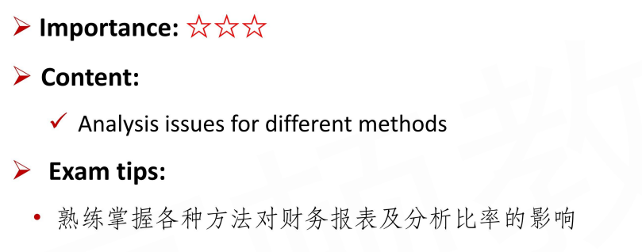

# Analysis Issues

#### Inter-corporate Investments

- 一般比较的维度：
  - 持股20%以下：AMC/FVOCI/FVPL
  - 持股20%以上：Associates/Joint Ventures/Business Combination

#### Net Income and Shareholders' Equity \*\*\*

- **Net income** is **<u>the same</u>** for the following accounting methods used to account for active investments in investee. 无论用那种，净利润都一样。假设A->B
  - Equity method
  - Proportionate consolidation
  - Acquisition method
  - 都等于A的NI + B的NI x%
- The **total net assets(shareholders' equity)** of the investor is **<u>the same</u>** under **<u>equity method</u>** and **<u>proportionate consolidation</u>**（这里的equity都是合并资产负债表中的equity）
  - If the minority interests is **not treated as **"shareholders' equity", the total net asset will **also be same** under acquisition method
  - 意思是对于合并报表中的Equity，下面三种一样：
    - Equity method
    - 按比例合并的Proportionate consolidation
    - 把minority interest not treated as shareholder的 acquisition method
- Question: Why?
  - 回顾，合并理论：实体理论和母公司理论。实体理论时，Minority Interest放在Equity，但是母公司理论时，Minority Interest放在Liability.
  - 注意，不管是现金收购还是增发股票，都有这个Equity的结论。

#### Comparison

- I/S口径： 归属投资方的利润
- B/S口径：合表后的Equity
- Revenue, Expense：Equity method都是母公司自己的数，proportionate是比例，acquistion 全额合并。

#### Two Common Analysis Frameworks

1. **One-line consolidation vs. line-by-line consolidation**

   - There can be significant differences in ratio analysis between the three methods, because of the differential effects on values for total assets, liabilities, sales, expenses, etc.

     

   - Net  Profit margin = NI / Revenue
   - ROA = NI / Asset
   - ROE = NI / Equity
   - 注意NI和Equity的口径。NI：投资方。Equity：合表后equity

2. **Ratio analysis before and after investment**
   - Case by case quantitative analysis
   - A->30%B
     - ROA = NI / Asset
     - 投资后，对NI和Asset进行分析。

#### Full Goodwill and Partial Goodwill Method

- **Net income** is the **<u>not affected by</u>** the choose between full goodwill and partial goodwill method
  - full/partial goodwill不影响NI
- Although net income to parent's shareholders is the same, the **<u>impact on ratios</u>** would **<u>be different</u>** because total assets and stockholders' equity would differ.
  - 比如ROA, ROE

#### Issue for Equity Method

- **Equity method accounting** presents several challenges for analysis
  - Analysts should question whether the equity method is **appropriate**
    - 意思是实质重于形式，不一定参照持股比例20%.
  - There can be significant assets and liabilities of the investee that are not reflected on investor's balance sheet, which will **<u>affect debt ratios</u>**
    - **Net margin ratios** could be overstated because income for the associate is included in investor's NI, but is not included in sales
    - 看上面的对比图，Net Profit Margin，ROA，ROE都是偏高
    - 另外L/A，更低，影响debt ratios. 杠杆率偏低。
  - The analyst must consider the **quality of the equity method earnings**
    - The equity method assumes that a percentage of each dollar earned by the investee company is earned by the investor, <u>even if cash is not received.</u>
    - 要看合并到investor帐上的earning有没有给cash

#### Summary

