# Share-based Compensation

## I. Introduction

回顾：董事会薪酬委员会设计报酬方案，提交董事会审核，最终shareholders决策（say-on-pay）

- Awarded as a bonus to highly compensated emplyees, such as managers and those in technical roles.
- Each plan is approved by the board of directors and, voted by shareholders

| Advantages                                                   | Disadvantages                                                |
| ------------------------------------------------------------ | ------------------------------------------------------------ |
| Reducing principal-agency conflicts of interest. （利益绑定） | Have limited influence over the company's share price        |
| Improves employee retention（比如股票禁售期，留住一些员工）  | Suboptimal risk-taking by managers: too conservative or too aggressive. |
| No cash outlay(不用给太多现金，不会造成现金挤压，流动性挤压) | Damaging retention due to share price declines               |

#### Insturments Used in Share-Based Compensation Plans

- Equity settlement 以权益结算的股份支付 🚩
  - **Restricted stock**
    - **Common shares** granted（授予） to employees but subject to selling and other restrictions. （交易受限）
    - **Restricted stock units(RSUs)** 预留限制性股票
    - Performance shares（满足业绩要求才解禁）
  - **Stock option**
    - Non-tradeable **call options** on the employer's stock typically issued at the money(Strike price=share price on grant date)
- Cash settlement 以现金结算的股份支付
  - Stock appreciation-based 以股价升值为基础的股份支付
    - Awards of cash or shares based on the performance of shares over a period
    - Stock appreciation rights 现金股票增值权
      - 基于share增值多少，给予报酬。比如1000个stock appreciation rights，授予后股价增加8，那发放报酬8000.
    - Phantom shares 影子股票
      - 用于没有上市的公司。
  - Stock purchase-based
    - Permits employees to purchase a limited number of newly issued shares at a discount. 员工打折买股

## II. Restricted Stock

#### Type of Restricted Stock

##### Restricted Stock

- **Performance shares** if vesting（授予） is based not only on service but also on performance conditions
  - Has voting rights and dividend participation, but it is not tradeable
  - Employee are free to sell their shares upon settlement（结算日才可卖）
- **Restricted stock units(RSUs)** are not actual shares, but an instrument represents the right to receive shares upon settlement.
  - 注意：代表的是一种right，不是真正的share
  - No voting rights, no dividend participation and not tradable.

##### Effect of RSU Awards on the Financial Statements

##### Timeline and Accouting of Share-based Compensation

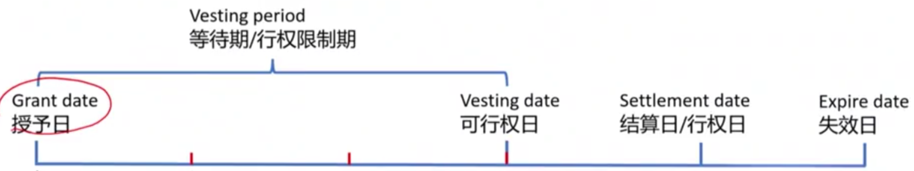

- Grant date 授予日:Fair value of underlying stocks for RSUs at the grant date is used to determine the compensation expense over vesting period.注意：授予日的Fair value作为compensation expense.
  - vesting period，等待期，行权限制期（grant date到vesting date期间）
    - 注意，这里体现权责发生制，compensation expense费用逐年确认，不发生现金流。
    - Recognize the **compensation expense（导致RE下降）**, **share-based compensation reserve(会计科目，属于capital，equity上升)** over the vesting period.
    - Total equity is unchange.
    - No any impacts on cash flows
- Vesting date 可行权日
- Settlement date 结算日/行权日，把RSU换成普通股(shares issued to employee)
  - **Transfer** share-base compensation reserve to common stock and paid-in capital.
    - 结转
  - Total equity is unchanged.
- Expire date 失效日

##### Accounting

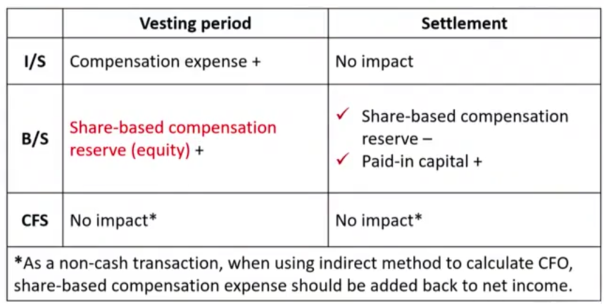

- indirect method calculating CFO, adjust NI to get CFO. 这里是加回expense，得到真正的CFO。

- 注意：
  - RSU授予的对象不同，在I/S中确认的compensation expense的科目也不同。比如授予高管的，确认SG&A，授予研发员工，确认R&D Expense.
  - 注意，share-based compensation reserve在grant date根据fair value确认后，一经确认，不再改变。
  - 如果分批次发行RSU，按照定义逐个计算。如果后续股价上涨，带来的I/S的expense的上升会小于股价的上升幅度，这是因为grant date fair value一经确认，不再变动.

##### Example

- 课件和textbook的例子一模一样，可以参考原书例题。

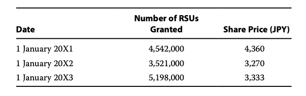

- 每年发一批RSU，1/4发给高管，3/4发给研发人员。所以逐年确认不同expense.
- 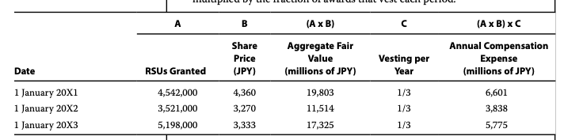

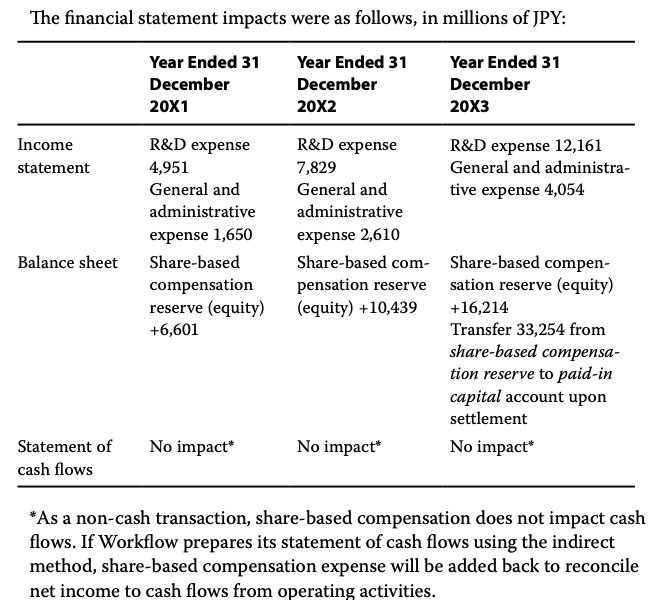

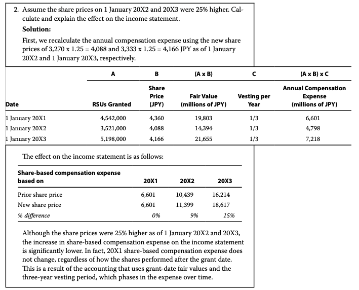

- 第2问指的是股价上升，但是I/S中的费用却上升较小。这是因为"This is the result of the accounting that uses grant-date fair values and the three-year vesting period, which phases in the expense over time"

## III. Stock Options

#### Accounting for Stock Options

- Similar to RSUs, but **fair value of stock options** on grant day must be estimated.
  - Black-Scholes option pricing model and binomial model are commonly used.

|                       | Changes  | Value of call option |
| --------------------- | -------- | -------------------- |
| Volatility            | increase | increase             |
| Risk free rate($r_f$) | increase | increase             |
| Time to expiration    | increase | increase             |
| Dividend yield        | increase | **decrease**         |

- Another difference between RSUs and stock option is how they are **settled**

|                            | RSUs                                                         | Stock Options                                                |
| -------------------------- | ------------------------------------------------------------ | ------------------------------------------------------------ |
| **How to settled**         | When RSUs vest, settlement occurs **automatically**, converting to common stock | Options should be **exercised** by employee depends on the share price. (X = grant date FV common stock) |
| **Accounting effects**     | **Transferring** amounts from the share-based copensation reserve account to common stock and paid-in capital accounts on the balance sheet. | **Transfer entry similar as RSUs**                           |
| Accounting effects on cash | No impact on cash flows                                      | **CFF + ** increase by number of options exercised multiplied by the strike price. 公司收到员工行权的行权现金。注意，这里本质是公司卖股票，所以现金流是CFF。 |

##### Summary on accounting for stock options

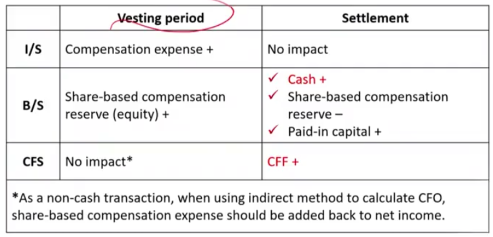

- 注意：

  - compensation expense是option在grant date的fair value。注意不是stock FV.
  - settlement date：cash = 行权价✖️份数 = （common stock grant date Fair value）✖️份数
  - 所以上面两个的差异，在settlement date记到paid-in capital

  - 另外，还要注意和RSUs不一样，vestdate 不一定等于 settelementdate

##### Example

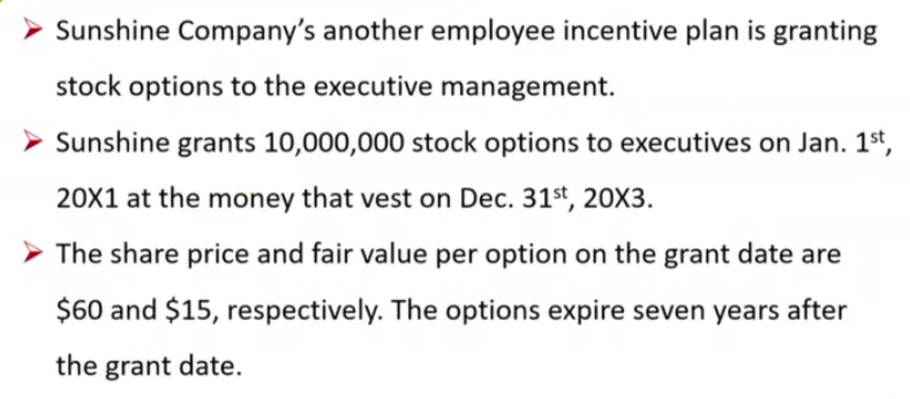

- 首先，对于每年年末，确认一笔expense。注意第三年年末并没有settle.

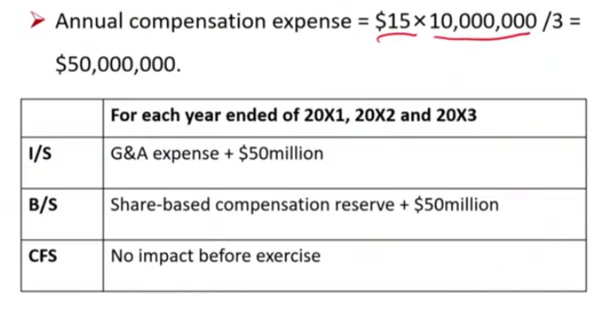

- stock option行权价等于grant date的fair value of common stock，所以是60块。如果股价低于60，没有人行权，所以不会有settlement. 如果高于60，那么产生行权。行权公司收到现金流。
  - 注意，share-based compensation reserve减少，收到cash增加，对应的差值记在paid-in capital上。
  - 本质上，cash是员工付钱，reserve是员工打工换来的回报。所以，paid-in-capital其实就是员工的付出产生的羊毛。剩余一部分员工拿到的羊毛，就是外界市场看好拿到，二级市场卖出股票从别人手里薅来的羊毛。Therefore, the company gets the cash and the labor force from employee, the employee gets abundant reward from stock market by selling stocks. In return, the company get a good reputation on good remuneration which attracts more excellent workers to the company and creates a more strong business. 

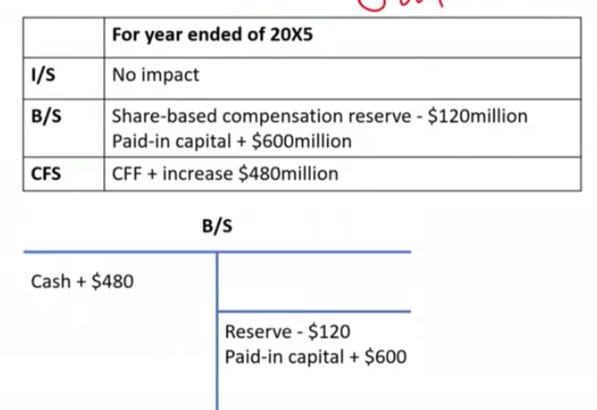

## IV. Shared-based Compensation Tax Issue

#### Financial Reporting vs. Tax Treatment

##### Tax Treatment \*\*\*

- Share price **<u>on settlement date(RSUs)</u>** and intrinsic value **<u>at exercise</u>**(options) are deductible **<u>at settlement</u>** for tax purpose.
  - Accounting： Expense是grant date FV
  - Tax: Expense 是settlement date FV
  - 产生永久性差异

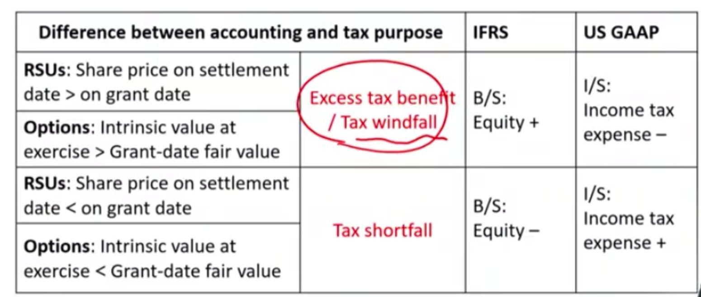

- Under US GAAP, effective tax rate(income tax expense / EBT) may large different from an issuer's statutory tax rates
  - 复习一级，永久性差异下，effective tax rate 不等于 statutory tax rates
  - If excess tax benefits: effective tax rate < statutory tax rates
  - If tax short fall: effective tax rate > statutory tax rates

## V. Shared-based compensation and shares outstanding

##### Shares outstanding

- Basic shares outstanding in each period does not include share-based awards that have not settled
- Share-based awards that have not settled are included in diluted shares outstanding, using **treasury stock method**(level 1: 库存股法算EPS)
  - Proceeds from the exercise or conversion of the potentially dilutive securities are assumed to be used to **repurchase** shares **<u>at the average share price</u>** for the reporting period
  - Adds a "**<u>net</u>**" amount of potentially dilutive securities like unvested RSUs to basic shares outstanding

#### Diluted shares outstanding

Basic shares outstanding 

​	\+ Shares issued from conversion or exercise of share-based

​	\- **Assumed** **proceeds** from conversion or exercise of share-based awards $\div$ **Average** share price for the reporting periods

= diluted shares outstanding

- 已知普通股股份 + 转换的股份 - 公司收到钱 / 平均股价  = 稀释股份
- 也就是公司收到的钱回购股票，然后再增发剩下的

Assumed proceeds = 

​	cash proceeds from exercise \+ average unrecognized share-based compensation expense

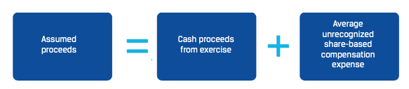

- 所以，unrecognized部分也需要。我认为这里体现了权责发生制，公司获得的proceed，应该由两部分组成：员工支付的exercise option premium，以及员工的劳动。员工的劳动，用average unrecognized的expense体现。
- For RSUs, cash proceeds from exercise is zero.
- **<u>Only</u>** share-based awards that management judges as **<u>likely to vest</u>** are included in the calculation
  - In practice, **awards with service vesting conditions are usually included** but **awards with performance conditions that have not been met** as of the end of the reporting period **are <u>exclude</u>**.
  - 预计不可解锁的期权，不考虑在内

- 具体Example看textbook.

- Only in-the-money options(average share price > strike price，注意，这里都是call option) are dilutive and included in diluted shares outstanding.
- RSUs are dilutive except when the average stock price is **<u>materially below</u>** the stock price at the RSU grant date.
  - 当average stock price < (1 / vesting period) \* FV grant date
    - RSUs此时是anti-dilutive
- Rapid increases in the share price can reuslt in more dilution(and vice versa), because the assumed number of shares that can be repurchased falls with a higher average share price.

## VI. Share-based Compensation and Financial Statement Modeling

#### Forecasting Share-based Compensation

- Step 1: **Subtract** share-based compensation expense from the costs and expenses lines on the income statement
- Step 2: Express adjusted costs and expenses and total share-based compensation expense **as percentages of revenues**
- Step 3: Forecast the percentages of revenues
- Step 4: Calculate the adjusted and reported figures using the percentages and a revenue forcast.
- 比如下图，用2023以及2022预测2024的share-based compensation.
  -  先求出2023/2022 excluded shared-based compensation的COGS and SG&A以及对应的revenue比例，以及compensation的比例。
  - 预测2024利润
  - 然后用这个比例求出2024的COGS，SG&A，compensation预计的比例。最后求出具体预测数值。

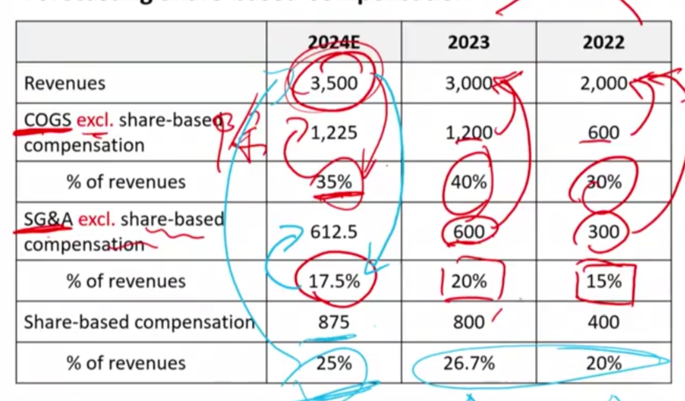

#### Forecasting Shares Outstanding

- Grants of share-based awards, net of forfeitures（失效）
  - 预测未来授予与失效的部分
  - Modeled using growth rates of historical values
- Settlements of awards，预测settlement部分
  - Assuming a percentage of outstanding awards settles each period.

#### Valuation Considerations

- Modify discounted cash flow model to account for effect of 
  - Dilution from outstanding but unvested share-based awards
    - Treasury stock method
  - Dilution from future share-based awards
    - Deducted from free cash flow, although no cash outflows
    - 回忆：FCFF = NI + NCC - WC -FC + Int(1-t)
      - NCC包含depreciation等非现金expense
      - 如果为了估值目的计算FCFF，NCC不包含compensation expense