# Post-emplyment Benefits Introduction

## I. Types of Post-retirement Plan

- Defined-contribution pension plan(DC) 设定提存计划
  - The amount contributed by employers are defined but the future value of plan is unknown
- Defined-benefit pension plan(DB) 设定受益计划
  - Employer promises to pay a certain annual amount to employees after retirement.
- Other post-retirement benefits(OPEB)
  - Life insurance premiums, health insurance, etc.

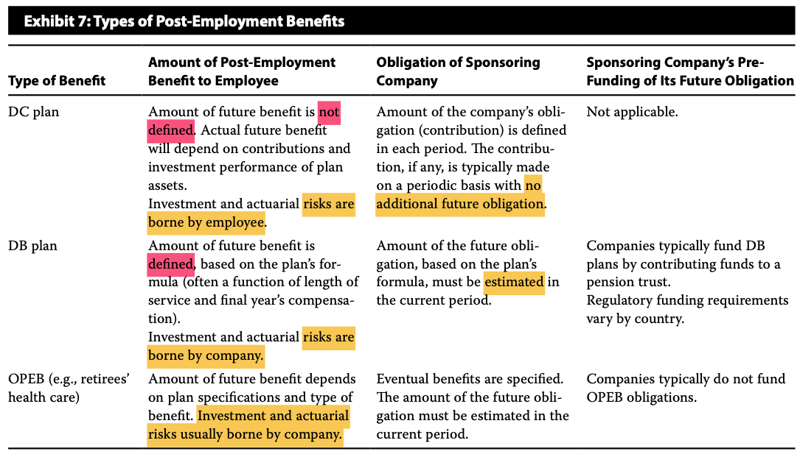

- DB Plan需要有专门基金，交给第三方管理（信托）。

## II. Accounting For DC Plan

|      | Vesting period         | Settlement                  |
| ---- | ---------------------- | --------------------------- |
| I/S  | Compensation expense + | no impact                   |
| B/S  | current liability+     | current liability -; cash - |
| CFS  | No impact              | CFO-                        |

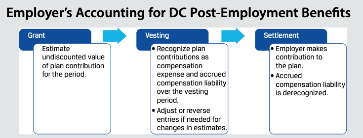

- vesting确认负债，发工资的时候（settlement）打到个人养老金卡里，企业流出现金，减少负债。
- grant date没有会计处理要求。

## III. Accounting for DB Plan

### 1. Pension Obligation养老金负债

- **Present value** of expected future payments required to settle obligations resulting from employee service in the current and prior periods 未来养老金的现值
- Estimated annual payment after retirement = Final salary \* benefit formula \* years of service

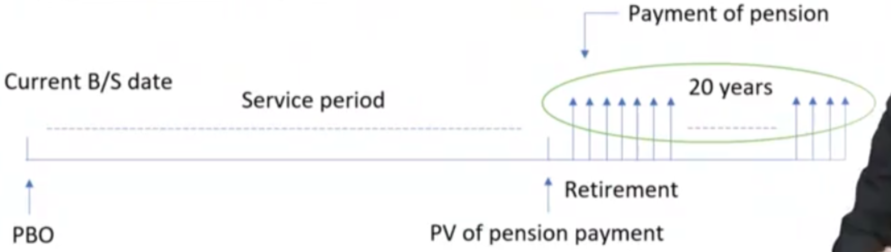

- 注意：
  - benefit formula企业制定
  - 通过公式确定PMT. 通过今天的工资，预估一个工资涨薪率，估计最后一年工作的薪资。
  - 注意折现率，折现到今天的PBO(pension benefit obligation)

- Estimating pension obligation involves **actuarial assumptions**
  - Discount rate折现率用什么
    - Yield on investment-grade corporate bonds(or government bonds in the absence of a liquid market in corporate bonds) 用投资级（or 国债），因为利率较低，避免低估负债。
  - Salary growth rates
  - Retirement dates
  - Mortality
- 上面的因素都是主观因素，成为精算假设，会影响PBO。

### 2. Balance Sheet Presentation

回顾，DB Plan需要prefunding，会形成一笔资产。

- Funded status = Fair value of plan assets - pension obligation

  - If the funded status is **positive**, the plan is **overfunded**
  - If the funded status is **negative**, the plan is **underfunded**

- Both IFRS and US GAAP require reporting funded status on the balance sheet.

  - Net pension asset/liability
  - Different plans' funded statuses cannot be <u>netted</u>

  - 轧差列示，要么net pension asset，要么net pension liability
  - 不同plan不能轧差，比如DB Plan和OPEB不能混在一起

#### 具体B/S的BASE法则

##### 1. 使得养老金资产plan asset变化的因素

- Add:
  - actual return 养老金资产的投资收益
  - emplyer contribution雇主每年主动储蓄，降低员工退休后的支付风险
- Substract:
  - benefit paid to employee

##### 2. PBO，liability变化因素

- Add：
  - **工龄service cost:**
    - **Current service cost**当期服务成本（CSC）：The present value of benefits earned by the employees during the current period. 多打一年工，获得的养老金提高。
    - **Past service cost**(PSC) 过去服务成本
      - Pension obligation relating to employees' service in prior periods **changes** if DB plan is **amended**. 赠送工龄，追溯员工工龄。或者养老金变化等，回溯之前工龄产生的养老金。
  - **Interest Cost**
    - The increase in the obligation due to the passage of time
    - 公司欠员工的利息
    - **<u>Interest cost = Pension obligation begining \* discount rate</u>**. 期初值\*利率，和债券摊销类似。
  - **Remeasurement**
    - **actuarial gain/loss**精算损益，比如预估员工寿命变化等
      - changes in the pension obligation from changes in actuarial assumptions
        - An acturarial gain will decrease the benefit obligation
        - An actuarial loss will increase the benefit obligation
      - The main difference between US GAAP and IFRS is the allocation of **<u>pension expense between the income statment and OCI</u>**。（对于Asset和Liability，两个会计准则没有差异)
    - **另外一个remeasurment**: any differences between the actual return on plan assets and the amount assumed in the net interest expense/income calculation
- Substract:
  - benefit paid to employee

##### 3. 对于B/S的配平 \*\*\*

掌握计算

- 注意，benefit paid在Plan Asset和PBO中都有，所以不会影响fund status.
- plan asset中的employer contribution和cash减少配平
- 其余增减，通过equity配平（RE/AOCI）

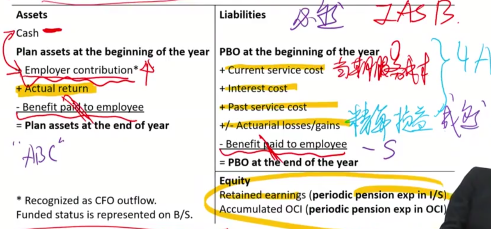

### 3. Accounting for I/S

#### 3.1 IFRS

##### Pension expense in I/S

- Current service cost (**operating expense**)
- past service cost (**operating expense**)
  - 因为上面这两个都是员工付出劳动获得的，属于operating expense
- net interest expense/income (**below operating income line**)
  - Beginning <u>**net**</u> pension liability/asset \* discount rate
    - PAbeg \* r
      - 本来应该是养老金asset投资的actual return，但是，为了会计记账科目平滑，科目数字稳定性，所以采用discount rate代替计量interest expense/income. 
      - **注意！**这里仅仅是interest expense/income的计量，采用r代替。在资产负债表上，依然还是actual return. 这时候，A和Equity不平，所以剩下的记在AOCI!
        - e.g. 养老金资产投资收益actual return+100，但是interest expense/income用discount rate计量，interest income偏低，所以RE上升只有80，剩下的20，记在AOCI+20.
    - PBObeg \* r
    - (PAbeg - PBObeg) \* r = FSbeg \* r
  - 注意这里是由interest cost和interest income轧差得到，也就是fund status

##### Pension expense in OCI: Remeasurement

- Acturarial gains or losses
- Actual return - beginning plan assets \* discount rate
  - 这里就是上面所说AOCI记录asset和RE的区别。

#### 3.2 Accounting for DB Plan(US GAAP)

##### Pension expense in I/S

- Current service cost
- Interest cost = Beginning pension obligation \* discount rate
- Expected Return = Beginning plan asset \* **expected** return rate
  - 为了平滑，expected is different to actual return.
  - **注意**：
    - 课本原话，It is not directly deducted from interest cost like the net interest expense/income in IFRS but an offset in earnings.
    - notes原话：Expected return on plan assets is used as an **offset** for the computation of reported pension expense.
    - 所以，如果US GAAP的expected return rate认为调高，那就会导致pension expense下降。
- Amortization of past service cost
  - PSC(Past service cost) reported in OCI in the current period and amortized to I/S over average service lives in subsequent periods
  - 对比：IFRS马上确认为operating expense
  - USGAAP: 发生PSC时候，先记在OCI，然后摊销年限是average service（平均剩余工作多少年）
- Amortization of net gains or losses
  - Actuarial gains and losses, actual return - expected return
    - 精算损益
  - **Corridor approach**

##### Pension expense in OCI

- Unamortized past service cost
- Unamortized net gains / losses 包括两个：精算损益以及PA的actual - expected
  - actuarial g/l
  - actual return - expected return

##### Corridor approach 通道法

- Net gains or losses can be reported immediately in I/S or, corridor approach(more commonly), in OCI and amortized to I/S.
- If cumulative unrecognized gains and losses > max(begin pension obligation, begin plan asset) \* 10%, only the excess amount is amortized to I/S over the expected average remaining service lives.
  - 意思是发生net gain/losses时候先放在OCI，然后摊销到利润表。本质都是平滑利润表，让会计科目不要波动太大。
  - 摊销超过阈值的部分的AOCI
  - 这里还有一个原理：Net gain/loss里包括actual return和expected return的差异。这个差异受到市场因素影响，波动会比较大，为了会计处理平滑，阈值下的较为平稳的波动，会计上不予处理，只有超过阈值的部分，进行摊销。

###### Example of corridor approach

- Net gain/loss = 600,000
- threshold = max(5000000,3900000) \* 10% = 500000

#### 3.3 Summary for accounting for DB Plan \*\*\*

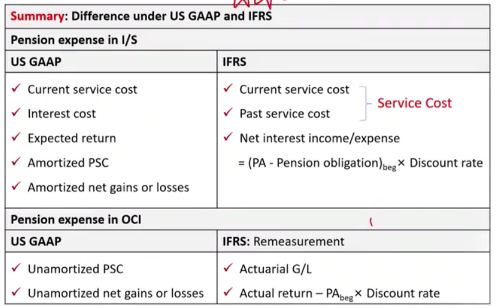

- US GAAP 的OCI
  - PSC全额进入OCI，剩余年限摊销
  - Unamortized net gains or losses，可以全额进入OCI，但更常见的采用corridor approach。

### 4. Examples for DB Plan Accounting \*\*\*

#### 4.1 IFRS

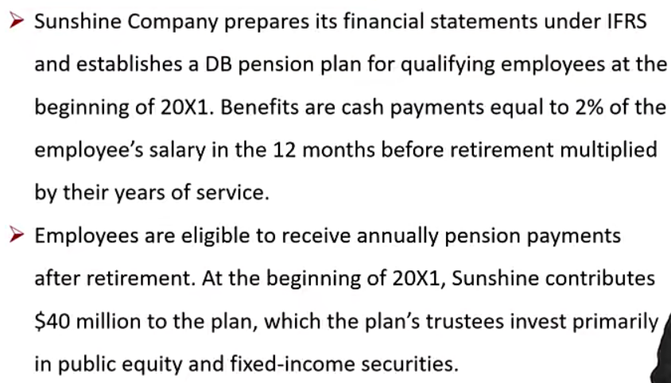

- years of service \* 2% \* salary 12m before retirement
- contribute 40 million

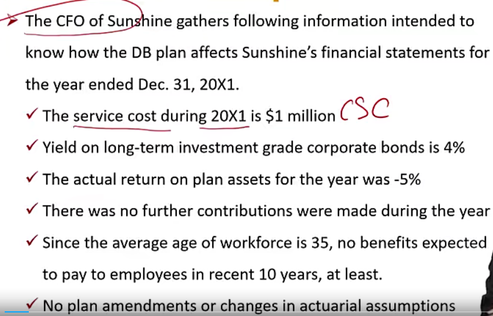

- r = 4%
- actual return = \-5%

##### Q1 第一年末的会计处理

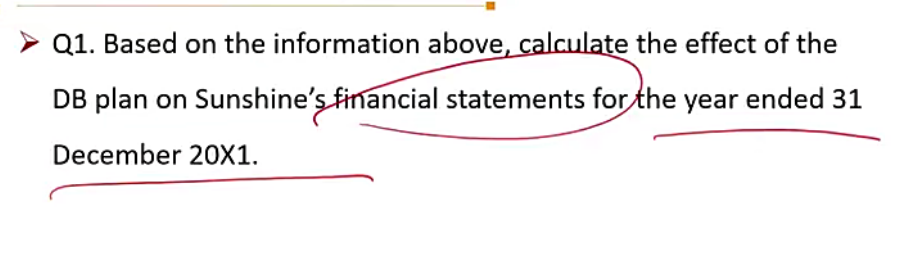

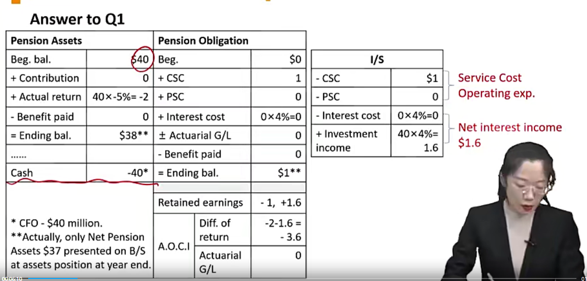

- 注意，实际中，需要轧差PA and PBO，最后呈现在Asset 端37.
- 注意，service cost = CSC + PSC。

##### Q2 第9年会计处理

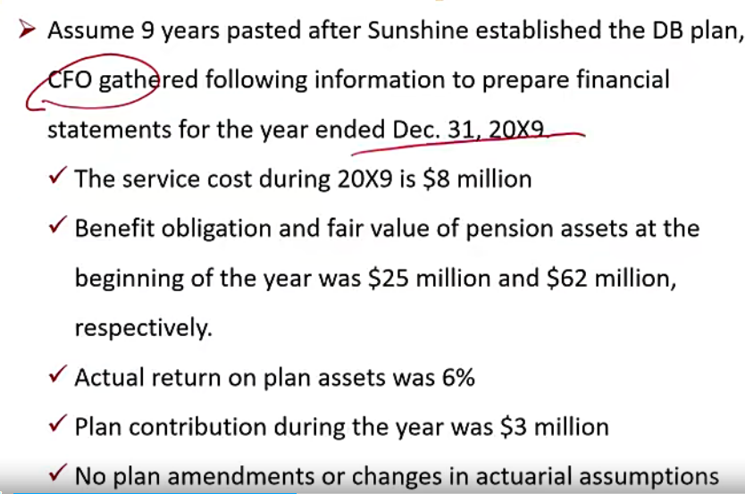

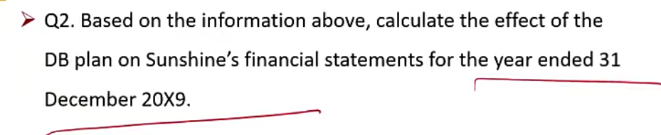

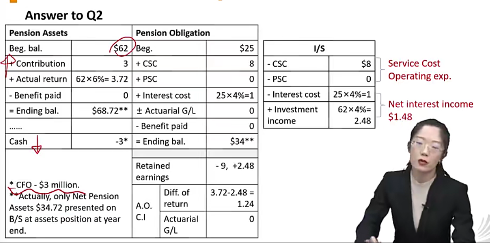

### 5. Effects for changing pension assumption \*\*\*

#### US GAAP

|                         | Changes  | Pension obligation | Pension expense in I/S |
| ----------------------- | -------- | ------------------ | ---------------------- |
| Discount rate           | increase | decrease           | **decrease**           |
| Estimated future salary | increase | increase           | increase               |
| Expected return rate    | increase | no effect          | **decrease(US GAAP)**  |

- r上升时：
  - PBO begin下降
  - CSC其实等于PV(退休年薪 \* formula)，r上升，现值变少，CSC减少
  - interest expense下降：因为PBO beginning下降。
    - 注意，Int expense = PBO beg. \* r.这里r上升，PBO下降。因为PBO是未来PMT折现，是$o((1/r)^n)$，所以 Int Expense下降。

- expected return，参考上面US GAAP下对expected return的说明，expected return is an offset on pension expense. 所以expected return增加，expense offset多了，那么pension expense 减少。

### 6. Other accounting 

#### 6.1 Contributions 往养老金充钱

- In many jurisdictions, employers' plan contributions are tax deductible, so contribution decisions are made with tax planning considerations
  - contribution增加，taxable income下降，可以降低交税。
  - A company in a tax jurisdiction with limits on tax loss carryforwards may choose to make contributions only in years when it has **positive** taxable income.
    - tax loss carryforward税损结转。比如今年亏损，产生的亏损可以未来抵扣。（DTA deferred tax asset）

#### 6.2 Closed and Frozen DB Plan

可见DB Plan对公司报表压力比较大，一般公司都偏向于转为DC Plan

- A **closed DB plan** means that new employees can no longer enter the plan.
- A **frozen DB plan** means that current beneficiaries no longer accrue additional benefits from service, so their future benefit payments are fixed.
- In cases of closed and frozen plans, affected employees' benefits are typically replaced by DC plans.
  - Analysts may not make detailed forecasts because the plan is not material to the investment case.

### 7. Valuation Consideration

#### Asymmetrical treatment of funded status

- If funded status is **overfunded**, net pension asset is **ignored** in valuation.
- If funded status in **underfunded**, net pension liability is considered **as debt** in the calculation of enterprise value.($\sum FCFF/(1+r_e)^i$+Debt)
- 所以，本质是公司向员工借钱，然后员工退休后还给员工。

#### Future service costs

- Should be **deducted from free cash flow**, even though are not cash expenses.
  - FCFF = NI + NCC - WC - FC + Int(1-t)
  - 这里意思是不应该把service cost考虑在NCC里。Service cost实际上是员工今天付出劳动，企业应该付款给员工，但是延迟到退休才发放。所以service cost当作认为**现金成本**。

