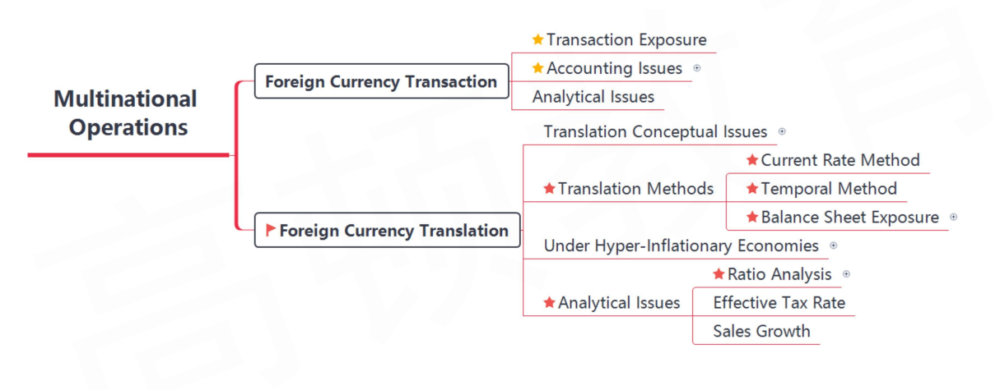

- Translation，外币报表折算

##  I. Introduction of Foreign Currency Activities

- A multinational company is likely to have two types of foreign currency activities that require special accounting treatment
  1. Engage in transactions that are denominated in a foreign currency
     - **foreign currency transactions**
  2. Invest in foreign subsidiaries that keep their books in a foreign currency
     - **foreign currency translation**