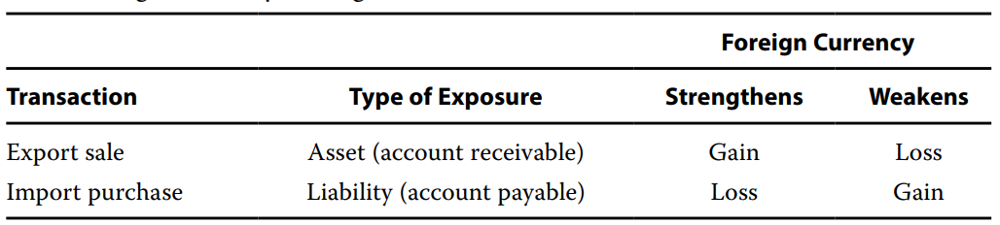

# Foreign Currency Transactions

- The multinational company may engage in **<u>business transactions</u>** that are denominated in a foreign currency
  - Foreign currency transactions occur when a company:
    - (1) makes an **<u>import purchase</u>** or an **<u>export sale</u>** that is denominated in a foreign currency
    - (2) borrows or lends funds where the amount to be repaid or received is denominated in a foreign currency
  - Because foreign exchange rates fluctuate over time, the value of foreign currency payables and receivables also fluctuates. 风险敞口来源于时间差，外币的应收帐款和应付账款。
- The major accounting issue here is how to reflect the changes in value for foreign currency payables and receivables in the financial statements.

#### Transaction Exposure

-  A **foreign currency transaction exposure** is an exposure to foreign exchange risk related to imports and exports
  - **Import purchase**: the importer is exposed to the risk that from the **<u>purchase date</u>** until the **<u>payment date</u>** the foreign currency might **<u>increase</u>** in value, thereby increasing the amount that must be spent to settle the account payable
    - 进口，付出外币，担心外币升值。
  - **Export sale**: the exporter is exposed to the risk that from the **purchase date** until the **payment date**, the foreign currency might **<u>decrease</u>** in value, thereby decreasing the amount can be converted when it is received.
    - 出口，以后收到外币，希望外币以后升值。

#### Accounting for Foreign Currency Transactions

1. **Settlement before balance sheet date**

   - 交易日->结算日（付钱）->资产负债表日

   - Foreign currency transactions are measured in the presentation(reporting) currency at the **<u>spot rate</u>** on the **<u>transaction date</u>**
     - 国内企业卖东西给外企。
     - 交易日，合同是收到100$，汇率CNY/USD=6，确认应收账款600￥
   - Both IFRS and US GAAP require the **<u>change in the value</u>** of the foreign currency asset(account receivable) or liability(account payable) resulting from a foreign currency transaction to be treated as **<u>a gain or loss reported on the income statement</u>**.
     - 结算日，汇率变动到7，收到100美元现金。此时B/S，cash+700人民币，应收账款-600，剩下的100作为gain，进入Return Earning(RE)
     - 所以，如果是应收账款(资产端敞口)，外币升值对公司有利。如果是应付账款，外币贬值对公司有利。

2.  **Settlement after balance sheet date**

   - 交易日->资产负债表日->结算日（付款cash）

   - For foreign currency transactions whose settlement dates fall in subsequent accounting periods, both IFRS and US GAAP require adjustments to reflect intervening changes in currency exchange rates
     - Foreign currency transaction gains and losses from "**<u>transaction initiation</u>** to **<u>balance sheet date</u>**" are **<u>reported on the income statement</u>**, creating one of the few situations in which accounting rules allow, indeed require, companies <u>recognize a gain or loss in income before it has been realized</u>
       - 要求第一年确认G/L，有点像FVPL。
     - Foreign currency transaction gains and losses from "**balance sheet date** to **transaction settlement**" are recognized **on next year's income statement**.
       - 注意，结算日的汇率变动，是和上一年的资产负债表日进行比较。
       - 另外，第一年资产负债表日的gain/loss是unrealized G/L。
   - 例子：交易日，确认应收100$。即期汇率：交易日:6，资产负债表日：5，结算日：5.6
     - 交易日应收账款+600
     - 资产负债表日：确认loss -100
     - 结算日确认：+60 gain
     - TODO：BS如何配平？

#### Accounting

- Whether a change in exchange rate results in a foreign currency transaction gain or loss(measured in local currency) depends on
  1. The **nature of the exposure** to foreign exchange risk(asset or liability) 头寸方向
  2. The **direction of change** in the value of the foreign currency(strengthens or weakens)

- Gain/Loss = f(type of exposure, direction of change of foreign currency)

#### Analytical Issues

- Both IFRS and US GAAP require foreign currency transaction gains and losses to be reported in net income, but **neither standard indicates where on the income statement** these gains and losses should be placed
  - This would **distort** the direct comparison of operating profit and operating profit margins.
  - 比如往operating income还是non-operating income加。所以，涉及跨国结算，公司和公司间的比较，要注意外汇结算的损益记在哪个位置。
- A second issue that should be of interest to analysts relates to the fact that **<u>unrealized foreign currency transaction gains and losses</u>** are included in net income when the balance sheet date falls between the transaction and settlement dates. 
  - 类似FVPL，未实现的损益记在gain and loss.

#### Summary

