# Foreign Currency Translation

## I. Translation Conceptual Issues

#### Background of Foreign Currency Translation

- Many companies have operations in foreign countries and most operations located in foreign countries keep their accounting records and prepare financial statements in the local currency
- To prepare worldwide consolidated statements, parent companies must translate the foreign currency financial statements of their foreign subsidiaries int o the parent company's presentation currency.

#### Classification of Currency

- **Presentation currency(reporting currency)** is the currency in which financial statement amounts are presented
  - The entity's financial statement shall be finally converted to reporting currency
  - 最终报表呈现的币种，这里特指母公司合并报表的呈现币种。
- **Functional currency** is the currency of the primary economic environment in which an entity operates, and normally is the currency in which an entity primarily generates and expends cash
  - The functional currency reflects the "substance" of the subsidiary economic activities
  - 这里的entity特指**子公司**，主要经营环境产生的币种，反应子公司经营实质。
- **Load currency** is the national currency of the country where an entity is located
  - The financial statement prepared by the entity is usually in local currency.
  - 这里特指子公司所在地的币种。

#### More Details about functional currency

- The **functional currency** is the currency of the primary economic environment in which an entity operates
  - functional currency意思是主要经营活动用的是什么货币。
- Deciding the functional currency
  - The currency that influences sales prices for goods and services
  - The currency that influences labor, material and other costs
  - The currency from which funds are generated
  - The currency in which receipts form operating activities are usually retained

#### Choice of Foreign Currency Translation Method

- If the **foreign local currency** is the **functional currency**, which differs from the **<u>parenet's presentation currency</u>**, the foreign entity's foreign currency financial statements are translated into the parent's presentation currency using **current rate method**. 现时汇率法。
- If the <u>**parent's presentation currency**</u> is the **<u>functional currency</u>**, which differs from the **foreign entity's local currency**, the foreign entity's foreign currency financial statements are remeasured into the parent's presentation currency using **temporal method**. 时态法.
  - US GAAP refer to this process as "remeasurement"
  - IFRS describe this situation as "reporting foreign currency transactions in the functional currency"

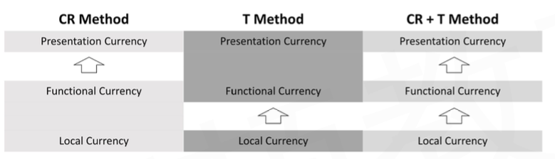

- functional和local一样，用current rate
- funcitonal和presentation一样，用temporal method
- 注意：
  - 子公司比较独立的时候，意思是functional currency 和local currency一致。
  - 子公司比较依赖母公司，意思是functional currency 和presentation currency一致。
- 注意：
  - 这里presentation是母公司合并财务报表
  - functional 是子公司经营现金币种
  - local currency是子公司所在地
- 注意：
  - 三个币种不一致的时候，分两步折算，第一步用temporal method把local 折算成functional，第二步把functional用temporal method折算到presentation

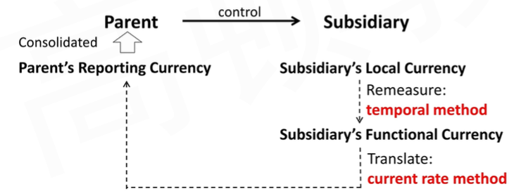

- 注意，tranlation结束后。还需要继续consolidate合并财务报表。（回顾reading 1）。也就是说，这一个reading只涉及子公司个别财务报表的转换。并没有consolidated financial statement.
- 拓展：中国企业会计准则19号规定，有两种货币：记账本位币，境外经营记账本位币，转换使用current method现时汇率法。

#### Summary

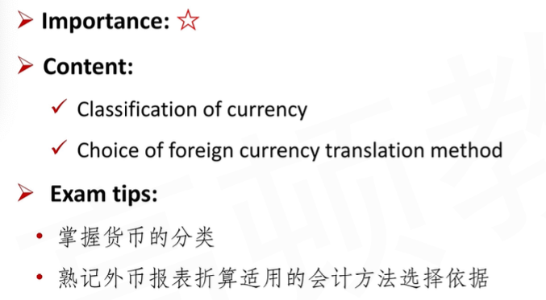

## II. Translation Method

### II.1 Current Rate Method

#### Translation Conceptual Issues

- In translating foreign currency financial statements in to the parent company's presentation currency, two questions must be addressed:
  1. What is the appropriate exchange rate to use in translating each financial statement item?
     - currency exchange rate
       - 指的是资产负债表日那一天的汇率
     - average exchagne rate
     - historical exchange rate**s**
       - 有很多个历史汇率，需要和具体事件绑定
  2. How is balance sheet brough back into balance?
     - 不同会计科目乘以不同的汇率，导致BS不平。恢复平衡的方法对于current method and temporal method不一样。

#### Current Rate Method

- In most cases, a foreign entity will operate primarily in the currency of the country where it is located, which will differ from the currency in which the parent company presents its financial statements
- In this situation, the **current rate method** should be used:
  1. **<u>All assets and liabilities</u>** are translated at the **<u>current exchange rate</u>** at the balance sheet date
     - 这是因为资产负债表是时间点的概念
  2. **<u>Stockholders' equity accounts</u>** are translated at **<u>historical exchange rates</u>**
     - 不同事件参考不同时间的历史汇率。
  3. **<u>Revenues and expenses</u>** are translated at the exchange rate that existed when the transactions took place
     - For practical reasons, an **<u>average exchange rate</u>** may be used.

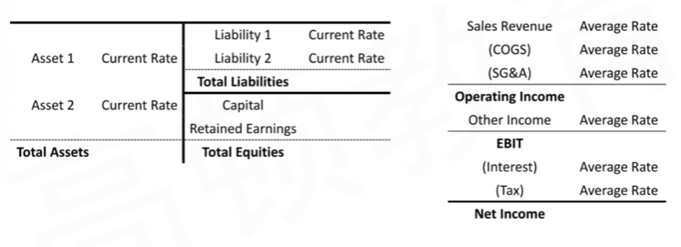

#### Questions

1. Is presentation currency calculated by local currency times or divided by exchange rate?
   - PC presentation currency
   - LC local currency
   - 直接标价法：Domestic Currency / Foreign currency
   - DC/FC = PC/LC，此时，LC \* PC/LC直接乘汇率
   - 如果indirect quote method: LC / (FC / DC) 除以汇率
2. What kind of exchange rate is used for operating income?
   - 注意上面的图，在I/S中，小结项，比如Operating Income，EBIT，Net Income都没有标注Average rate。这是因为这些项目通过子项目加减计算获得。建议通过这种子项目调整然后汇总的方式，而不建议通过原报表的Net Income的local currency直接乘以汇率计算report currency的项目。
3. What king of exchange rate is used for shareholders' equity?
   - 总的项目equity是currenct rate，但是 equity里包含很多项目，比如RE, Paid-in Capital, 等。按照前面的说法，sharesholder equity 都是用历史汇率，所以，这里的意思是，不同的equity项目，用不同的历史汇率；而且RE为了和I/S吻合，使用的是BASE法则进行计算（$\Delta RE=NI-Dividend$）。
   - 最后，equity总数，和asset 和liability一样，都是调整以current rate.
4. Is each statement item in the shareholders' equity obtained by multiplying(dividing) by historical exchange rate?
   - 除了RE，使用BASE法则计算。
5. Is balance sheet balanced after translation?
   - 通过历史汇率和BASE法则计算equity中的项目，有可能数字不等于local currency \* current exchange rate。这时候，通过增加一个cumulative translation adjustment，强行使得报表平衡。
6. What is the order of translation?
   - 先做利润表。然后算Return Earning. 再计算Asset/Liability，以及剩余的equity，最后增加**cumulative translation adjustment**，具体看下图。计算顺序：A->B->C，也就是NI->delta RE-> cumulative Translation Adjustment
   - 注意，RE,beg, PC，是已经转换过的presentation currency的子公司的RE.

#### Illustration

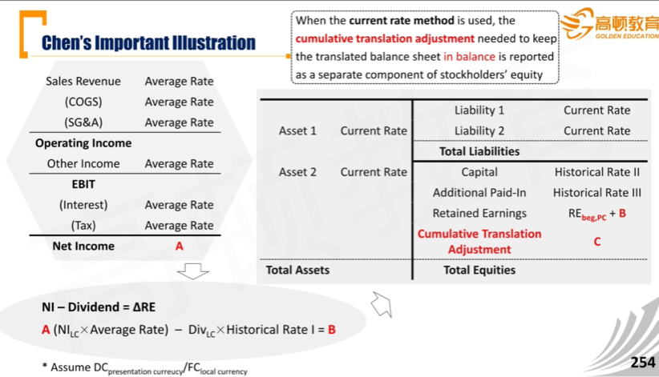

- 注意，复习CFA一级，这里的CTA是时间点数字。$\Delta$CTA，体现在OCI，其他综合收益中。
- 注意，历史汇率要和具体的事件联系一起，所以不同的historical rate不一样。比如historical rate when dividends were declared.

#### Example

- 在课本LV2，145页。
- 几点要注意：
  - 如果Net Income - Dividend = 当年年末的RE。这表示RE1 - RE0 = RE1，意思是RE0 = 0. 表示公司在今年的1月1日才成立
  - 对于刚成立的公司，capital stock 使用的历史汇率，一般是年初的汇率，指的是成立那天的汇率。

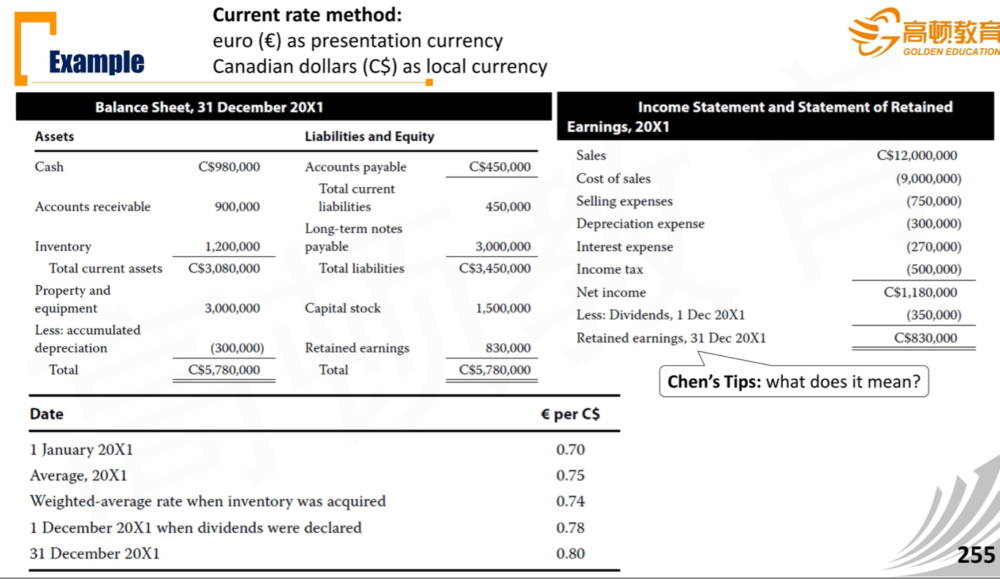

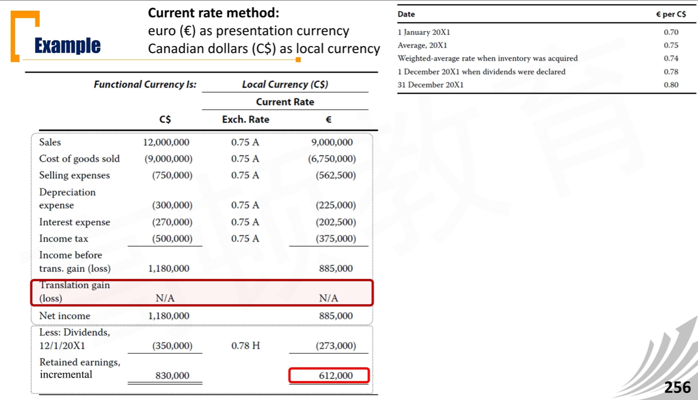

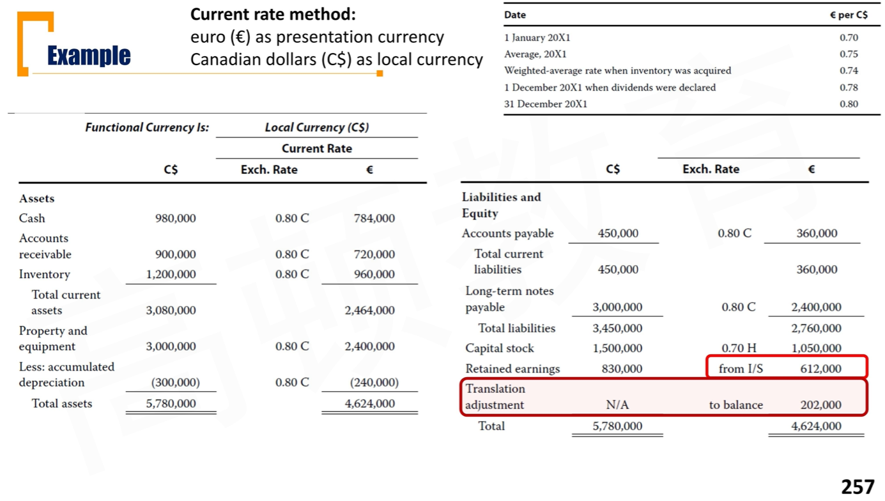

#### Summary

### II.2 Temporal Method

#### Monetary and Non-Monetary Items

货币性和非货币性项目。注意这不是会计上的分类，会计上对资产分类是current/non-current. 

- **Monetary items** are cash and receivables (payables) that are to <u>be received (paid) in a fixed number of currency units</u>
  - 固定金额。

1. **Monetary assets** include **<u>cash</u>** and **<u>accounts receivable</u>**
2. **Non-monetary assets** 非货币资产又分为两类：
   - Non-monetary assets measured **at current value**(e.g., **<u>marketable securities</u>**（FVPL）)（current指资产负债表日）
   - Non-monetary asets measured **at historical costs**(e.g., **<u>inventory, PPE, intangible assets</u>**)
3. **Monetary liabilities**
   - Such as **<u>accounts payable, accrued expenses, long-term debt, and deferred income taxes</u>**
4. **Non-monetary liabilities** include **<u>deferred revenue</u>**

- 注意：**Most of libilities are usually regarded as monetary items**
  - 绝大多数负债都是monetary items，e.g. AP, DTL. 

#### Temporal Method

- In some cases, a foreign entity might have the parent's resentation currency as its functional currency

- In this situation, the **temporal method** should be used:

  1.1. **Monetary assets and liabilities** are translated at the **current exchange rate** 货币性的A/L按照current exchange rate

  1.2. **Non-monetary assets and liabilities measured at historical cost** are translated at **historical exchange rates**历史成本计量的non-monetary，按照historical exchange rate

  1.3. **Non-monetary assets and liabilites measured at current value** are translated at the **exchange rate at the date when the current value was determined** 使用current value计量的，non-monetary，按照current exchange rate

  2. **Stockholders' equity accounts** are translated at **historical exchange rates**
     - 注意，Return Earning在此不是按照historical exchange rate计算，而是和current method一样通过I/S计算。但是，在temporal method没有CTA，而是通过期末的RE使得B/S平衡

  3.1 **Revenues and expense, *<u>other than</u>* those expenses related to non-monetary assets** are translated at the exchange rate that existed when the transactions took place

  - For practical reasons, **average rates** may be used
  - 排除掉non-monetary挂钩的费用，剩下的可以用average rates
  - 什么是non-monetary挂钩费用，看3.2

  3.2 **Expenses related to non-monetary assets**, such as <u>cost of goods sold(inventory), depreciation(fixed assets), and amortization(intangible assets)</u>, are translated at the **exchange rates used to translate the related assets**.

  - COGS，Depreciation, amortization.
  - 这里意思是，资产B/S里用什么汇率，I/S里也用什么汇率。（除了COGS，具体看下文）

- The basic idea underlying the temporal method is that assets and liabilities should be translated in such a way that <u>the measurement basis(either current value or historical cost) in the foreign currency is preserved after translating to the parent's presentation currency</u>
  - 这句话意思是temporal method的基本原理：折算完成后，计量属性不发生改变。也就是，汇率和计量属性匹配。比如用current value计量（公允价值），那使用的汇率，也应该是资产负债表日那一天的汇率。
- When the temporal method is used, the **translation adjustment** needed to keep the translated balance sheet in balance **is reported as a gain or loss in net income**
  - 如何使得B/S平衡？和current method不一样，这里通过控制net income，调整equity，使得两遍平衡。
  - US GAAP refer to these as "**remeasurement gains or losses**"
  - IFRS没有具体科目名称规定
  - 和current method的CTA区分！

#### Illustration

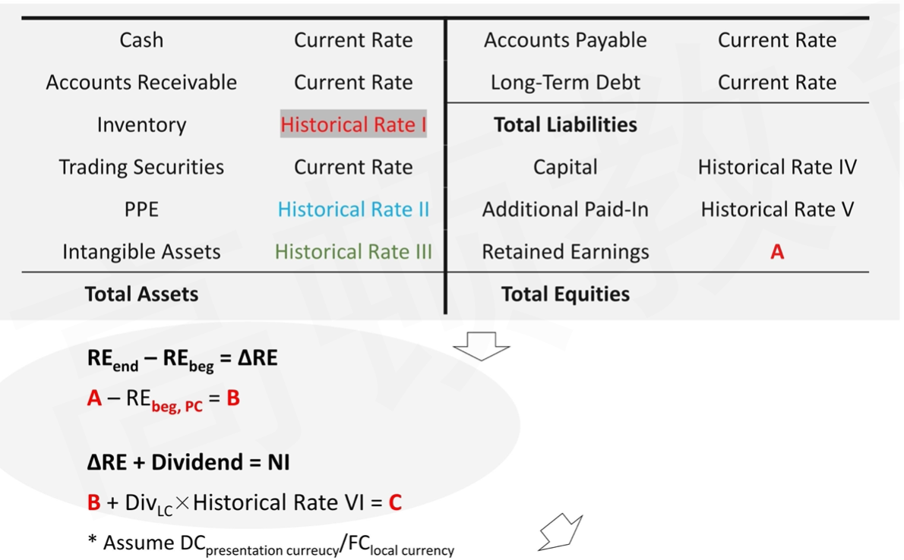

- 先资产负债表区分货币性和非货币性。non-monetary asset，用各自对应的historical rate. 
- Retain Earning此时已经确定。通过Asset - Liability - other equity = REend求得。
- Dividend也需要用historical rate进行转换。
- 上面，Net Income最后需要计算得到`C`. 然后下面再计算每一项I/S项目，最后计算得到`D`. 
- 下面的historical rate of non-monetary asset，计算对应的expense时候采用对应的historical rate. 当然，COGS根据cost flow不一样，有一定的区别，具体看下文。

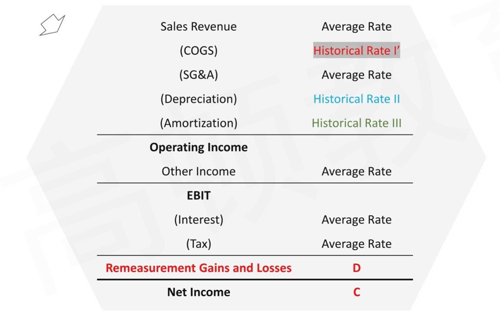

#### Inventory and COGS

- The **historical exchange rates** used to translate **inventory** and **cost of goods sold** under the temporal method will differ **<u>depending on the cost flow assumption</u>**: FIFO, LIFO, or average cost
  - If **FIFO** is used, ending inventory will be translated at **<u>relatively recent</u>** exchange rates, and COGS will be translated at **<u>relatively older</u>** exchange rates.
    - 库存是新的，卖掉的是旧的，所以COGS用的是更久的historical exchange rate.
  - If **LIFO** is used, ending inventory will be translated at **<u>relatively older</u>** exchange rates, and COGS will be translated at **<u>relatively recent</u>** exchange rate.
    - 同理，LIFO相反
  - If **weighted-average cost** is used, both ending inventory and COGS will be translated at the **<u>weighted-average</u>** exchange rate for the year.
    - 注意，这里的weighted-average exchange rate不是之前说的average rate. 这里的weighted-average计算方法和存货有关。
  - 补充：
    - specific method, 通过inventory入库的具体日期的historical rate
    - IFRS不允许LIFO

#### Example

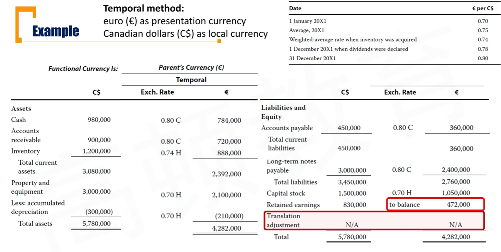

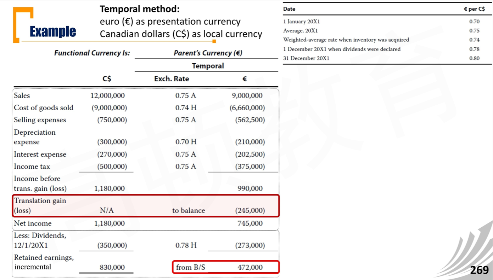

- 从BS得到RE，得到NI。
- 这里要注意一个现象，同样的资产负债表，在上一章current method中，带来的是20.2w的CTA增加，而这里带来的是24.5w的loss。这里产生区别的原因在下文提及。

#### Summary

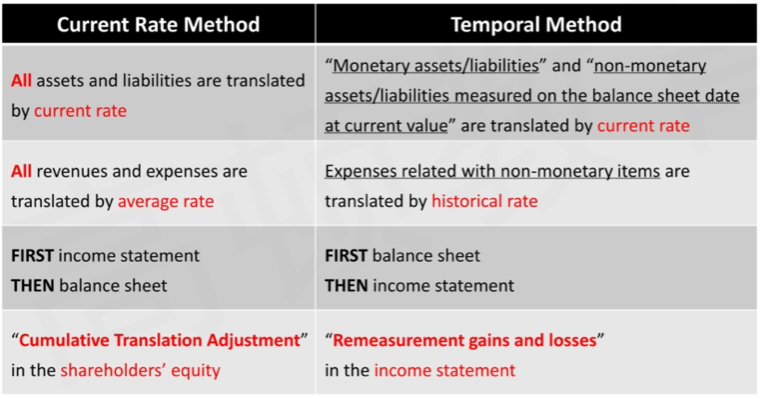

- 注意：CTA是时间点数（存量），Remeasurement gains and losses是时间段数（增量）。
- 注意：复习
  - local currency = function currency != presentation currency
    - 使用current method
  - local curreny != function currency = presentation currency
    - 使用temporal method

#### Use Both Translation Methods

- Under both IFRS and US GAAP, a multinational corporation may need to use **both** the **current rate method** and the **temporal method** of translation at a single point in time
  - 情况1：local currency != function currency != presentation currency
  - 情况2：一个母公司，对应多个子公司。子公司1用current method, 子公司2用temporal method.
- As a result, a multinational corporation's consolidated financial statements can reflect simultaneously both
  1. a **<u>net translation gain or loss</u>** that is included in the determination of <u>net income</u> (from foreign subisidiaries translated using the **temporal method**) and:
  2. a separate **<u>cumulative translation adjustment</u>** reported on the balance sheet in <u>stockholders' equity</u> (from foreign subisidiaries translated using the **current rate method**)

#### Disclosures Related to translation methods

- Both IFRS and US GAAP **require** two types of **disclosures** related to foreign currency translation:意思是在notes披露：
  1. The amount of exchange differences recognized in **net income**
     - 由汇率影响到的净利润，有两项It consists of:
       - Foreign currency **transaction** gains and losses 交易
       - **Translation** gains and losses resulting from application of the temporal method 折算
     - Neither IFRS nor US GAAP require disclosure of the two separate amounts。不要求分开这两点报告。
  2. The amount of cumulative translation adjustment（CTA） classified in a **separate component of equity**

#### Summary

### II.3 Balance Sheet Exposure

这节解释两个method带来的看似矛盾的点：translation gain/loss: 一个减少NI，一个增加equity.

#### Balance Sheet Exposure

资产负债表更重要，通过资产负债表体现风险敞口更准确。current rate每年发生变动，通过CR折算的科目，会导致敞口。

- Those <u>assets and liabilities translated at the current exchange rate</u> are **revalued** from balance sheet to balance sheet in terms of the parent company's presentation currency, and these items are said to **be exposed to** translation adjustment.
  - 只有通过current rate折算的项目，才会暴露在汇率波动的风险敞口之下。
  - Balance sheet items translated at historical exchange rates <u>do not change in parent currency value</u> and therefore are not exposed to translation adjustment. Historical rate折算的科目，不会变动，所以不会产生风险敞口。
  

#### Net Asset/Liability Exposure

净资产敞口、净负债敞口。通过current exchange rate折算的A，L的比较。

- There is a **net asset blance sheet exposure** when **<u>exposed assets</u>** are greater than **<u>exposed liabilities</u>**
  - A foreign operation will have a net asset balance sheet exposure when **assets translated at the current exchange rate** are greater than **<u>liabilities translated at the current exchange rate</u>**
- There is a **net liability balance sheet exposure** when **<u>exposed liabilities</u>** are greater than **<u>exposed assets</u>**
  - A net liability balance sheet exposure exists when **<u>liabilities translated at the current exchange rate</u>** are greater than **<u>assets translated at the current exchange rate</u>**

- The sign(positive or negative) of the current period's **translation adjustment** is a function of two factors: 头寸、汇率变动方向
  1. The nature of the balance sheet exposure(asset or liability)
  2. The direction of change in the exchange rate(strengthens or weakens)

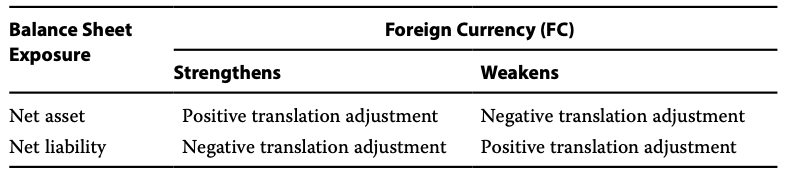

- 注意这里的positive translation adjustment意思是，$\Delta CTA >0$
  - 注意**不是**CTA>0
- 复习：第一节：transaction。根据手上的头寸，判断希望汇率变动的方向。

#### Net exposure Under current Rate Method

- The **current rate method** results in a **<u>net asset balance sheet exposure</u>**
  - Items translated at current exchange rate:
    - Total assets > total liabilities -> Net asset balance sheet exposure
- When the foreign currency increases in value(i.e., strengthens), application of the current rate method results in an <u>**increase** in the positive cumulative translation adjusment</u>(or a <u>**decrease** in the negative cumulative translation adjustment</u>) reflected in stockholders' equity。意思就是$\Delta CTA > 0$
  - The cumulative translation adjustment will be the sum of the translation adjustments that arise over successive accounting periods. CTA是存量，时间点数。
- 现时汇率法->外币升值->translation gain->$\Delta CTA>0$->OCI增加。
  - TODO问题：AOCI呢？？？CTA一增加，AOCI怎么变动？？？是不是反过来Equity又多增加一遍dCTA？

#### Net exposure under Temporal Method

- The temporal method generates either a <u>net asset</u> or a **net liability balance sheet exposure**
  - Liabilities translated at the current exchange rate(exposed liabilities) **often** exceed assets translated at the current exchange rate(exposed assets) 
    - 因为liabilities基本全部都用current rate，但是assets只有monetary部分才用current rate. 
    - 一般企业不会持有太多现金，会产生cash drag，拉低回报。
    - 所以一般都是net liability balance sheet exposure. 
    - 所以，current method and temporal method的风险头寸一般相反。
    - **Exposed assets < exposed liabilities** -> Net liability balance sheet exposure
- When the foreign currency increases in value(i.e., strengthens), application of the temporal method results in a <u>translation losses</u>, which will reduce the net income for this year.
  - 外币(subsidiary's local currency)升值，本币贬值，导致remeasurement loss.

#### Example

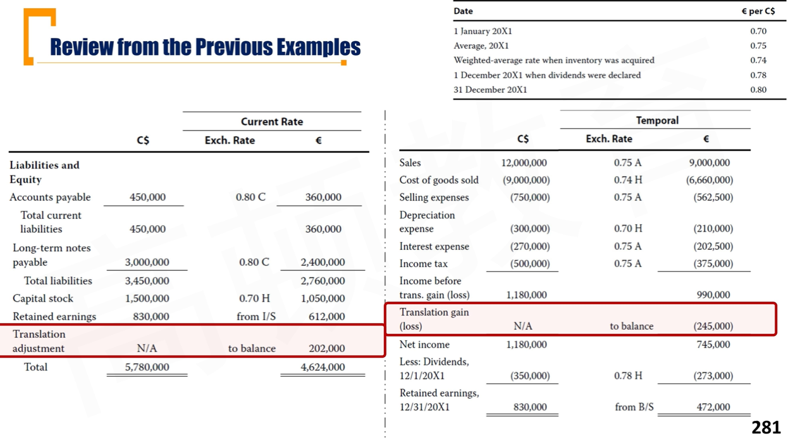

#### Summary

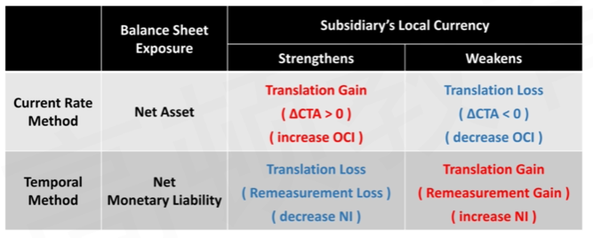

### II.4 Under Hyper-Inflationary Economies

注意，这里说的是子公司所在地，国外发生通货膨胀。

#### Highly Inflationary Economies

- US GAAP define a **highly inflationary economy** as one in which the **<u>cumulative three-year inflation rate exceeds 100%</u>**(but note that the definition should be applied with judgment（实质重于形式）, particularly because the trend of inflation can be as important as the absolute rate)
  - A cumulative three-year inflation rate of 100% equates to an average of approximately 26% per year
- IFRS does not provide a specific definition of high inflation, but indicates that a cumulative inflation rate approaching or exceeding 100% over three years would be an indicator of hyperinflation.

#### Accounting principles for Highly Inflationary Economies

- When a <u>foreign entity</u> is located in a highly inflationary economy, the entity's functional currency is **<u>irrelevant</u>** in determining how to translate its foreign currency financial statements into the parent's presentation currency. 发生恶性通胀时，不再用functional currency判断用哪种方法。
  - **IFRS** require that the foreign entity's financial statments first  **<u>be restated for local inflation</u>**, and then the inflation-restated foreign currency financial statements are translated into the parents's presentation currency using the **<u>current exchange rate</u>**.
    - IFRS要求两步：子公司报表重述调整（币种还没变），然后用粗暴地用current exchange rate转换（不是current method）
  - **US GAAP** do not allow restatement for inflation, but instead require using the **temporal method**.

#### Questions

1. If hyper-inflation occurs in the country where the parent company is located, how to translate foreign currency statements?
   - 上面说到的方法，是指子公司的通货膨胀，如果母公司发生恶性通胀，不影响原有的会计处理逻辑（current method, temporal method）
2. Which of the two methods(current rate method and temporal method) is more affected by hyper-inflation, and what is the impact?
   - current method影响更大。复习经济学知识：恶性通货膨胀，导致资金流出，导致汇率下跌，导致current exchange rate极小，导致Asset, Liability变得极小。但是temporal method还有一部分historical rate，还留有一些资产。
3. What is the essence of IFRS restated for local inflation?
   - 保证报表上科目金额的实际购买力不变。
4. Under IFRS, do all statement items need to be restated for inflation?
   - monetary不能重述。比如cash, account receivable.
5. Under what circumstances are the results of IFRS and US GAAP similar?
   - 复习经济学：购买力平价成立时：通货膨胀率$\pi$，汇率贬值$1/\pi$
   - $\%\Delta S_{f/d}=\pi_f-\pi_d$
   - $\pi=(P_1-P_0)/P_0$
   - 注意，上面是间接标价法，所以如果本国相对通胀是0，相当于外国通胀$\pi$，那么间接标价法涨$\pi$，那么直接标价法跌$1/\pi$.
   - IFRS: 
     - non-monetary: 先restate乘以$\pi$，在乘以current rate = $s_{his}/\pi$
     - monetary: current rate
   - US GAAP:
     - non-monetary: historical = $s_{his}$
     - monetary: current rate
   - 所以，对于monetary，都是乘以current rate；对于non-monetary，如果购买力平价，current rate \* $\pi$ = historical rate
   - 所以，US GAAP就是假定PPP成立。

#### IFRS: restated for inflation

- IFRS require the foreign currency financial statements **first** the be **restated for inflation** using the following procedures, and **then** the inflation-adjusted financial statements are translated **using the current exchange rate**.

##### **Balance Sheet**

1. **Monetary assets and monetary liabilities** are **<u>not restated</u>** because they are already expressed in terms of the monetary unit current at the balance sheet date
   - Monetary items consist of cash, receivables, and payables.
2. **Non-monetary assets and non-monetary liabilities** are **<u>restated</u>** for changes in the general purchasing power of the monetary unit
   - Most non-monetary items are carried at historical cost, and the restated cost is determined by applying to the historical cost the change in the general price index from the date of acquisition to the balance sheet date.
     - 这句话意思：比如：一个非货币性项目PPE，是6月1日买入acquire，在资产负债表日12月31日，只计算6月1日至12月31日发生的通胀。
     - $P_{12.31}/P_{6.1}$
3. **All components of stockholders' equity(<u>except for</u> retained earnings)** are restated by applying the change in the general price level from the beginning of the period or, if later, from the date of contribution to the balance sheet date. （$P_1/P_0$）
   - **<u>Restated</u>** **retained earnings** are **<u>derived</u>** from all the other amounts in the restated statement of financial position. RE用来最后配平。注意这里是restatement，没有CTA或者remeasurement。

##### **Income statment**

1. **All income statement items** are **<u>restated</u>** by applying the change in the general price index from the dates when the items were orignally recorded to the balance sheet date
   - 一般很难确认每一笔交易、费用产生的时间点，用$P_{average}$计算物价上涨水平: $P_1/P_{avg}$
2. The **<u>net gain or loss in purchasing power</u>** that <u>arises from holding monetary assets and monetary liabilities</u> during a period of inflation is included in net income
   - 注意，这里和B/S的RE需要对应，要调整NI，调整科目四Net gain or loss in purchasing power. 这里的调整来源于monetary A/L. Asset导致loss，Liability导致gain.

- **Question**
  - What little secret did you find?
    - 步骤和temporal method一样。都是往NI打一个使得报表平衡的数字。

#### Illustration

- Although the thins we do here are completely different from the **temporal method**, the internal logic of adjustment is the same

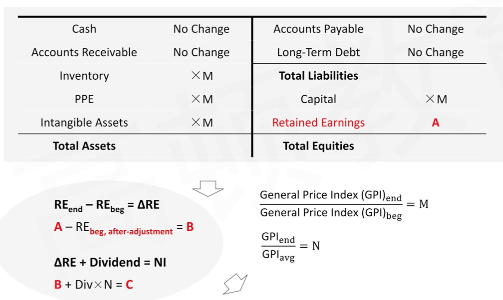

- $RE_{beg,after-adjustment}$, 这里的after-adjustment意思是也是要经过通货膨胀调整后的RE。

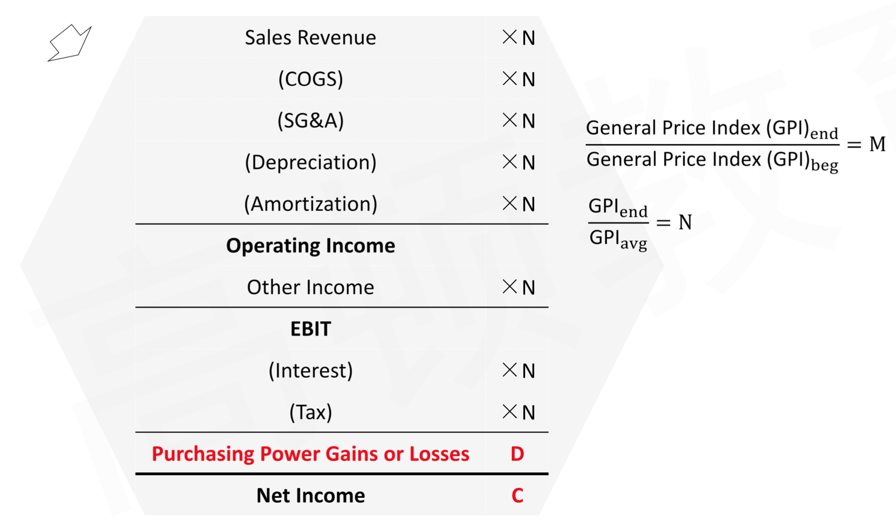

- 计算顺序: A->B->C->D

#### IFRS:Risk Exposure 风险敞口

- Only the **monetary items**, which are not restated for inflation, **are exposed to inflation risk**
  - 风险敞口体现在monetary items。最终反应在
- The effect of that exposure is **reflected through** the **purchasing power gain or loss** on the net monetary asset or liability position
  - Holding cash and receivables during a period of inflation results in a purchasing power loss. Asset导致loss
  - Holding payables during inflation results in a purchasing power gain. Liability导致gain.

#### Example

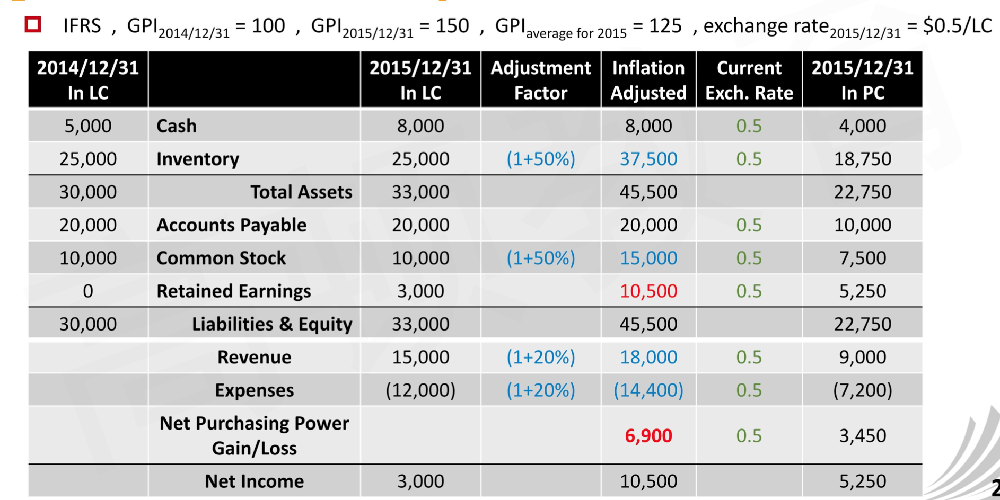

- 轧差算出RE，确定NI

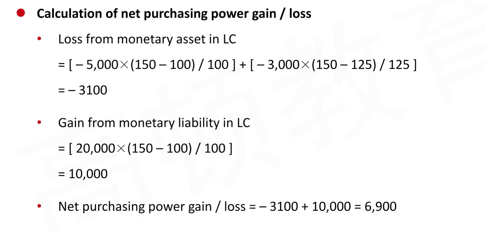

- 上面的loss: -5000指的是年初持有5000cash，经受了一整年通货膨胀；期间增加3000cash，使用平均的通货膨胀

#### Summary

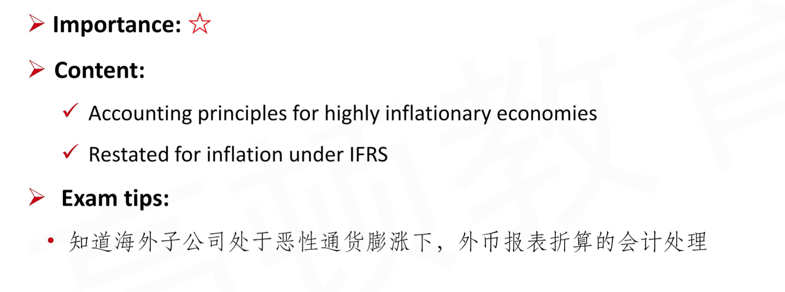

### II.5 Analytical Issues

#### Review from the Previous Examples

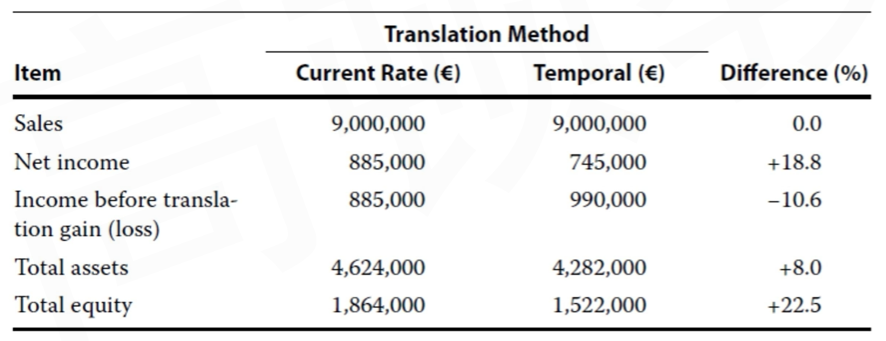

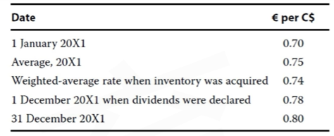

- 这里外币升值，注意，这是是直接标价法。
- The two different translation methods used to translate subsidiary's local currency into reporting currency result in very different amounts to be included in parent's consolidated financial statements
- In this particular case, the current rate method results in a significantly larger net income than the temporal method
  - Part of the reason is that under the current rate method, the <u>translation adjustment is not included</u> in the calculation of income
  - 另一个原因是使用的exchange rate不一样，比如COGS。
- The combination of smaller net income under the temporal method and a positive translation adjustment reported on the balance sheet under the current rate method results in a much larger amount of total equity under the current rate method.
  - net income差别，CTA差别，使得equity不同
- Total assets also are larger under the current rate method because all assets are translated at the current exchange rate, which is higher than the historical exchange rates at which inventory and fixed assets are translated under the temporal method.

下面ratio的比较，关键是抓住汇率如何变动。

- 直接标价法下：RC/LC = representation currency / local currency = domestic currency / foreign currency. 一单位外币换多少本币。以外币作为商品，给外币标价。（子公司的local currency是外币）
- 然后看清楚，外币贬值还是升值。外币贬值，则直接标价法下的exchange rate变小。然后有AR > CR, average exchange rate > current exchange rate. 另外historical exchange rate 需要具体分析。

#### Ratio Analysis1: Compared with original subsidiary's Ratio

- 原subsidiary报表的ratio，折算前和折算后比较
- **Financial ratios under current rate method**
  - **Pure ratios** are <u>unaffected</u> when translated by current rate method
    - pure ratio，里面的数字同时来源于一张表。
    - current ratio1 = CA / CL
    - financial leverage1 = 
      - $\frac{A1}{E1} = \frac{A1}{A1 - L1} = \frac{CR \times A0}{CR \times (A0 - L0)} = \frac{A0}{E0}$
    - Net Profit Margin1 = 
      - $\frac{NI1}{Revenue1} = \frac{Average Rate \times NI0}{AR \times Revenue0}$
    - 注意，一个bug，比如某个Asset除以capital（用historical计量）
  - **Mixed ratios** should be analyzed case-by-case
    - 比如假设LC外币贬值，CR变小,CR < AR, CR < HR
    - Asset Turnover = 
      - $\frac{Revenue_1}{Asset_1}=\frac{AR\times Revenue_0}{CR \times Asset_0} > Asset\ Turnover_0$
    - ROE = NI / Equity一样
    - ROA = NI / Asset一样

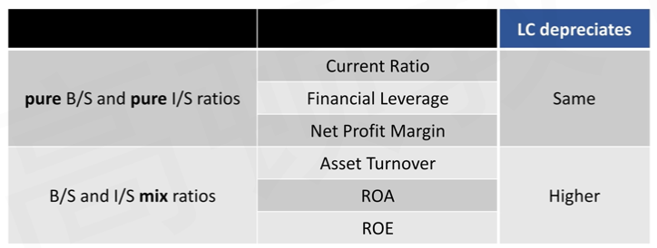

- **Finacial ratios under temporal method**: case-by-case analysis
  - temporal要具体分析

#### Ratios Analysis2: Comparison of Ratios under Two Methods

这里比较维度是不同方法之间的比较。视频36

- **Financial ratios under current rate method and temporal method**

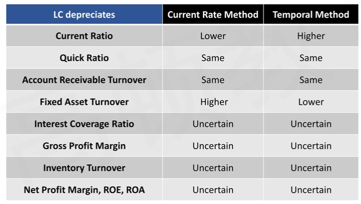

- current ratio: Temporal method高是因为inventory等non-monetary asset使用了更高的historical rate. 注意，这里条件是local currency depreciate外币贬值。
- quick ratio: cash + securities + receivables都是货币性，都是用的current rate
- Account receivable turnover = Revenue / AR. 
- Fixed asset turnover= Revenue / Fixed Asset
  - current method：Revenue使用Average rate, Fixed asset使用current rate
  - temporal method: revenue 使用average rate, fixed asset 使用historical rate
  - CR < HR，所以fixed asset turnover在current method下更高
- Interest Coverage Ratio = EBIT / I.
  - 关键在于temporal method下，AR和Historical rate的关系无法确定
  - EBIT = revenue - 各种cost
  - 各种cost使用不同的rate
  - 特别是cogs，还和inventory出库顺序LIFO FIFO等有关
- 其余和NI有关的，都是和COGS等费用难以确定rate有关

#### Multinational operations and a company's effective tax rate

复习：如果有永久性差异，effective tax rate 不等于法定税率statutory rate

- An entity with operations in multiple countries with different tax rates could aim to set transfer prices such that <u>a higher portion of its profit is allocated to lower tax rate jurisdictions</u>.
  - 把利润主要部分转到低税国家

- An analyst can obtain information about the effect of multinational operations from companies' disclosure on **effective tax rates**
  - The disclosure is presented as a reconciliation between the average effective tax rate(tax expense divided by pretax accounting profits) and the relevant statutory rate.
- Changes in the effective tax rate impact of foreign taxes could be caused by:
  1. changes in the applicable tax rates
  2. changes in the mix of profits earned in different jurisdictions

##### Illustration

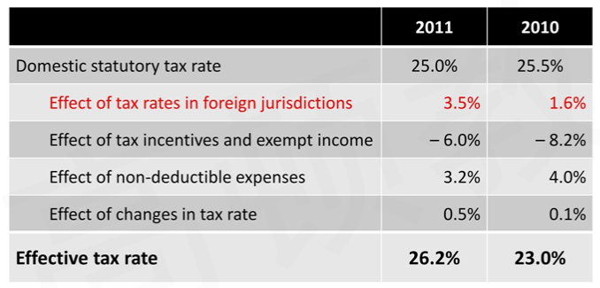

#### Disclosures Related to Sales Growth

- For a multinational company, sales growth is driven not only by <u>changes in volume and price</u>, but also by <u>changes in the exchange rates</u> between the reporting currency and the currency in which sales are made
  - Growth in sales that comes from changes in volume or price is **more sustainable** than growth in sales that comes from changes in exchange rates
  - 收入的提升有可能来源于汇率变动。内生性的增长更重要，也就是销量、价格带来的收入增长。
- Thus, an analyst will consider the foreign currency effect on sales growth both for forecasting future performance and for evaluating a management team's historical performance.

#### Summary

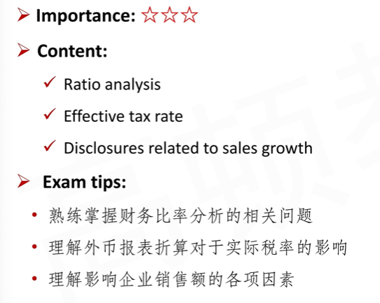
