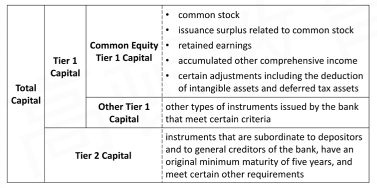
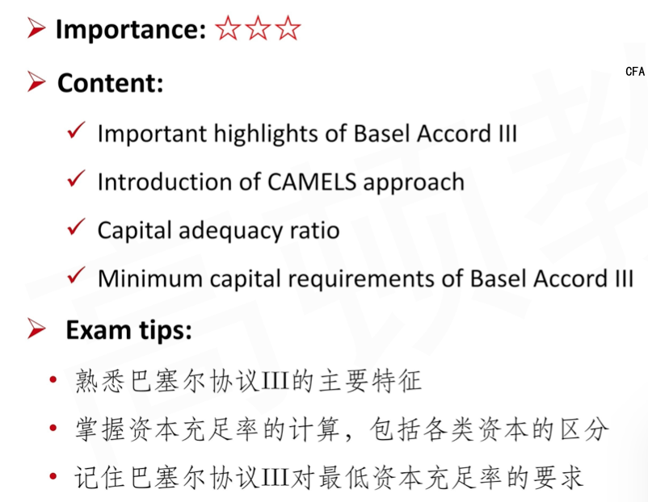
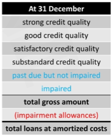

# Analysis Of Banks

## I. CAMELS Approach

### I.1 Capital Adequacy

#### Basel Commitee

- The Basel Committee developed the **international regulatory framework for banks** known as **Basel III**
- The purporse of the measures contained in Basel III are the following
  - Improve the banking sector's ability to absorb shocks arising from financial and economic stress, whatever the source.
  - Improve risk management and governance.
  - Strengthen banks' transparency and disclosures.

#### Important Hightlights of Basel Accord III

1. **Minimum capital requirement**
   - Basel III specifies the minimum percentage of its **risk-wieghted assets** that a bank must fund with capital
     - Tis minimum capital requirement prevents a bank from assuming so much **financial leverage** that it is unable to withstand loan losses
2. **Minimum liquidity**
   - A bank must hold enough **high-quality liquid assets** to cover its liquidity needs in a **30-day** liquidity stress scenario.
3. **Stable funding**
   - A bank must have a minimum amount of stable funding relative to the bank's liquidity needs over a **one-year horizon**

#### Introduction of CAMELS Approach

- **CAMMELS is an acronym** for the six components of a widely used bank rating approach originally developed in the United States:
  - Capital adequency
  - Asset quality
  - Management capabilities
  - Earnings sufficieny
  - Liquidity position
  - Sensitivity to market risk

1. Assign a numerical rating of 1 through 5 to each component
   - Rating 1: best
   - Rating 5: poores
2. Composites rating for the entire bank is contructed
   - Each component is weighted by the examiner(judgment involved)

##### Capital Adequacy(C)

- **Capital adequacy ** for banks is described in terms of the proportion of the bank's assets funded with capital
  - It is important for a bank(as with any company) to have adequate capital **so that potential losses can be absorbed** without causing the bank to become financially weak or even insolvent
- Basell III specifies the minimum percentage of its risk-weighted assets that a bank must fund with capital
  - **Capital Adequecy Ratio(CAR) = capital / risk-weighted assets(RWA)**

##### Risk-weighted assets

- For purposes of determining capital adequacy, a bank's assets are adjusted based on their risk, with riskier assets requriing a **higher** wieghting
- Off-balance-sheet exposures are assigned risk weighted and included in the risk-weighted assets.
  - **Risk-weighted assets = $\Sigma w_i \times Assets_i $**
  - Cash risk weighting zero.(no capital is required to fund cash)
  - Corporate loans have a risk weighting of 100%, and certain risky assets, such as loans on high-volatility commercial real estate and loans that are more than 90 days past due, have a weighting greater than 100%.

##### Capital

- A bank's capital is classified into hierarchica tiers \*\*\*

- 实务中，通过增发股票，可以增加capital，补充资本充足率
- 核心一级资本common equity tier 1 capital:
  - common stock 普通股，股本金
  - issuance surplus related to common stock 溢价股本
  - certain adjustments including the deduction of intangible assets and deferred tax assets. 注意，这里的capital是在equity中，这里意思是抵扣掉资产负债表asset里面质量不好的asset.
- Other Tier 1 capital:
  - 优先股，永续债。因为有一些义务条款
- Tier 2
  - 在存款之前。

##### Minimum Capital Requirements

- The minimum capital requirements set forth in Basel III are decribed here, because they are global 
  - However, it is the individual countries' regulators who have authority to estabilish the minimum capital requirements for institutions within their jurisdiction
- **Total capital** must be at least **8.0%** of risk-weighted assets
- **Total Tier 1 capital** must be at least **6.0%** of risk-weighted assets
- **Common Equity Tier 1 Capital** must be at least **4.5%** of risk-weighted assets

#### Summary

### I.2 Other Factors of CAMELS

#### Asset Quality(A)

- **Asset quality** pertains to the amount of **<u>existing and potential risk</u>** associated with a banks' assets, focusing primarily on financial assets 
  - 已有的和潜在的风险都要考虑。只考虑金融资产，包括贷款和投资
  - **Loans** typically constitute the largest portion of a bank's assets
  - **Investments in securities** issued by other entities constitute another significant portion of a bank's assets

如何评价风险：

1. From the perspective of the composition of a bank's assets
   - **Proportion** of total assets invested in highly liquid assets
2. From the perspective of credit quality for loans
   - **Creditworthiness** of the borrowers
   - Adequacy of adjutments for expected loan losses.

##### Impairment allowances

- **Loans** are measured **at amortized cost** and are shown on the balance sheet net of allowances for loan losses. 贷款减值准备，一个备抵账户。
  - Total loans minus the allowance for loan losses represents the expected value of the loan
- **Allowance for loan losses** is a balance sheet account, which is a **contra asset account** to loans
  - **Provision for loan losses** is an income statement expense account that **increases** the amount of the allowance 计提减值准备的时候，I/S同时记一笔费用
  - Actual loan losses (i.e., **charge-offs（核销，净核销额度）, net of recoveries**)**reduce** the amount of the allowance. 也就是实际贷款违约，贷款人跑路发生loss的时候，备抵账户销掉。

- 上表是贷款的分类（六级）（impaired损失）
- 六级的加起来是总额，然后减值。

- Underestimating the allowance for loan losses would overstate the amounts reported for assets and net income

  - **Non-performing loans**(不良贷款) are another measure that can help in assessing adequacy of the allowance for loan losses 
  - 低估减值准备的话，会高估资产和NI。所以用不良贷款帮助判断减值准备。

- Three ratios are helpful in assessing the quality of the allowance for loan losses: 三个指标越高，表示越计提的减值准备越谨慎（越高）

  1. Ratio of the **allowance for loan losses** to **non-performing loans**
  2. Ratio of the **allowance for loan losses** to **net loan charge-offs**（净核销金额，收回来的损失 - 减去收回来发生的成本）
  3. Ratio of the **provision for loan losses** to **net loan charge-offs** 这里的是利润表里的减值费用。

  - In each ratio, a discretionary mreasure(such as the allowance for loan losses or provision for loan losses) is compared to a more objective measure. 上面的是主观数 / 客观数。

#### Management Capabilities(M) 管理层能力

- **Effective management** involves successfully identifying and exploiting appropriate profit opportunities, while simultaneouly manageing risk 风险和收益
- **Sound internal controls, transparent management communication and financial reporting quality** are indicators of management effectiveness
  - 沟通透明，财报质量，内控
  - **Overall performance** is ultimately the most reliable indicator of management effectiveness

#### Earnings(E)

- **High-quality earnings** mean that **accounting estimates are unbiased** and the earnings are derived from **sustainable rather that non-recurring items**
  - 会计估计无偏差，盈利来源稳定
- Banks' earning typically comprise:
  - net interests 贷款和存款利息差
  - service income 中间服务（转账）
  - trading income 自营业务
- **Greater proportion** of net interest income and service income is typically more sustainable than trading income. 
- **Lower volatility** within net interest income is desirable净息差波动小
  - A bank‘s net interest revenue represents the difference between interest earned on loans and other interest-bearing assets and the level of interest paid on deposits and other interest-bearing liabilities.
    - 收到利息 - 付出利息

##### Fair Value Hierarchy 

这是另一个维度：accouting estimates are unbiased. 如何判断银行的金融资产的Fair value，回忆FVPL, FVOCI. 下面是一个确认Fair value的顺序。

- Fair value are used to measure financial assets: **fair value hierarchy**.

1. **Level 1 inputs** are **quoted** prices for **identical** financial assets(liabilities) in active markets。有报价。
2. **Level 2 inputs** are **observable** but are not the quoted prices for identical financial instruments in active markets. 可观测 。
   - Quoted prices for similar financial instruments in active markets. 相似报价
   - Quoted prices for identical financial instruments in markets that are not active. 和level 1 有区别，没有活跃交易。
   - Observalbe data such as interest rates which are used in a model to determine the fair value of the financial instrument. 能找到估值模型。
3. **Level 3 inputs** are **unobservable** and the fair value of a financial instrument is based on a model(or models) and unobservable inputs. 比如DCF模型。

#### Liquidity Position(L)\*\*\*

- 短期和长期。
- Basel III thus introduced two minimum liquidity standards

1. **Liquidity Coverage Ratio(LCR) = highly liquid assets / expected cash outflow**
   - 短期指标
   - <u>Expected cash outflows</u> are bank's anticipated **one-month liquidity needs** in a **stress scenario**. 注意，这里是压力测试下的一个月的现金流出。
   - The <u>highly liquid assets</u> include only those that are easily convertible into cash，高质量流动资产，很容易变现。
   - The standards set a target minimum of 100%
   - Basel III要求这个指标>=100%.
2. **Net stable funding ratio(NSFR) = available stable funding / required stable funding**
   - 中长期指标。能拿到的融资 / 所需要的
   - <u>required stable funding</u> is a function of composition and maturity of a **bank's asset base**
     - 这里指的是参考Asset端。
   - <u>Available stable funding</u> is a function of composition and maturity of a **bank's funding sources**
     - available指的是参考资产负债表右边L和E，决定了融资结构。
   - The standards set a target minimum of greater than 100%
     - \>100% 没有等于号

- **Concentration of funding** refers to the proportion of funding that is obtained from a single source
  - Excessive concentration of funding exposes a bank to the risk that a single funding source could be withdrawn
  - 资金来源集中程度也需要考虑。越集中风险越大。
- Contractual **maturity** **mismatch** refers to the maturity dates of a bank's assets compared to the maturity dates of a bank's funding sources.
  - 期限不匹配，贷款长期，存款短期。
  - 拓展：CFA level 3固收，免疫策略。

#### Sensitivity to Market Risk(S)

- 对市场风险的敏感程度
- The nature of banks' operations generally makes sensitivity of earnings to market risks a praticularyly important consideration for analysis
  - **Mismathes in the maturity, repricing frequency, reference rates, or currency** of banks' loans and deposits create exposure to market movements
  - repricing frequency重定价频次，重新定价贷款的利率等。
- **Value-at-Risk(VaR)** is a way to estimate the amount of potential loss based on simulations that incorporate historical pricing information
  - **Trading revenue per unit of risk** can be represented by the ratio of **annual trading revenue** to **average trading VaR** and represents a measure of reward-to-risk
  - 单位风险带来的交易收入，类似（sharpe ratio）
  - 预习Level 2 porfolio

#### Summary

## II. Other Considerations