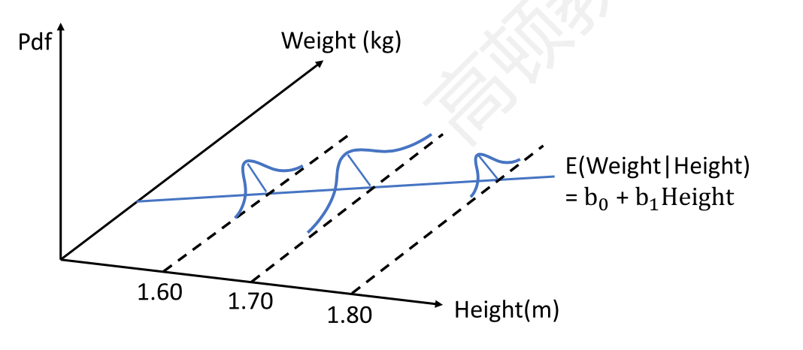
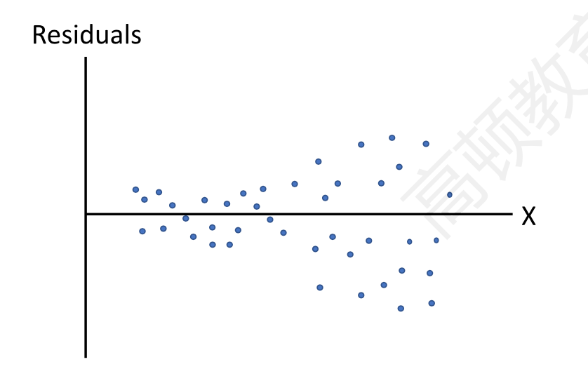
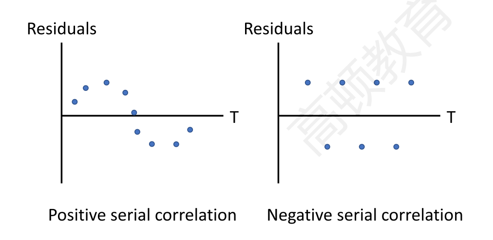
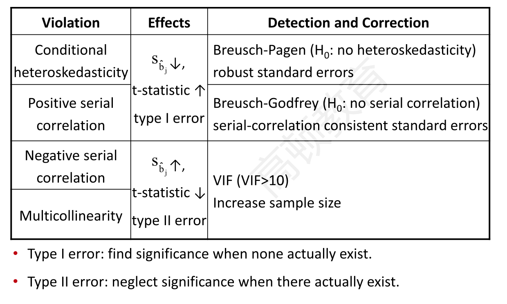
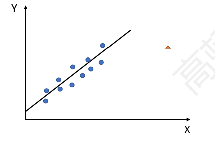
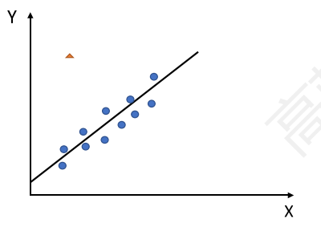
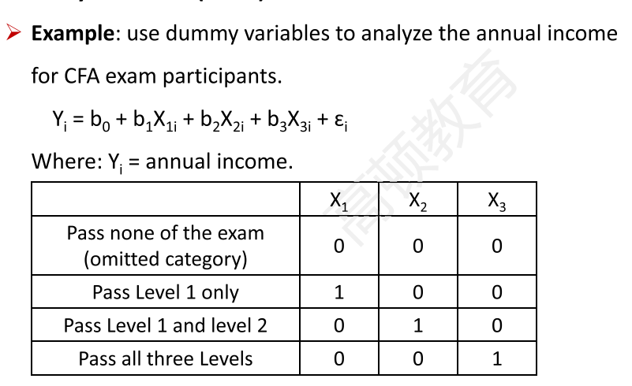
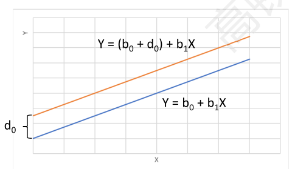
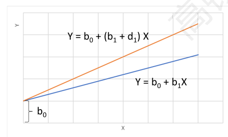

## 1.Multiple Regression

#### 1.1 Basics of Mutiple Regression

##### 1.1.1 Assumptions of simple linear regression model

- **linearity**: X is linear to Y
- 下面三个和残差的assumption有关，一个残差对应一个应变量
- **homoskedasticity**: 残差同方差
- **normality**：the error term is normally distributed
- **independence**
  - the error term is uncorrelated across observations
  - no exact linear relation **between independent variables** **自变量之间没有线性关系**（！）

##### 1.1.2 Multiple linear regression model

$$
Y_i=b_0+b_1X_{1i}+b_2X_{2i}+...+b_kX_{ki}+\epsilon_i
$$

- intercept term($b_0$): all X=0, dependent variable  = $b_0$

- slope coefficient($b_j$)
  - The expected increase in the dependent variable for a 1-unit increase in that independent variable, **holding the other independent variables constant**
    - Also called partial slope coefficients.

##### 1.1.3 Hypothesis testing for a regression coefficient

- we do a hypothesis test for each $b_j$

- hypothesis: H0: bj =(>=|<=) b; Ha: bj !=(<|>) b
- test statistic **t**
  - $t = \frac{\hat b_j - b_{jH}}{s_{\hat b_j}}$
  - df = n-k-1, k is the number of independent variables
- decision rules:
  - reject H0 if p-value < $\alpha$ significant level
  - reject H0 if $t > +t_{critical} \or t < -t_{critical}$

##### 1.1.4 Significane testing for independent variables

- H0: $b_j = 0$(significant test)
- 有几个变量做几回检验

##### 1.1.5 Confidence interval for regression coefficent

- confidence interval $\hat b_j \pm t_c \times s_{\hat b_j}$
- $t_c$ is critical value with $df = n - k - 1$.
- $s_{\hat b_j}$ is standard error of the regression coefficient.
- Applied to significance test for a regression coefficent
  - If the confidence interval does not include **zero**, the null hypothesis(H0: bj=0) is rejected, and the coefficent is said to be statistically significantly different from zero.
  - 如果置信区间不包括0，这可以拒绝bj=0.

#### 1.2 Evaluating Regression Model Fit and Interpreting Model Results

- **ANOVA** analysis

|            | df      | Square of sum | Mean Square         |
| ---------- | ------- | ------------- | ------------------- |
| Regression | $k$     | SSR           | MSR = SSR / k       |
| Error      | $n-1-k$ | SSE           | MSE = SSE / (n-k-1) |
| Total      | $n-1$   | SST           |                     |

- standard error of estimate: $s_e = \sqrt{MSE}$

- $F=\frac{MSR}{MSE}$ with $df=(k, n-k-1)$

- $R^2=\frac{SSR}{SST}$ coefficient of determination
  - Test the overall effectiveness (goodness of fit) of the entire set of independent variables(regression model) in explaining the dependent variable. 可解释部分占总体的占比。
  - For multiple regression, however, $R^2$ will <u>**increase simply** by adding independent variables</u> that explain even a slight amount of the previously unexplained variation.
    - Even if the added independent variable is not statistically significant, $R^2$ will increase.
    - 也就是，在多元回归种，自变量不显著，增加自变量也会增加$R^2$
    - 为了缓解这个问题，引入adjusted $R^2$以及其他指标

- **Adjusted $R^2$** 
  $$
  \bar R^2 = 1-\frac{n-1}{n-k-1}(1-R^2)
  $$

  - $n$ is the number of observations
  - $k$ is the number of independent variables
    - 上面这个式子的思路：R方是可以解释的部分，1-R^2则是不可解释的部分。k越大，不可解释的部分越多。也就是k越大，(n-1)/(n-k-1)越小，(1-R^2)越大，从而得到调整。
  - $\bar R^2 \le R^2$ and may less than zero, if $R^2$ is low enough or the independent variables is too many.
  - Adding a new independent variable may **either increase** or **decrease** the $\bar R^2$.
    - If the value of $\bar R^2$ increase, the new independent variable should be added.
    - 如果假如了一个变量，使得调整R方上升。则考虑假如这个变量。
    - 
  
- **AIC(Akaike's information criterion）**

$$
AIC=n\ln\frac{SSE}{n}+2(k+1)
$$

- **AIC(Akaike's information criterion）**

  - 2(k+1)是惩罚项，对增加变量进行惩罚.penalty for adding independent variables.
  - measure of model parsimony吝啬，模型的精炼, so the lower AIC the better. 越小越好。

- **BIC(Schwarz's Bayesian information criterion)**

- $$
  BIC=n\ln{\frac{SSE}{n}}+(\ln n)(k+1)
  $$

- **BIC(Schwarz's Bayesian information criterion)**

  - 和AIC相比，BIC penalty更大
  - AIC is preferred for prediction while BIC is more likely to be used for seeking best fitness. 
    - BIC获得更精简的模型

- **Joint F-test**

  - Test whether the two or more independent variables **jointly**, explain the dependent variable.
    - **Unrestricted model**
      - $Y_i=b_0+b_1X_{1i}+...+b_kX_{ki}+\epsilon_i$
    - Restricted Model 去除q个变量
      - $Y_i=b_0+b_1X_{1i}+...+b_{k-q}X_{(k-q)i}+\epsilon_i$
    - $H_0:b_1=b_2=...=b_q=0;H_a:$ at least one $b_j \ne 0$
    - $F=\frac{(SSE_R-SSE_U)/q}{SSE_U/(n-k-1)}$​
    - Decision rule: reject H0 if F > F critical, (**one tail**)
    - Rejection of $H_0$ means there is **at least one** regression coefficient is significantly different from zero.

- **Linear F-test**

  - Test whether the independent variables, **as a group**, help explain the dependent variable; or assess the effectiveness of the model, **as a whole**, in explaining the dependent variable. 就是一级中的线性回归F检验
    - $H_0:b_1=b_2=...=b_k=0$
    - $F = \frac{MSR}{MSE}= \frac{SSR / k}{SSE / n-k-1}$

- **Prediction of dependent variable**

  - The regression equation can be used to predict the value of the dependent variable base don assumed values of the independent variables. 就是回归出来的方程用来预测变量。

##### Summary

- ANOVA
- joint and linear F-test
- adjusted $R^2$
- AIC/BIC

#### 1.3 Model Misrepresentation

模型分类错误的问题

- heteroskedasticity, serial correlation, multicollinearity
- **Definition of model misspecification**
  - The set of variables included in the regression or the regression equation's functional form are not appropriate.
- **Categories**
  - misspecificied functional form
    - important variables omitted遗漏变量
    - Variables need to be transformed (e.g. 不同国家的GDP)
    - inappropriate **scaling** of variables 标准化，缩放处理数据
    - pools data incorrectly（因变量当成了自变量）
      - 比如，A股票收益率 = f(B股票，C股票，A股票上一时刻收益率)
- **Effects of model misspecification**
  - may lead to heteroskedasticity or serial correlation or multicollinearity.
- **Avoiding model misspecification**
  - The model should be grounded in cogent economic reasoning. 背后有经济学基础
  - The model should be parsimonious. 变量不能太多，要精简
  - The model should be examined for violations of regression <u>assumptions</u> before being accepted.
  - The model should be <u>formed</u> appropriately. 建模前，看清楚散点图
  - The model should be tested and be found useful out of sample before being accepted. 用out of sample的数据测试，测试集。
- **Volations of assumptions**
  - heteroskedasiticity异方差性，违反**残差**同方差
  - serial correlation(autocorrelation, 序列相关、自相关)，违反**残差**不相关
  - multicollinearity 多重共线性，违反**变量**的linearity

##### 1.3.1 Heteroskedasticity

- **Definition of heteroskedasticity**
  - The **variance of error terms** differs across observations
    - Graphic illustrations of heteroskedasicity. 对于每个自变量取值，其残差的方差不一致。
    - 

- **Types of heteroscedasticity**
  - **Unconditional heteroskedasticity**: heteroskedasticity of the error variance is **not correlated** with the independent variables. 无条件异方差，残差和自变量无关，找不到规律，影响不大。
    - Creates **no major problems** for statistical inference.
  - **Conditional heteroskedasticity**: heteroskedasticity of the error variance is **correlated** with (conditional on) the values of the independent variables. 有条件异方差，和自变量相关。
    - Does create **significant problems** for statistical inference.需要考虑修正

- **Effects of heteroskedasticity**
  - The coefficient estimates($\hat b_j$) aren't affected.变量本身不受影响，受影响的是T检验
  - The standard errors of coefficient($s_{\hat b_j}$)are usually unreliable.
    - With financial data, the standard errors are most likely **underestimated**, and the t-statistics ($t = \frac{\hat b_j-b_{jH}}{s_{\hat b_j}}$)and tend to find significant relationships where none actually exist(**type I error**)
      - **标准误变小**，t值变大，所以更容易大于$t_c$, 更容易拒绝$H_0$. 
  - The F-test is also unreliable
- **Testing for condional heteroskedasticity**
  - 两个检验方法
  - Examing scater plots of the residuals. 画图
    - 
  - Breusch-Pagen $\chi^2$ test
    - $H_0$: no heteroskedasticity 没有异方差
    - BP $\chi^2=n\times R^2_{residual}$ 
      - $df = k$
      - k = the number of independent variables
      - **one tail test**
      - n is the number of observation
      - $R^2_{residual} = R^2$ of a **second** regression of the squared residuals from the first regression on the independent variables.
        - 比如：$Y_i=b_0+b_1X_1+b_2X_2+\epsilon_i$
        - 回归：$\epsilon_i^2=a_0+a_1X_1+a_2X_2+\epsilon^*_i$
          - 得到第二个回归的方差
- **Correcting for heteroskedasticity**
  - use **robust standard errors** to recalculate the t-statistics （课本也没有详细讲）
    - Also called White-corrected standard errors
  - Use **generalized least squares**, other than ordinary least squares, to build the regression model. 广义最小二乘法。

##### 1.3.2 Serial correlation

- **Definition of serial correlation**
  - The **error** **terms are correlated** with one another, and typically arises in time-series regression.
    - **Positive serial correlation**: a positive/negative error for one observation increases the chance of a positive/negative error for another observation. 正相关，残差图呈现聚集性（error-X 图）
      - <u>More often</u> 正相关更常见
    - **Negative serial correlation**: a positive/negative error for one observation increases the chance of a negative/positive error for another observation. 负相关，呈现震荡形式。

- **Effects of serial correlation**
  - The coefficient estimates <u>aren't affected</u>.估计值不会收到影响
    - if one of the independent variables is the lagged value of dependent variable（指的是时间序列，滞后变量$Y_{t-1}$）, the coefficient estimate will be affected.
  - The standard errors of coefficient are usually unreliable.
    - **Positive serial correlation**: standard errors **underestimated** and t-statistics **inflated**.标准误被低估，（因为误差聚集，离散程度小；t检验值偏大，从而更容易拒绝原假设）
      - Tend to find significant relationships when none actually exist(**type I error**)
    - **Negative serial correlation**相反。standard errors **inflated** and t-statistics **underestimated**.
      - Tend to neglect significant relationships when there actually exist(**type II error**)
  - The F-test is also unreliable.
- **Testing for serial correlation**
  - Examining scatter plots of the residuals

- **Testing for serial correlation**
  - The Durbin-Watson(DW) test
    - Limited for detecting <u>first-order</u> serial correlation.局限于一阶
      - first-order指的是时间上的一阶。$\epsilon_t$ 和$\epsilon_{t-1}$相关。（$\epsilon_{t-2}$是”二阶“）
  - The Breusch-Godfrey(BG) test 可以检验高阶
    - $\hat \epsilon_t=a_0+a_1X_{1t}+...+a_kX_{kt}+p_1\hat \epsilon_{t-1}+e_t$
    - $H_0:p_1=0;H_a:p_1 \ne 0$
    - F-distributed with $n-1-k-p$ and $p$ degrees of freedom
      - $df=(n-1-k-p,p)$
    - $p$ is the number of lags，阶次，上面这里p=1
    - 注意这里因变量是残差

- **Correcting for serial correlation**
  - Adjust the coefficient standard erros(recommended)
    - e.g., **serial-correlation consistent standard errors**, adjusted standard errors, Newey-West standard errors, and robust standard errors.
      - Also correct for conditional heteroskedasticity
  - Modify the regression equation itself.

##### 1.3.3 Multicollinearity 

- **Definition of multicollinearity**
  - Two or more independent variables (or combinations of independent variables) are **highly correlated ** with each other.
- **Effects of multicolinearity**
  - Estimates of regression coefficients become <u>extremely imprecise and unreliable</u>.
    - e.g. 假如$X_1=2X_2$, $Y=aX_1+bX_2$可以有不同组合
  - Standard errors of coefficients **inflated** and t-statistics **underestimated**.
    - 注意这里是inflated, 放大参数的标准误
    - $H_0:b_j=0;H_a:b_j\ne0$
    - Tend to neglect significant relationships when there actually exist(**type II error**).
- **Testing for multicollinearity**
  - **Classical                                                                                                                                                                                                                                                                                                                                                                                                                                                                                                                                                                                                                                                                                                                                          Methods**
    - The t-tests indicate that none of the regression coefficients is significant, while $R_2$ is high and F-test indicates overall significant. 单个不显著，但是总体来说是显著的。(单个大妈干很少活，但整个团队完成了目标)
  - **VIF(Variance inflation factor)**
    - $VIF=\frac{1}{1-R_j^2}$
    - $R_j^2$ represents the variations of $X_j$ explained by other independent variables.
      - 比如$X_j = a_1X_1+a_2X_2+...+a_{j-1}X_{j-1}$，用其他变量解释变量j
      - R2越大，说明相关性大，所以VIF越大，变量间相关性越大
    - $VIF_j > 5$, further investigation
    - $VIF_j > 10$, multicollinearity
- **Correcting for multicollinearity**
  - Excluding one or more of the correlated independent variables
  - Using a different proxy for one of the variables. 不同表示方法
  - Increasing the sample size. 增加样本量（？）

##### summary（\*\*\*）

- 前两种更常见，异方差和正向序列相关

#### 1.4 Extensions of Multiple Regression

##### 1.4.1 Influence Analysis

- **influence observations**： an observation whose inclusion may significantly alter regression results.
- High-leverage point 高杠杆点，自变量是极值。an extreme value of **independent point**
  - 
  - 如何找high-leverage point:
  - **leverage($h_{ii}$​)**  measures the distance between the value of the i-th observation and the mean value of all n observations. 和平均值的距离
    - $\sum_{i}h_{ii}=k+1$
    - [9.2 - Using Leverages to Help Identify Extreme X Values | STAT 462 (psu.edu)](https://online.stat.psu.edu/stat462/node/171/#:~:text=The leverage hii is,regression coefficients including the intercept).)
    - $h_{ii}$其实是帽子矩阵中的对角元素
    - $0<h_{ii}<1$
  - Between 0 and 1, the higher, the more influence the i-th observation
    - Rule of thumb: exceed $3(k+1)/n$, potentially influential
- **Outliers**. 离群值，因变量是极值。 an extreme value of dependent variable
  - 
  - 如何找outliers
  - **studentized residual($t_{i*}$)**, compare the observed Y values(on n observations) with the predicted Y values resulting from the models with the i\-th observation deleted(on n-1 observations) 判断点i是不是out-lier. 去除点i和去除点i前的Y做对比。
  - t test with degree of freedom $n-k-2$. 具体的t统计量参见课本。（two tail 检验）
- **Cook's Distance(Cook's D)**

$$
D_i=\frac{e_i^2}{k\times MSE}\frac{h_{ii}}{(1-h_{ii})^2}
$$

-  

  - 这个值依赖于残差$e_i$以及上面的leverage$h_{ii}$
  - A large $D_i$ indicates that the ith observations **strongly** influences the regression's estimated values
  - Rule of thumb: exceed $2\sqrt{k/n}$​, potentially influential.
  - D是F分布，$df = (k+1, n-k-1)$

  - Cook's Distance更综合考虑，优先采用这个判断influential points.

##### 1.4.2 Qualitative independent variables

- Qualitative independent variables : nominal type or ordinal type variable.
  - e.g. education, gender

- Dummy variables 哑变量，二值变量. 0/1
  - If we want to distinguish among $n$ categories, we need $n-1$​​ dummy variables. 这里不是二进制，看下面的例子。哑变量要有区分度。
    - **不选择n个变量，是为了avoid the assumption that no exact linear relationship exists between two or more independent variables**， 避免linear relationship
  - 缺省状态：**omitted category**，全是0.
  - ****
  
- ###### **Interpretation of regression coefficient**(\*\*\*)

  - 截距intercept 代表 omitted category
    - $Y = b_0$
    - **intercept coefficient($b_0$)**: the average value of dependent variable for the omitted category.
  - slope代表对应的变量(category)减去omitted category
    - $Y = b_0 + b_1$
    - $b_1 = Y - b_0$
    - **slope coefficient($b_j$)**: the difference in dependent variable (on average) between the category represented by the dummy variable and the omitted category
  - 另外：dummy variables可以放在截距和斜率中
    - **Intercept dummies**
      - $Y=b_0+d_0D+b_1X+e$
      - 这里$D$​实际上影响的是截距。
      - 
    - Slope dummies
      - $Y=b_0+b_1X+d_1DX+e$
      - 这里D的取值，会影响到斜率
      - 

- Qualitative **dependent** variable(应变量 Y是dummy)

  - dummy variables can be used as dependent variables in regression analysis

    - Logistic model

  - **Logit model** 

    - estimate the probability of a discrete outcome given the values of the independent variables used to explain that outcome

    - A logistic model（log odds）: $\ln \frac{p}{1-p}=b_0+b_1X_1+...+\epsilon$

      - p/(1-p)，不就是一级里的赔率odds.

    - The event probability
      $$
      p=\frac{1}{1+e^{-(b_0+b_1X_1+...)}}
      $$

      - 回归方法是maximum likelihood estimation（MLE）最大似然估计。（不是最小二乘法）回忆《机器学习》牛顿法求解！

##### summary

- influential data detecting
- qualitative independent and dependent variables

