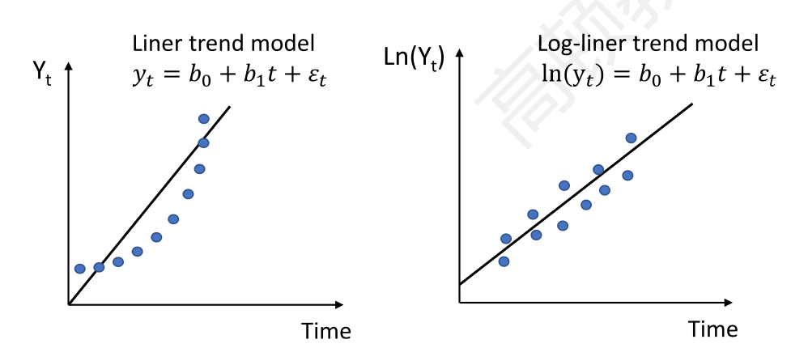
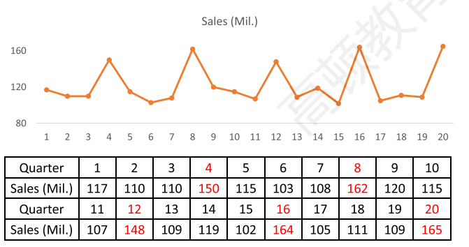
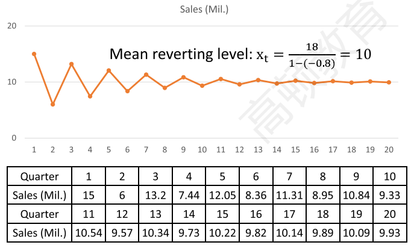

# Times Series Analysis

- review一级：cross-sectional data, time-series data
  - 横截面数据**cross-sectional data** are on some characteristic **at a single point in time**. 
    - 多变量，单时间
  - **time-series data** are collected at discrete and equally spaced **intervals of time.**
    - 单变量，多时间

### 1. Trend Models

#### Linear Trend Models

- work well in fitting time series that have **constant change amount** with time. 描述变量随着时间改变具有固定的增量。
  - $y_t=b_0+b_1t+\epsilon_t$
  - 时间作为了变量

#### Log-linear trend models

- work well in fitting time series that have **constant growth rate** with time(exponential growth)
  - 复习：对数正态分布，和增长率有关。
  - $y_t=e^{b_0+b_1t+\epsilon_t}$
  - $\ln y_t = b_0+b_1 t+\epsilon_t$


$$
\ln y_t - \ln y_{t-1}
$$

#### Linear vs Log-linear

- plots画图观察, linear shape适合linear, curve适合log-linear

#### Limitation

- The trend model is not appropriate for time series when data exhibit **serial correlation**
  - Use the Durbin-Watson statistic to detect serial correlation.

### 2. Autoregressive Models 自回归模型

没有ANOVA概念

#### Autoregressive(AR) model

- **AR model**: use the past values of dependent variable as independent variables
  - AR(1): first-order autoregressive model 一阶自回归
    - $x_t=b_0+b_1x_{t-1}+\epsilon_t$
  - AR(p) p-order AR model p阶自回归
    - $x_t=b_0+\sum_{i=1}^{p}{b_ix_{t-i}}+\epsilon_t$
    - p is the number of lagged values that the AR model will include as indpendent variables.

#### Covariance stationary 协方差平稳（AR model针对变量的前提条件）

- **Covariance stationary** is a key *assumption* for AR model to be valid based on ordinary least squares(OLS) estimates, and must satify 3 principal requirements:
  - constant and finite <u>expected value</u> in all periods. 均值恒定
  - constant and finite <u>variance</u> in all periods. 方差恒定
  - constant and finite <u>covariance</u> with itself for a fixed number of periods in the past or future in all periods.  （TODO，确认）
    - e.g. $cov(x_t, x_{t-2})$
- TODO：对残差要满足独立同分布？？？

#### Chain rule of forecasting (\*\* calculate)

- A one-period ahead forecast AR(1)
  - $\hat x_{t+1}=\hat b_0+\hat b_1x_t$
- A two-step ahead forecast for an AR(1) model
  - $\hat x_{t+2}=\hat b_0+\hat b_1x_{t+1}$

#### Comparing forecasting model performance(\*\*)判断预测准不准

- **In-sample forecasts errors**: the residuals within sample period to estimate the model.
  - 类似训练集
- **out-of-sample forecasts errors**: the residuals outside sample periods to estimate the model.
  - 类似测试集

- **Root mean squared error(RMSE) criterion**: the model with the **smallest RMSE** for the **out-of-sample** data is typically judged most accurate.
  - 优先看 out-of-sample
  - 这里其实就是$s_e=\sqrt{MSE}$

#### Instability of regression coefficients

- Financial and economic relationships are inherently <u>dynamic</u>, so the estimates of regression coefficients of the time-series model can change substantially across different sample periods.
- There is a tradeoff between reliability and stability.
  - Models estimated with ***shorter*** time series are usually **more** **stable** but **less** **reliable**.

### 3. Violations of Assumptions

Autoregressive conditional heteroskedasticity(ARCH)

autocorrelations of the residuals

seansonality

mean-reverting level

random walk processes vs. covariance stationary processes.

unit roots for time-series analysis

#### Violations of assumptions

- In working with autoregressive model, we often find that the assumptions of the autoregression model are not satisfied
  - **Autoregressive conditional heteroskedasticity(ARCH)**: the variance of the time series changes over time. $\epsilon$残差异分布
  - **Serial correlation**: the residuals are correlated instead of being uncorrelated. 残差序列相关，缺少独立性
    - Time series with seasonality 季节性
  - **Random walk**: the variable is not covariance stationary
    - Time series with a unit root. 单位根

#### ARCH 条件异方差

- **Conditonal heteroskedasticity**: heteroskeasticity of the error variance is correlated with (conditional on) the values of the independent variables.
- **ARCH**: conditional heteroskedasticity in AR models.
  - When ARCH exists, the standard erros of the regression coefficients in AR models are incorrect, and the hypothesis tests of these coefficients are invalid. ARCH下，参数不准，假设检验不可靠

#### ARCH(1) model

- Variance of the error in a particular time-series model in one period depends on the variance of the error in previous periods. 看看残差是否和上一期的残差相关。
- $\hat \epsilon_t^2=a_0+a_1\hat \epsilon_{t-1}^2+u_t$, where $u_t$ is the error item.
  - If the coefficent $a_1$ is statistically significantly <u>different from 0</u>, the time series is <u>ARCH(1)</u>
  - If a time series model has ARCH(1) errors, generalized least squares must be used. OLS不能用，要用GLS广义最小二乘法。（TODO？）
  - 推到ARCH(p) p-order的ARCH

#### Predicting variance with ARCH models

- If a time-series model has ARCH(1) errors, the ARCH model can be used to predict the variance of the residuals in the future periods. 如果有ARCH(1)，残差可以预测。
  - $ \hat \epsilon_{t+1}^2=\hat a_0+\hat a_1\hat \epsilon_{t}^2$

#### Detecting serial correlation (\*\*) 序列相关（autocorrelation）

- **Step1**: estimate the AR(1) model using linear regression
  - $x_t=b_0+b_1x_{t-1}+\epsilon _t$
- **Step2**: compute the **autocorrelations**($\rho_{\epsilon_t, \epsilon_{t-1}}$) of the residuals
  - **Autocorrelations**: the correlations of a time series with its own past values. 这里意思是$x_t$和$x_{t-1}$相关
  - The order of the correlation is given by $k$, where $k$ represents the number of periods lagged.
- **Step3**: test if the autocorrelations are significant different from zero，检验是否显著不为0
  - $t=\frac{\rho_{\epsilon_t,\epsilon_{t-1}}}{1/\sqrt{T}}$
    - $T$ is the number of observations in the time series
    - $df =T-2 $
- **Step4**: if the residual autocorrelations differ significantly from 0, the model is not correctly specified and need to be modified

#### Seasonality(\*\*)

- seasonality is the time series that shows regular patterns of movement **within the year**. 季节性
- 
- **Testing of seasonality**: test if the **seasonal autocorrelation** of the residual will differ significantly from 0. 注意是一年内重复出现
  - The 4th autocorrelation in case of quarterly data
  - The 12th autocorrelation in case of monthly data
- **Correcting of seasonality**: include a **seasonal lag** in AR model: 修正季节性
  - Quarterly data: $x_t=b_0+b_1x_{t-1}+b_2x_{t-4}+\epsilon_t$
  - monthly data: $x_t=b_0+b_1x_{t-1}+b_2x_{t-12}+\epsilon_t$ 
- **Forecasting** using AR model with a seaonal lag:
  - quarterly data: $\hat x_t=\hat b_0+\hat b_1x_{t-1}+\hat b_2x_{t-4}$
  - monthly data: $\hat x_t=\hat b_0+\hat b_1x_{t-1}+\hat b_2x_{t-12}$

- 课件有example

#### Mean reversion(\*\*\*) 均值复归

- 很多数据都体现这种特征，比如利率

- A time series shows mean reversion if it has a **tendency** to move towards its mean.收敛级数
  - Tends to fall when it is above its mean and rise when it is below its mean.
- Mean-reverting level for an AR(1) model:

$$
x_t=\frac{b_0}{1-b_1}
$$

- 

  - **Covariance stationary --> finite mean-reverting level.**(TODO?)
  - $|b_1|<1$ in AR(1) model --> finite mean-reverting level.

- Graphic illustration of mean reversion AR(1): $x_t=18-0.8x_{t-1}$​

  - 神奇

  

- 上面的一个数学原理：

- $$
  x_t=b_0+b_1x_{t-1}\\
  x_t-\frac{b_0}{1-b_1}=b_1(x_{t-1}-\frac{b_0}{1-b_1})
  $$

- 也就是说，$x_t-\frac{b_0}{1-b_1}$是等比数列，公比为$b_1$，所以$\abs{b_1}<1$的时候，数列收敛，且极限为$\frac{b_0}{1-b_1}$

#### Simple Random walk随机游走

- **simple random walk**: time series in which the value of the series in one period is the value of the series in the previous period plus an unpredictable random error

$$
x_t=x_{t-1}+\epsilon_t
$$

- 
  - A special AR(1) model with $b_0=0;b_1=1$
  - **The best forecast of $x_t$ is $x_{t-1}$**（\*\*\*）

#### Random walk with a drift

- **random walk with a drift**: a random walk with the intercept term that not equal to zero($b_0\ne 0$)
  - $x_t=b_0+x_{t-1}+\epsilon_t$
  - Increase or decrease by a constant amount($b_0$) in each period.

#### Random walk vs. covariance stationary(\*\*)

- A random walk will <u>not</u> exhibit covariance stationary. 随机游走不满足协方差平稳。因为没有稳定均值（三个条件之一）。
  - A time series must have a finite mean reverting level to be covariance stationary
  - A random walk has an undefined mean reverting level
    - $x_t=b_0/(1-b_1)=0/0$
- The <u>least squares regression method doesn't work</u> to estimate an AR(1) model on a time series that is actually a random walk.

#### Unit root(\*\*)单位根

- The time series is said to have a **unit root** if the lag coefficient is equal to one($b_1=1$) and will follow a random walk process.
  - Testing for unit root can be used to test for **non-stationarity** since a random walk is not covariance stationary
    - 有单位根$\implies$ 协方差不平稳(covariance non-stationary)
    - But **t-test** for $b_1=1$ in AR model is **invalid** to test unit root.
      - 这句话的逻辑有点复杂：
        - CS（协方差平稳）$\implies$ AR$\implies$ $b_1$存在
        - 如果要检验$b_1=1$ ，那说明有单位根，说明non-CS。（和CS矛盾）
        - 所以不可以通过检验$b_1=1$​ 来验证有单位根。
        - 通过Dickey-Fuller test来检验单位根
  - Testing of AR model can determine if a time series is **covariance stationary**
    - 反过来，**没有单位根，不能推出协方差平稳**，所以，检验协防差平稳，需要检验残差自相关性$\rho_{\epsilon_t,\epsilon_{t-1}}$。
    - If autocorrelations at all lags are statistically indistinguishable from zero, the time series is stationary.

#### Dickey-Fuller(DF) test for unit root(\*\*\*)

- **Step1**: start with an AR(1) model
  - $x_t=b_0+b_1x_{t-1}+\epsilon_t$
- **Step2**: substract $x_{t-1}$ from both sides:
  - $x_t-x_{t-1}=b_0+(b_1-1)x_{t-1}+\epsilon_t$
  - or: $g_1=b_1-1$
- **Step3**: test if $g_1=0$
  - $H_0:g_1=0;H_a:g_1<0$​
    - 注意，这里Ha不包括g1>0. 因为如果g1>0, b1>1，序列本来是发散，肯定协方差不平稳。
  - Calculate t-statistic and use <u>revised</u> critical values
    - revised一般比查表的$t_c$大。（超纲）
  - If fail to reject $H_0$, there is a unit root and the time series is non-stationary.
  - 如果拒绝$H_0$，表示没有单位根。

#### First differencing(\*\*\*) 检验后，修正模型的方法

- 确定有单位根，确定随机游走后，修正为covariance stationary 模型

- a random walk can be transformed to a covariance stationary time series by first differencing
  - Substract $x_{t-1}$ from both sides of random walk model:
    - $x_t-x_{t-1}=x_{t-1}-x_{t-1}+\epsilon_t=\epsilon_t$
  - Define $y_t=x_t-x_{t-1}$, so
    - $y_t=\epsilon_t$
  - Then, $y_t$ is covariance stationary variable with a finite mean-reverting level of $0/(1-0)=0$​
    - $b_0=b_1=0$

#### summary

$$
b_1=1 \iff random\ walk\\
\iff unit\ root\ exists\\
\iff noncovariance\ stationary
$$

- 用DF test检验是不是单位根。
- correction: 一阶差分

### 4. Issues in Time-series Analysis

non-stationarity, cointegration两列时间数据

determine a model分析逻辑

#### Regression with two time series（\*\*） panel data多变量，多时间

- When running regression with two time series, either or both could be subject to non-stationarirty.
- **Dickey-Fuller Tests** can be used to detect unit root:
  - If none of the time series has a unit root, linear regression can be safely used.
  - Only(只要) one time seires has a unit root, linear regression **can not be used.**
  - If both time series hava a unit root:
    - **Cointegration协整:** two time series have **long-term financial or economic relationship** so that they do not diverge from each other without bound in the long run.(两列数据存在长期的经济关系）
    - **If the two series are cointegrated, linear regression can be used.**
    - If the two series are not cointegrated, linear regression can not be used.

#### Steps in time series forecasting

```flow
st=>start: Start
op1=>operation: Linear/Exponential trend
op3=>operation: Use a trend model
op4=>operation: Use an AR model
op5=>operation: First Differencing
op6=>operation: estimate AR(1) model
op7=>operation: adding lags
op8=>operation: general least squares
op9=>operation: time series model

cond1=>condition: Does series have a trend?(plotting)
cond2=>condition: DW test for serial correlation?
cond3=>condition: Covariance stationary(unit root?)?
cond4=>condition: Serial correlation(monthly/seasonly)?
cond5=>condition: ARCH?
e=>end

st->cond1
cond1(yes)->op1
op1->cond2
cond1(no)->op4
cond2(yes)->op4
cond2(no)->op3
op4->cond3
cond3(yes)->op6
cond3(no)->op5
op5->op6
op6->cond4
cond4(yes)->op7
op7->cond5
cond4(no)->cond5
cond5(yes)->op8
cond5(no)->op9
op8->op9
op9->e
```


##### Example

- R-squred and F-statistic 不适用series model

- underweight不是低估，而是降低(invest to a lesser than normal degree)

#### Summary (\*\*\*)

- Covariance stationary
- chain rule for forecasting
- violation of assumptions
  - Serial correlation(season lag)
  - ARCH: autoregressive conditional heteroskedasticity
- Common time series
  - Mean reversion, seasonality, random walk
