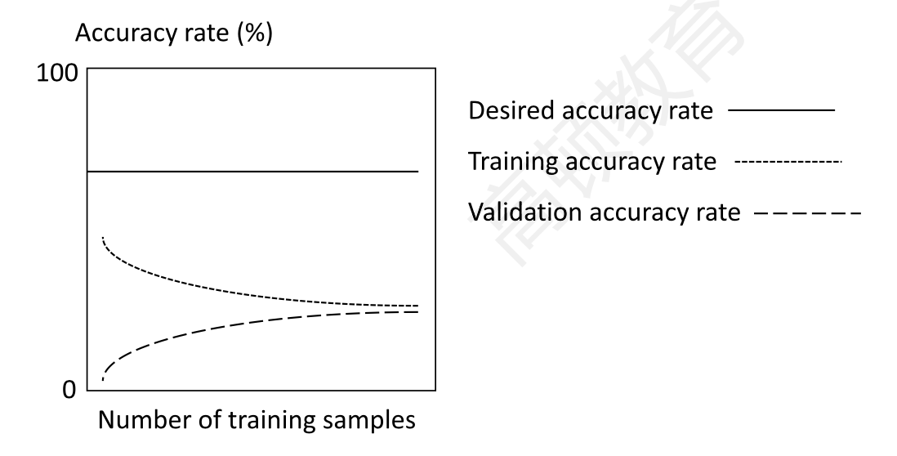
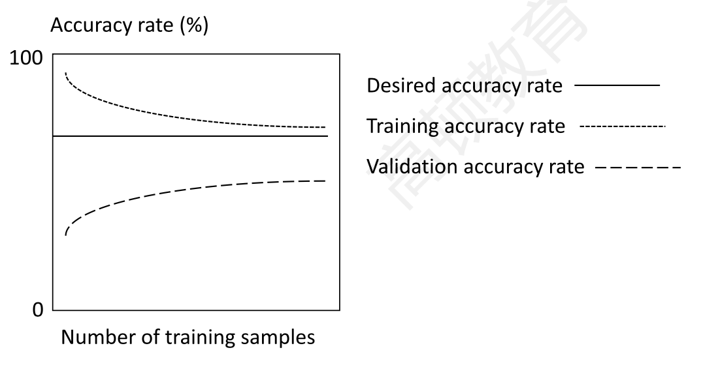
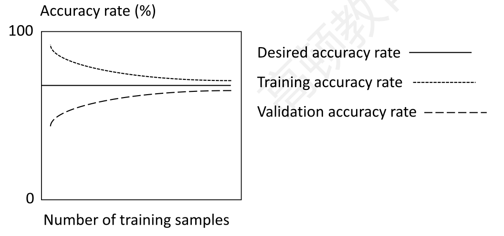
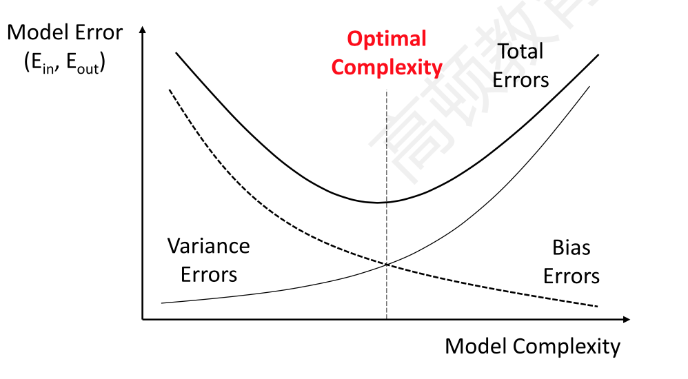

# Machine Learning

##### Unsupervised learning

- dimension reduction
- clustering

##### Overfitting and generalization

- overfiting
- generalization泛化能力

- bias error：the degree to which a model fits the **training data.**
  - Algorithms with erroneous assumptions produce high bias, casing **underfitting** and high in-sample error

- variance error: how much the model's results change in respones to new data from **validation and test samples**
  - Unstable models pick up noise and produce high variance, causing **overfitting ** and high out-of-sample error.
- base error: due to randomness of data.

##### Learning curve:

- plot the accuracy

- **underfitting**: high bias error
  - 

- **overfitting**: high variance error
  - 

- **robust model:** tradeoff between bias and variance error
  - 

##### Fitting curve

- plots in-sample and out-of-sample error rates against model complexity.

- 

##### Prevent overfitting

- complexity reduction
- cross-validation
  - 存在**holdout samples**: reducing the training set size too much
  - K-fold cross-validation can mitigate the problem.