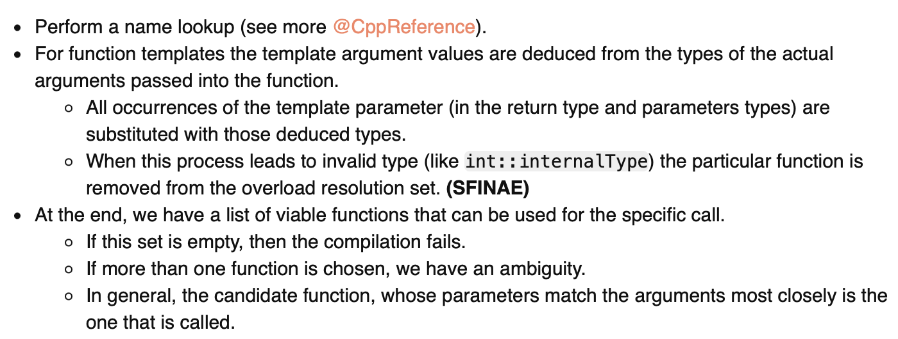
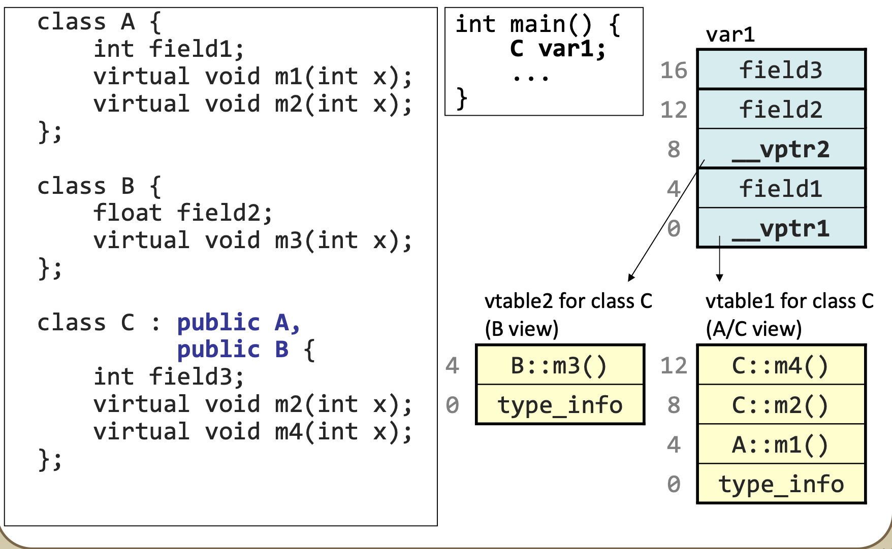

# CPP learning notes

### 1. Template

- If you want to use the member of the template type as return type or parameter, add `typename` keywords.
  - This is because in return, it is not in the scope of template.

```cpp
class A {
public:
	using type = int;
};

template<typename T>
typename T::type func(){ //  `typename` in return type is requried
	return 0;
}
template<typename T>
void func(typename T::type x){
	return 0;
}

int main(){
	fun<A>();
}
```

#### SFIANE

> "Substitution Failure Is Not An Error"
>
>
> This rule applies during overload resolution of function templates: When [substituting](https://en.cppreference.com/w/cpp/language/function_template#Template_argument_substitution) the explicitly specified or [deduced type](https://en.cppreference.com/w/cpp/language/template_argument_deduction) for the template parameter fails, the specialization is discarded from the [overload set](https://en.cppreference.com/w/cpp/language/overload_resolution) instead of causing a compile error.

- before learning SFIANE, we should know the compilation of function calls. [from this notes](https://www.cppstories.com/2016/02/notes-on-c-sfinae/)

  - 

  - 我们可以看到subsitution，其实就是编译器Substitute the template parameter with the deduced type. 如果发生substitute failure, 那不是错误，继续匹配下一个。（SFINAE）
- how to implement SFINAE
- Let's see the following example

```cpp
#include <iostream>

template <typename T>
class HasToString {
private:
    typedef char YesType[1];
    typedef char NoType[2];

    template <typename C> static YesType& test(decltype(&C::ToString));
    template <typename C> static NoType& test(...);

public:
    enum { value = sizeof(test<T>(0)) == sizeof(YesType) };
};

struct Wrapper {
    int _val { 0 };
    std::string ToString() const { return "Hello"; }   
};

int main() {
    static_assert(HasToString<int>::value == false);
    static_assert(HasToString<Wrapper>::value == true);
}
```

- 也就是说，通过创造某个匹配的**编译错误**，来实现SFINAE. 比如上面，`decltype(&C::ToString)`意思是函数指针。所以`test<T>(0)`中的0是函数指针。replace it with `test<T>(nullptr)` is also ok.
- 如果传入一个template 是int. 那么在第9行，failure，处罚SFINAE，不会产生compilation error, 然后移动到下一行，匹配。所以，这时候`test<int>(0)`返回的是NoType应用，size是2. 所以value == false. so amazing.

- AI is so amazing, I learn SPINAE with the help of chatGPT.
- To be notice, having SFINAE doesn't mean you can define two conflict functions. 

```cpp
template<typename T>
char f(T a){
	return '1';
}
template<typename T>
typename std::enable_if_t<std::is_same<int,T>::value> f(T x){
	
}

template<typename T>
char g(...){
	return '1';
}
template<typename T>
typename std::enable_if_t<std::is_same<int,T>::value> g(T x){
	
}


int main(){
    f(2);// error. 
    //because the first template matched as `char f(int)`
    // the second matched as void f(int)
    // conflict
    
    g(2);// ok
    // because although two was matched, the char f(...) is different from void f(int), not conflicting
}
```

#### variadic templates, parameters packs


#### traits, policies and tag-types

#### concepts(SFIANE)

- concepts是编译期间对template的检查，比如

- ```cpp
  template <class T, class U>
  concept	isDerive = std::is_base_of<U, T>::value;
  
  template <isDerive<A> T>
  void f(T a){}
  ```
  
- This code means T must be derived from class `A`. when calling function `f`.

- 还有`requires`关键字，和上面一样效果

- ```c++
  template <class T>
  requires isDerive<T, A>
      void g(T a){}
  ```

### 2. move/forward

> `T&&` Doesn’t Always Mean *“Rvalue Reference”*
>
> by Scott Meyers

[universal reference](https://isocpp.org/blog/2012/11/universal-references-in-c11-scott-meyers)

- some concept:

  - cv-qualifier: `const`, `volatile`

  - forwarding references
  - rvalue references

- `std:forward` 
- rvalue reference is for
  - move semantice
  - perfect forwarding

### 3. Misc

- CRTP
- tuples, variants visit, apply
- plmpl idiom

- tuples/variants visit/apply etc.
- the pImpl idiom
- lambdas; 
- custom streaming operators; 
- constexpr; auto; lambdas and macro hackery. 

- Additionally, thorough understanding of low-level/everyday C++ operation: 
  - sequencing, aliasing, global/namespace scope vs stack vs heap; 
  - smart pointers,
  -  virtual dispatch, 
  - translation units, 
  - ODR, 
  - extern/static/inline and anonymous namespaces,
  -  operator overloading, RAII etc.

- some questions collected from internet
  - new standards? 17, 20, 23

  - memory layout? class struct 

  - what's the memory layout of in heretance

  - virtual inheretance

  - if Base class has virtual function, will Base class exists in Derived  class?
    - what if it has virtual function, 64bit machine?

  - what else are included in the v-table of virtual function, except virtual function itself?

  - 如果一个函数是成员模版函数，可以声明为虚函数吗
    - no, template is determined at compile-time, virtual functions are run-time features.

  - inline
    - 虚函数可以inline吗
    - **By default,** all the functions defined inside the class are implicitly or automatically considered as inline except virtual functions. 
    - **Note:** *inline is a request to the compiler and its compilers choice to do inlining or not.*
    - Whenever a virtual function is called using a base class reference or pointer it cannot be inlined because the call is resolved at runtime, but whenever called using the object (without reference or pointer) of that class, can be inlined because the compiler knows the exact class of the object at compile time.

  - optional<bool>?, what is the sizeof?

  - C++ compile process

  - what if declaration in head file but not definition in source file. which part will raise error? what if compiling `.a`?

  - smart pointers, what is the size of shared_ptr, how to determine use which smart pointer?what is the difference of the performance? 

  - how to implement multithread mutex? what is the difference with self-spin lock?

  - atomic ? how to implement? is it lock-free? all atomic variable lock free?? what is atomic variable memory order?

  - how to fetch data in memeory for cpu? what module will be used?

  - cpu cache?

  - cache speed of different level?

  - how to write cache-friendly code? for array, will specific length slowen the speed?

  - do you know virtual memory? what is the benefit? what is the size of each page?

  - thread and process? difference of linux implementation?

- `decltype(auto)` will maintain the cv-qualifiers, while `auto` won't.

#### 12. About memory layout of object

details refers to [12.cpp](./src/12.cpp)

##### Normal class and normal inheritance

- The memory layout of an object. The members are stored in the stack, with the order of declaration, ranging from low address to high address.

```c++
class A {
public:
	int i;
	int j;
};
class B: public A {
public:
	int k;
};
// 
void test(){
    B b;
    //for b, its memory layout is:
    // (start of b address in stack)0x0: int i
    // 0x4: int j
    // 0x8: int k
}
```

##### With virtual function

- The first address is vtable pointer. The size depends on machine type. For a 64 bit operating system, it occupies space of 8 bytes. (`sizeof(void **)`)

- first of all, the order of virtual table`vtab`:

  - **suprise!**, the order of function in virtual table is the order of declaration in Class!. 

    - For the `Derived class`, the order of functions in `vtab`:

      - Base virtual function first, with Base declaration order

      - Derived class second, with Derived declaration order

        - **that is, firstly, copy from Base class, and then replace with own implementation; Secondly, append Derived own virtual table at the end of `vtab`(if a virtual function is declared in Derived class)**

      - e.g.

        - BTW, if you call a destructor of Derived class. a Base class destructor will be called either, in the reverse order of inheritance.

      - ```c++
        class Base{
        	virtual void fb(){}
        	virtual void fc(){}
            virtual ~Base(){}
        };
        class Derived : Base{
        	void fb(){}
        	void fc(){}
        	virtual void f3(){}
        	virtual void f2(){}
            virtual ~Derived(){}
        };
        // so the order of vtab of Derived class is
        // vtab = {fb, fc, destructor, type_info, f3, f2}
        ```

  - In the vtable, a entry for **virtual destructor**(`~Base(){}`) always follows by address of `type_info`(one pointer (`void *`)). It is observed by my own experiment, to be verified?

  - So, I recommend to declare the virtual destructor function at the end of the class. Just for the code locality of finding the right business function address.

###### What if multi inheritance?

- 

- the first pointer`v_ptr` is pointing to a vtab for class C. those new declared virtual function is in this table. not `v_ptr2`

##### Diamond structure heritance

- heritance structure like Top, Left, Right,Bottom; reference `heritance.cpp`

```c++
class Top {
public:
    int a;
};

class Left : public Top {
public:
    int l;
};

class Right : public Top {
public:
    int r;
};

class Bottom : public Left, public Right {
public:
    int b;
};

void f(){
    Bottom b;
    b.Left::a;
}
```

- In this case, `a` is ambiguous for an `Bottom` object. We should explicitly note which `a` be used. `b.Left::a`.
- The memory layout is quite obvious. Stack Left and Right together, and then `int b`. That is


- If we upcast a pointer of `Bottom`, the compiler locates the address of `Left` and `Right` automatically. `Left *` at `Left::Top::a` and `Right *` at `Right::Top::a`.

- To avoid repeated inheritance of `a`, use `virtual inheritance`

```C++
class Top
{
public:
   int a;
};

class Left : virtual public Top
{
public:
   int b;
};

class Right : virtual public Top
{
public:
   int c;
};

class Bottom : public Left, public Right
{
public:
   int d;
};
```

- The memory layout becomes complicated. refer to this [website](https://web.archive.org/web/20160413064252/http://www.phpcompiler.org/articles/virtualinheritance.html)

#### 11. about self-defining sorting and heap

```c++
// e.g.
vector<pair<int>> x;
sort(x.begin(), x.end(), [](const pair<int> &x, const pair<int> &y){return x.second > y.second;});
// notice: the parameter must use reference, otherwise the speed will be harm, that is, if 
// slow
[](pair<int> x, pair<int> y){return x.second > y.second;}
```

-  as for `priority_queue`, use redefinition of `operator ()`, return value of `int`. remember, if you need a min heap, use `greater`, otherwise `less` for max heap. that is, logic of `>` is implement in min heap comparing class.

```C++
class myComparator 
{ 
public: 
    int operator() (const Point& p1, const Point& p2) 
    { 
        return p1.getX() > p2.getX(); 
    } 
}; 

int fun() {
	priority_queue <Point, vector<Point>, myComparator > pq; 
}
```


#### 10. pointers and reference

[Pointers](https://www.geeksforgeeks.org/pointers-in-c-and-c-set-1-introduction-arithmetic-and-array/): A pointer is a variable that holds memory address of another variable. A pointer needs to be dereferenced with ***** operator to access the memory location it points to.

[References](https://www.geeksforgeeks.org/references-in-c/) : A reference variable is an alias, that is, another name for an already existing variable. A reference, like a pointer, is also implemented by storing the address of an object.

​	1）初始化角度。指针可以先定义，后初始化，引用需要在定义的时候同时初始化

​	2）重定义。指针可以re-assignment，引用不可以

​	3）内存。指针占用独立内存，引用和引用变量共享一个内存

​	4）空指针NULL。指针可以为空，引用不可以

​	5）间接引用。指针的指针合法，但是没有引用的引用。

#### 9. About keyword `const`

-  const int* p与int * const p区别 

  - `int const *p` and `const int *p`: `p` is a pointer to a const int.
    - reassign of the reference of `p` is allowed, but we can't change the reference number's value.
    - `p = &i;//correct`
    - `*p = 3;`//error

  - `int * const p`: `p` is a const of a pointer to int.
    - can not reassign reference of `p`, but changing the referenced number's value is allowed
    - `p = &i;//error`
    - `*p = 3;//correct`

-  一个启发：
  - `int const a`和`const int b`有什么区别？No difference.
-  **const applies to the thing left to it. If there is nothing on the left then it applies to the thing right of it.** 

#### 8. About keyword `static`

- static可以修饰变量，成员变量

  - it gets allocated for the lifetime of the program.

  - for static variables in a class: it is shared by objects. a static variable inside a class should be initialized explicitly by the user using the class name and scope resolution operator outside the class

    - ```C++
      // C++ program to demonstrate static
      // variables inside a class
      
      #include <iostream>
      using namespace std;
      
      class GfG {
      public:
      	static int i;
      
      	GfG(){
      		// Do nothing
      	};
      };
      
      int GfG::i = 1;
      
      int main()
      {
      	GfG obj;
      	// prints value of i
      	cout << obj.i;
      }
      
      ```

- static 修饰类成员函数

  - 可以通过类名调用`Class::func()`
  - static成员函数里，只能用到static 成员变量。

#### 7. Virtual functions

虚函数表、虚函数指针、动态多态、虚析构

虚函数声明：

```c++
class A{
public:
    A();
    virtual void f(){
        cout << "In A f" << endl;
    }
}
```

在某个类定义的虚函数只对该类的派生类有效果。如果在该类的派生类中定义一个虚函数，那么这个定义对该派生类的派生类有效果。

```c++
class B: public A{
public:
    B();
    virtual void f(){//有没有virtual,对于B的虚函数表都是一样的，这个virtual只影响B的派生类
        cout << "In B f" <<endl; 
    }
}
```

- 虚函数，实际上就是一个数组，数组里面有虚函数的地址，所以可以通过指针调用，模拟虚函数调用过程。

- ```C++
  class A{
  	virtual	void func() {}
  };
  class B: A{
      void func(){}
  };
  typedef void (*f_t)();
  int main(){
      B *b = new B();
      void **vtab = (void **)(*(void **)b);
      f_t f1 = (f_t)vtab[0];
      f1();
  }
  ```

- 纯虚函数与虚函数 

- 前者只声明不定义，后者必须定义 


#### 6. Pointer of function

如果在程序中定义了一个函数，那么在编译时系统就会为这个函数代码分配一段存储空间，**这段存储空间的首地址称为这个函数的地址**。而且**函数名表示的就是这个地址**。既然是地址我们就可以定义一个指针变量来存放，这个指针变量就叫作函数指针变量，简称函数指针。

定义方法

```c++
typedef return_type (* function_name)([parameters])
int(*p)(int, int);
```

一个有趣的现象

```c++
void f(){
    cout << "f"<<endl;
}
int main(){
    f();
    (*f)();
    (*****f)();
    (***f)();
    (****f)();
    return 0;
}
```

可正常运行。f是函数的地址，应该是(dereference operator)`*`作用于函数地址无效？

#### 5、makefile链接顺序

用命令行启动时，显示`libposition.so`出现undefined symbol：

`home/gfqg_user/zyd/develop/9-mmoption_cpp/main: symbol lookup error: libposition.so: undefined symbol: g_heap`

`g_heap`是定义在`util`模块，然后我用`nm libutil.so`看了下，有定义。利用`ldd -r libposition.so`查看依赖寻找情况，发现是util下的`g_heap`没找到，但是libutil.so又在当前文件夹下。为什么找不到呢？

1）makefile链接顺序出错。在生成`libposition.so`的时候，没有指定`-lutil`依赖。另外，梳理一下各个模块之间的依赖关系，重新定义makefile的链接顺序依赖。按照底层依赖在右边的原则重新make。

2）调整了后，发现还是找不到？最后用`ldconfig -p | grep libutil.so `发现系统库有一个重名的文件在`/lib64/libutil.so`下，所以出了问题。

- 最后一个问题：为什么在qg2.0的网页85服务器上可以运行，但是在28开发机上运行不了？于是我在85寻找，也找到了`/lib64/libutil.so`。所以问题出在，28开发机在`.bashrc`里设置了动态库的寻找路径`$LIBRARY_PATH`包括了`/lib64`while 85 server don't. 所以，在28上把对应路径删掉，或者把容易混淆的名字util改为ommutil之类的就没问题了。

#### 4、又一坑，unordered_map<char*, T>

一开始我通过一些小测试，发现开了`g++ -O2`优化情况下，`unordered_map<char *, T>` 比`kthmap`要快30%，觉得蹊跷。今天终于发现原因。

```c++
template<typename _Tp>
struct equal_to : public binary_function<_Tp, _Tp, bool>
{
    _GLIBCXX14_CONSTEXPR
        bool
        operator()(const _Tp& __x, const _Tp& __y) const
    { return __x == __y; }
};
```

如果只定义：`unordered_map<char *, T> m;`，不指定key的对比函数，那么编译器会启用默认的`equal_to`如上。可见，这函数仅仅较了两个`char *`的指针值相不相等，这显然不对劲。

然后加入了自定义的hash和cmp函数，又比`kthmap`慢了。

```c++
template <class _Tp>  
struct my_equal_to : public binary_function<_Tp, _Tp, bool>  
{  
    bool operator()(const _Tp& __x, const _Tp& __y) const  
    { return strcmp( __x, __y ) == 0; }  
};


struct Hash_Func{
    //BKDR hash algorithm
    int operator()(char * str)const
    {
        int seed = 131;//31  131 1313 13131131313 etc//
        int hash = 0;
        while(*str)
        {
            hash = (hash * seed) + (*str);
            str ++;
        }

        return hash & (0x7FFFFFFF);
    }
};
unordered_map<char *, double, Hash_Func, my_equal_to<char *>> m;
```


#### 3、explicit关键字

`explicit` keyword forbids conversion constructor prevents conversion error during class construction.

```c++
class A {
	int type;
	A(int x): type(x) {}
};

class B {
	int type
	explicit B(int x): type(x) {}
}

A a = 1; // success
B b = 1; // error, conversion constructor is not allowed with explicit keyword
```

`explicit` can not be used in default constructor, because no parameters is needed.

#### 2、栈变量的life time

针对`kthash`，做了一层包装，打算使用多层map。遇到的现象如下：

`ommhash`仅仅对`kthash`增加了括号重载以及`insert`函数。

```c++
template <class _keyT, class _valT>
class ommhash {
private:
    kthash *_h;
    char magic[8] = {0};
public:
    ommhash() {
        _h = kthash_new(ktstrcmp);
        sprintf(magic, "hello");
    }
    ommhash(ktcmp_f cmpf) {
        _h = kthash_new(cmpf);
    }
    ~ommhash() {
        kthash_free(_h);
    }

    _valT &operator[](const _keyT &key) {
        return *(_valT *)kthash_find(_h, key, strlen(key));
    }

    _valT &operator[](_keyT &&key) {
        return *(_valT *)kthash_find(_h, key, strlen(key));
    }

    void insert(const _keyT &key, _valT &&val) {
        kthash_insertstr(_h, key, &val);
    }

    void insert(_keyT &&key, _valT &&val) {
        kthash_insertstr(_h, key, &val);
    }

    void insert(const _keyT &key, _valT &val) {
        kthash_insertstr(_h, key, &val);
    }

    void insert(_keyT &&key, _valT &val) {
        kthash_insertstr(_h, key, &val);
    }
};
```

打算实现一个二级的hash：

```c++
ommhash<char *, ommhash<char *, double>> m;
ommhash<char *, double> m2;
m.insert("key1", m2);
m.insert("key2", ommhash<char *, double>());
printf("daxiao%x\n", sizeof(m2));

printf("%p\n", &m["key1"]);
printf("%p\n", &m["key2"]);
double a = 23.232323;
m["key1"].insert("number", a); 
printf("%lf\n", m["key1"]["number"]);	//正确
m["key2"].insert("number", a); 
printf("%lf\n", m["key2"]["number"]);	//错误
```

在上面的代码中，第二个`printf`执行的时候，出现了除零的exception：`Floating point exception (core dumped)`

查core：发现是出现了除以0的错误

```
Program terminated with signal SIGFPE, Arithmetic exception.
#0  0x000000000040175b in __search_inbuckets (h=0x24e4420, key=0x404bb3, hash=2452037257)
    at /opt/gfqg2_stg_dev/include/ktl/kthash.h:152
152         uint32_t index = hash % h->_size;
```

I checked the call stack, and found the program went into `__search_inbuckets` from `kthash_insert`. The `_buckets` is not NULL in the condition check `if (!h->_buckets) `. It is weird because the `_bucket` will not  be `NULL` until number of elements in `kthash ` exceed 7. That means the space of `kthash` is corrupted.

I checked assembly code with `gdb` and proved the assumption: `ommhash` is released after the `insert` method:

```
0x40238e <test_ommhash()+126>   callq  0x4030fa <ommhash<char*, ommhash<char*, double> >::insert(char*&&, ommhash<char*, double>&&)>
0x402393 <test_ommhash()+131>   lea    -0x80(%rbp),%rax
0x402397 <test_ommhash()+135>   mov    %rax,%rdi0x40239a <test_ommhash()+138>   callq  0x4030a8 <ommhash<char*, double>::~ommhash()>   
```

Conclusion:

**Not all stack variables keep alive in the function. The object will be released right after the function where the object was constructed as parameters**.

#### 1、关于`#include_next`

今天发现一个神奇的现象，在`.bashrc`中设置了默认的环境变量：

```bash
export CPLUS_INCLUDE_PATH=$CPLUS_INCLUE_PATH:"/opt/gfqg2_stg_dev/include":"/usr/include" 
export C_INCLUDE_PATH=$C_INCLUE_PATH:"/opt/gfqg2_stg_dev/include":"usr/include"
export LIBRARY_PATH=$LIBRARY_PATH:"/opt/gfqg2_stg_dev/lib64":"/lib64":"/usr/lib64/mysql" 
export LD_LIBRARY_PATH="/lib64":$LD_LIBRARY_PATH                                         
```

设置之后，发现make qg2.0的策略失败，显示找不到`stdlib.h`：

```bash
g++ -D_REENTRANT -g -O0 -fPIC -Wall -fno-strict-aliasing -Wno-unused-function -std=c++11 -DNDEBUG -c -I/o
pt/gfqg2_stg_dev/include main.cc -o main.o                                                               
In file included from /usr/include/c++/8/ext/string_conversions.h:41,
                 from /usr/include/c++/8/bits/basic_string.h:6400,
                 from /usr/include/c++/8/string:52,
                 from main.cc:5:
/usr/include/c++/8/cstdlib:75:15: fatal error: stdlib.h: No such file or directory
 #include_next <stdlib.h>
               ^~~~~~~~~~
compilation terminated.
make: *** [Makefile:33: main.o] Error 1                                                   
```

然后我把`CPLUS_INCLUDE_PATH`中的`/user/include`删除，发现编译通过。百思不得其解，终于在GCC官方文档2.7节的Wrapper headers找到了[答案](https://gcc.gnu.org/onlinedocs/cpp/Wrapper-Headers.html)

> the GNU extension ‘#include_next’. It means, “Include the *next* file with this name”. This directive works like ‘#include’ except in searching for the specified file: it starts searching the list of header file directories *after* the directory in which the current file was found.

也就是，出错的这行代码中`#include_next <stdlib.h>`并没有按照传统的`#include`从头到尾寻找头文件，而是从当前文件路径开始，往下寻找。

然后我试一下观察设置不同的环境变量时，gcc的路径寻找差异（命令：`echo | gcc -Wp,-v -x c++ - -fsyntax-only`）：

- 设置了`/usr/include`时（正确执行）：

  ```
  //echo | gcc -Wp,-v -x c++ - -fsyntax-only
  ignoring nonexistent directory "/usr/lib/gcc/x86_64-redhat-linux/8/include-fixed"
  ignoring nonexistent directory "/usr/lib/gcc/x86_64-redhat-linux/8/../../../../x86_64-redhat-linux/include"
  #include "..." search starts here:
  #include <...> search starts here:
   .                         
   /opt/gfqg2_stg_dev/include
   /usr/lib/gcc/x86_64-redhat-linux/8/../../../../include/c++/8
   /usr/lib/gcc/x86_64-redhat-linux/8/../../../../include/c++/8/x86_64-redhat-linux
   /usr/lib/gcc/x86_64-redhat-linux/8/../../../../include/c++/8/backward
   /usr/lib/gcc/x86_64-redhat-linux/8/include
   /usr/local/include
   /usr/include
  End of search list.
  ```

- 环境变量删除了`/usr/include`时（执行错误）：

  ```
  ignoring nonexistent directory "/usr/lib/gcc/x86_64-redhat-linux/8/include-fixed"
  ignoring nonexistent directory "/usr/lib/gcc/x86_64-redhat-linux/8/../../../../x86_64-redhat-linux/include"
  ignoring duplicate directory "/usr/include"
  #include "..." search starts here:
  #include <...> search starts here:
   .
   /opt/gfqg2_stg_dev/include
   /usr/include
   /usr/lib/gcc/x86_64-redhat-linux/8/../../../../include/c++/8
   /usr/lib/gcc/x86_64-redhat-linux/8/../../../../include/c++/8/x86_64-redhat-linux
   /usr/lib/gcc/x86_64-redhat-linux/8/../../../../include/c++/8/backward
   /usr/lib/gcc/x86_64-redhat-linux/8/include
   /usr/local/include
  End of search list.
  ```

  观察得知，当在环境变量中设置了需要遍历某个文件夹后，程序会从默认遍历的文件夹中删去重复的路径。`stdlib.h`在`/usr/include/stdlib.h`，`cstdlib`在`/usr/include/c++/8/cstdlib`。所以，在第一种情况下（正确执行），执行过程中最后会回到最后一行路径`/usr/include`，并且找到`stdlib.h`。但是第二种情况，我们会在第四个路径` /usr/lib/gcc/x86_64-redhat-linux/8/../../../../include/c++/8`处找到`cstdlib`，然后无法回到`/usr/lib/include`

