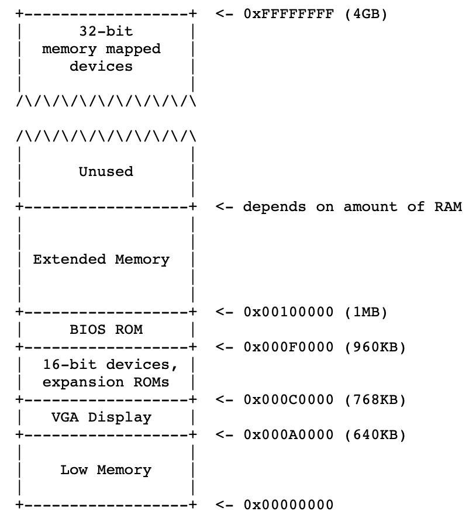
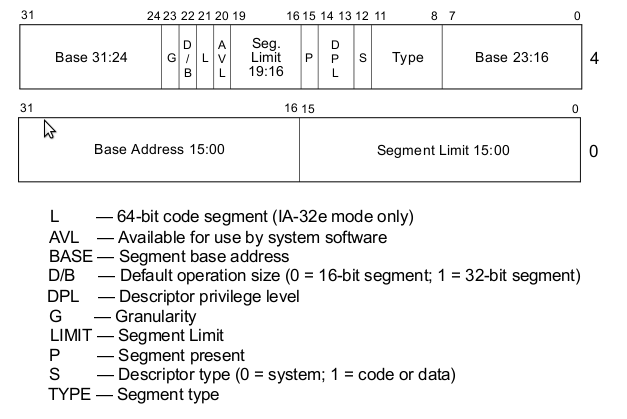
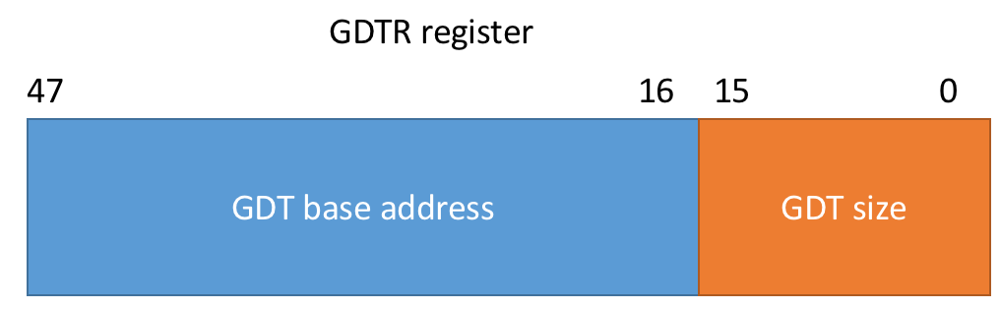
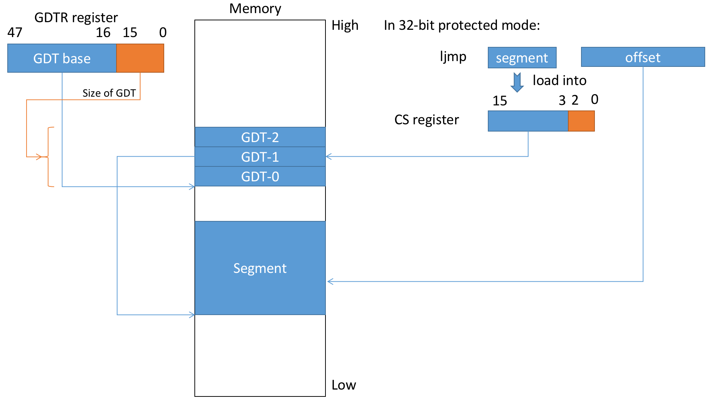

## Lab1

TODO:

1. get familari with the x86 assembly language, the QEMU x86 simulator, the bootstrap procedure
2. boot loader for 6.828, in boot/ directory
3. delve into the kernel
4. read format assemble inline in C language


**BIOS**: 

The layout of PC's memory:



The first instruction is :

```assembly
[f000:fff0]  0xffff0:    ljmp  $0xf000,$0xe05b
```

this is where the BIOS begins. (Notes: Different from the bootloader begin address(0x7c00))

When the BIOS runs, it sets up an interrupt descriptor table and initializes various devices such as the VGA display. 

After initializing the PCI bus and all the important devices the BIOS knows about, it searches for a bootable device such as a floppy, hard drive, or CD-ROM. Eventually, when it finds a bootable disk, the BIOS reads the *boot loader* from the disk and transfers control to it. 

**BOOTLOADER:**

When the BIOS finds a bootable floppy or hard disk, it loads the 512-byte boot sector into memory at physical addresses 0x7c00 through 0x7dff, and then uses a jmp instruction to set the CS:IP to 0000:7c00, passing control to the boot loader. 

 

Like the BIOS load address, these addresses are fairly arbitrary - but they are fixed and standardized for PCs.

What  bootloader in boot.S do: 

1. Enable A20 Mode

in early CPU, the 21th bit(line 20, starting from 0 is tied low(set as bit 0)).(rolling address)

for compatibility, enabled A20 mode allows the line 20 to set as bit 1.

Open the A20 gate:

1. write 0xd1 to port 0x64
2. write 0xdf to port 0x60(don’t know why this will work)

```assembly
# Enable A20:
#   For backwards compatibility with the earliest PCs, physical
#   address line 20 is tied low, so that addresses higher than
#   1MB wrap around to zero by default.  This code undoes this.
seta20.1:
  inb     $0x64,%al               # Wait for not busy
  testb   $0x2,%al
  jnz     seta20.1

  movb    $0xd1,%al               # 0xd1 -> port 0x64
  outb    %al,$0x64

seta20.2:
  inb     $0x64,%al               # Wait for not busy
  testb   $0x2,%al
  jnz     seta20.2

  movb    $0xdf,%al               # 0xdf -> port 0x60
  outb    %al,$0x60
```


2. go into 32-bit protect mode	

   In this process, the CPU excutes the following tasks:
   1. lgdt load Global Description Table

      In this process, we need to :

      - define the GDT which is stored at memory 

        the format of GDT is:

        

      - store the GDT address, and GDT size into register GDTR(48bits, the higher 32bit is for address, the lower 16bits is for the size of GDT) in CPU.

      In lab1, we can find the GDTR as:

      `GDTR =     00007c4c 00000017`

      the lgdt code is:

      ```assembly
      lgdt    gdtdesc
      # some other code...
      .p2align 2                                # force 4 byte alignment
      gdt:
        SEG_NULL             				 	# null seg
        SEG(STA_X|STA_R, 0x0, 0xffffffff) 	# code seg
        SEG(STA_W, 0x0, 0xffffffff)           # data seg
      
      gdtdesc:
        .word   0x17                            # sizeof(gdt) - 1
        .long   gdt                             # address gdt
      ```

      The marco `SEG` is defined in mmu.h:

      Notics, we define the shit in little endian order, which is reversely from the GDT difinition of the picture.

      ```assembly
      #define SEG_NULL           \
          .word 0, 0;            \		// one word is 16 bit, therefore 32 bit here
          .byte 0, 0, 0, 0				// 4 * 8 bits
      #define SEG(type,base,lim)                  \
          .word (((lim) >> 12) & 0xffff), ((base) & 0xffff);  \
          .byte (((base) >> 16) & 0xff), (0x90 | (type)),     \
              (0xC0 | (((lim) >> 28) & 0xf)), (((base) >> 24) & 0xff)
      ```

      The remaining marcos definitions:

      ```C
      // Application segment type bits
      #define STA_X       0x8     // Executable segment
      #define STA_E       0x4     // Expand down (non-executable segments)
      #define STA_C       0x4     // Conforming code segment (executable only)
      #define STA_W       0x2     // Writeable (non-executable segments)
      #define STA_R       0x2     // Readable (executable segments)
      #define STA_A       0x1     // Accessed
      ```

      

   2. set cr0 register(control register)

      ```assembly
      .set CR0_PE_ON,      0x1         # protected mode enable flag
      movl    %cr0, %eax
      orl     $CR0_PE_ON, %eax
      movl    %eax, %cr0
      ```

      

   3. jump into the 32-bit protection mode, and setting up segment registers
   
     ```assembly
     ljmp    $PROT_MODE_CSEG, $protcseg   # ljmp Segment_select, offset
     
     .code32                     # Assemble for 32-bit mode
     protcseg:	# Set up the protected-mode data segment registers
       movw    $PROT_MODE_DSEG, %ax    # Our data segment selector
       movw    %ax, %ds                # -> DS: Data Segment
       movw    %ax, %es                # -> ES: Extra Segment
       movw    %ax, %fs                # -> FS
       movw    %ax, %gs                # -> GS
       movw    %ax, %ss                # -> SS: Stack Segment
     ```
   
3. jump to bootmain, start C main function
   1. set up stack pointer(`$ESP`)（TODO：figure out what happen with the `$esp` and `$ebp`）
   2. call bootmain
   
   ```assembly
   # Set up the stack pointer and call into C.
   movl    $start, %esp
   call bootmain
   ```
   
   `$ESP` is stack pointer, points to the top of the stack, growing to lower address. `$EBP` is stack base, points to the base of the stack.
   
   When entering a function. We push the `$ebp` on the stack and assign the current `$esp` to the `$ebp`.

## GDT Details

### GDT

The structure of GDT item is shown as follows:


Detail descriptions:

- Base: 0x0

- Limit: 0xfffff

- Present: 1, since segment is present in memory - used for virtual memory

- Privilige: 0, ring 0 is the highest privilige

- Descriptor type: 1 for code or data segment, 0 is used for traps

- Type:

  The code segment:

  - Code: 1 for code, since this is a code segment
  - Conforming: 0, by not corming it means code in a segment with a lower privilege may not call code in this segment - this a key to memory protection
  - Readable: 1, 1 if readible, 0 if execute-only. Readible allows us to read constants dened in the code.
  - Accessed: 0 This is often used for debugging and virtual memory techniques since the CPU sets the bit when it accesses the segment

  The data segment:

  - Code: 0 for data

  - Expand down: 0 . This allows the segment to expand down

  - Writable: 1. This allows the data segment to be written to, otherwise it would be read only

  - Accessed: 0 This is often used for debugging and virtual memory techniques, since the CPU sets the bit when it accesses the segment

- Other flags:

  - Granularity: 1, if set, this multiplies our limit by 4 K (i.e. $16\times16\times16$), so our 0xfffff would become 0xfffff000 (i.e. shift 3 hexadecimal digits to the left), allowing our segment to span 4 Gb of memory
  - 32-bit default: 1, since our segment will hold 32-bit code, otherwise we'd use 0 for 16-bit code. This actually sets the default data unit size for operations (e.g. push 0x4 would expand to a 32-bit number ,etc.)
  - 64-bit code segment: 0, unused on 32-bit processor
  - AVL: 0, We can set this for our own uses (e.g. debugging) but we will not use it

One item in GDT has 64 bits. We can check our GDT in xv6 system booting procedure:

1. check the lgdtw command in gdb mode.

   ```assembly
   0x7c1e      lgdtw  0x7c64
   ```

   The address `0x7c64` locates at the `$gdtdesc` which is defined as:

   ```assembly
   gdtdesc:
    85   .word   0x17                            # sizeof(gdt) - 1 (16bits, 4bytes)
    86   .long   gdt                             # address gdt		(32bits, 8bytes)
   ```

2. Therefore, we check the value at `0x7c64` by gdb command `x /4x 0x7c64`

   ```assembly
   0x7c64: 0x7c4c0017      0x90900000      0xbae58955      0x000001f
   ```

   Remember we have define 4 bytes alignment`.p2align 2` and we use little endian order in cpu.

   Therefore, `0017` is the size of GDT and `00007c4c` is the address of our GDT. The `lgdtw` command stores these two values in GDTR register as the following rules.

   

   The lower 16 bits in GDTR stores the size of GDT. One item of GDT is 64 bits($8=2^3$ bytes). So 16 bits of the GDTR can represent $2^{16-3}=8192$ items of GDT.

3. And then we check the GDT in address `0x7c4c` with command `x /8x 0x7c4c`:

   ```assembly
   0x7c4c: 0x00000000      0x00000000      0x0000ffff      0x00cf9a00
   0x7c5c: 0x0000ffff      0x00cf9200      0x7c4c0017      0x90900000
   ```

   It shows the 3 GDT items as:

   ```assembly
    0x00000000  = 0000 0000 0000 0000 0000 0000 0000 0000    
    0x00000000  = 0000 0000 0000 0000 0000 0000 0000 0000
     
    0x0000ffff  = 0000 0000 0000 0000 1111 1111 1111 1111    
    0x00cf9a00  = 0000 0000 1100 1111 1001 1010 0000 0000
     
    0x0000ffff  = 0000 0000 0000 0000 1111 1111 1111 1111
    0x00cf9200  = 0000 0000 1100 1111 1000 0100 0000 0000
   ```

   It indicates that the GDT is growing to the higher memory address.

   The difference between the GDT-1 and GDT-2 is the TYPE flags. The GDT-1 has TYPE: `1010`, which means it is a code segment, GDT-2 has TYPE: 0100, means it is data segment.


The address mapping procedure is depicted on the below picture.




### STACK

esp, decrease by 0x4 after `push`, pointing to the top of the stack

ebp, pointing to the base of the current stack frame

The procedure of the stack building during a call of a function:

1) push arguments into stack inversibly(decreasing $esp)

​	`movl   $0x0,(%esp)`

2) `call` instrution, push `eip` to stack

3) push `ebp` to the current stackframe, and refresh the `ebp`

```asm
push   %ebp
mov    %esp,%ebp
```

4) reserve space for variants in current function:

```assembly
sub    $0x14,%esp
```


##### Symbol during debuging

```c
printf("%.*s", l, s);
```

print a string with a length


## GOING INTO C

### Pointers

An interesting segment of code about pointers recommended by the lab handout:

```C
int a[4] = {200 400 301 302};
int *b = malloc(16);
int *c = a;

*(int *) ((char *) c + 1) = 500;
printf("a[0] = %d, a[1] = %d, a[2] = %d, a[3] = %d\n", a[0], a[1], a[2], a[3]);

// 	   200 400 301 302
//     00000190  0000012d
//     little endian
//     90 01 00 00 2d 01 00 00
//     c
//        c+1
//     500: 0x1f4
//     *(int *)((char *)c+1) = 500
//     90 f4 01 00 00 01 00 00
//     0x0001f490 = 128144
//     0x00000100 = 256
//		if modify the c+1 to c+3:
//
//     90 01 00 00 2d 01 00 00 
//     c        c+3     
//     90 01 00 f4 01 00 00 00
//     0xf4000190 = -201326192
//     0x00000001 = 1
```

The `c` points to `a`, which is the begining of an array. `c` is pointer to integer. Remember numbers in computer system is store by little-endian order, which mean lower bytes stores at lower address. We can compute the value of each element in `a` carefully, such as the annotation above.


### ELF format file

When you compile and link a C program such as the JOS kernel, the compiler transforms each C source ('`.c`') file into an *object* ('`.o`') file containing assembly language instructions encoded in the binary format expected by the hardware. The linker then combines all of the compiled object files into a single *binary image* such as `obj/kern/kernel`, which in this case is a binary in the ELF format, which stands for **Executable and Linkable Format**.


##### Kernel mapping

entrypgdir.c maps 4MB($2^{22}$) memory from `0xf0000000` through `0xf0400000` to memory from `0x00000000` through `0x00400000`(4MB). The details of mapping is not required at current stage. 

the mapping takes into effect after 

```assembly
movl    %eax, %cr3
movl    %cr0, %eax
orl 	$(CR0_PE|CR0_PG|CR0_WP), %eax
movl    %eax, %cr0
```

The marco is defined as:

```C
#define CR0_PE      0x00000001  // Protection Enable
#define CR0_MP      0x00000002  // Monitor coProcessor
#define CR0_EM      0x00000004  // Emulation
#define CR0_TS      0x00000008  // Task Switched
#define CR0_ET      0x00000010  // Extension Type
#define CR0_NE      0x00000020  // Numeric Errror
#define CR0_WP      0x00010000  // Write Protect
#define CR0_AM      0x00040000  // Alignment Mask
#define CR0_NW      0x20000000  // Not Writethrough
#define CR0_CD      0x40000000  // Cache Disable
#define CR0_PG      0x80000000  // Paging
```

The meaning of each bit of `CR0` register is:


### Format printing of C

Read through `kern/printf.c`, `lib/printfmt.c`, and `kern/console.c`

##### In `printf.c`

`kern/printf.c`: functions of higher level interface

- `static void putch(int ch, int *cnt)`
- `int vcprintf(const char *fmt, va_list ap)`
- `int cprintf(const char *fmt, ...)`

The `cprintf` is the function `printf` we usually call. It is implemented with `vcprintf `:

```C
int cprintf(const char* fmt, ...) {
	va_list ap;
    int cnt;
    va_start(ap, fmt);
    cnt = vcprintf(fmt, ap);
    va_end(ap);
    return cnt;
}
```

So `cprintf` actually has a return, which is an integer.

In ANSI C, the following definitions is in `stdarg.h`:

```C
typedef char *va_list;
#define va_start(list,param1)   ( list = (va_list)&param1+ sizeof(param1) )
#define va_arg(list,mode)   ( (mode *) ( list += sizeof(mode) ) )[-1]
#define va_end(list) ( list = (va_list)0 )
```

:pig:

`va_start(ap, fmt)` converts the `ap` to the `va_list` type. The pointer`ap` skips the `fmt` memory area, and points to the arguments following the `fmt`. `va_end` just release the `ap` pointer. `va_arg` is used in `console.c`, we will check it later.

##### In `printfmt.c`

`void vprintfmt(void (*putch)(int, void*), void *putdat, const char *fmt, va_list ap)` is the core function. `putch` puts a char and a counter pointer. `putdata` is the `cnt` counter. 

##### In `console.c`

`console.c` handles inputs from keyboard and output to terminal. 

###### Output

An output traceback process is `cprintf` -> `vcprintf` -> `vprintfmt` -> `putch` -> `cputchar` -> `cons_putc`.

The `cons_putc` puts a char to the console. It contains three output channels, which are `serial_putc`, `lpt_putc` and `cga_putc`. They represent serial port output, parrallel port output and CGA/VGA displayer output. `cga_putc` is most commonly used.

An interesting piece of code:

```C
if (crt_pos >= CRT_SIZE) {
    int i;
    memmove(crt_buf, crt_buf + CRT_COLS, (CRT_SIZE - CRT_COLS) * sizeof(uint16_t));
    for (i = CRT_SIZE - CRT_COLS; i < CRT_SIZE; i++)
        crt_buf[i] = 0x0700 | ' ';
    crt_pos -= CRT_COLS;
}
```

This code make sure the terminal displays the latest information on the terminal curser, by refreshing the screen. An unknown operation is `0x0700 | ' '`. It was seen in previous code in `cga_putc`:

```C
//if no attribute given, then use black on white
if (!(c & ~0xFF))
	c |= 0x0700;
```

I guess it was an attribute to the char, differentiating the controlling char and normal char.(ENTER, CTL etc vs. ascii char such as `a-z` etc.)

### Appendix

- A new way to initilizing an array in C: `int a[3] = {[1]=3, [2]=1, [0]=4}`

- octal number starts with `0`: `033 = 0x1b = 27`

- `&p[i]` represents `p+i`


### STH LEFT TODO

- color output