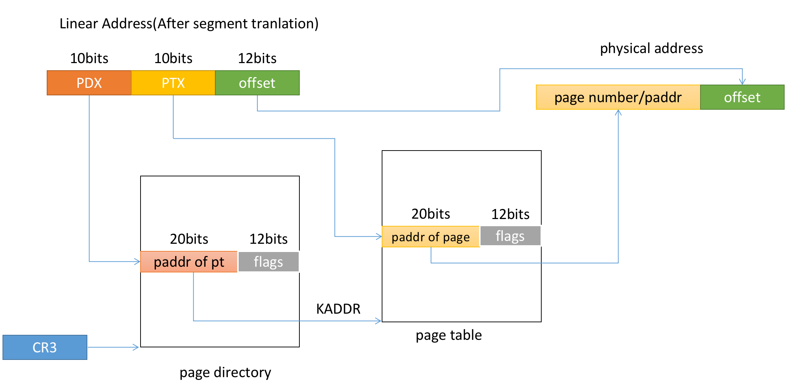

# Lab 2 

Virtual memory and Physical memory allocator

### Initialization

```bash
git merge lab1 # merging lab1 codes(actually no code)
```

### Memory management

Memory Address transformation process:


The **virutal address** (which used by programmers) is transformed to **linear address**. Linear address is the address before page table indexing. After page translation, we acquire the **physical address**, which is the actual address on physical memory.


We will set up the mapping procedure in lab 2, completing the corresponding data structure.

The address in page directory/table entry is physical address(PADDR)

The overall translation process is sketched as following




#### Segment Translation

The translation procudure is introduced in [lab1 notes](/Users/zyd/os/notes/lab1.md). The translation uses 4 data struture:

- Descriptors, which is the items in Descriptor Table
- Descriptor Table
- Selectors, which is used to select the Descriptor Tables
- Segment Register(`$CS`, `$ES` etc)


#### Page Tranlation

Firstly, page tranlation is effected only when `PG` bit is set on `$CR0` register.

Operating system kernels often like to be linked and run at very high *virtual address*, such as `0xf0100000`, in order to **leave the lower part of the processor's virtual address space for user programs to use**.

Mapping regulation:

kernel space:, linear address `0xf0000000` to `0xffffffff`, has totally `256MB`(0xfffffff) space, maps to physical address(0x0 to 0x0fffffff)。In this space we store the kernel code, kernel page diretory etc.

other space: linear address`0x0` to `0xefffffff`, has totally `4GB-256MB` space, maps to whatever you like

The page translation is flexible, is not a bijection mapping.

suppose one physical address 0x00000000, it belongs to page 0. then it can be map by linear address:

`0x00000000`, `0x10000000`, just by adding the physical address to the corresponding pte_entry by `pgdir_insert`. (remember the `PageInfo::pp_ref`). In this case, the `pp_ref` of page 0 is incremented by `2`


- The question:

  - Revisit the page table setup in `kern/entry.S` and `kern/entrypgdir.c`. Immediately after we turn on paging, EIP is still a low number (a little over 1MB). At what point do we transition to running at an EIP above KERNBASE? What makes it possible for us to continue executing at a low EIP between when we enable paging and when we begin running at an EIP above KERNBASE? Why is this transition necessary?

  In `entry.S` the paging turning on and jumping to high EIP above KERNBASE code is:

  ```assembly
  # Load the physical address of entry_pgdir into cr3.  entry_pgdir
  	# is defined in entrypgdir.c.
  	movl	$(RELOC(entry_pgdir)), %eax
  	movl	%eax, %cr3
  	# Turn on paging.
  	movl	%cr0, %eax
  	orl	$(CR0_PE|CR0_PG|CR0_WP), %eax
  	movl	%eax, %cr0
  
  	# Now paging is enabled, but we're still running at a low EIP
  	# (why is this okay?).  Jump up above KERNBASE before entering
  	# C code.
  	mov	$relocated, %eax
  	jmp	*%eax
  relocated:
  	# ...
  ```

  Lets see the pgdir:

  ```C
  // Page directories (and page tables), must start on a page boundary,
  // hence the "__aligned__" attribute.  Also, because of restrictions
  // related to linking and static initializers, we use "x + PTE_P"
  // here, rather than the more standard "x | PTE_P".  Everywhere else
  // you should use "|" to combine flags.
  __attribute__((__aligned__(PGSIZE)))
  pde_t entry_pgdir[NPDENTRIES] = {
  	// Map VA's [0, 4MB) to PA's [0, 4MB)
  	[0]
  		= ((uintptr_t)entry_pgtable - KERNBASE) + PTE_P,
  	// Map VA's [KERNBASE, KERNBASE+4MB) to PA's [0, 4MB)
  	[KERNBASE>>PDXSHIFT]
  		= ((uintptr_t)entry_pgtable - KERNBASE) + PTE_P + PTE_W
  };
  ```

  We can see we map both [0, 0x400000] and [0xf0000000, 0xf0400000] to physical address [0, 0x400000]. When we turn on paging at`movl %eax, %cr0`, we still run on low EIP. This is ok because both low EIP and KERNBASE maps to the same physical address.


after setting up the mapping from virtual address and physical address. We should load the pgdir address in `CR3` register.

```C
lcr3(PADDR(kern_pgdir));
```

the implementation detail:

```C
static inline void
lcr3(uint32_t val) {
	asm volatile("movl %0, %%cr3" : : "r" (val));
}
```

#### Why kernel address is located at high space?

Early version CPU has fewer bits of address line, such as 16-bits. To be compatible to the early program which is coded with lower address, locating the kernel at high place gives convenience.

#### Speculation

1)

```c++
// print the following message with mon_kerninfo(0, NULL, NULL)

Special kernel symbols:
  _start                  0010000c (phys)
  entry  f010000c (virt)  0010000c (phys)
  etext  f0101806 (virt)  00101806 (phys)
  edata  f0119300 (virt)  00119300 (phys)
  end    f0119940 (virt)  00119940 (phys)
Kernel executable memory footprint: 103KB
```

The  address of ` _start[], entry[], etext[], edata[], end[]` should be important, but I don't know their logic yet.

`end` is bigger than `KERNBASE`, which means the `kern_pgdir` is store at Remapped Physical Memory(above `KERNBASE:0xf0000000`).

The page directory is store above KERN_BASE


2)

`PGSIZE` page size is 4096(Bytes).

`basemem`is `640`K. `npages_basemem`is `basemem / (PGSIZE / sizeof(KB))=basemem/(PGSIZE/1024)=655360`

`IOPHYSMEM` is equal to `npages_basemem*PGSIZE`

`EXTPHYSMEM` is `0x100000`, where kernel begins. 


#### Missing Task in Lab1(mon_backtrace)

###### Tools

GDB command

`layout regs`: show registers

`x/16x $ebp`: print 16 number after the location to which $ebp points

###### EBP and ESP maintaining stack frame

The calling convention in C language:

When a caller call a callee function:

​	1) push the parameters in reverse order into stack. moving the `$esp` register to lower address, growing the stack towards lower address

​	2) push the next jump address into stack, i.e. the next instruction of the calling instruction.

​	3) jump in the callee function, setting the `$eip` to the callee function.

​	4) push `$ebp` into stack

​	5) setting new`$ebp` with current `$esp` value.

- checking the esp and ebp in the first line of `mon_backtrace`(`b *0xf010079c`)

  check stack frame pointer

  ```bash
  (gdb) p $esp
  $2 = (void *) 0xf0116f1c
  (gdb) p $ebp
  $1 = (void *) 0xf0116f38
  ```

  checking the stack frame, printing out the memory.

  ```assembly
  0xf0116f18:     0xf0116f38      
  0xf0116f1c:		0xf0100087	#<----- $esp, points to the next jump address (return addr)  
  0xf0116f20:		0x00000000  # tf	parameter of mon_traceback			^
  0xf0116f24:		0x00000000	# argv										|
  0xf0116f28:     0x00000000 	# argc     									|
  0xf0116f2c:		0x00000000  #      					The stack frame of test_traceback(0)
  				0xf01008f4  # 											|
  				0x00000001	# push %ebx									\/
  0xf0116f38:     0xf0116f58 	#<--------- $ebp , points to $ebp of previous stack frame--- 
  				0xf0100069      
  				0x00000000      
  				0x00000001
  0xf0116f48:     0xf0116f78      
  				0x00000000      
  				0xf01008f4      
  				0x00000002
  0xf0116f58:     0xf0116f78  #-------------      
  0xf0116f5c:		0xf0100069      
  				0x00000001      
  				0x00000002
  0xf0116f68:     0xf0116f98      
  				0x00000000      
  				0xf01008f4      
  				0x00000003
  0xf0116f78:     0xf0116f98  #-------------    ebp 
  				0xf0100069      
  				0x00000002      
  				0x00000003
  0xf0116f88:     0xf0116fb8      
  				0x00000000      
  				0xf01008f4      
  				0x00000004
  ```

  

  

## Appendix

- NVRAM: non-volatile random access memory. It is able to retains data without supplied power.
- DRAM: dynamic random access memory. maintain data only as long as power is supplied.
- SRAM: static random access memory. maintain data only as long as power is supplied.

##### A C language knowledge

- Memory Layouts

  Memory allocated for one C program:

  

- `extern` and `static` key words in C language

##### `extern`: 

The **declaration** and **definition** of a variable is difference in C language. Declaration process only declare a  variable name and type in the programme and don't allocate memory for the variable. Definition of the variable allocates memory for the variable. A declaration can be done any times programmers want but definition can exist only once.

`extern` can decorate both variable and functions like:

```C
extern <data_type> <variable_name>;
extern <return_type> <function_name>(<parameter_list>);

extern int x;	
extern void fun(int arg);
```

In variable decoration, `extern` keyword represents a **declaration** , which means under such a keyword, the variable is a global variable, owns types and names in the compiling process, but don't deserved memory allocation.

```C
//in file b.c
extern int y;
void f() {
	y = y + 1;
}

//in main.c
y = 10;
int main(int argc, char *argv[]) {}
```

In function decoration, the keyword is implicitly assumed. The compiler treats `void fun(int argc)` the same as `extern void fun(int arg)`. The `extern` keyword extends the function visibility to the whole program. The file can use this function with a declaration of the function.

```c
void fun() {}
//equals to
extern void fun() {}
```

Moreover, the `extern` keyword is used to adapt the C plus plus program to the C program.

```cpp
extern "C" {
	// code of C.
}
//code of C++
```

We can check the symbol different using `nm <file_name>.o` command for the following code.

```C++
// a1.cpp
extern "C" {
	int a;
    void fun() {
        return a;
    }
}
//a2.cpp
int a;
void fun() {
    return a;
}
```

The `nm a1.o` output:

```bash
00000000000000c8 S _a                                                                              0000000000000000 T _fun                                                                           0000000000000010 T _main
```

The `nm a2.o` output: 

```bash
0000000000000000 T __Z3funv
00000000000000c8 S _a
0000000000000010 T _main
```

##### `static`: 

As similar to the `extern`, `static` can be used to decorate both variables and functions.

Firstly, the static variable keep their value even out of current variable scope. The syntax is:

```c
static <typename> <variable name> = <var value>;
```

- A static int variable remains in memory while the program is running. A normal or auto variable is destroyed when the function where the variable is declare is over.

```c
#include<stdio.h> 
int accumulate() 
{ 
  static int count = 0; 
  return count++; 
} 
   
int main(int argc, char *argv[]) 
{ 
  printf("%d\n", accumulate()); 
  printf("%d\n", accumulate()); 
  return 0; 
}
```

- static variables are store in data segment(not stack)

- static variables are initialized as `0`.
- static variables can only be initialized with constant values.
- static variables should not be declared inside structure.


When `static` decorates function, it means that the function can only be accessed within the file where it is declared.


#### C syntax `struct`

```c
struct StructTypeName {
	<type> <name> : <width: int>;// it implys the width of this member, the width must be no more than the size of <type>
};
```

But the size of the `struct StructTypeName`still follow the align rule of C language. This syntax is used for bit setting, narrowing the memory usage. for example:

```C
struct A {
	unsigned x : 7;
    unsigned y : 25;
};
//sizeof(A) is 4(bytes) = 32bits = 7 + 25
struct B {
    unsigned x : 7;
};
//sizeof(B) is 4(bytes) = 7bits round up to 4 bytes(size of unsigned)
```

This is used in the Segment Descriptor:

```C
struct Segdesc {
    unsigned sd_lim_15_0 : 16;  // Low bits of segment limit
    unsigned sd_base_15_0 : 16; // Low bits of segment base address
    unsigned sd_base_23_16 : 8; // Middle bits of segment base address
    unsigned sd_type : 4;       // Segment type (see STS_ constants)
    unsigned sd_s : 1;          // 0 = system, 1 = application
    unsigned sd_dpl : 2;        // Descriptor Privilege Level
    unsigned sd_p : 1;          // Present
    unsigned sd_lim_19_16 : 4;  // High bits of segment limit
    unsigned sd_avl : 1;        // Unused (available for software use)
    unsigned sd_rsv1 : 1;       // Reserved
    unsigned sd_db : 1;         // 0 = 16-bit segment, 1 = 32-bit segment
    unsigned sd_g : 1;          // Granularity: limit scaled by 4K when set
    unsigned sd_base_31_24 : 8; // High bits of segment base address
};
```


