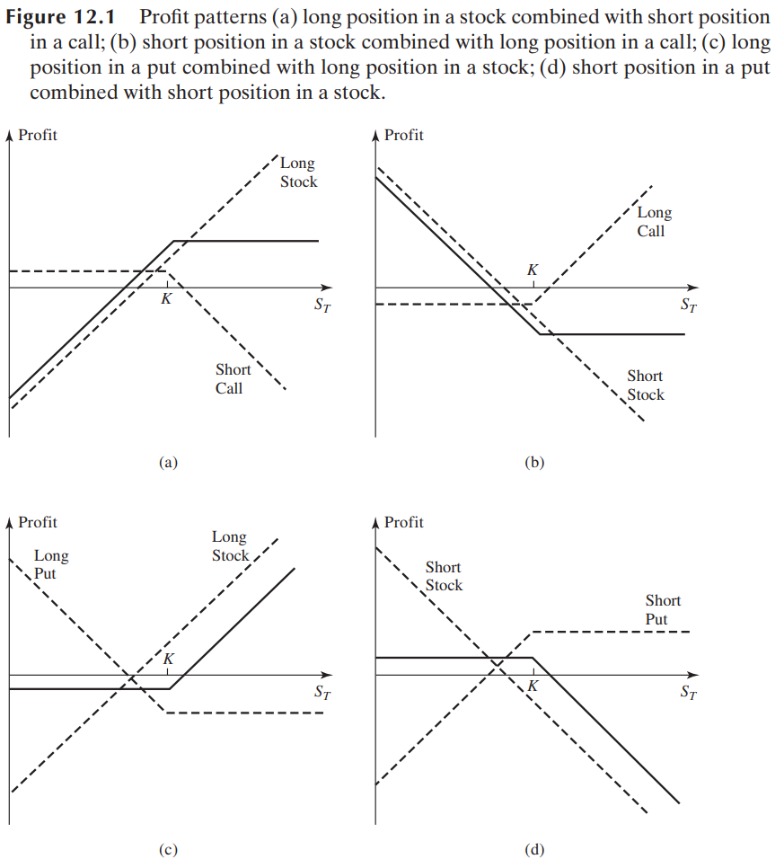
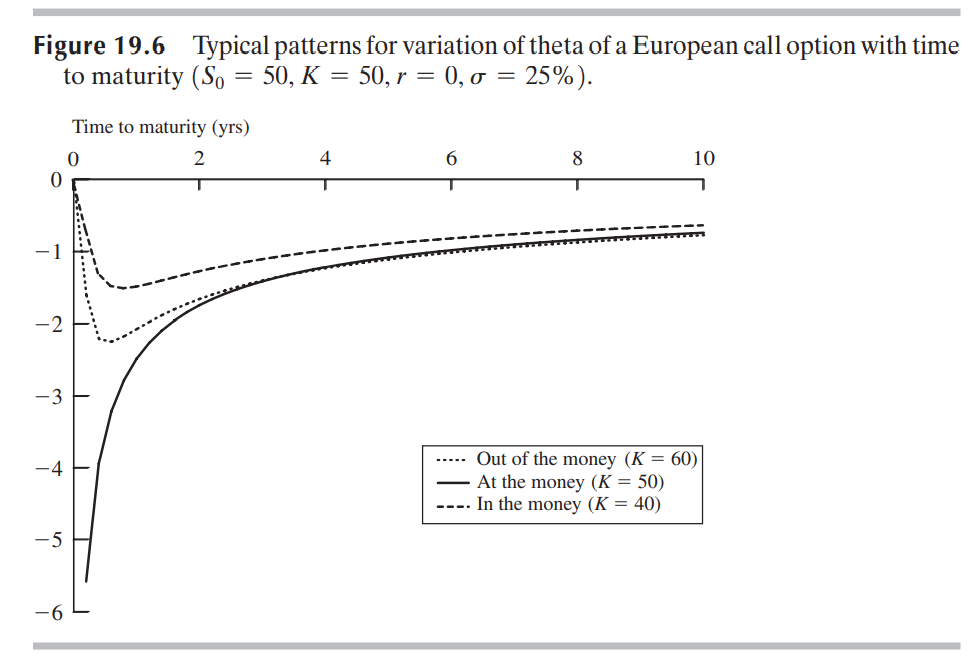
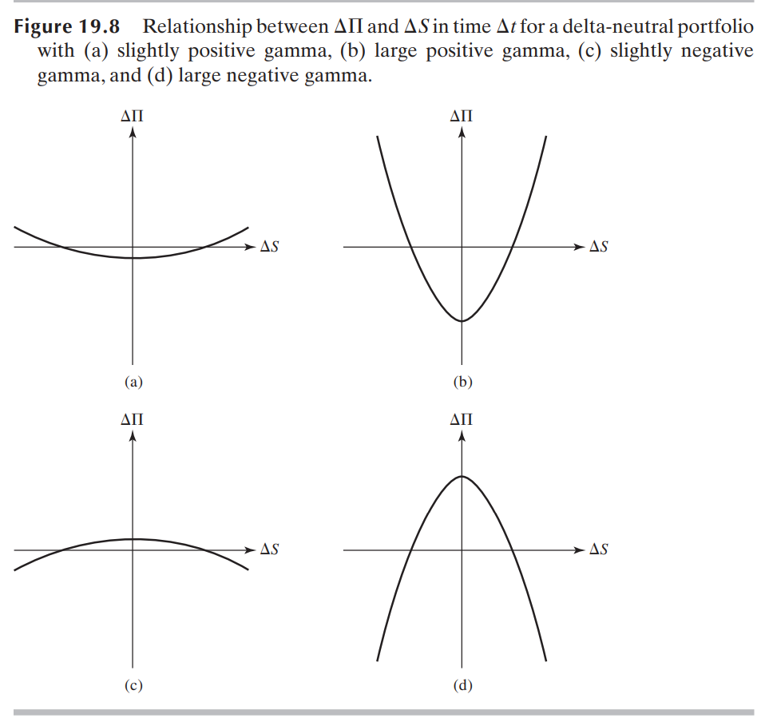

# Options 

## 1. Introduction of derivatives

> A derivative involves two parties agreeing to a future transaction. Its value depends on(or derives from) the values of other underlying variables.

Key factors of derivatives: two parties, future transaction, underlying variables. 

### 1.1 Markets

Derivatives can be traded both in exchange markets or OTC markets.

#### 1.1.1 Exchange-traded Markets

Chicago Board of Trade(CBOT, 1848), brought farmers and merchants together to standardized the traded grains.

Chicago Mercantile Exchange(CME, 1919), future exchange.

CME Group, which is merged from CBOT and CME, includes New York Mercantile Exchange(NYMEX), Kansas City Board of Trade(KCBT).

Chicago Board Options Exchange(CBOE) started trading call option in 1973.

Once two traders in exchange reach an agreement, the actual transaction will be between the clearing house and traders. Traders need to deposit **margin** in clearing house of exchange to meet the requirement of clearing house, who needs to handle the credit risk.

- 中国场内衍生品发展

1990年，郑州粮食批发市场试行远期交易

1992年国债期货，95年327国债期货事件后，证监会叫停国债期货。

1998年期货交易所合并为3家：上期所，郑州商品交易所，大连商品交易所

2013年，首支股指期货，中金所，沪深300

2015年，首个ETF期权50ETF期权上交所。

2019年，沪深300ETF上交所+深交所 股指期权，中金所沪深300股指期权。

2022年，中证500ETF期权，创业板期权。

#### 1.1.2 Over-The-Counter Markets

Derivatives trading take place in OTC derivatives markets, which includes banks, large financial institutions, fund managers and corporations.

#### 1.1.3 comparison of exchange and OTC

OTC market size is much larger than exchange market.(5 times, otc $500+trillion, exchange \$10 trillion, www.bis.org)

### 1.2 Types of Derivatives

- forward contracts: **agreement** to buy or sell an asset at a **certain** **future** **time** for a **certain** **price**.
- future contracts: agreement between two parties to buy or sell an asset at a certain time in the future for a certain price. Futures are normally standardized contracts  in exchanged market.
- options: call options gives the holder the **right** to buy the underlying asset by a certain date for a certain price, and put options gives the holder the **right** to sell the underlying asset by a certain date for a certain price. Key factors of option: expiration date(maturity), strike price(exercise price). American options can be exercised before expiration date while European options can only be exercised at the expiration date. 

### 1.3 Types of Traders

- Hedger: risk management with derivatives.

- Speculator: make profit by betting market movements.

- Arbitrageur: lock a profit by finding offset between markets or contracts.

## 2. Mechanics of Options

We only discuss European options below.

### 2.1 Option Position

- long position: who bought an option.
- short position: who sold an option.

Use payoffs, which means the profits(not considering costs) made by traders at the maturity,  to characterize an option. Suppose strike price is $K$, underlying stock price at expiration time $T$ is $S_T$. 

- long call: $\max(S_T-K,\ 0)$. When $S_T$ is larger than $K$, exercise the option, cash flow, $-K$ buying stock and $S_T$ selling. Nothing happen while $S_T$ lesser than $K$.
- long put: $\max(K-S_T, 0)$. When $S_T<K$, exercise the option, selling stock earns $K$ value, earns $K-S_T$.
- short call:$-\max(S_T-K, 0)=min(K-S_T, 0)$, which means opposite situation from long call.
- short put:$-\max(K-S_T, 0)=min(S_T-K, 0)$, which mean opposite situation from long put.

### 2.2 Types of underlying asset

- Stock option: most trading in exchanges. CBOE.
- ETP Option: ETF option
- Foreign Currency Option: mainly OTC
- Index Option: most popular exchange-traded contract: SPX(S&P 500 Index), OEX(S&P 100), NDX(Nasdaq-100), DJX(Dow Jones Industrial). All this on CBOE.
- Future Option.

### 2.3 Stock Option Properties

- Expiration date, strike price, no more shit to tell.

- Three items to specify option comparing strike price over underlying price. Suppose $S$ is the underlying stock price at present. for a call option, **ATM**(at the money, $S=K$), **OTM**(out of the money, $S<K$), **ITM**(in the money, $S>K$). ATM and ITM are option with payoff value, which means they have a larger chance than OTM to be exercised at the maturity.
- FLEX option, dividends, and other exchange limits

### 2.4 Trading Related

- market maker: obliged to provide orders of buy side and sell side in specific situations to provide liquidity of market.

- offsetting orders: no need to exercise if a trader offsets his long position by selling opposite direction option contracts.

- Trading cost: trading fee etc.

- Margin Requirements: for credit risk management. 

- **Naked Option**: 

  > A naked option is an option that is not combined with an offsetting position in the  underlying stock.

### 2.5 Others

- Taxation
- Clearing corporation
- Regulation
- Warrants, employee stock options and convertibles

## 3. Properties of Stock Options

### 3.1 Notations and assumptions

We assume:

- no contraction fee
- taxes equally on buying and selling stocks and options.
- investors can borrow and paying back risk free money

notations:

| meaning                                                      | notations |
| ------------------------------------------------------------ | --------- |
| current stock price                                          | $S_0$     |
| option strike price                                          | $K$       |
| expiration time of option                                    | $T$       |
| stock price at time $T$                                      | $S_T$     |
| risk-free interest, expiring at time $T$, continuous compound interest | $r$       |
| European call option price                                   | $c$       |
| European put option price                                    | $p$       |

### 3.2 Factors affecting option price

$+$ means value up, $-$ means value dropping down, ? means uncertainty.

| while factors adding up$+$ | call option price | put option price |
| -------------------------- | ----------------- | ---------------- |
| current stock price        | $+$               | $-$              |
| risk-free interest rate    | $+$               | $-$              |
| expiration time            | $?$               | $?$              |
| volatility                 | $+$               | $-$              |
| strike price               | $-$               | $+$              |
| amount of future dividends | $-$               | $+$              |

- When risk-free rate is high, long position of call option gives up higher opportunity cost of risk-free interest earnings. On the contrary, long position of put option can lend out cash to get the free risk interest. Prices change to implement this opportunity cost.
- Stock price will shrink if company announce higher amount of future stock dividends. prices change according to payoffs formula.
- call option holders want stock prices higher, and on the contrary, put option holders want stock prices lower.

### 3.2 Put-call parity

#### 3.2.1 Upper and lower bound of European options

##### 3.2.1.1 Upper bound

$$
c\leq S_0
$$

$$
p\le Ke^{-rT}
$$

a good method to prove bounds of option price is assumption.

- if $c>S_0$, buy the stock and sell the option can easily make a risk-free arbitrage.
- if $p>Ke^{-rT}$, sell a put option. get $p$ proceeds. Invest it risk-freely, get $pe^{-rT}$ at option expiration terminal. 

##### 3.2.1.2 Lower Bound

$$
c\ge S_0-Ke^{-rT}
$$

$$
p\ge Ke^{-rT}-S_0
$$

##### 3.2.1.3 put call pairty:

$$
c+Ke^{-rT}=p+S_0
$$

consider proving it by build two portfolios that have same profits at the future, and discounted them to current value:

portfolio A: one European call option plus a zero-coupon bond that provides a payoff of $K$ at time $T$.

portfolio C: one European put option plus one share of the stock.

**one tips:**  you can **lock** a future transaction at price $K$ by buying call option and selling put option simultaneously.

portfolio A at time T: $\max(S_T-K, 0) + K$, at present: $c + Ke^{-rT}$

portfolio C at time T: $\max(K-S_T, 0) + S_T$, at present: $p+S_0$

#### 3.2.2 American Options

American options prices can be shown as follows while no dividends are paid.
$$
S_0-K\le C-P \le S_0 -Ke^{-rT}
$$

## 4. Trading Strategies involving options

### 4.1 principal-protected notes 保本债券

Use option to create principal-protected notes. portfolio: principal \$1000 bond, ATM option.

### 4.2 trading one option and underlying asset

- writing a covered call: long position in stock + short call option, long stock covers for the short call option.
- protective put strategy: long put option , and long stock position. 



what about long stock + long call? $\max(S_T-K, 0) + S = \max(S_T+S-K, S)$

### 4.3 Spread Strategy

- Bull Spread: $\max(S_t-K_1, 0) - \max(S_t-K_2, 0)$, $K_1 < K_2$, short call + long call
- Bear Spread: $\max(K_1-S_t, 0) - \max(K_2-S_t, 0)$, $K_2<K_2$, short put + long put
- Box Spread: bull + bear
- Butterfly Spread: $K_1 < K_2<K_3$
  - long call $K_1$, short call $K_2$, long call$K_3$
  - long put $K_1$, short put $K_2$, long put $K_3$
- Calendar Spread
- Diagonal Spread

### 4.4 combination

- Straddle(跨式组合): long call and put option with same strike price and expiration date
- Strip（序列组合）: one long call and two long shorts with same $K$ and $T$
- Strap（带式组合）: two long call and one long shorts with same $K$ and $T$
- Strangle（异价跨式组合）: bottom vertical combination, long put and call with different $K$ but same $T$

Overall, you call build any kinds of profit curve with designed portfolio. It doesn't matter how much the curve is on the x-axis, it's about the probability of winning the market with the strategy you build.

## 5. Mathematics basics

### 5.1 Binomial Trees

#### 5.1.1 one step model

Suppose price of a stock option(or any derivatives dependent on the stock) is $f$, price of stock is $S_0$ at current step. At next time step, the price of stock can move up to $S_0u$ or shrink to $S_0d$, option price correspondingly move to $f_u$ or $f_d$.

We imagine building a portfolio consisting of a long position in $\Delta$ shares of stock and a short position in one option. We assume no-arbitrage situation. We construct risk-less portfolio by solving below equation. In such a case, no matter up or down the stock price is heading towards, the value of this portfolio is stable.
$$
S_0u\Delta-f_u=S_0d\Delta-f_d
$$
We can solve $\Delta$ out.
$$
\Delta=\frac{f_u-f_d}{S_0(u-d)}
$$
If we denote risk-free interest rate by $r$, the current value of this portfolio is:
$$
(S_0u\Delta-f_u)e^{-rT}=(S_0d\Delta-f_d)e^{-rT}
$$
The cost of setting up the portfolio equals the discount value:
$$
S_0\Delta-f=(S_0u\Delta-f_u)e^{-rT}
$$
We obtain the price of option(or derivatives)
$$
f=e^{-rT}[pf_u+(1-p)f_d]
$$
where
$$
p=\frac{e^{rT}-d}{u-d}
$$
Therefore, $p$ meaningfully stands for the probability of the stock price rising by percentage $u-1$.

#### 5.1.2 Risk Neutral Valuation

We call an investors risk neutral when investors do not increase the expected return they require from an investment to compensate for increased risk. (What??? Actually so stupid)

Risk neutral world has two features that simplify the pricing of derivatives:

- The expected return on a stock is risk-free rate.
- The discount rate used for the expected payoff on an option is risk-free rate.

#### 5.1.3 Two step binomial tree

Assuming one step is $\Delta t$ years, we just need to add up calculations:
$$
f=e^{-2r\Delta t}[p^2f_{uu}+2p(1-p)f_{ud}+(1-p)^2f_{dd}]
$$

#### 5.1.4 Binomial Tree Formula

##### 5.1.4.1 Matching Volatility

We have shown that 
$$
p=\frac{e^{r\Delta t}-d}{u-d}
$$
The parameter $u$ and $d$ should be chosen to match volatility. 

>Definition.
>
>The volatility of a stock $\sigma$ satisfies that the standard deviation of its return in a short period of time $\Delta t$ is $\sigma\sqrt{\Delta t}$

During a time step of $\Delta t$, the stock will provide a return of $u-1$ with probability $p$, and provide a return of $1-d$ with probability $1-p$.
$$
E(X)=p(u-1)
+(1-p)(1-d)
$$
The Variance of the stock is
$$
E(X^2)-(E(X))^2=\sigma^2\Delta t
$$
We obtain
$$
p(u-1)^2+(1-p)(d-1)^2-[p(u-1)+(1-p)(d-1)]^2=\sigma^2\Delta t
$$

$$
e^{r\Delta t}(u+d)-ud-e^{2r\Delta t}=\sigma^2\Delta t
$$

Using Talyor expansion, emitting $O(2)$ item:
$$
u=e^{\sigma\sqrt{\Delta t}}, d=e^{-\sigma\sqrt{\Delta t}}
$$
We can see $u$ and $d$ have no relation to $p$, which is the probability of stock price rising in **risk neutral world**. It means that in **real world** with price rising probability $p^*$,  it has same solution of the above equation.

- BS option pricing formula can be derived from binomial formula. Detail of deduction refers to textbook.

### 5.2 Probability Basic

#### 5.2.1 about variance

##### 5.2.1.1 Consider a random variable $X$

- variance of $X$ is the math expectation of $Y=(X-E(X))^2$
- $Var(X)=E(X^2)-(E(X))^2$
- $E(aX+b)=aE(X)+b$
- $Var(aX+b)=a^2Var(x)$

##### 5.2.1.2 variance types

- **population** variance, given population mean $\mu$
  $$
  \sigma^2=\frac{1}{n}\sum_{i=1}^{n}{(X_i-\mu)^2}
  $$

- **sample** variance:
  $$
  s^2=\frac{1}{n-1}\sum_{i=1}^{n}{(X_i-\bar{X})^2}
  $$

##### 5.2.1.3 covariance

$$
\sigma(x,y)=\frac{1}{n-1}\sum_{i=1}^{n}{(x_i-\bar{x})(y_i-\bar{y})}
$$

sample covariance matrix $C\in R^{d\times d}$, $X\in R^{d\times 1}$
$$
C_{i,j}=\sigma(x_i, x_j)
$$

$$
C=\frac{1}{n-1}\sum_{i=1}^{n}{(X_i-\bar{X})(X_i-\bar{X})^T}
$$

##### 5.2.1.4 Gaussian distribution

univariate:
$$
f(x)=\frac{1}{\sqrt{2\pi}\sigma}e^{-\frac{(x-\mu)^2}{2\sigma^2}}
$$
more general, $X\in R^{k \times 1}$
$$
\mathcal N(X|\mu, \Sigma)=\frac{1}{\sqrt{(2\pi)^kdet(\Sigma)}}\exp(-\frac{1}{2}(X-\mu)^T\Sigma^{-1}(X-\mu))
$$
if $Y=AX+b$, $X \sim \mathcal N(\mu, \Sigma)$, then $Y\sim \mathcal N(A\mu+b, A\Sigma A^T)$.

### 5.3 Wiener process, Ito's lemma

#### 5.3.1 Wiener Process

##### 5.3.1.1 Definition

A variable $z$ follows a Wiener process if it has the following two properties:

- The change $\Delta z$ during a small period of time $\Delta t$ is
  $$
  \Delta z=\epsilon\sqrt{\Delta t}
  $$
  where $\epsilon \sim \mathcal N(0, 1)$

- The values of $\Delta z$ for any two different short intervals of time, $\Delta t$, are independent.

Therefore, $\Delta z \sim \mathcal N(0, \Delta t)$ . Suppose $T=N\Delta t$. Variable $z$ at time $t$ is denoted as $z(t)$. Then, $z(T)-z(0)=\sum_{i=1}^{N}{\epsilon_i\sqrt{\Delta t}}\sim \mathcal N(0, N\Delta t)$

##### 5.3.1.2 Generalized

A generalized Wiener process for a variable $x$ can be defined in terms of basic Wiener process $dz$ defined at 5.3.1.1 as:
$$
dx=adt+bdz
$$
where $a$, $b$ are constants.  In discrete form, $\Delta x\sim\mathcal N(a\Delta t, b^2\Delta t)$.

##### 5.3.1.3 Itô  process

This is a generalized Wiener process in which the parameters $a$ and $b$ are functions of the value of the underlying variable $x$ and time $t$. It can be written as:
$$
dx=a(x,t)dt+b(x,t)dz
$$

##### 5.3.1.4 Simulation

How to simulate a Wiener process? Firstly we need to generate random numbers in Gaussian distribution with direct sample methods. Using python to implement this process.

```python
def ngd(x, mu=0, sigma=1):
    return 1/(np.sqrt(2 * np.pi) * sigma) * np.exp(-((x-mu)*(x-mu))/(2* sigma *sigma))

# generate [-3sigma, 3sigma] gaussian pdf data with `gap`
def gen_pdf(mu=0, sigma=1, gap=0.01):
    x = [gap * i - 3 * sigma for i in range(int(6 * sigma / gap))]
    return np.array([ngd(ix) for ix in x])

def gen_cdf(p, gap=0.01):
    cdf = np.zeros((p.shape[0], 1))
    cdf[0] = p[0] * gap
    for i in range(1, p.shape[0]):
        cdf[i] = cdf[i-1] + p[i] * gap
    return cdf

def gen_ngd(cdf, mu=0, sigma=1, gap=0.01):
    x = np.random.rand() * (cdf[-1][0] - cdf[0][0]) + cdf[0][0]
    for i in range(cdf.shape[0]):
        if cdf[i] > x:
            return i * gap - 3 * sigma
# T: time
# a: drift rate
# b: variance rate
# dx = a*dt + b*dz
# dz ~ N(0, dt)
def gen_wiener(x0 = 0, a = 0, b = 3, dt = 1, gap = 0.01, T = 4*365):
    pdf_data = gen_pdf()
    cdf_data = gen_cdf(pdf_data)
    N = int(T / dt)
    x = np.zeros((N, 1))
    x[0] = x0
    for t in range(1, N):
        x[t] = x[t-1] + a * dt + b * gen_ngd(cdf_data) * np.sqrt(dt)
    return x
```

#### 5.3.2 Process for a stock price

The expected percentage return required by investors from a stock is independent of the stock's price.(Why?????) Expected return(expected drift divided by the stock price) is constant.
$$
dS=\mu Sdt
$$
Integrating between $[0, T]$, we get
$$
S_T=S_0e^{\mu T}
$$
Another **reasonable** assumption: the variability of the return in a short period of time $\Delta t$ is the same regardless of the stock price.(Why????)
$$
dS=\mu Sdt+\sigma Sdz
$$
In discrete form
$$
\Delta S=\mu S\Delta t+\sigma S\epsilon\sqrt{\Delta t}
$$
Therefore
$$
\frac{\Delta S}{S}\sim\mathcal N(\mu \Delta t, \sigma^2\Delta t)
$$

#### 5.3.5 Itô's Lemma

A function $G(x,t)$ follows the equation if $x$ follows Itô's process:
$$
dG= \left(\frac{\partial G}{\partial x}a+ \frac{\partial G}{\partial t}+\frac{1}{2}\frac{\partial ^2G}{\partial x^2}b^2\right)dt+\frac{\partial G}{\partial x}bdz
$$
$dG$ also follows an Itô's process, with a drift rate of 
$$
\frac{\partial G}{\partial x}a+ \frac{\partial G}{\partial t}+\frac{1}{2}\frac{\partial ^2G}{\partial x^2}b^2
$$
and a variance rate of 
$$
\left(\frac{\partial G}{\partial x}b\right)^2
$$

#### 5.3.6 Lognormal property

We define 
$$
G=\ln S
$$
where $S$ is stock price defined above. From Itô's Lemma, we acquire
$$
dG=\left(\mu-\frac{\sigma^2}{2}\right)dt+\sigma dz
$$
Therefore, $\ln S$ is generalized wiener process. This means that
$$
\ln S_T-\ln S_0\sim \mathcal N\left[\left(\mu-\frac{\sigma^2}{2}\right)T, \sigma^2T\right]
$$
We call $S_T$ lognormal distributed because $\ln S_T$ is normal distributed.

## 6. Black-Scholes-Merton model

Stock price $S$ follows lognormal distribution. The expected value and variance can be shown as
$$
E(S_T)=S_0e^{\mu T}
$$

$$
Var(S_T)=S_0^2e^{2\mu T}(e^{\sigma^2T}-1)
$$

### 6.1 Expected return

We define compounded rate of return as $x$, then
$$
S_T=S_0e^{xT}\\
x=\frac{1}{T}\ln \frac{S_T}{S_0}
$$
So the return rate follows lognormal distribution. 
$$
\ln[E(S_T)]=\ln[S_0e^{\mu T}]=\ln(S_0)+\mu T
$$
$\ln(x)$is a concave function. We have 
$$
\ln(S_0)+\mu T=ln(E(S_T))>E(ln(S_T))=E(x)T+ln(S_0)
$$
which leads to
$$
E(x)<\mu
$$

### 6.2 Volatility

Volatility is defined as the standard deviation of the return provided by the stock in 1 year when the return is expressed using continuous compounding. Using the lognormal property:
$$
\sigma^2=\frac{1}{T}Var(\ln\frac{S_T}{S_0})
$$

### 6.3 BS Differential Equation

The stock price wiener process we have developed:
$$
dS=\mu Sdt+\sigma Sdz
$$
Suppose $f$ is the price of a call option or other derivative contingent on S. Then $f$ should be $f(S, t)$.
$$
df=\left(\frac{\partial f}{\partial S}\mu S+\frac{\partial f}{\partial t}+\frac{1}{2}\frac{\partial^2 f}{\partial S^2}\sigma^2S^2\right)dt+\frac{\partial f}{\partial S}\sigma Sdz
$$
We construct portfolio of:

- -1 unit derivatives
- +$\partial f/ \partial S$ share of stock

Define $\Pi$ as the value of this portfolio. At the current time step:
$$
\Pi=-f+\frac{\partial f}{\partial S}S
$$
Consider discrete time situation, substitute $f$ with above equation:
$$
\Delta \Pi=\left(-\frac{\partial f}{\partial t}-\frac{1}{2}\frac{\partial ^2 f}{\partial S^2}\sigma^2S^2\right)\Delta t
$$
Because this equation does not involve $\Delta z$, which is the random noise in wiener process, the portfolio must be risk-less during time $\Delta t$. **Why this happens**? Because the portfolio we design gracefully eliminate the risk of stock price by just  right $\partial f/ \partial S$ share of stock.

Because it is risk-less, it follows that:
$$
\left(-\frac{\partial f}{\partial t}-\frac{1}{2}\frac{\partial ^2 f}{\partial S^2}\sigma^2S^2\right)\Delta t=\Delta \Pi=r\Pi \Delta t=r\left(f-\frac{\partial f}{\partial S}S\right)\Delta t
$$
So that we get the famous **Black-Scholes-Merton differential equation**:
$$
\frac{\partial f}{\partial t}+rS\frac{\partial f}{\partial S}+\frac{1}{2}\sigma^2S^2\frac{\partial^2 f}{\partial S^2}=rf
$$

### 6.4 BS Pricing Formula

The most famous solution the the equation above is the pricing formulas for European call and put options.
$$
c=S_0N(d_1)-Ke^{-rT}N(d_2)\\
p=Ke^{-rT}N(-d_2)-S_0N(-d_1)
$$
where
$$
d_1=\frac{\ln(S_0/K)+(r+\sigma^2/2)T}{\sigma\sqrt{T}}\\
d_2=d_1-\sigma\sqrt T
$$
The function $N(x)$ is the CDF(Cumulative Probability Distribution) of standard Gaussian distribution. 

### 6.5 Implied Volatilities

The only parameter in the BS pricing formulas that can not be directly observed is the volatility of the stock price. Implied volatilities are observed in the market with binary search method.

Implied volatilities are used to monitor the market’s opinion about the volatility of a  particular stock. Whereas **historical volatilities** are backward looking,  **implied volatilities** are forward looking. Traders often quote the implied volatility of an option rather than its price. This is convenient because the implied volatility tends to be  less variable than the option price. The implied volatilities of actively traded options on  an asset are often used by traders to estimate appropriate implied volatilities for other  options on the asset.

The most popular index, SPX VIX, is an index of the implied volatility of 30 day options on the S&P 500 calculated from a wide range of calls and puts.

## 7. Greeks

Greeks are used for hedging process.

###  7.1 Delta

Delta is defined as the rate of change of the option price with respect to the price of the underlying asset. 
$$
\Delta = \frac{\partial c}{\partial S}
$$
where $c$ is the price of call option, $S$ is the stock price. Suppose a trader sold call options to buy $N$ shares stock.  The trader can hedge the position by buying $\Delta \times N$ stock. If stock price rise $\partial S$, stock position gains  $\Delta \times N \partial S$. Option price goes up by $\partial S \times \Delta$, which produces a loss of $\partial S \times \Delta N$ on the written call option.

The delta of this trader's short position in option is $\Delta \times (-N)$. The delta of one share of the stock is $1.0$, so the delta of long position in stock is $\Delta \times N$.  The delta of the stock position offsets the delta of the option position. which referrers to delta of zero, **delta neutral**.

For European stock options:
$$
\Delta(call)=\mathcal N(d_1)\\
\Delta(put)=\mathcal N(d_1)-1
$$
This can be derived from BS stock price formula by calculating $\frac{\partial c}{\partial S}$.

The delta of an option does not maintain constant. The factor of $T$ in $d_1$ also proves that. 
$$
d_1=\frac{\ln(S_0/K)+(r+\sigma^2/2)T}{\sigma\sqrt{T}}
$$
Therefore, trader's position can be remained delta hedged for only a relatively short period of time. The position should be adjusted periodically, which is called **rebalancing**. When the hedge is adjusted on a regular basis, the procedure is called dynamic hedging. It is contrasted with static hedging, where hedge is set up initially and never adjusted.

### 7.2 Theta

Theta of a portfolio is the rate of change of the value of the portfolio with respect to the passage of time with all else remaining the same.
$$
\Theta(call)=-\frac{S_0N'(d_1)\sigma}{2\sqrt T}-rKe^{-rT}N(d_2)\\
\Theta(put)=-\frac{S_0N'(d_1)\sigma}{2\sqrt T}+rKe^{-rT}N(-d_2)
$$
Theta is usually negative for an option. Because as time passes with all else remaining the same, the option tends to become less valuable.



### 7.3 Gamma

Gamma of a portfolio of options on an underlying asset is the rate of change of the portfolio's delta with respect to the price of the underlying asset.
$$
\Gamma=\frac{\partial ^2 \Pi}{\partial S^2}
$$
Relationship between $\Theta$, $\Gamma$, for a delta-neutral portfolio.
$$
\Delta \Pi=\Theta \Delta t+\frac{1}{2}\Gamma\Delta S^2
$$

- When $\Gamma$ is positive, $\Theta$ tends to be negative.
- When $\Gamma$ is negative, the $\Theta$ is tends to be positive.



For an European call or put option on a non-dividend-paying stock, the gamma given by BS model is
$$
\Gamma = \frac{N'(d_1)}{S_0\sigma\sqrt T}
$$

- Making Portfolio gamma neutral

suppose a delta-neutral portfolio has a gamma equal to $\Gamma$, a traded option has a gamma equal to $\Gamma_T$. The number of traded options added to the portfolio is $w_T$.
$$
w_T\Gamma_T+\Gamma=0
$$
the position in the traded options make the portfolio gamma neutral is $-\Gamma/\Gamma_T$.

### 7.4 Relationship between Delta, Theta, Gamma

The value of portfolio $\Pi$ follows a geometric Brownian motion process and satisfies the BS differential equation 
$$
\frac{\partial \Pi}{\partial t}+rS\frac{\partial \Pi}{\partial S}+\frac{1}{2}\sigma^2S^2\frac{\partial ^2 \Pi}{\partial S^2}=r\Pi
$$
Therefore
$$
\Theta+rS\Delta+\frac{1}{2}\sigma^2S^2\Gamma=r\Pi
$$
For a delta neutral portfolio, $\Delta=0$,
$$
\Theta+\frac{1}{2}\sigma^2S^2\Gamma=r\Pi
$$
This shows that, when $\Theta$ is large and positive, gamma of a portfolio tends to be large and negative, and vice versa. This is consistent with the way in which Figure 19.8 has been drawn and explains why theta can to some extent be regarded as a proxy for gamma in a delta-neutral portfolio.

### 7.5 Vega

The vega of an option, V, is the rate  of change in its value with respect to the volatility of the underlying asset
$$
\nu=\frac{\partial f}{\partial \sigma}
$$
A position in the underlying asset has zero vega. Use $-\nu/\nu_T$ number of traded options to neutralize the vega risk.

### 7.6 Rho

The rho of an option is the rate of change of its price $f$ with respect to the interest rate $r$:
$$
\frac{\partial f}{\partial r}
$$
For a European call option on a non-dividend-paying stock
$$
\rho_{call}=KTe^{-rT}N(d_2)\\
\rho_{put}=-KTe^{-rT}N(-d_2)
$$

## 7. Volatility Smiles

The volatility smile is the relationship between implied volatility and the strike price for a particular maturity.

The volatility surface is the implied volatility function of strike price and time maturity.

Volatility skew is the volatility decreases as the strike price increase.

## 8. More on models

### 8.1 Stochastic Volatility Model

stochastic volatility models are those in which the variance of a stochastic process is itself randomly distributed. On the contrary, volatility in BS model is a constant.

A general form for non-dividend stock with stochastic volatility is as below:
$$
dS_t=\mu_tS_tdt+\sqrt{v_t}S_tdW^1_t\\
dv_t=\alpha(S_t, v_t, t)dt+\beta(S_t,v_t,t)dW^2_t
$$
with
$$
dW^1_tdW^2_t=\rho dt
$$
where $S_t$ denotes stock price and $v_t$ denotes its variance.

A Wiener process $\Delta z$ follows:
$$
\Delta z=\epsilon\sqrt{\Delta t}
$$
Therefore,
$$
\Delta z_1\Delta z_2=\epsilon_1\epsilon_2\Delta t
$$
Let $\Delta t \to 0$, we get the micro differential form of correlated Wiener process:
$$
dz_1dz_2=\epsilon_1\epsilon_2d t
$$
which is the previous condition of stochastic volatility equations.

Some SV model examples: Heston, SABR, GARCH, 3/2, Chen.

### 8.1 Heston Model


### 8.1 SABR model

SABR model is short for "stochastic alpha, beta and rho" model. The model is
$$
dF=\sigma F^\beta dz\\
\frac{d\sigma}{\sigma}=vdw
$$
where $F$ is a forward interest rate or the forward price of an asset, $dz$ and $dw$ are Wiener processes, $\sigma$ is the stochastic volatility, and $\beta$ and $v$ are constants. 


